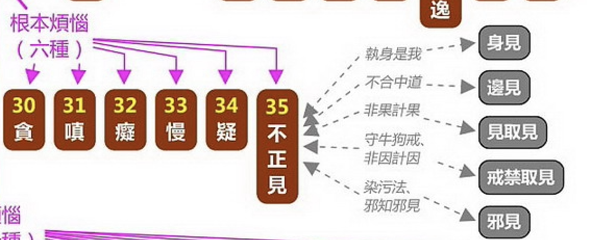

经常在学佛群里面听别人提起“执着”，尤其是说别人执着的特别常见。可是认真地问对方，什么是执着时，又通常得不到正面的回应。久而久之，大家都习惯了说执着，却并不清楚到底什么是执着。更糟糕的是，甚至有人不知道该如何生活了，被人说这也是执着，那也是执着，仿佛就没有不是执着的东西了。如果是这样，那真的很有必要来讨论下，到底什么是执着了。

## 世人的执着

先来看看一些例子吧。

* 有人说：必须去海外留学，才能学到真正的东西。
* 有人说：必须考上985，211（指排名靠前的大学），人生才是圆满的。
* 有人说：必须学会AI，才会有前途。
* 有人说：必须去国外旅游几次，人生才有意义。
* 有人说：必须学会一项乐器，才能考上好的大学。
* 有人说：女人若不学会化妆，将来就没人愿意娶。
* 有人说：女儿大了就得嫁人，嫁人了才会幸福，才有归宿。
* 有人说：除非用上了xxx品牌的包包，否则人生就是缺憾。
* 有人说：非某某不嫁，如果错过他，我会后悔一辈子。
* 有人说：我非某某品牌的coffee不喝。
* 有人说：只有某某茶才是真正的茶。
* 有人说：只有考上公务员才有出路。

这样的例子还有很多，你要留意下，几乎每天都会听到类似的言论了。这些都是“执着”，而且都是普通人的执着。仔细看看这些例子，不难总结出来这里的规律 —— 那就是认为只有这样，才是成功的，才是圆满的，才是有意义的，才是有价值的。“只有这样”是指单一选择，单一因素，才能有最好的结果。肯定这“单一选项”的同时，也否定了其他选择了。我们不妨把个规律叫做“一因一果”。

事实上，这种“一因一果”正是诸多执着的本质，即对前因后果的错误认知，产出了执着。通常来说，想要达到某种结果，一般都是有很多种选择的，所谓 —— 三百六十行，行行有状元。如果你的目标是想要成为一个状元，那么任何一个行业里面都有状元，都是可以成为其状元的。至于你要选择哪个行业，应该综合考虑，尤其是结合自身的优点、特长来说。这样选择一个合适的行业，才最有可能成为其状元了。

## 学佛人的执着

不仅世人会有很多执着。其实学佛人，也是有很多执着的。比如说：

* 有人说：必须拜地藏菩萨忏才能清除罪障。
* 有人说：必须念佛这一门，才有解脱的可能。
* 有人说：只有某某师父，才是真正的老师（指善知识，下同）。
* 有人说：只有某某宗派，才是真正的佛法。
* 有人说：没有神通作为证明，就不能认定老师的证量。
* 有人说：必须穿破衣服，用旧东西，过得像乞丐才是真正的修行人。
* 有人说：瞧，那和尚还用iPhone呢，还坐大品牌轿车，算什么出家人啊。
* 有人说：必须每天念《楞严经》100遍，否则无法开悟。
* 有人说：必须修习密宗法门，其他流派都太浅薄。
* 有人说：数息打坐就是修行，研读经论纯属多余。
* 有人说：只有在深山老林闭关，城市里的修行都不算数。

除了“一因一果”的例子之外，这里又多了一些不同的“执着”的例子。那就是只有这样，才是那样。比如，只有打坐才是修行，这不仅把打坐和修行划上了等号，还直接排除了其他的选择。否定了持戒、念佛等其他方式也是修行。这显然违背了大多数人的认知。

## 什么是执着？

先不讨论佛教的核心，先看对执着的定义和描述，ChatGPT的这个总结相当到位了。摘录文字如下：

在佛教中，"执着"是一个核心概念，通常指对物质、想法、情感等的过分依赖或固执。以下是佛教对执着的几种描述：

* 物质执着：对物质财富、身体或感官享受的过分依恋。
* 观念执着：固守某些观点、信仰或思想，不愿意接受新的或不同的理念。
* 情感执着：对特定情感状态（如快乐、爱情或悲伤）的过度追求或回避。
* 自我执着：对“我”或“自我”身份的强烈认同，这包括对自我的成就、外貌或社会地位的执着。
* 仪式执着：盲目遵守宗教或社会仪式而忽视了其背后的精神意义。

再用这个定义和描述来看上面的例子，可谓是一目了然了。如：

* 物质执着的例子：“除非用上了xxx品牌的包包，否则人生就是缺憾。”
* 仪式执着的例子：“必须拜地藏忏”，“必须在深山里”，“必须打坐”等。
* 情感执着的例子：“非某某不嫁”，“只爱她、他一人”。
* 观念执着的例子：“必须去国外旅游几次，人生才有意义。” —— 很多例子都属于此类。
* 自我执着的例子：这个是核心，后文再剖析下。

虽然“执着”可能是佛教里面出来的词汇，在佛教里面使用也最频繁。但很显然，上面的例子，即包括了普通人的执着，也包括学佛人的执着，所以就这个执着而言，并非是只有学佛人才有的了。

那么执着的危害是什么？很显然，那就是导致痛苦。盲目的追求和判断，必然导致身心上的涟漪反应。如果碰巧心愿得到了满足，这种反应会暂时隐藏起来。一旦没有得到满足，心与愿违，那必然会产生痛苦了，而且，执着得越深，痛苦越剧烈。

## 佛学上的我执

若再进一步分析为何会有各种各样的执着，一步步分析下去，必定都会到“自我认知”的这个根本点来。可以这样说，一切的错误认知，都是以“我的看法”，“我的观念”，“我的经验”，“我的立场、视角”等为前提的。若没有固执于此，那么就不容易产生执着了。

而“我的看法”，“我的观念”，“我的经验”，“我的立场、视角”又是以什么为基础呢？那就是“我”了，或现代所说的“自我”，“自我意识”了。这也是佛教中的“我执” —— 认为有我。一个什么样的我呢？一个实有的“我”，一个拥有永恒灵魂的“我”，或是一个永恒固定的“我”。

[佛学大辞典（丁福保）]解释“我执”：
（术语）认有我身之执念为我执，亦云人执。唯识述记一本曰：「烦恼障品类众多，我执为根，生诸烦恼，若不执我无烦恼」俱舍论二十九曰：「由我执力，诸烦恼生。三有轮回，无容解脱。」俱舍光记二曰：「我执谓我见。」梵Ātma－grāha。

ChatGPT翻译的白话如下（有修改）：

“（佛教术语）我们坚信自己身体就是自己 —— 那种想法称为‘我执’，也叫做‘人执’。《唯识述记》中说：‘烦恼有很多种，但我执是它们的根源，它产生了所有的烦恼。如果不执着于自我，就不会有烦恼。’《俱舍论》第二十九卷说：‘由于我执的影响，各种烦恼就产生了。这样就会困在生死轮回中，无法解脱。’《俱舍光记》第二卷里说：‘我执就是对自我的看法。’用梵文说，这叫做Ātma-grāha。”

## 破除我执的根本方法 

正如刚才ChatGPT中提到的一样，破除我执的根本方法就是梳理对于“我”的正确认识，那就是“无我”。破除对物质过分依赖，或固执的想法，那就需要对“无常”和“苦”（指不安）有正确的认识。这里的“苦”不只是“痛苦”的意思，更是指一种不安定的状态，任何物质（乃至意识）都是“无常”的，所以是“苦”的（只是起名为“苦”）。

为何无常？那就要对一切物质和精神的形成和存在有一定的了解了，这便是佛教的根本理论了 —— 因缘法。即一切的人事物都不会绝对地、孤立地产生和存在。它们的产出和存在都是相互依存。正因为如此，所以没有任何永恒的人事物，它们所以依赖的东西（因缘）也一直在发生变化…… 所以，我们会看到春夏秋冬，花谢花开，人会生老病死。

总结来说，就是要明白因缘法，就会懂得“无常”和“苦”的道理，不仅物质世界如此，精神世界也如此，自我意识当然也是如此，所以最后也就没有了“我”，即“无我”。没有了“我”，就没有“我所”，即没有以我为中心的各种观念，想法，偏见，立场等。这样就可以破除“我执”了。

## 贪瞋痴根本的也是我执

佛教里面经常提起“贪瞋痴”的危害，但却很少提及“贪瞋痴”的根本其实在于“我执”。不了解“我执”，不直接破除“我执”，虽然也能够减少贪瞋痴，但其效果肯定不如先破“我执”之后，再去减少贪嗔痴来得效果好。因为产生“贪瞋痴”的根本，在于有“我”。所以其实是“我贪”，“我嗔”，“我痴”。如果把其中的“我”破除掉了以后，“贪瞋痴”就没有可以依赖了，没有“依赖”就不会产生新的“贪瞋痴”。

以《百法明门论》中的分类来说，有六个核心根本烦恼，即：贪、嗔、痴、慢、疑和不正见。不正见又分为：身见、边见、见取见、禁戒取见和邪见。

* 身见：是最常见的错误认知，即是把身体当成“我”，称之为身见。
* 边见：是常见的两种错误认知，一种是断灭论，认为人死如灯灭，一了百了。另一种是认为有一个永恒不变的灵魂。
* 见取见：非果计果 —— 不是佛教中所承认的证果，但是被当做证果了，最常见的误解就是把神通和证果混为一谈。
* 禁戒取见：非因计因 —— 古印度时期就有的牛戒，狗戒等，印度之外的地方不太多见。
* 邪见：就是其他一切不正确的认知 —— 比如把能量、维度、量子和证果联系起来的，稀里糊涂，不清不楚，但是可以糊弄人的。

## 破除我执才是证果的开始

以修行来说，证果是目标。无论是解脱果——阿罗汉，还是菩提果——成佛。这两者都有一个重要的里程碑，就是第一个证果的阶位，都是从破除我执开始的 —— 见道位。

声闻的见道位：见四谛之真理，即体悟到了苦、集、灭、道。这个真理是涵盖了一切物质和生命的，从生命的角度来说，就是“无我”。从物质的角度来说，就是“苦”（无常）。所以在基础佛法（《阿含经》等）中，苦，无常，无我和空，经常会一起出现，意思相同，只是表达的侧重点不同而已。

菩萨的见道位：见真如之真理，不仅要证人无我，还要证法无我。人无我，法无我其实是无我的细分了。只是在菩提道中，会进一步推导“无我”的个概念，因为“无我”，所以也是“无自性”，即是“空性”的。有时只是为了突出菩萨需要救度众生的需求，才会更加强调“法无我”。尤其是对“涅槃”的解读上，和声闻有所区别。

## 法执

和我执对应的概念还有一个法执，这里也简略补充下。

我执 —— 就是认为有我，要么把身体当我，要么认为有一个永生的灵魂。

法执 —— 就是认为实有物质，或实有世界，这是粗略地说，再细的来说，就是要区别涅槃是否有无了。

我执 = 烦恼障，认为实有我，所以起烦恼。烦恼障碍涅槃。不息灭烦恼不能成阿罗汉。

法执 = 所知障，认为物质等是实有的，所以不能对物质等有正确的认识。这样就无法认识真如。所知障碍菩提。不证真如不能觉悟佛智。

上面其实也说了，其实“无我”即可以指生命，也可以指物质。但也可以区分成“人无我”和“法无我”。其中，对于“法无我”的部分，又分为有区分的和无区分的，比如对于苹果的认知，各个体系都认为是“无我”的。但是对于更加高级的概念，如涅槃，在不同的体系中就会有不同的认知了。暂且不展开了。

## 先从我执（烦恼障）下手一定没错

不过要记住一定，从实际修行中的角度来说，可以先把这些高级的概念放一边。涅槃是什么，佛性是什么，如来藏是什么，是有是无？这些概念不仅在普通人之间存在广泛的争议，就是在很多高僧大德之间，也并未有统一的认知。有统一认识的部分，反而是我执的部分，就是烦恼障的部分 —— 即我执，和贪瞋痴。

所以从修行的角度来说，完全可以先努力破除我执为先，然后再去减少和对治贪瞋痴。但如果对于破除我执等还有一定的难度，不能完全理解。也是没有关系，那就从日常中对治贪瞋痴开始。贪瞋痴减少了，对于破除我执也是非常有帮助的。

若以解脱道来说，先破除我执，体证无我，自然而然就能熄灭贪瞋痴了，也就达成了解脱的目标了。

若以菩萨道来说，先破除了我执，也就是法执中最重要、最迫切的部分先处理掉了，剩下的法执，是初地菩萨以后要对治的。所以如果以初地菩萨为目标，这样就和解脱道一样了 —— 那就是先破除我执。

最后祝大家都能早日破除我执。
阿弥陀佛。

愚夫合十。
