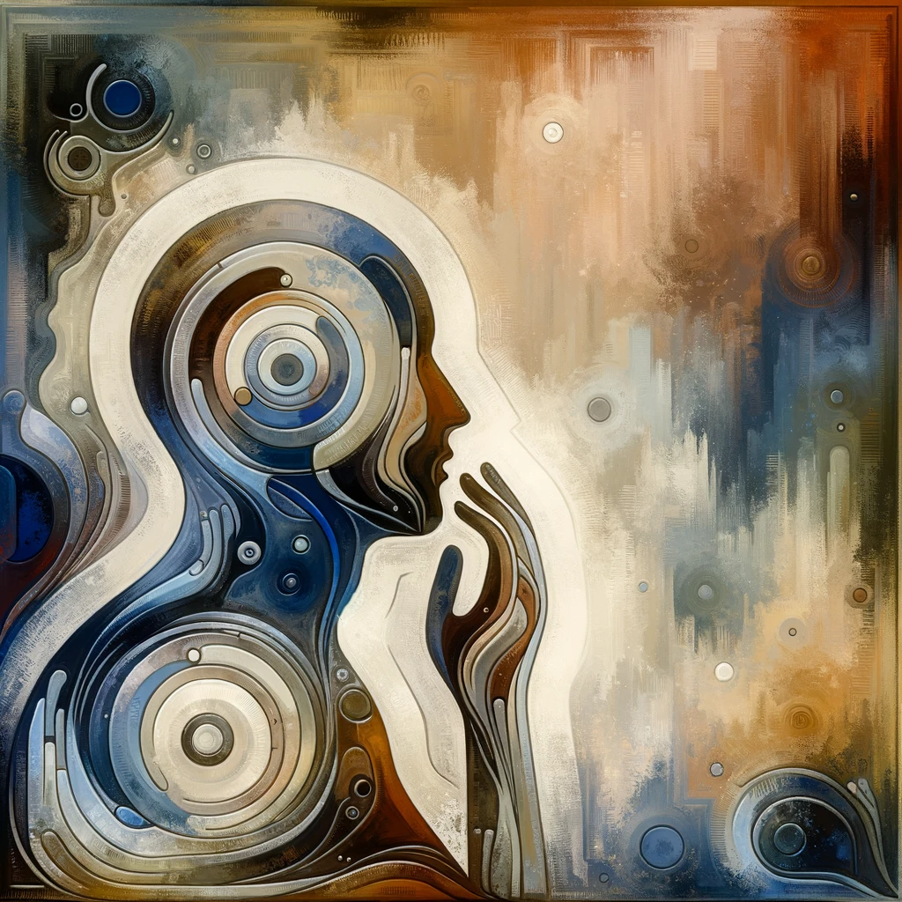

## 空的第一层含义 —— 和“有”相对

这个含义非常直接明了，就是指“空间”没有被占 —— 如空位，没有内容 —— 空白的纸，空盒子等。大家在日常生活中几乎每天都在使用这个含义。比如说，“给我一个空碗”，“这个车位是空的”，“空杯子”等等。佛经里面，也有类似含义的使用，如：

《相应部》(五四)〈入出息相应〉(南传一六下.一八一)说:「比丘!往阿练若，往树下，往空屋，结跏趺坐，正身，修普前念，正念入息，正念出息」。

直译："比丘！前往禅林，前往树下，前往空屋，跏趺坐，端正身体，修普前念，吸气时保持正念，呼气时保持正念。"

其中的“修普前念” - 不太清楚意思，保留原文好了。跏趺坐就是打坐🧘🏻的姿势。打坐要安静的环境，所以要在空屋子里面，以免被人打扰。

## 空的第二层含义 —— 空掉，清空

这个含义也很简单明了，就是把占据空间的东西拿掉、去除。从有一个被占据的状态，转变成一个空的状态。大家在日常生活中也会经常使用这个含义，如：“在卖房子之前，我们需要清空房间里所有的家具和杂物”，“应该定期清空冰箱里过期的食物，以保持食物的新鲜和卫生”，“清空浏览器的历史记录，可以保护个人隐私”。相同地，佛经里面，同样有这个含义的“空”：

《相应部经典》：「居士！以何为已空诸欲者？居士！此处有人，于诸欲离贪、离欲、离爱、离渴、离热烦、离渴爱。居士！如是为已空诸欲者。」
(CBETA 2023.Q3, N15, no. 6, p. 14a7-8)

直译："居士！什么被称为已经空掉了所有欲望？对于所有的欲望已经远离了贪婪、远离欲望、远离爱慕、远离渴望、远离热恼、远离渴爱。居士！像这样的人就被称为已经空掉了所有欲望。"

对于修行人来说，需要空掉欲望，以及对欲望的贪爱，渴望，渴求等 —— 因为这些欲望会引起烦恼，容易引发恶业，所以需要空掉，需要被清空。这个道理，就算是没有学佛的人，也是知道的。

## 空的第三层含义 —— 无常，苦，空，无我

无常，苦，空，无我 —— 是基础佛法（阿含经）的核心概念，而这些核心概念都是可以从最核心的理论 —— 因缘法一一进行推导的。理论上理解了以后，就可以在日常中对照来验证理论的正确性了。

因缘法：“此有故彼有，此生故彼生，此无故彼无，此灭故彼灭”。（《相应部经典》）

直译是：“因为这个存在所以那个存在，因为这个生起所以那个生起，因为这个不存在所以那个不存在，因为这个灭去所以那个灭去。” 

用现代的话来表达就是说，**一切人事物的产生和存在都依赖其他人事物的存在。即，没有一样人事物可以绝对地、孤立地存在。**

**无常**：由于所有事物都是基于因缘关系存在的，这就意味着它们的存在是不稳定的、不持久的。一旦构成它们存在的条件发生变化或消失，这些事物也会随之变化或消失。这就是无常的本质——一切事物都在不断的变化之中，没有什么是永恒不变的。

**苦**：苦的意思不只是痛苦，从哲理上来说，是指不安定的状态。因为一切的人事物都是在不停地变化当中的，而没有一个恒定的（安定的）状态，所以起名为“苦”。

**空**：这里的空是指没有实有的东西，**实有的定义（在佛教里面），是指永恒的存在，固定的存在，无论什么条件下都不会发生变化。**很显然，无论是生活经验，还是现代科学，物理学上的认知，都是不存在这样的“东西”的。不仅微观如此，宏观也如此。所以一切都是“空”，不是“实有”的。

**无我**：“我”的定义多指人的自我意识。不仅物质是无常的，就是意识观念也是无常的 —— 你仔细去观察下自己的观点（念头），比如前一秒想吃火锅，下一秒可能就想吃烧烤了。没有一个观点是”实有“的（记住前面对实有的定义）。既然所有的念头（意识）也是不是实有的，那么这种“自我意识”的认知，也不是实有的 —— 这样就被称之为“无我”了。 这是从生命的角度进行解读，如果从物质的角度进行解读，就可以推导出物质也是没有任何一个固定的特性的 —— 所以物质也是无我的，或说是“无自性”的。这里的“自”和“我”是一个意思。

《相应部》(三五)〈六处相应〉(南传一五.八七——八八)说:「阿难!眼，我我所空;色，我我所空;眼识，我我所空; 眼触，我我所空;眼触因缘所生受，若苦若乐若非苦非乐，我我所空。......意触因缘所生受，若乐若苦若非苦非乐，我我所空。阿难!我我所空故，名空世间」。

这段文字不太好直译，不如简单解释下：如果理解了一切人事物都是空、无我的之后，只要把“人事物”再展开即可，以佛教对人如何接触外界的认知来说，就是**六根**（眼耳鼻舌身意），**六尘**（色声香味触法），以及**六触**（眼触色，耳触声，鼻触香，舌触味，身触触，意触法），有时也说**十二处**，即六根六尘组合，也说**十八界**，就是六根，六尘和六识（即六个感受器官的能力和作用范围）的组合。以及因此产生的感受（苦，乐，不苦不乐）。这些也都是空、无我的。因为他们没有一样不会发生变化，没有一样是固定永恒不变的。

## 空的第四层含义 —— 空、空性、空相

**空** - 就是否定了事物的实有存在。既然没有一件事物是实有的存在，那么我们看到的一切的一切，如山河大地，日月星辰，动物植物微生物等等都是空的了。人也不例外。

**空性** —— 是从“自性”，“特性”，“性质”的角度来说的。比如金属有导电的特性。液态水有流动的特性。但这些特性依然不是实有的。还记得实有的定义吗？实有的定义就是必须满足一切条件不发生变化。而水变成冰了就不再流动了。金属如果被腐蚀了，就可能失去了导电性。甚至水和金属本身也都不是“实有”的，他们都可以被分解，或被转化。从这个道理上来说，任何事物都不会有一个实有的特性。这个概念就称之为“无自性”，或”空性“。

**空相** —— 是从“相貌”，“外相”上来说。无明对于事物的认识里面，除了特性外，就会关注它的相状了（相貌、外相）。比如苹果是圆的，桌子是方的，黄铜是黄色的，等等。这些相貌也都不是实有的（请务必记住其定义）。苹果会被切掉就不再是圆的了，桌子会也被拆掉，就不再是方的了，就是黄铜如果被腐蚀掉，变成绿色。

用现代物理学的概念，其实很容易理解这些，比如物质都有三种形态：固态，液态和气态。这三者的转变只需要不同的温度即可。如果进入到微观世界，连原子都是可以转变的，因为原子有裂变和聚变。这样就容易理解，任何事物的相貌都不会是实有的了。这个概念就称之为“无相”，或“空相”。

## 空的第五层含义 —— 空有不二

前两层的空，都是和有对应的。这里的有是指一般意义上的有（现象有，临时有）。

从第三层的空开始，空是和“实有”对应的。

有时为了区分前两层的有和“实有”，就把前两层的有称之为“假有”，或“临时有”，或“现象有”，反正都不是“实有”。如果理解到这一层，其实大多数的佛经，尤其是基础佛法（阿含系）和般若系的经典（如《心经》《金刚经》等）都是比较容易看懂的。

但佛法并没有止步于此，而是进一步说明空和（假）有之间的关系 —— 空有不二。这其实说，我们对于空性的讨论，其实是基于“假有”才推导出来的。如果事物不是假有的，就不空了。如果连假有的事物都没有，那么世界是完全的空白的，连人也没有，就不存在空性的概念和认知了。所以，空性的推导也离不开“假有”的事物。相同地，因为一切事物是空性的，所以一切事物才会随着因缘的变化而在特性，外相上有所变化。

对于这种相互无法离开，不能孤立存在的关系，就称之“不二”。当做“不二”的一种解释就好，不二当然可以有很多不同的解释，其实佛教词汇，大多数都存在许多诠释的，就算是佛经和佛经之见，也不见得完全相同。

## 空的第六层含义 —— 离言空性

虽然我们可以用语言来表达这种空性，可以进行说明。但要是语言本身并不等于“事物”本身。语言本身的描述也容易有局限性，甚至会令人产生误解。而且语言本身也是在发展中的。比如古人用繁体，（很多地方的）今人都用简体。甚至相同概念的含义在发展当中，也在不断发生变化，如民国时期的“小姐”等。

为了隔绝语言上的这些种种弊病，用来代指真正意义上的那个“东西”，于是还有离言空性的说法了。

其实不仅佛教上有这种超越语言的表达，其实现实上生活中，一般人也会有类似的体会 —— 比如你吃到了一道美食，让你形容这个味道给没有吃过的人吃，无论你的语文多好，无论你的表达多厉害，都无法把真实的味道传到给对方。这就是语言的局限性。这也是佛教“不可说”的一种诠释。

再比如，你看到一幅画，一幅美景（但没有照相的情况下），你要分享你看到的景象给其他人 —— 一样地，无论如何，你都无法把景色的真实情况完整地表达出来，并让对方真实地身临其境。

从写文章的角度来说，能说明的地方，以我的能力也就到此为止了。不过在最后，还是想要做一些补充。

## 对空的误解 —— 恶取空 

**恶取空** —— 就是完全否认假有的作用，任何一切事情都是无意义的，人生是虚无的，世界是虚无的，做什么都是无意义的。这就是恶取空，或“顽空”。这是学佛人尤其要警惕的。

另一类误解就好像认为世界最终有一天，会有大爆炸，然后一切的东西会同时消失，然后进入一种绝对的虚无当中了。事实上，这也是不正确的解读。佛教说空，是指针对单个事物而言的，或所有的事物的共性而言的，但并不是说，它们会在同一时间同时灭亡。

其实，稍微有点物理学常识的人，也不会得出这样的结论了，因为物质能量磁场（或其他未知的一个领域）等，这些的总量是守恒的。他们只会相互转化，而不会彻底消失。以佛教来说，就是用“业”这个概念来综合代指了，所以可以把业理解为物质，能量，磁场等的综合。

“假使经百劫，所作业不亡”（《大宝积经》）

## 般若中的毕竟空

如果以《大智度论》作为般若系的教科书，那么里面有一个名词可能是被重复了最多次 —— 毕竟空。

智度论三十一曰：「毕竟空者，以有为空无为空破诸法无有遗余，是名毕竟空。」

仁王经良贲疏中一曰：「毕竟空者，谓诸法究竟不可得。」

这里的不可得的意思是，因为任何东西都不是实有的，所以就没有可以“实得”的东西了。以般若思想来说，成佛也是不可得的。佛也是毕竟空的。而没有一个固定的佛的样貌。实际上，各个佛的报身都是有不同的。比如说阿弥陀佛的报身巨大无比，寿命极其长久（无量劫）。但有些佛的报身不过几十由旬，寿命不过几十劫长。关于寿命这点可以参考《法华经》的授记部分。

## 般若中对空的诠释有十八空 

其实对于般若空的诠释也有多种多样，比如有十四空，十六空，十八空，二十空。详细可以参考《空之探究》的对比表格。这里摘录《空之探究》中十八空和解释如下。

备注：依旧要记得实有的定义。没有任何东西是实有的。所以从实有存在的角度来说。一切都是空的。即一切法空（下面的第14空）。

1. 内空：内是眼、耳、鼻、舌、身、意——六 内处，为众生的身心自体。六内处是空的，名为内空。
2. 外空：外是色、声、香、味、触、法——六 外处，是眼等所取的境。六外处空，名为外空。
3. 内外空：内外是内六处与外六处， 内外处都是空的，名为内外空。
4. 空空：空是一切法空，空也是空的，名为空空。（备注：这是否定有一种实有的、绝对的空的存在。要是有绝对的实空存在，那么一切东西都不会出现了）
5. 大空：大是十方，十方是无限的广大，广大的十方是空 的，名为大空。
6. 胜义空：胜义就是涅槃，涅槃是空的，名为胜义空。（备注：声闻经典中对于涅槃的诠释角度于此不同，多是从苦，灭苦的角度而诠释的涅槃）
7. 有为空：有为是欲界、色界、无色界，生死流转的三界是空 的，名有为空。
8. 无为空：无为是没有 生住灭相的，不生不灭的无为是空的，名无为空。（备注：无为只是相对有为而说的，不存在绝对的、孤立的无为）
9. 毕竟空：毕竟是到达究竟彻底处，所以或译作「至竟空」。究竟是空的，名为毕竟空。
10. 无际空：际是边际。佛说:「众生无始以来」，没有最初际，所以名无际(或译作「无始空」，「不可得原空」)。依此初际而进说中际、后际，没有时间的三际，所以是空的，名无际空。
11. 散无散空：《摩诃 般若波罗蜜经》虽译为「散空」，解说也还是「散名诸法无灭」。《大般若波罗蜜经.第三分》说:「若法无放、弃、舍可得，说名无散」。
12. 本性空：本性是有为法性、无为法 性，本性如此，名为本性。有为、无为法性是空的，名本性空。
13. 自共相空：如恼坏是色自相，领纳是受 自相等;自相是空的，名自相空。
14. 一切法空：一切法是五蕴、十二处、十八界 等;一切法是空的，名一切法空。
15. 不可得空：不可得，是求一切法不可得;不可得就是空，名不 可得空。
16. 无性空：无性，是「无少许可 得」;无性是空的，名无性空。
17. 自性空：自性是「诸法和合中有自性相」;或作「诸法能和 合自性」。自性是不可得的，名自性空。
18. 无性自性空：玄奘译本说:「无性自性， 谓诸法无能和合者性，有所和合自性」;无性自性是空的，名无性 自性空。然依鸠摩罗什(Kumārajīva)所译，这是无性空与自性 空合说，与内外空的意义一样。

## 总结

以上介绍了很多的空的概念，总结来说无非是 —— **缘起性空**，或说，**因缘有自性空**。

真正理解因缘，就能理解空性。真正理解了空性，就能理解因缘。如果暂时还不能理解，也没有关系，回到因缘，多学因缘法。因缘法是一切佛法，各个体系，各个宗派的共同基础。相比较而言，学习因缘最不容易有误会，最不容易产生误解。所以也是最安全的。等到时机成熟时，自然就会懂的。不要着急，学佛可不只是一生一世的事情了。

阿弥陀佛

愚夫合十
