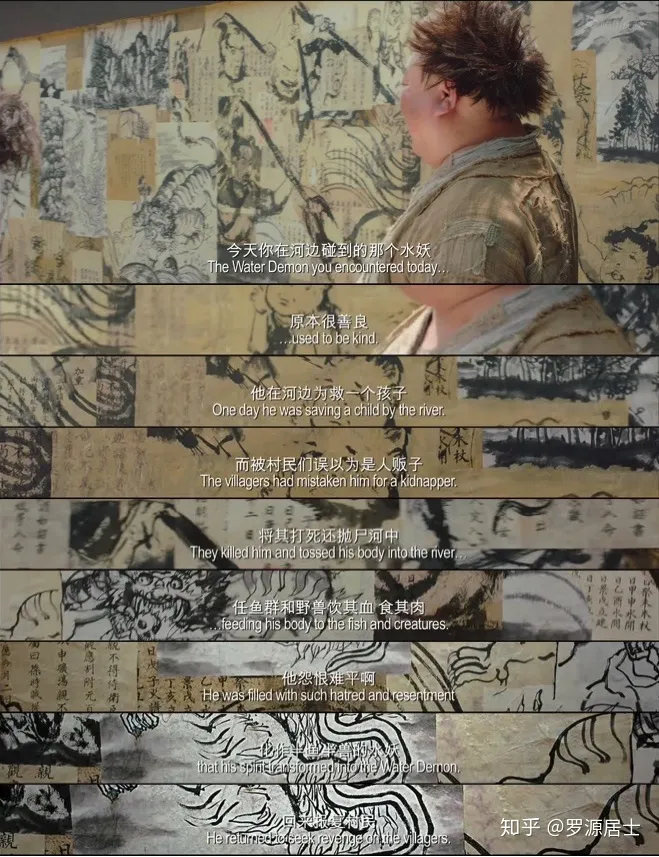

这其实是我在 2019 年发表在知乎上的原创文章（《电影《西游降魔篇》里面的佛法
》 https://zhuanlan.zhihu.com/p/56874207），后来因为知乎的限制，就没有继续在知乎上发表文章了。国内内容公开平台都有的限制，目前仅仅发现微信公众号是个例外，还允许发文。所以也就想把这篇文章在这里重新发表一次。不是完全的 copy，而会稍作补充。注意：这里不是去介绍《西游降魔篇》故事本身，而是仅仅选取了一个角度进行说明。

《西游降魔篇》里面有讲到三个妖怪，分别是水妖（后来的沙和尚），猪妖（猪八戒）以及猴妖（当然是孙悟空了）。而在电影里面，又用了较大的篇幅去讲水妖和猪妖。讲到他们是多么地为非作歹，残害生灵 —— 然后引起了驱魔人争先恐后去降妖除魔，而他们的目的又都是为了领赏金。这有点借鉴了美国悬赏猎人的风格。除了电影的主角 —— 唐玄奘除外，他是为了大乘佛教的弟子，自然就不是为了领赏金了。

玄奘在电影中的师父，是一个有着大肚子一样的胖和尚，也像是布袋和尚。而布袋和尚传说是弥勒菩萨的化身。在实际的佛教历史当中，玄奘当年要去印度取经，正是为了取得《瑜伽师地论》等唯识经典，而这一宗派的源头正是弥勒菩萨。传说是无著菩萨上升到兜率内院听弥勒菩萨讲法，后来无著菩萨再把听闻的佛法记录而成。

玄奘的师父在电影中是一个非常重要的角色，对于每个妖怪的前因后果，都是这位师父告诉玄奘的。既让玄奘知道，也让观众知道。而这些妖怪之所以是妖怪，都是有原因的。

## 水妖

电影中说：

> 今天你在河边碰到的水妖，原本很善良，他在河边为救一个孩子，而被村民们误以为是人贩子，将其打死还抛尸河中，任鱼群和野兽饮其血食其肉。他怨恨难平啊。化作半鱼半兽的水妖。回来报复村民。

这便是水妖之所以是水妖的原因。这里并不是说水妖报复村民就是对的。而是说，水妖报复村民，是因为村民有“过错”在先。而水妖也是凡夫，怨恨难平，于是就开始了报复。正所谓，冤冤相报何时了啊。如果无人救度，那么后续的村民必定也会再报复水妖的。如此就是冤冤相报了。

## 猪妖

猪刚鬣，即猪悟能，也就是猪八戒。

> 这猪妖原名叫猪刚鬣，生的跟猪一样丑，是个情种，他对媳妇无比痴情，可他的媳妇却嫌他丑而和一个美男通奸，还合谋用九齿钉耙将其打死，他因爱成恨积怨成魔，誓要杀尽天下所有爱慕美男的女人。

道理和前面的水妖一样，就不再赘述了。

## 有果必有因，理解这点就不会再有怨恨了

在生活中，我们常常会遇到一些让我们感到委屈、困扰甚至怨恨的情况。然而，如果我们真正理解了“有果必有因”的道理，就能放下这些负面情绪，以更积极、理解的心态去面对生活。

这其实是一个基本法则。它意味着发生的每一件事都有其背后的原因。没有任何事情是孤立发生，没有原因的。如果我们面临困境，那是因为某些原因导致了这个结果。可能是我们的行为、决定或者环境导致了现在的情况。

遇到一个坏人，坏事的时候。我们可以寻找下原因，而不是仅仅责怪，更不应该停留在责怪上。我们可以问：是什么原因导致了这个情况？这其中有哪些是可以改变的，哪些是无法改变的，可以改变的地方如何积极地改变，不能改变的地方，就去理解和接受。

此外，“有果必有因”的理解也能促进我们对他人的理解和同情。我们可以试着从他们的角度理解他们的行为和决定，而不是一味地责怪或者评判他们。我们可以意识到，他们也是被自己的环境和经历所塑造的。

这样思维方式不仅帮助我们放下怨恨，还可以可以让我们摆脱怨恨，更让我们能够掌控自己的生活。让我们过上更积极、理解的生活。它鼓励我们为自己的行为负责，从经历中学习，对他人表示同情。

## 后记

原文中还提到了“就差那么一点点”和“儿歌三百首 vs 大日如来经”，如果展开来说就是另外的主题了。这里的主题是讲“有果必有因”，就不展开了，仅仅摘录下而已。这样如果知乎上的文章被删，这里还算是一个备份了。

### 就差那么一点点

电影里面有好几处都出现了这句话“就差那么一点点”，这里其实可以对应佛法里面的“悟”，有“领悟”，“顿悟”，”开悟“的意思，尤指禅宗的明心见性，开悟于不悟就差那么一点点，有了这一点，就能看见的自己的”自性“，”佛性“，”本来面目“，却了这一点，就是凡夫。当然，我觉得电影里面的这一点还有”领悟“的意思，比如领悟了男女之间的关系等，领悟了大爱小爱的关系等。

### 儿歌三百首 vs 大日如来经

这里是一个很有趣的转变，一开始是《儿歌三百首》，后来却变成了《大日如来经》。正所谓《金刚经》中讲：”一切法皆是佛法。“《大日如来经》是佛法，《儿歌三百首》也可以是佛法，只要你能够唤醒人们内心的真善美，那更是值得鼓励的好办法。

