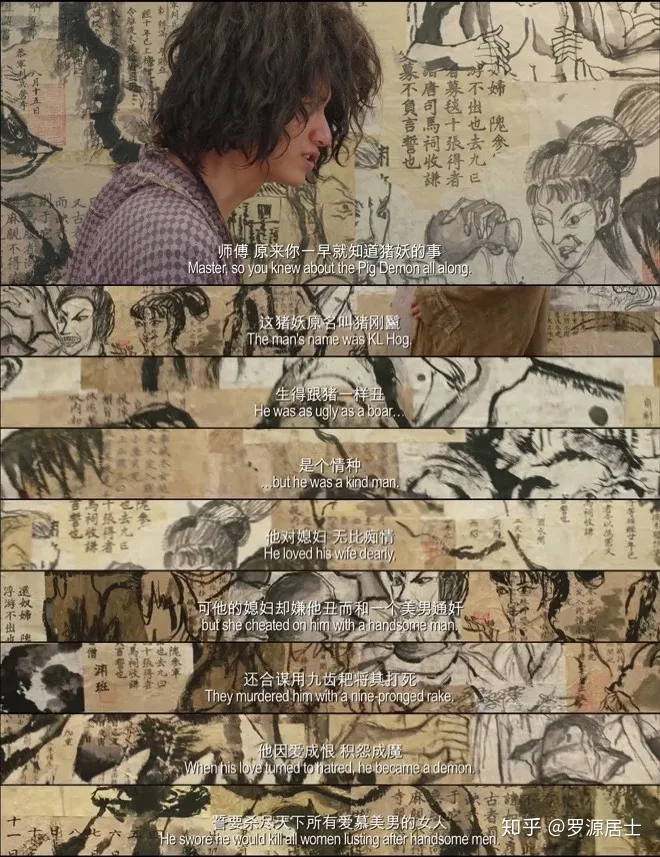
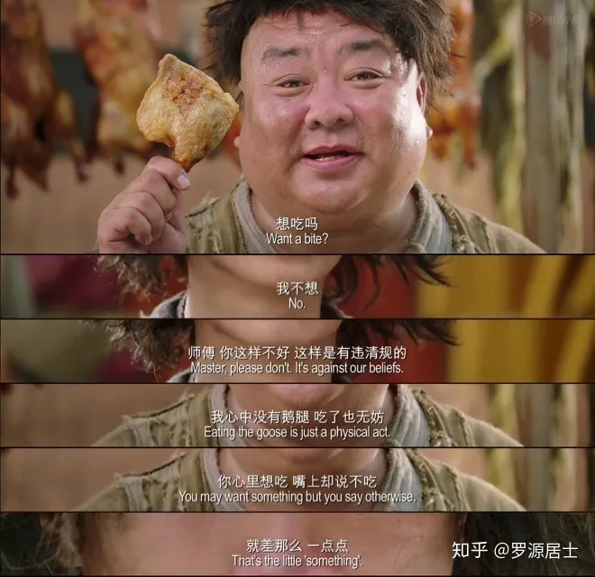

這其實是我在 2019 年發表在知乎上的原創文章（《電影《西遊降魔篇》裡面的佛法
》 https://zhuanlan.zhihu.com/p/56874207），後來因為知乎的限製，就冇有繼續在知乎上發表文章了。國內內容公開平臺都有的限製，目前僅僅發現微信公衆號是個例外，還允許發文。所以也就想把這篇文章在這裏重新發表一次。不是完全的 copy，而會稍作補充。註意：這裏不是去介紹《西遊降魔篇》故事本身，而是僅僅選取了一個角度進行說明。

《西遊降魔篇》裡面有講到三個妖怪，分別是水妖（後來的沙和尚），豬妖（豬八戒）以及猴妖（當然是孫悟空了）。而在電影裡面，又用了較大的篇幅去講水妖和豬妖。講到他們是多麼地為非作歹，殘害生靈 —— 然後引起了驅魔人爭先恐後去降妖除魔，而他們的目的又都是為了領賞金。這有點借鑒了美國懸賞獵人的風格。除了電影的主角 —— 唐玄奘除外，他是為了大乘佛教的弟子，自然就不是為了領賞金了。

玄奘在電影中的師父，是一個有著大肚子一樣的胖和尚，也像是佈袋和尚。而佈袋和尚傳說是彌勒菩薩的化身。在實際的佛教曆史當中，玄奘當年要去印度取經，正是為了取得《瑜伽師地論》等唯識經典，而這一宗派的源頭正是彌勒菩薩。傳說是無著菩薩上升到兜率內院聽彌勒菩薩講法，後來無著菩薩再把聽聞的佛法記錄而成。

玄奘的師父在電影中是一個非常重要的角色，對於每個妖怪的前因後果，都是這位師父告訴玄奘的。既讓玄奘知道，也讓觀衆知道。而這些妖怪之所以是妖怪，都是有原因的。

## 水妖

電影中說：

> 今天你在河邊碰到的水妖，原本很善良，他在河邊為救一個孩子，而被村民們誤以為是人販子，將其打死還拋屍河中，任魚群和野獸飲其血食其肉。他怨恨難平啊。化作半魚半獸的水妖。回來報複村民。

這便是水妖之所以是水妖的原因。這裏並不是說水妖報複村民就是對的。而是說，水妖報複村民，是因為村民有“過錯”在先。而水妖也是凡夫，怨恨難平，於是就開始了報複。正所謂，冤冤相報何時了啊。如果無人救度，那麼後續的村民必定也會再報複水妖的。如此就是冤冤相報了。

## 豬妖

豬剛鬣，即豬悟能，也就是豬八戒。

> 這豬妖原名叫豬剛鬣，生的跟豬一樣醜，是個情種，他對媳婦無比癡情，可他的媳婦卻嫌他醜而和一個美男通姦，還合謀用九齒釘耙將其打死，他因愛成恨積怨成魔，誓要殺盡天下所有愛慕美男的女人。

道理和前面的水妖一樣，就不再贅述了。

## 有果必有因，理解這點就不會再有怨恨了

在生活中，我們常常會遇到一些讓我們感到委屈、睏擾甚至怨恨的情況。然而，如果我們真正理解了“有果必有因”的道理，就能放下這些負面情緒，以更積極、理解的心態去面對生活。

這其實是一個基本法則。它意味著發生的每一件事都有其背後的原因。冇有任何事情是孤立發生，冇有原因的。如果我們面臨睏境，那是因為某些原因導緻了這個結果。可能是我們的行為、決定或者環境導緻了現在的情況。

遇到一個壞人，壞事的時候。我們可以尋找下原因，而不是僅僅責怪，更不應該停留在責怪上。我們可以問：是什麼原因導緻了這個情況？這其中有哪些是可以改變的，哪些是無法改變的，可以改變的地方如何積極地改變，不能改變的地方，就去理解和接受。

此外，“有果必有因”的理解也能促進我們對他人的理解和同情。我們可以試著從他們的角度理解他們的行為和決定，而不是一味地責怪或者評判他們。我們可以意識到，他們也是被自己的環境和經曆所塑造的。

這樣思維方式不僅幫助我們放下怨恨，還可以可以讓我們擺脫怨恨，更讓我們能夠掌控自己的生活。讓我們過上更積極、理解的生活。它鼓勵我們為自己的行為負責，從經曆中學習，對他人表示同情。

## 後記

原文中還提到了“就差那麼一點點”和“兒歌三百首 vs 大日如來經”，如果展開來說就是另外的主題了。這裏的主題是講“有果必有因”，就不展開了，僅僅摘錄下而已。這樣如果知乎上的文章被刪，這裏還算是一個備份了。

### 就差那麼一點點

電影裡面有好幾處都出現了這句話“就差那麼一點點”，這裏其實可以對應佛法裡面的“悟”，有“領悟”，“頓悟”，”開悟“的意思，尤指禪宗的明心見性，開悟於不悟就差那麼一點點，有了這一點，就能看見的自己的”自性“，”佛性“，”本來面目“，卻了這一點，就是凡夫。當然，我覺得電影裡面的這一點還有”領悟“的意思，比如領悟了男女之間的關係等，領悟了大愛小愛的關係等。

### 兒歌三百首 vs 大日如來經

這裏是一個很有趣的轉變，一開始是《兒歌三百首》，後來卻變成了《大日如來經》。正所謂《金剛經》中講：”一切法皆是佛法。“《大日如來經》是佛法，《兒歌三百首》也可以是佛法，只要你能夠喚醒人們內心的真善美，那更是值得鼓勵的好辦法。

