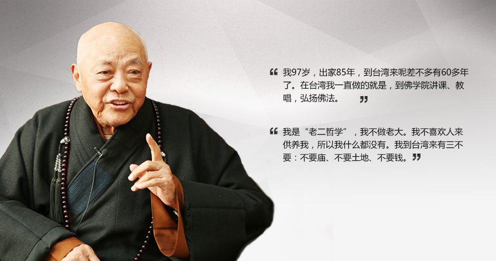

汉传佛教举行法会时，总少不了唱诵，而唱诵就离不开配乐 —— 由佛教的法器所组成的乐律，唱诵和法器配乐合起来就是汉传佛教的梵呗了。

初学佛时，虽然也参加过法会，但是对于法会的误解很深，觉得都是形式主义，为什么要弄得那么复杂呢，就不能简简单单读读经嘛。基于这样的误会，自然就不会对梵呗感兴趣了。既然没有兴趣，自然也就没有深入过。

对梵呗兴趣的转变，还要回到我所“薰修”时间最长的净土宗了，以及净土宗所推崇的临终关怀。在临终关怀里面，助念 —— 重复唱诵阿弥陀佛（或南无阿弥陀佛）—— 很重要，为了更加庄严的助念，则需要用到法器了 —— 引磬或小鱼。使用引磬是印光大师的推荐，而使用小鱼则是弘一大师的推荐，很显然，被尊为净土十三祖的印光大师的推荐更为流行和普遍，所以大多用引磬来助念。这时，我才想学梵呗了。虽然后来学修的范围从净土扩展到了其他的更有体系，偏重教理的宗派 —— 如天台，唯识等。但对净土和助念的信愿，依旧保持至今。

碰巧看到法鼓山西雅图道场有举办梵呗培训，于是欣然报名。结果却因为忘记了而错失了第一节课，但欣慰的是，后面的课程会有复习，所以得以完成后续的培训。因为之前对法会不感兴趣，所以并不知道梵呗培训的内容是以“念佛法会”开始的，梵呗的练习就是“念佛法会”的全套流程 —— 报名前，并不了解这点，只以为是普通的法器培训。所以看到是“念佛法会”后，突然觉得这算是意外的惊喜了，因为这更契合我对“净土”的信愿了。

每一次演练之后，我们这些“学员”都会长叹了一口气，有一种如释重负的感觉。这是因为对法器和音律都不熟悉，敲打起来手忙脚乱的。法师指导时说，对法器不熟悉就算了，怎么对音律也不熟悉啊 —— 我哪里敢告诉法师，在此之前，其实我从未参加过法鼓山的任何法会。

我们学了的法器有：引磬，钟鼓，木鱼（小、中、大）和地钟。表面上看起来都很简单，无非是敲敲打打而已。但实际上要打起来并不容易，不仅要配合唱诵，甚至要能引导唱诵，敲打时有时要轻，有时要重，有时缓慢得像小溪流水，有时快得又像快马加鞭。单独一个法器都是如此，各种法器配合就更加困难了。类似演奏乐，配合得好，才会是行云流水。配合得不好，那就是叮叮咣咣了。

法师教导大家说，无论是唱诵还是执掌法器，实际上都是禅定的一种练习。念佛时的练习不必多说，自然是口要出声，耳要听声，让身心都保持在念佛这一件事情上（心缘一境）。执掌法器也是如此，不仅要专心念佛，更要保持更加敏锐的觉知，才会该敲打时就敲打，不快不慢，不抢拍子，也不拖后。念佛法会的重点自然是念佛，但也还是有很多唱诵的。但无论是念佛还是唱诵，禅定练习的原则都是一样的。

在法器练习和实践中，我还是有额外的收获 —— 那就是定心的程度是可以通过执掌法器进行检验。

例如心散乱时，很容易就敲错了，要么漏敲了，要么多敲了，要么敲早了，要么敲晚了，要么节奏不对。平常自己念佛时，心散乱了自己也会知道，但觉察程度不一样，有时要过了很久才知道自己散乱了。但执掌法器时，一点心散乱了，就必定会出错。而一出错，不仅自己会立即觉察到错误，熟悉法会的人，如其他悦众也都会察觉，包括法师们。

而心定时，那就是一切都是好的，节奏很好，轻重缓急都是恰到好处的。如果大家的心都很定时，那么一场法会过后，大家都会感觉到身心的愉悦 —— 我想，这大概就是法喜充满吧。

我本身五音不全，更不懂乐理，唱卡拉OK时，从来都是开着原唱的。所以从未想过自己有一天自己会站在佛像前、大众前参与“表演”一场佛教的“演奏会”。它是那样庄严，那么庄重，抚慰人心，安定人心，让人们在纷纷扰扰的尘世中获得一片安详。法师曾经教导说，参加法会的唱诵并不要求有一幅好嗓子，只要心态诚恳，心清净了，唱诵就是庄严的。唱诵得力，不仅可以自己体会到身心的安定，而且可以帮助他人安定身心。因此，每次在法会正式开始前，我都会祈求三宝的加持，让法会顺利和圆满，并以梵呗自利利人，自度度人。

## 后记

这篇文章的草稿写作时间是在2022年10月份，今天获知有“梵呗第一人”之称的广慈长老于2024年1月8日往生了。而法鼓山的梵呗是广老教导和培训的，虽然后续略有调整。但很显然，广老是法鼓山梵呗的源头了。末学福德浅薄，无缘亲见广老，甚至连知道他都在因为他往生的消息在群里传播，有师兄介绍他时，提到了他和法鼓山梵呗的关系，这才让我略略地有所了解，敬佩之情无以言表，仅以此文供养广慈长老，祈愿广慈长老不舍众生，乘愿再来。

广慈长老法照

## 扩展阅读

* 口述歷史之一—訪廣慈法師 http://dongchu.dila.edu.tw/html/04/4_1.html
* 梵呗第一人广慈长老：出家85年的穷和尚 https://fo.ifeng.com/dsj/special/fbdyrgczl/

阿弥陀佛。 
愚夫合十。

