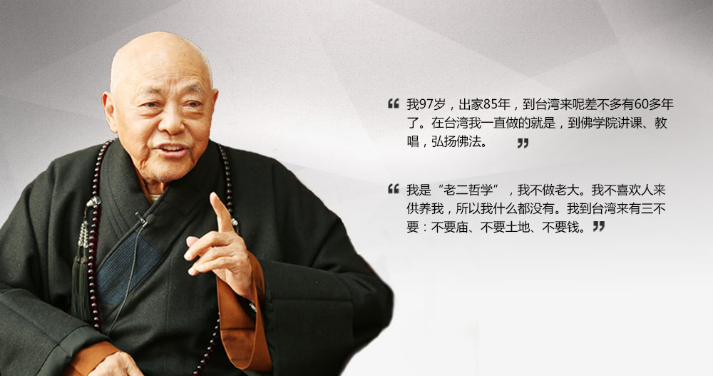

漢傳佛教舉行法會時，總少不了唱誦，而唱誦就離不開配樂 —— 由佛教的法器所組成的樂律，唱誦和法器配樂合起來就是漢傳佛教的梵唄了。

初學佛時，雖然也參加過法會，但是對於法會的誤解很深，覺得都是形式主義，為什麼要弄得那麼複雜呢，就不能簡簡單單讀讀經嘛。基於這樣的誤會，自然就不會對梵唄感興趣了。既然沒有興趣，自然也就沒有深入過。

對梵唄興趣的轉變，還要回到我所“薰修”時間最長的淨土宗了，以及淨土宗所推崇的臨終關懷。在臨終關懷裡面，助念 —— 重複唱誦阿彌陀佛（或南無阿彌陀佛）—— 很重要，為了更加莊嚴的助念，則需要用到法器了 —— 引磬或小魚。使用引磬是印光大師的推薦，而使用小魚則是弘一大師的推薦，很顯然，被尊為淨土十三祖的印光大師的推薦更為流行和普遍，所以大多用引磬來助念。這時，我才想學梵唄了。雖然後來學修的範圍從淨土擴展到了其他的更有體係，偏重教理的宗派 —— 如天臺，唯識等。但對淨土和助念的信願，依舊保持至今。

碰巧看到法鼓山西雅圖道場有舉辦梵唄培訓，於是欣然報名。結果卻因為忘記了而錯失了第一節課，但欣慰的是，後麵的課程會有複習，所以得以完成後續的培訓。因為之前對法會不感興趣，所以並不知道梵唄培訓的內容是以“念佛法會”開始的，梵唄的練習就是“念佛法會”的全套流程 —— 報名前，並不了解這點，隻以為是普通的法器培訓。所以看到是“念佛法會”後，突然覺得這算是意外的驚喜了，因為這更契合我對“淨土”的信願了。

每一次演練之後，我們這些“學員”都會長歎了一口氣，有一種如釋重負的感覺。這是因為對法器和音律都不熟悉，敲打起來手忙腳亂的。法師指導時說，對法器不熟悉就算了，怎麼對音律也不熟悉啊 —— 我哪裡敢告訴法師，在此之前，其實我從未參加過法鼓山的任何法會。

我們學了的法器有：引磬，鍾鼓，木魚（小、中、大）和地鍾。表面上看起來都很簡單，無非是敲敲打打而已。但實際上要打起來並不容易，不僅要配合唱誦，甚至要能引導唱誦，敲打時有時要輕，有時要重，有時緩慢得像小溪流水，有時快得又像快馬加鞭。單獨一個法器都是如此，各種法器配合就更加睏難了。類似演奏樂，配合得好，才會是行雲流水。配合得不好，那就是叮叮咣咣了。

法師教導大家說，無論是唱誦還是執掌法器，實際上都是禪定的一種練習。念佛時的練習不必多說，自然是口要出聲，耳要聽聲，讓身心都保持在念佛這一件事情上（心緣一境）。執掌法器也是如此，不僅要專心念佛，更要保持更加敏銳的覺知，才會該敲打時就敲打，不快不慢，不搶拍子，也不拖後。念佛法會的重點自然是念佛，但也還是有很多唱誦的。但無論是念佛還是唱誦，禪定練習的原則都是一樣的。

在法器練習和實踐中，我還是有額外的收獲 —— 那就是定心的程度是可以通過執掌法器進行檢驗。

例如心散亂時，很容易就敲錯了，要麼漏敲了，要麼多敲了，要麼敲早了，要麼敲晚了，要麼節奏不對。平常自己念佛時，心散亂了自己也會知道，但覺察程度不一樣，有時要過了很久才知道自己散亂了。但執掌法器時，一點心散亂了，就必定會出錯。而一出錯，不僅自己會立即覺察到錯誤，熟悉法會的人，如其他悅衆也都會察覺，包括法師們。

而心定時，那就是一切都是好的，節奏很好，輕重緩急都是恰到好處的。如果大家的心都很定時，那麼一場法會過後，大家都會感覺到身心的愉悅 —— 我想，這大概就是法喜充滿吧。

我本身五音不全，更不懂樂理，唱卡拉OK時，從來都是開著原唱的。所以從未想過自己有一天自己會站在佛像前、大衆前參與“表演”一場佛教的“演奏會”。它是那樣莊嚴，那麼莊重，撫慰人心，安定人心，讓人們在紛紛擾擾的塵世中獲得一片安詳。法師曾經教導說，參加法會的唱誦並不要求有一幅好嗓子，只要心態誠懇，心清淨了，唱誦就是莊嚴的。唱誦得力，不僅可以自己體會到身心的安定，而且可以幫助他人安定身心。因此，每次在法會正式開始前，我都會祈求三寶的加持，讓法會順利和圓滿，並以梵唄自利利人，自度度人。

## 後記

這篇文章的草稿寫作時間是在2022年10月份，今天獲知有“梵唄第一人”之稱的廣慈長老於2024年1月8日往生了。而法鼓山的梵唄是廣老教導和培訓的，雖然後續略有調整。但很顯然，廣老是法鼓山梵唄的源頭了。末學福德淺薄，無緣親見廣老，甚至連知道他都在因為他往生的消息在群裏傳播，有師兄介紹他時，提到了他和法鼓山梵唄的關係，這才讓我略略地有所了解，敬佩之情無以言表，僅以此文供養廣慈長老，祈願廣慈長老不捨衆生，乘願再來。

廣慈長老法照

## 擴展閱讀

* 口述歷史之一—訪廣慈法師 http://dongchu.dila.edu.tw/html/04/4_1.html
* 梵唄第一人廣慈長老：出家85年的窮和尚 https://fo.ifeng.com/dsj/special/fbdyrgczl/

阿彌陀佛。 
愚夫合十。

