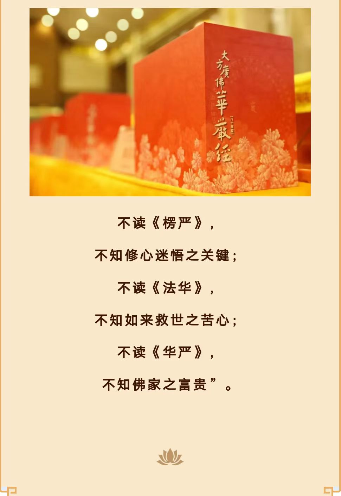

## 一点背景

去年5月28日，我组织了一个“一起读华严”的活动 [(链接)](https://mp.weixin.qq.com/s/exPab92Lk-YvBw9lcWdyiA) ，历经7个月零28天，陆居士是第一个读完了80卷《华严经》的同学。从日期（美国）起2023-5-28到2024-1-24。

（部分记录，后期才转到了「微信读书」APP）

有句话说“独行者快，众行者远” —— 意思是说，一个人走路，会比较快。而一群人走路，则会走得比较远。原因很明显，一个人走路时，不需要和他人协调，独行独往，自然走得快。而一群志同道合的人一起走路，肯定要花时间协调，以及相互照应，所以走起来慢，但是在遇到困难的时候，也可以一起协商努力解决。而众人的力量，肯定比一个人的力量要大。所以，最终会走得更远。

读经也是如此，读一篇短经，相对容易些。读一部大佛经，例如这部80卷之多的《华严经》，就相当的不容易。据我所知，就有不少人曾经尝试读过，却因为种种原因而导致没有完成。一起读佛经这个活动的目的也在于此，大家在一起读，虽然没有组织特别的活动，只是简简单单地在群里面汇报进度，偶尔分享下其中令人感动的经文，或令人赞叹不已的经文等等。即便如此，对于我们坚持读完也非常有鼓励了。

以下是陆居士的读后心得。

## 读《华严经》的一点心得

有句话说：成佛的法华，开悟的楞严，富贵的华严。我用了半年时间读完《华严经》八十卷，初步体会到佛教的富贵，《华严经》是大乘佛教经典中较长的一部，是释迦牟尼成佛后对文殊菩萨、普贤菩萨等菩萨宣讲法界的情况，是对佛教世界观最完整的介绍。此经描绘了一个寥廓无碍、不可思议的佛国净土，并叙述了菩萨修行的因果，显示了一个心性无量、时空行愿、缘起无尽的胜境，彰显了佛陀广大圆满的功德，因此有“不读华严，不知佛家之富贵”的说法。
 
此外，《华严经》以“法性本净”理论为中心，阐述了法界诸法等同一昧、无尽缘起等理论，并在实践上指明了修行的道路，即以“三界唯心”为依据，强调心的作用，并指出了大乘菩萨从初发菩提心到修行圆满成佛的十法阶次，即十信、十住、十行、十回向、十地、等觉、妙觉等52个等级。最后提出依普贤愿十地修行，终能进入佛果境界的理论。在《华严经》中提出的十信、十住、十行、十回向、十地法门行相和修行成果差别的教义，对大乘佛教理论的发展有很大影响。
 
作为释迦牟尼成佛后宣讲的第一部经典，《华严经》逻辑严密、体系宏博，体现了大乘佛教圆融的法义，在大乘佛教诸经典中素有“经中之王”的美誉。

**谈谈自己感触比较深的句子。**

《华严经》觉林菩萨偈：若人欲了知，三世一切佛。应观法界性，一切唯心造。

要想了解过去现在未来诸佛，那就观法界的本性。观法界性，就是一真法界性，一切唯心造。唯心造，一切法都是心造的。 心能造天堂，心能造地狱；行十善便是造天堂，行十恶便是造地狱。心又能造人、造修罗、造畜生、造饿鬼。人的心就是这样微妙，千变万化不离一念，故曰‘一切唯心造’。

“三界唯心，万物唯识”说明众生流转六道，都是生灭妄心所造成。所以这个心，是指集起的妄心。 这个心又是指随缘不变、不变随缘的真如法性，因为从真起妄，真妄不二。《华严经》说：“心如工画师，造种种五阴，一切世间中，无法而不造。”

“应观法界性，一切唯心造”《华严经》这两句话要记住，要常常提起观照，会有很大的帮助。所以，六祖慧能大师开悟了，最后一句话告诉我们，“何期自性，能生万法”，跟《华严经》这两句完全相同。宇宙从哪里来的？真心所现，妄心所变。真心是真如、本性，这个心无处不在，无时不在，哲学里面称之为宇宙万有的本体，是自性。

自性只有一个，没有两个，诸佛如来的自性，跟我们的自性，跟众生的自性，跟山河大地的自性，完全相同。乃至十方三世诸佛刹土，大千世界，没有一法不是，一切唯心造。大师的能生万法，就是此地一切唯心造。 我所见到的，我所受用的，是我自性变现的，他所受用的，是他自性变现的，自他是一不是二，自性只有一个，没有两个。所以，一切万物跟自己原本是一体。

《楞严经》中“空生大觉中,如海一沤发。 有漏微尘国,皆依空所生”，沤就是水泡的意思，众生是真如的一个水泡，水泡不离水，但看似又与水不同，一体两面。
真心迷则称妄心，成佛即转识成智，心量就扩大了，就能包容虚空法界，包容万事万物。包容到什么程度？ 心佛众生无二无别， 心、佛、众生、我没有差别，这一点很重要。

《无量寿经》中有一句：“是诸人等，以此因缘，虽生彼国，不能前至无量寿所。道止佛国界边，七宝城中。佛不使尔，身行所作，心自趣向。”讲出真相，‘佛不使尔’，说明这个事情跟佛不相干，为什么？“身行所作，心自趣向”。 我们无量劫来在轮回里面，舍身受身无量劫，这是为什么？ 身行所作，是自己造的，心自趣向。所以《华严经》上讲得好，“应观法界性，一切唯心造”。 我们在过去无量劫里做过无数好事坏事，今生也做过有限的好事坏事，这是因，遇到缘，果报现前，无论好坏自己承受。

还有一个感悟是《华严经》反复多次讲了发菩提心的重要性。

另外，在谈到善财童子说了很多不可思议的现象，如下， 

“尔时，文殊师利童子… 观察善财以何因缘而有其名？知此童子初入胎时，于其宅内自然而出七宝楼阁，其楼阁下有七伏藏，于其藏上，地自开裂，生七宝牙，所谓：金、银、琉璃、玻璃、真珠、砗磲、玛瑙。善财童子处胎十月然后诞生，形体肢分端正具足；其七大藏，纵广高下各满七肘，从地涌出，光明照耀。复于宅中自然而有五百宝器，种种诸物自然盈满，所谓：金刚器中盛一切香，于香器中盛种种衣，美玉器中盛满种种上味饮食，摩尼器中盛满种种殊异珍宝，金器盛银，银器盛金，金银器中盛满琉璃及摩尼宝，玻璃器中盛满砗磲…”

说明善财童子本身福德智慧具足，是在这个基础上修五十三参，而我们很多人为了工作挣钱、家庭琐事等等，不得不忙忙碌碌，耽误了修行时间，这个修行与工作平衡做的好也算是红尘炼心，如果做不好确实影响修行。

但在此时此刻只能接受现实，从长计议，困难重重也是唯心造，顺顺利利也是唯心造，我们站在过去现在未来的时间轴上，只能承受过去因与现在因带来的果，能做的就是活在当下，做好自己，去改善未来因。

还有建议大家对如来藏概念深入理解，如来藏有很多名字，真如、本际、涅槃、一真法界等等，《楞严经》中“知如来藏，妙觉明心、遍十方界、含育如来十方国土、清净宝严、妙觉王刹”等等。理解如来藏的概念对读懂《华严经》大有好处。

理则顿悟，乘悟并销，事非顿除，因次第尽，大家这次读了《华严经》，今后还要一步步践行，路途遥远，非一时可毕，祝大家六时吉祥！

