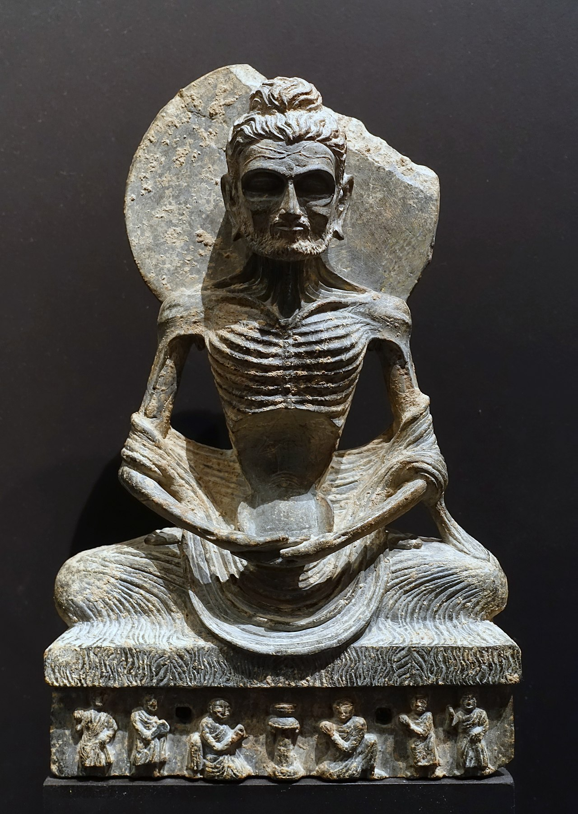

## 基本信息

| 项目       | 信息                                                         |
|------------|--------------------------------------------------------------|
| 姓         | 乔达摩 / 瞿昙                                                |
| 名         | 悉达多                                                       |
| 全名       | 乔达摩.悉达多                                                |
| 英文名     | Siddhartha Gautama                                           |
| 出生       | 前623／563／480年（三种说法）                                |
| 出生地     | 迦毗罗卫国，蓝毗尼园（今尼泊尔境内）                        |
| 逝世       | 前543／483／400年（对应上面三种）                            |
| 逝世地     | 拘尸那揭罗（今印度境内）                                    |
| 享年       | 80岁                                                         |
| 头衔       | 释迦牟尼佛、释迦佛、佛陀、佛、世尊、如来等。                |
| 印度种姓   | 刹帝利（军事贵族）                                           |
| 父亲       | 净饭王                                                       |
| 母亲       | 摩耶夫人                                                     |
| 姨母       | 摩诃波阇波提 / Mahāprajāpati Gautamī / 大爱道                |
| 妻子       | 耶输陀罗，《根本说一切有部毘奈耶破僧事》记载另有两位妻子：鹿王、乔比迦。 |
| 儿子       | 罗睺罗                                                       |
| 堂兄弟       | 阿难陀 / 阿难，提婆                                           |

## 生平事迹

* 8岁：向毘奢婆蜜多罗学习文化，向羼提提婆学习武艺
* 16岁：娶妻，妻子耶输陀罗是天臂城主善觉王的公主
* 29岁：四门出游，于东南西北四道门看到老人、病人、死者、沙门，了知众生之苦，并决意学习沙门出家修道
* 29岁：夜晚偷偷出家，开始遍访名师
  * 遇“阿罗逻伽蓝”，阿罗逻为“数论派”上师，学习禅定，很快就达到：无所有处定（四禅八定之第七），并未解脱。
  * 跟随“郁陀罗摩子”，达到“非想非非想处定”（四禅八定之第八）的禅定状态，也不是解脱。
  * 决定苦行，历时6年。

* ~36岁：在一次苦行中昏倒了，巧遇一位牧羊女供养了羊乳后恢复精神体力。便意识到苦行无法达到解脱，修行应取中道而修。
  * 于是便转往菩提伽耶，于菩提树下铺设吉祥草，跏趺而座。
* 36岁：终于悟道成佛。
  * 依《南传大藏经》记载，释迦牟尼入四种禅，得三明，现观四谛与十二缘起而成无上正等正觉。
  * 北传佛教说，直到了第七日中的第七夜，天正晓明，瞻望明星而悟道。

## 传播佛教

* 在鹿野苑，为㤭陈如等五比丘宣说“四圣谛”，**第一批比丘** —— 僧团成立
* 波罗奈国长者之子耶舍，与其他四位友人，一同加入僧团，随后城中其他豪族有五十人也加入。（僧团人数：五十多人）
* 耶舍的父母，成为僧团**第一位优婆塞、优婆夷**（在家居士） —— 四众弟子
* 舍利弗、目犍连在听到马胜比丘说法后，率二百弟子加入僧团（僧团人数：二百五十多人）
* 迦叶三兄弟率领一千名弟子加入僧团（僧团人数：千二百五十多人） —— 至此，经典中常说的“千二百五十人”到齐了。
* **第一位比丘尼**： 在净饭王去世之后，摩诃波阇波提（大爱道）请求出家，成为僧团中的第一位比丘尼。
* **第一位沙弥**： 7岁的罗睺罗。于佛陀约41岁时（悟道六年后）出家，成为第一位沙弥。
* 佛陀说法住世共45年。

* 大乘佛教认为释迦牟尼佛在色究竟天先说《华严经》
* 两种“三转法轮”说法：
 * 《阿含经》中记载释迦牟尼佛在波罗奈国鹿野苑说四圣谛，以示转（初转），教转（二转），证转（三转），三次宣说四圣谛，称为三转法轮。
 * 在《解深密经》中
   * “初转法轮”，佛在人间先从四圣谛（即苦集灭道），此系列的经典为《阿含经》
   * “第二转无相法轮”，借由体解世间一切法皆空无自性，认知到烦恼生死和涅槃是不二的。此阶段的经典为《大品般若经》及《小品般若经》。
   * “第三转善分别法轮”的《解深密经》、唯识方广诸经、《如来藏经》、《妙法莲华经》，以更显了的方式说明般若经等开示的“一切法无生无灭，本来寂静，自性涅槃”

## 进入涅槃

* 佛陀80岁时，在毗舍离城坐雨安居，宣布将在三个月后进入入灭
* 接受铁匠纯陀供养的世间奇珍栴檀树耳，重病发作（南传佛教记载为痢疾，北传佛教记载为背痛）
* 到拘尸那揭罗酰连尼耶跋提河的岸边，佛告知弟子们将入涅槃，命阿难在娑罗双树中间铺下卧具，头部向北，佛陀躺下，向右侧偃卧，左足置右足上，弟子们都守候在身边，聆听佛陀的最后教诲
* 夜里须跋陀罗（Subhadra）去求佛开示，成为佛陀的最后弟子，并在佛陀涅槃之前先行早一步圆寂。
* 佛陀最后于拘尸那揭罗城附近的娑罗双树下涅槃。
* 火化后的舍利由摩揭陀国王阿阇世和释迦族等八王带回建塔（即舍利塔）供养。

参考：

* https://zh.wikipedia.org/wiki/释迦牟尼
* https://zh.wikipedia.org/wiki/耶输陀罗
* https://zh.wikipedia.org/wiki/罗睺罗
* https://en.wikipedia.org/wiki/The_Buddha
* https://en.wikipedia.org/wiki/Four_sights

