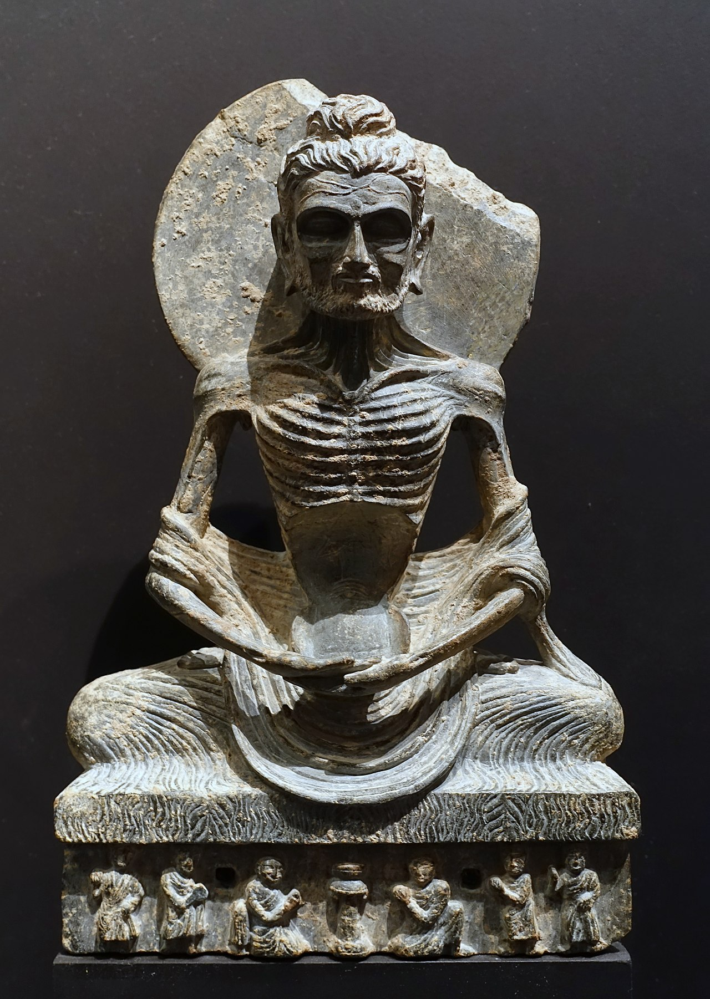

## 基本信息

| 項目       | 信息                                                         |
|------------|--------------------------------------------------------------|
| 姓         | 喬達摩 / 瞿曇                                                |
| 名         | 悉達多                                                       |
| 全名       | 喬達摩.悉達多                                                |
| 英文名     | Siddhartha Gautama                                           |
| 出生       | 前623／563／480年（三種說法）                                |
| 出生地     | 迦毗羅衛國，藍毗尼園（今尼泊爾境內）                        |
| 逝世       | 前543／483／400年（對應上面三種）                            |
| 逝世地     | 拘屍那揭羅（今印度境內）                                    |
| 享年       | 80歲                                                         |
| 頭銜       | 釋迦牟尼佛、釋迦佛、佛陀、佛、世尊、如來等。                |
| 印度種姓   | 剎帝利（軍事貴族）                                           |
| 父親       | 淨飯王                                                       |
| 母親       | 摩耶夫人                                                     |
| 姨母       | 摩訶波闍波提 / Mahāprajāpati Gautamī / 大愛道                |
| 妻子       | 耶輸陀羅，《根本說一切有部毘奈耶破僧事》記載另有兩位妻子：鹿王、喬比迦。 |
| 兒子       | 羅睺羅                                                       |
| 堂兄弟       | 阿難陀 / 阿難，提婆                                           |

## 生平事蹟

* 8歲：向毘奢婆蜜多羅學習文化，向羼提提婆學習武藝
* 16歲：娶妻，妻子耶輸陀羅是天臂城主善覺王的公主
* 29歲：四門出遊，於東南西北四道門看到老人、病人、死者、沙門，了知眾生之苦，並決意學習沙門出家修道
* 29歲：夜晚偷偷出家，開始遍訪名師
  * 遇“阿羅邏伽藍”，阿羅邏為“數論派”上師，學習禪定，很快就達到：無所有處定（四禪八定之第七），並未解脫。
  * 跟隨“鬱陀羅摩子”，達到“非想非非想處定”（四禪八定之第八）的禪定狀態，也不是解脫。
  * 決定苦行，歷時6年。

* 35歲：在一次苦行中昏倒了，巧遇一位牧羊女供養了羊乳後恢復精神體力。便意識到苦行無法達到解脫，修行應取中道而修。
  * 於是便轉往菩提伽耶，於菩提樹下鋪設吉祥草，跏趺而座。
* 35歲：終於悟道成佛。
  * 依《南傳大藏經》記載，釋迦牟尼入四種禪，得三明，現觀四諦與十二緣起而成無上正等正覺。
  * 北傳佛教說，直到了第七日中的第七夜，天正曉明，瞻望明星而悟道。

## 傳播佛教

* 在鹿野苑，為㤭陳如等五比丘宣說“四聖諦”，**第一批比丘** —— 僧團成立
* 波羅奈國長者之子耶舍，與其他四位友人，一同加入僧團，隨後城中其他豪族有五十人也加入。（僧團人數：五十多人）
* 耶舍的父母，成為僧團**第一位優婆塞、優婆夷**（在家居士） —— 四眾弟子
* 舍利弗、目犍連在聽到馬勝比丘說法後，率二百弟子加入僧團（僧團人數：二百五十多人）
* 迦葉三兄弟率領一千名弟子加入僧團（僧團人數：千二百五十多人） —— 至此，經典中常說的“千二百五十人”到齊了。
* **第一位比丘尼**： 在淨飯王去世之後，摩訶波闍波提（大愛道）請求出家，成為僧團中的第一位比丘尼。
* **第一位沙彌**： 7歲的羅睺羅。於佛陀約41歲時（悟道六年後）出家，成為第一位沙彌。
* 佛陀說法住世共45年。

* 大乘佛教認為釋迦牟尼佛在色究竟天先說《華嚴經》
* 兩種“三轉法輪”說法：
 * 《阿含經》中記載釋迦牟尼佛在波羅奈國鹿野苑說四聖諦，以示轉（初轉），教轉（二轉），證轉（三轉），三次宣說四聖諦，稱為三轉法輪。
 * 在《解深密經》中
   * “初轉法輪”，佛在人間先從四聖諦（即苦集滅道），此係列的經典為《阿含經》
   * “第二轉無相法輪”，藉由體解世間一切法皆空無自性，認知到煩惱生死和涅槃是不二的。此階段的經典為《大品般若經》及《小品般若經》。
   * “第三轉善分別法輪”的《解深密經》、唯識方廣諸經、《如來藏經》、《妙法蓮華經》，以更顯了的方式說明般若經等開示的“一切法無生無滅，本來寂靜，自性涅槃”

## 進入涅槃

* 佛陀80歲時，在毗舍離城坐雨安居，宣佈將在三個月後進入入滅
* 接受鐵匠純陀供養的世間奇珍栴檀樹耳，重病發作（南傳佛教記載為痢疾，北傳佛教記載為背痛）
* 到拘屍那揭羅酰連尼耶跋提河的岸邊，佛告知弟子們將入涅槃，命阿難在娑羅雙樹中間鋪下臥具，頭部向北，佛陀躺下，向右側偃臥，左足置右足上，弟子們都守候在身邊，聆聽佛陀的最後教誨
* 夜裡須跋陀羅（Subhadra）去求佛開示，成為佛陀的最後弟子，並在佛陀涅槃之前先行早一步圓寂。
* 佛陀最後於拘屍那揭羅城附近的娑羅雙樹下涅槃。
* 火化後的舍利由摩揭陀國王阿闍世和釋迦族等八王帶回建塔（即舍利塔）供養。

參考：

* https://zh.wikipedia.org/wiki/釋迦牟尼
* https://zh.wikipedia.org/wiki/耶輸陀羅
* https://zh.wikipedia.org/wiki/羅睺羅
* https://en.wikipedia.org/wiki/The_Buddha
* https://en.wikipedia.org/wiki/Four_sights

