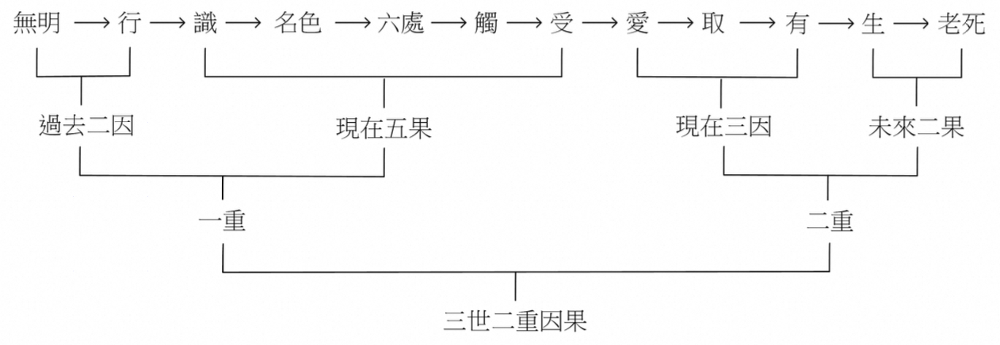
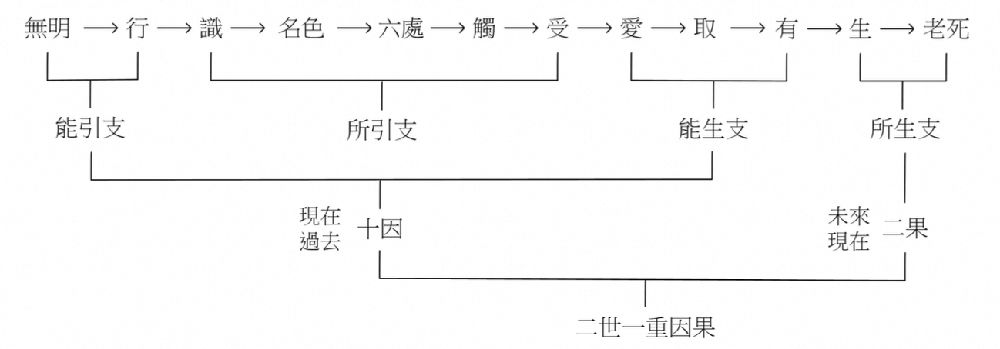
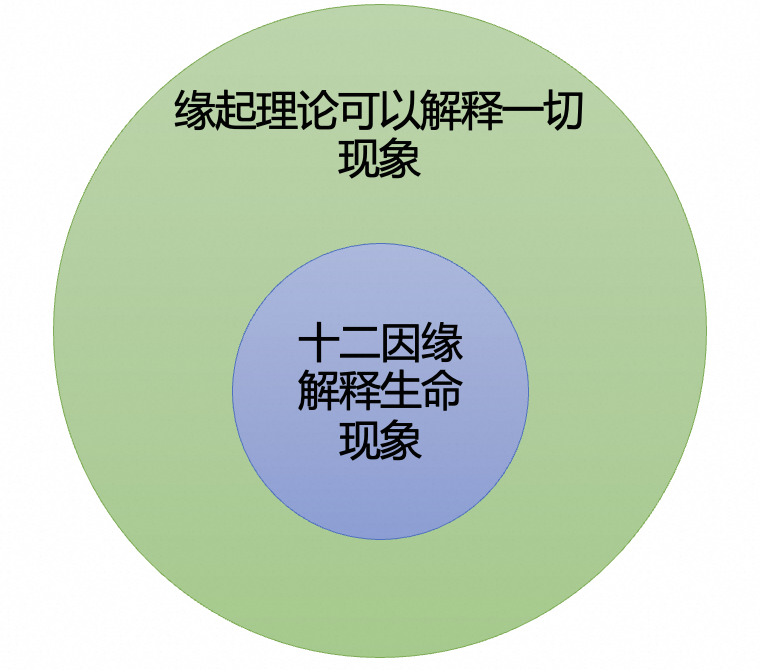

在[上篇文章](https://mp.weixin.qq.com/s/uY6HBqUR3lHDro7MeUFuZA)里面，我从佛经中查找了许多关于佛陀在菩提树下觉悟的直接说法。从数量上来说，十二因缘是最多的。为加深影响，并指出佛经来源，请参考下表。

| 分类 | 佛经 | 内容 |
| ---- | ---- | ---- |
| 南传三藏 | 長部14經，大品第二，譬喻大經 （备注：此处说的是毘婆尸如来） | 十二因缘 |
| 南传三藏 | 自说经，第一品菩提品 | 十二因缘 |
| 北传阿含部 | 杂阿含经，卷第十五，369经 | 十二因缘 |
| 北传经集部 | 佛说分别缘生经 | 十二因缘 |
| 北传本缘部 | 方广大庄严经卷，第九，成正觉品 | 十二因缘 |
| 北传本缘部 | 佛本行集经，成无上道品 | 十二因缘 |
| 北传本缘部 | 过去现在因果经，卷第三 | 十二因缘 |
| 北传律部 | 根本说一切有部毘奈耶破僧事，卷第五 | 十二因缘 |

## 十二因缘简介

在进行十二因缘的解说之前，我先用现代语言，简单地介绍下十二因缘分别是什么。注意，佛教术语，名字，概念，经常会有很多不同的含义。我这里只会介绍下最常用的一种或两种。如果想要完全了解每一项的完整含义，还请参考佛学辞典，以及查找佛经中的原文（这需要下一番功夫才行的）。

十二因缘分别是：无明，行，识，名色，六入，触，受，爱，取，有，生，老病死。

* **无明：即无知，即愚痴。** 对于什么无知呢，即佛法，最关键的哪些佛法呢？四圣谛，十二因缘，八正道。如果是大乘，再加上般若（空性），唯识（真如），如来藏等。
* **行：即造作。** 因为无知，所做的事情，所做的事情也叫业。业的分类方法非常多，最常见的莫过于：**善业、恶业，不善不恶业**（也叫无记业）。其次是：身业（杀、盗、淫），口业（妄语、恶口、两舌、绮语），意业（贪、嗔、痴），合起来就是**十善业或十不善业**了。
* **识：第六意识**。或**唯识里面的第八识**。
* **名色：名，就是名词。色就是物质。** 五蕴中的色蕴，现代来说，就是物质。
* **六入：即六根（眼耳鼻舌身意），六种可以感受的器官**，也有人说是感受器官对应的神经系统。
* **触：接触。** 比如眼睛，在有光，有距离的情况下，看到外面的物体。这个过程就是“触”。（备注下，眼睛可以看到东西，严格来说，需要具备9个条件的。有兴趣的可以参考唯识对此的解说。）
* **受：感受。有三受：苦，乐，不苦不乐。** 再进一步有五受，三受的基础上，再加上忧，喜。
* **爱：喜爱，贪爱。** 
* **取：** 因为贪爱，所以想要**获取**更多。
* **有：三有，欲有，色有，无色有。** 分别对应欲界，色界，无色界。贪爱男女之乐，就希望生在欲界。厌恶男女之欲，又有禅定之力，就希望生在色界。厌恶色身，禅定之力更强，就希望生在无色界。（备注，三界依旧在轮回中，不是解脱）
* **生：** 有了投生的愿望，因缘具足后，就会投生**对应的欲界，色界，无色界**。
* **老病死：有生就会有死。** 无论生在欲界，色界，还是无色界，最终都会有死。**老和病，即变老和生病**，则是不一定，比如婴儿出生就夭折，就不存在”变老“。“生病”也不一定，欲界的众生，很难绝对的无疾而终，但是色界，从出生，变老，到死亡，无疾而终的情况应该有很多。无色界就更不用说了，不会变老，也不会生病，连物质的身体都没有了，哪里来的变老和生病呢。只有投生和死亡了。

**如何深入佛法？ 学会展开，进一步了解各种概念和理论。**

对于佛教名词，有两个步骤可以参考。
1. 理解定义，含义。从最常见的开始，最通用的开始。
2. 展开。比如说“受”，直接的定义和解释就是“感受”，再展开一点就有“三受”和“五受”了，然后再去分别理解他们即可。

对于理论也是如此。比如十二因缘，先了解其含义，每一项的含义，然后再去了解它的解说。含义上面已经简单介绍了。下面介绍对它四种解说，也从最常见的解说开始。

## 十二因缘：解释生命的现象

这是用十二因缘来解释生命的不常不断，生死流转，生命的这种不常不断的现象，经常被称为轮回。轮回的说法有点“泛滥”了，导致对它的误解越来越多了。依照佛法来说，更准确的说法其实是不常不断，流转不停。那么为何会不常不断，流转不停呢？

先解释基本定义，基本含义：
* 不常：不会永恒固定不变。
* 不断：生命不会断灭，生命是连续的，一段又一段。死后会再生。生后终会死。依此循环。但循环中，并没有一个固定不变的灵魂或神识。
* 流传不停：生死流转，即生死生死生死，以此重复。直到解脱。

### 三世两重因果

如图所示：

* 三世：因为有过去世，现在世和未来世。
* 二重：过去世和现在世是第一重因果。现在世和未来世是第二重因果。
* 因为过去世的无明和行，即无知和造作，由此产生了现在世的生命。无明和行，就是过去二因，过去世。
* 现在世的生命（现在五果，即现在世），就是从识，名色，六入，触，受。在这个解说里面，识是神识，或第六意识。名色是卵子受精后的胚胎。六入，是从胚胎慢慢发育出器官，头，眼，手等。触，就是器官成熟，对于子宫中的环境有接触感了。受，就是继续发育，有感受了。出生前的胎儿也可以和大人互动，就是因为有感受，有苦乐了。
* 胎儿出生之后，再继续长大，过程中就会有自己的喜好。进而想要获取更多，以便满足自己的喜好。以欲界的众生来说，最大的喜好和贪求莫过于男女之欲了。这就是爱、取、有三支。（现在三因，即现在世）
* “有”就希望出生和存在于这样的世间（大多是欲界）。这种希望就引发下一次的生命。从而为下一次的投生播下了种子。（未来二果，即未来世）

过去世的无明和行，导致了这一世的果（识，名色，六入，触，受）。而这一世的继续造作（爱、取、有），又会种下下一世投生的因，进而会有后世的生命现象（生，老病死）。从此，生命不停流转，不常也不断。

聪明的读者或许已经发现了。这一世的爱、取、有。在下一世的生命中，也即是无明和行了。这样，生命就进入无限循环当中了。要打破这个循环，解脱”轮回“，正是需要从这一世的爱、取、有作为入手处。改变这一世的爱、取、有。让他们不成为下一世生命产生的原因，即不等于无明和行。

具体点如何操作呢？见到喜欢的东西，不贪求。见到不喜欢的东西，不厌恶。因为这个不贪求，就不会想要获取更多。不想要获取更多，就不会想要拥有了，进而就不会再”生“出新的生命，从而可能解脱轮回之苦了。甚至可以进入涅槃了。（注意，涅槃不是生命的断灭，而是另有解释，限于篇幅，暂时不展开了。）

### 二世一重因果

这个解说是唯识学的独特解说。

* 二世：只有现在世和未来世。
* 一重：现在世和未来世组成了一重因果。
* 因此，也可以画成是过去世和现在世。

唯识学的这个二世一重因果是想要简化的。毕竟比三世一重简单了三分之一。奈何唯识学在传承中有中断，且在文化水平普遍低下的古代，的确是门槛高的。反过来说，进入现代教育的新时代，文盲率在逐年降低的背景下，唯识学也在复兴当中。因此唯识学上的解说，或许也会逐渐流行开来。

玄奘大师组织翻译和汇集的《成唯识论》中说：
“如是十二，一重因果，足显轮转，及离断常，施设两重，实为无用，或应过此，便致无穷。”

大意：十二因缘构成了一重因果关系，足以说明轮回流转的现象，并且能够破除对于生死现象过于极端的看法，既不是断灭论也不是常见。他认为，如果设定两重以上的因果关系，实际上是不必要的；否则，如果不断添加更多的因果层次，理论上会导致无穷无尽的递归，这是没有实际意义的。

看得出来，玄奘大师对于三世二重因果的态度极其明显，批判起来一点都不客气。不过这是题外话了，我个人觉得，觉得哪个容易理解就先用哪个。能理解的就是好的。不能理解的，搁置一边，以后再说喽。

## 十二因缘：解释一切现象

在佛经中，提及十二因缘时，经常会有一个“前缀”，一个“后缀”。比如：

《杂阿含经》卷第十三，335经：谓此有故彼有，此起故彼起，如无明缘行，行缘识……广说乃至纯大苦聚集起。又复，此无故彼无，此灭故彼灭，无明灭故行灭，行灭故识灭……如是广说，乃至纯大苦聚灭。

这个“前缀”就是：此有故彼有，此起故彼起。这个后缀就是“此无故彼无，此灭故彼灭”。这四句话，也经常被单独提起，合并为：

此有故彼有，此起故彼起。
此无故彼无，此灭故彼灭。

这四句话就是 —— 缘起法，不仅可以用来解释生命的生死流转。也可以用来解释一切现象、一切事物的生命周期（成住坏空）。例如，一个苹果树种子，可以发芽生根，从小树长成大树，结果实。苹果掉落地上，腐烂后，种子进入泥土，又发芽生根，长出新的小树。周而复始。

和生命不同现象不同的是，其他东西，如苹果树，不是“有情”，没有“感受器官”，不会感觉“苦乐”，也不会造业（善恶业），所以，十二因缘不能一一对照。但是，此有故彼有这四句，却可以解释一切事物，甚至包括有情众生。

用现代话来解释缘起大意如下：
* 一切人事物（现象）的产生和存在，都依赖其它人事物的产生和存在。
* 换句话说，没有任何一个人事物，可以绝对地、孤立地存在。

## 十二因缘：解释心理现象

十二因缘还可以解释心理现象，例如烦恼的生起。举个例子：

有一位男士正在熙熙攘攘的大街上漫步，突然一位美女朝他走来。

1. 因为窈窕淑女，君子好逑（无明）。
2. 男人总爱看美女（行）。
3. 突然看到美女朝他走来（识──眼识）。
4. 身心就立即紧张起来（名色）。
5. 美女走得越来越近，他开始注意到美女的衣着打扮（六入──眼及意念）。
6. 美女瞧来他一眼。两人眼神对碰了一下。（接触）
7. 他感觉仿佛有一股电流在体内流窜。（受）。
8. 如果美女对他微笑，他会有满足的感觉（爱）；反之，若美女反应平平，他可能会感到失落或遗憾（爱的反面）。
9. 如果美女确实表现出对他感兴趣的样子，他会认为这是对自己魅力的一种肯定（取）。
10. 在内心深处产生自我陶醉的情绪（有）。
11. 开始想象谈恋爱，结婚生子，把孩子名字都起好了（生）。
12. 然而，这些美好的幻想往往转瞬即逝，随着美女逐渐走远，现实情境将他拉回（死）。

从这个过程中可以看到，十二因缘，其实也可以贯穿在每一次的心理活动当中。处理不当，就会生起烦恼，处理得当，就可以泰然自若。还以上面的例子来说，其实，每个环节，都可以改变，从而从情绪的跌宕起伏，变成泰然自若了。略说几个作为例子：

1. 无明：知道美丑只是一种现象，心理美丑更加关键。
2. 行：平常不会去关注美女。
3. 偶尔看到了，也只是看到了，不会多想，这就是不爱，不取。 后面的有，生，老死就都没有了。

## 总结

从提问“佛陀在菩提树下悟到了什么”作为开始，搜集了相关的佛经，并统计了，其中数量最多是“十二因缘”。然后介绍了“十二因缘”的基本概念后，进一步介绍了四种解说。深入理解十二因缘，不仅可以帮助我们理解生命不常不断的流转，也可以帮助理解一切事物的产生和灭亡，还介绍了烦恼是如何生起，以及如何对治。希望大家都能早日离苦得乐。

阿弥陀佛。

