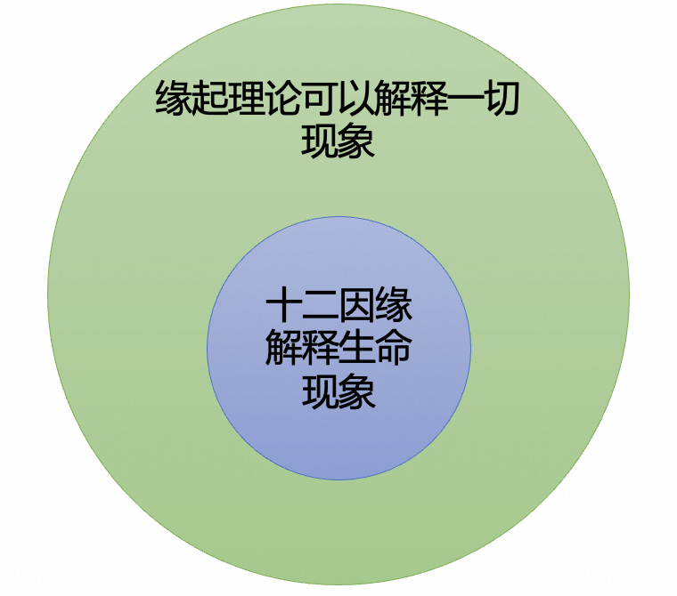

在[上篇文章](https://mp.weixin.qq.com/s/uY6HBqUR3lHDro7MeUFuZA)裡面，我從佛經中查找了許多關於佛陀在菩提樹下覺悟的直接說法。從數量上來說，十二因緣是最多的。為加深影響，並指出佛經來源，請參考下表。

| 分類 | 佛經 | 內容 |
| ---- | ---- | ---- |
| 南傳三藏 | 長部14經，大品第二，譬喻大經 （備註：此處說的是毘婆屍如來） | 十二因緣 |
| 南傳三藏 | 自說經，第一品菩提品 | 十二因緣 |
| 北傳阿含部 | 雜阿含經，卷第十五，369經 | 十二因緣 |
| 北傳經集部 | 佛說分別緣生經 | 十二因緣 |
| 北傳本緣部 | 方廣大莊嚴經卷，第九，成正覺品 | 十二因緣 |
| 北傳本緣部 | 佛本行集經，成無上道品 | 十二因緣 |
| 北傳本緣部 | 過去現在因果經，卷第三 | 十二因緣 |
| 北傳律部 | 根本說一切有部毘奈耶破僧事，卷第五 | 十二因緣 |

## 十二因緣簡介

在進行十二因緣的解說之前，我先用現代語言，簡單地介紹下十二因緣分別是什麼。注意，佛教術語，名字，概念，經常會有很多不同的含義。我這裡只會介紹下最常用的一種或兩種。如果想要完全瞭解每一項的完整含義，還請參考佛學辭典，以及查找佛經中的原文（這需要下一番功夫才行的）。

十二因緣分別是：無明，行，識，名色，六入，觸，受，愛，取，有，生，老病死。

* **無明：即無知，即愚痴。** 對於什麼無知呢，即佛法，最關鍵的哪些佛法呢？四聖諦，十二因緣，八正道。如果是大乘，再加上般若（空性），唯識（真如），如來藏等。
* **行：即造作。** 因為無知，所做的事情，所做的事情也叫業。業的分類方法非常多，最常見的莫過於：**善業、惡業，不善不惡業**（也叫無記業）。其次是：身業（殺、盜、淫），口業（妄語、惡口、兩舌、綺語），意業（貪、嗔、痴），合起來就是**十善業或十不善業**了。
* **識：第六意識**。或**唯識裡面的第八識**。
* **名色：名，就是名詞。色就是物質。** 五蘊中的色蘊，現代來說，就是物質。
* **六入：即六根（眼耳鼻舌身意），六種可以感受的器官**，也有人說是感受器官對應的神經系統。
* **觸：接觸。** 比如眼睛，在有光，有距離的情況下，看到外面的物體。這個過程就是“觸”。（備註下，眼睛可以看到東西，嚴格來說，需要具備9個條件的。有興趣的可以參考唯識對此的解說。）
* **受：感受。有三受：苦，樂，不苦不樂。** 再進一步有五受，三受的基礎上，再加上憂，喜。
* **愛：喜愛，貪愛。** 
* **取：** 因為貪愛，所以想要**獲取**更多。
* **有：三有，欲有，色有，無色有。** 分別對應欲界，色界，無色界。貪愛男女之樂，就希望生在欲界。厭惡男女之慾，又有禪定之力，就希望生在色界。厭惡色身，禪定之力更強，就希望生在無色界。（備註，三界依舊在輪迴中，不是解脫）
* **生：** 有了投生的願望，因緣具足後，就會投生**對應的欲界，色界，無色界**。
* **老病死：有生就會有死。** 無論生在欲界，色界，還是無色界，最終都會有死。**老和病，即變老和生病**，則是不一定，比如嬰兒出生就夭折，就不存在”變老“。“生病”也不一定，欲界的眾生，很難絕對的無疾而終，但是色界，從出生，變老，到死亡，無疾而終的情況應該有很多。無色界就更不用說了，不會變老，也不會生病，連物質的身體都沒有了，哪裡來的變老和生病呢。只有投生和死亡了。

**如何深入佛法？ 學會展開，進一步瞭解各種概念和理論。**

對於佛教名詞，有兩個步驟可以參考。
1. 理解定義，含義。從最常見的開始，最通用的開始。
2. 展開。比如說“受”，直接的定義和解釋就是“感受”，再展開一點就有“三受”和“五受”了，然後再去分別理解他們即可。

對於理論也是如此。比如十二因緣，先了解其含義，每一項的含義，然後再去了解它的解說。含義上面已經簡單介紹了。下面介紹對它四種解說，也從最常見的解說開始。

## 十二因緣：解釋生命的現象

這是用十二因緣來解釋生命的不常不斷，生死流轉，生命的這種不常不斷的現象，經常被稱為輪迴。輪迴的說法有點“氾濫”了，導致對它的誤解越來越多了。依照佛法來說，更準確的說法其實是不常不斷，流轉不停。那麼為何會不常不斷，流轉不停呢？

先解釋基本定義，基本含義：
* 不常：不會永恆固定不變。
* 不斷：生命不會斷滅，生命是連續的，一段又一段。死後會再生。生後終會死。依此循環。但循環中，並沒有一個固定不變的靈魂或神識。
* 流傳不停：生死流轉，即生死生死生死，以此重複。直到解脫。

### 三世兩重因果

如圖所示：

* 三世：因為有過去世，現在世和未來世。
* 二重：過去世和現在世是第一重因果。現在世和未來世是第二重因果。
* 因為過去世的無明和行，即無知和造作，由此產生了現在世的生命。無明和行，就是過去二因，過去世。
* 現在世的生命（現在五果，即現在世），就是從識，名色，六入，觸，受。在這個解說裡面，識是神識，或第六意識。名色是卵子受精後的胚胎。六入，是從胚胎慢慢發育出器官，頭，眼，手等。觸，就是器官成熟，對於子宮中的環境有接觸感了。受，就是繼續發育，有感受了。出生前的胎兒也可以和大人互動，就是因為有感受，有苦樂了。
* 胎兒出生之後，再繼續長大，過程中就會有自己的喜好。進而想要獲取更多，以便滿足自己的喜好。以欲界的眾生來說，最大的喜好和貪求莫過於男女之慾了。這就是愛、取、有三支。（現在三因，即現在世）
* “有”就希望出生和存在於這樣的世間（大多是欲界）。這種希望就引發下一次的生命。從而為下一次的投生播下了種子。（未來二果，即未來世）

過去世的無明和行，導致了這一世的果（識，名色，六入，觸，受）。而這一世的繼續造作（愛、取、有），又會種下下一世投生的因，進而會有後世的生命現象（生，老病死）。從此，生命不停流轉，不常也不斷。

聰明的讀者或許已經發現了。這一世的愛、取、有。在下一世的生命中，也即是無明和行了。這樣，生命就進入無限循環當中了。要打破這個循環，解脫”輪迴“，正是需要從這一世的愛、取、有作為入手處。改變這一世的愛、取、有。讓他們不成為下一世生命產生的原因，即不等於無明和行。

具體點如何操作呢？見到喜歡的東西，不貪求。見到不喜歡的東西，不厭惡。因為這個不貪求，就不會想要獲取更多。不想要獲取更多，就不會想要擁有了，進而就不會再”生“出新的生命，從而可能解脫輪迴之苦了。甚至可以進入涅槃了。（注意，涅槃不是生命的斷滅，而是另有解釋，限於篇幅，暫時不展開了。）

### 二世一重因果

這個解說是唯識學的獨特解說。

* 二世：只有現在世和未來世。
* 一重：現在世和未來世組成了一重因果。
* 因此，也可以畫成是過去世和現在世。

唯識學的這個二世一重因果是想要簡化的。畢竟比三世一重簡單了三分之一。奈何唯識學在傳承中有中斷，且在文化水平普遍低下的古代，的確是門檻高的。反過來說，進入現代教育的新時代，文盲率在逐年降低的背景下，唯識學也在復興當中。因此唯識學上的解說，或許也會逐漸流行開來。

玄奘大師組織翻譯和彙集的《成唯識論》中說：
“如是十二，一重因果，足顯輪轉，及離斷常，施設兩重，實為無用，或應過此，便致無窮。”

大意：十二因緣構成了一重因果關係，足以說明輪迴流轉的現象，並且能夠破除對於生死現象過於極端的看法，既不是斷滅論也不是常見。他認為，如果設定兩重以上的因果關係，實際上是不必要的；否則，如果不斷添加更多的因果層次，理論上會導致無窮無盡的遞歸，這是沒有實際意義的。

看得出來，玄奘大師對於三世二重因果的態度極其明顯，批判起來一點都不客氣。不過這是題外話了，我個人覺得，覺得哪個容易理解就先用哪個。能理解的就是好的。不能理解的，擱置一邊，以後再說嘍。

## 十二因緣：解釋一切現象

在佛經中，提及十二因緣時，經常會有一個“前綴”，一個“後綴”。比如：

《雜阿含經》卷第十三，335經：謂此有故彼有，此起故彼起，如無明緣行，行緣識……廣說乃至純大苦聚集起。又復，此無故彼無，此滅故彼滅，無明滅故行滅，行滅故識滅……如是廣說，乃至純大苦聚滅。

這個“前綴”就是：此有故彼有，此起故彼起。這個後綴就是“此無故彼無，此滅故彼滅”。這四句話，也經常被單獨提起，合併為：

此有故彼有，此起故彼起。
此無故彼無，此滅故彼滅。

這四句話就是 —— 緣起法，不僅可以用來解釋生命的生死流轉。也可以用來解釋一切現象、一切事物的生命週期（成住壞空）。例如，一個蘋果樹種子，可以發芽生根，從小樹長成大樹，結果實。蘋果掉落地上，腐爛後，種子進入泥土，又發芽生根，長出新的小樹。週而復始。

和生命不同現象不同的是，其他東西，如蘋果樹，不是“有情”，沒有“感受器官”，不會感覺“苦樂”，也不會造業（善惡業），所以，十二因緣不能一一對照。但是，此有故彼有這四句，卻可以解釋一切事物，甚至包括有情眾生。

用現代話來解釋緣起大意如下：
* 一切人事物（現象）的產生和存在，都依賴其它人事物的產生和存在。
* 換句話說，沒有任何一個人事物，可以絕對地、孤立地存在。

## 十二因緣：解釋心理現象

十二因緣還可以解釋心理現象，例如煩惱的生起。舉個例子：

有一位男士正在熙熙攘攘的大街上漫步，突然一位美女朝他走來。

1. 因為窈窕淑女，君子好逑（無明）。
2. 男人總愛看美女（行）。
3. 突然看到美女朝他走來（識──眼識）。
4. 身心就立即緊張起來（名色）。
5. 美女走得越來越近，他開始注意到美女的衣著打扮（六入──眼及意念）。
6. 美女瞧來他一眼。兩人眼神對碰了一下。（接觸）
7. 他感覺彷彿有一股電流在體內流竄。（受）。
8. 如果美女對他微笑，他會有滿足的感覺（愛）；反之，若美女反應平平，他可能會感到失落或遺憾（愛的反面）。
9. 如果美女確實表現出對他感興趣的樣子，他會認為這是對自己魅力的一種肯定（取）。
10. 在內心深處產生自我陶醉的情緒（有）。
11. 開始想象談戀愛，結婚生子，把孩子名字都起好了（生）。
12. 然而，這些美好的幻想往往轉瞬即逝，隨著美女逐漸走遠，現實情境將他拉回（死）。

從這個過程中可以看到，十二因緣，其實也可以貫穿在每一次的心理活動當中。處理不當，就會生起煩惱，處理得當，就可以泰然自若。還以上面的例子來說，其實，每個環節，都可以改變，從而從情緒的跌宕起伏，變成泰然自若了。略說幾個作為例子：

1. 無明：知道美醜只是一種現象，心理美醜更加關鍵。
2. 行：平常不會去關注美女。
3. 偶爾看到了，也只是看到了，不會多想，這就是不愛，不取。 後面的有，生，老死就都沒有了。

## 總結

從提問“佛陀在菩提樹下悟到了什麼”作為開始，蒐集了相關的佛經，並統計了，其中數量最多是“十二因緣”。然後介紹了“十二因緣”的基本概念後，進一步介紹了四種解說。深入理解十二因緣，不僅可以幫助我們理解生命不常不斷的流轉，也可以幫助理解一切事物的產生和滅亡，還介紹了煩惱是如何生起，以及如何對治。希望大家都能早日離苦得樂。

阿彌陀佛。

