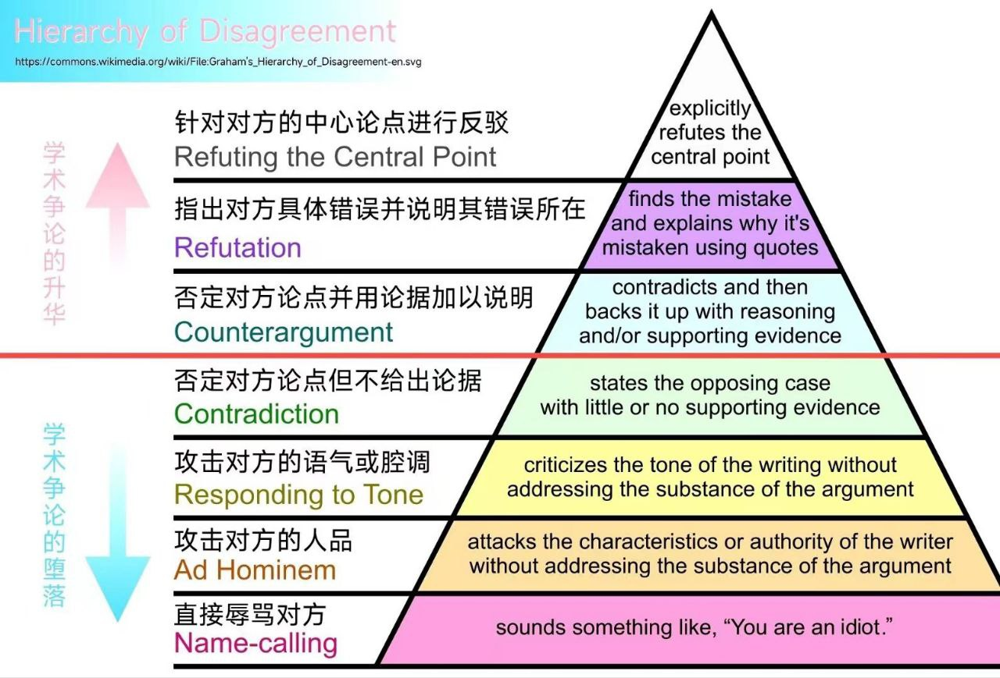
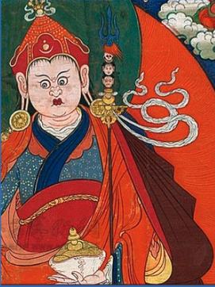

备注：
1. 本笔记记录视频里面的主要观点。其视频参考了古代文献，如《巴协》，但不采信神话描述。根据现实生活，推测历史“原貌”。
2. 如有反驳者，请参考下图，列出主要证据，其证据需要可信，如古代文献，考古资料等。
3. 本人只是记录其观点，不代表100%认同。但认真的科学考据，有一定的参考价值。

## 莲花生大师确有其人吗？

视频：[莲花生确有其人吗？藏传佛教修的法是哪里来的？密教是什么？莲花生的来龙去脉独家考证，张老师讲藏传佛教前弘期](https://www.bilibili.com/video/BV1Ju4y1P7SC)

1. 莲花生的来路不明。
	1. 但是的印度文明非常发达，佛教高僧，大多有非常详细的记录，如出生时间和地点，出家，受戒，学法过程。
	2. 但是莲花生大师的记录都没有。目前也只知道他是8世纪的人。尤其是没有出家记录，受戒等记录。
	3. 号称有25弟子，但是这个25个弟子的记录也传说和神通为主，并无佛教传法的记录（如弘扬了什么教法）。
2. 他的名字 —— Padmasambhāva。
	1. 意译是莲花中出生。名字不符合起名规范。总之，不像人名。
	2. 名字和一个诗歌的名字构成一致。印度一个比较有名的诗人叫做迦梨陀娑（4-5世纪），他有一部诗叫做《鸠摩罗出世》。进的是湿婆和雪山女神结合，最后生下孩子。这个《鸠摩罗出世》在梵文里面叫做Kuma rasambhava。后面这个sambhava和莲花生的那个sambhava是一 样的，前面这块不一样。Kumara的意思就是儿子，孩子。
3. 根据以上两点总结，莲花生大概率不是一个（真实）的人，是后人编出来的一个人。那么为什么要编造这样一个人呢？张老师继续说。
4. 需要探究藏传佛教的内容到底是什么？表面上是佛教大乘。实际上是各种密教。密教来源不能明说（意思是密教不是佛教）。
5. 张老师认为是寂护或他的弟子们编造了莲花生这样的人物。原因：
	1. 寂护刚来西藏传法，不到2个月，就被苯教赶跑了。寂护临走时说，要请一个莲花生来。然后莲花生来了半年，就把苯教干趴下了。这些是寂护的弟子（巴赛囊）记录的。
		1. 如何干趴下苯教呢？那就是仪式比苯教还恐怖，还神异。苯教本身类似巫术。巫术就是比谁更恐怖。
	2. 把苯教搞定了以后，寂护又回到西藏传法 —— 传播大小乘，中观理论。（根据《巴协》记载的）
	3. 一方面传播预层的大乘理论，另一方面用湿婆教骷髅 派的这一套仪式扫平了苯教的这些人。
	4. 然后又很聪明，说你们的这些苯教的这些神都变成了 我佛教的护法神，调和了这个矛盾。
	5. 同时，莲花生的“法”也在同时流传。这是为了继续镇住苯教。然而，这个“法”到底是什么内容？哪里来的？

6. 莲花生的形象。手拿天杖。手里托钵。
	1. 天杖，上面有三个骷髅头，一个干透了的骷髅头，一个正在腐烂的骷髅头，和一个刚割下来的血淋淋的头颅。
	2. 钵，就是嘎巴拉碗 —— 人的头骨制作的“法器”。一些唐卡里面的钵，还会放人的眼睛，或心脏。
	3. 这两个东西是来源于印度湿婆教的一个比较极端的派 别叫做骷髅派 （Kapalika）。湿婆教骷髅派的标志物：天杖khatvanga和人骨钵子kapala。
		1. 这个骷髅派的骷髅头，来源必须是婆罗门或其信仰者。
		2. 披驴皮，或狗皮。
		3. 身上涂灰。
		4. 沙门中的苦行者，住在乱葬岗等地。
		5. 修行各种“大法门”，需要4种东西：肉，血，酒，性。
		6. 该派使用大量的骨头做“法器”。
		7. 骷髅派主要活动在8世纪。后来消失了。
		8. 张老师推测，该派后来跑到了西藏。仪式和莲花生所传的“法”类似。
		9. 佐证：玄奘大师在印度取经时，记录了，有些佛教徒和印度苦行者混杂在一起。两者相互影响很深。
7. 莲花生在布达拉宫有一个“做法”（仪式），在《巴协》里面记载的。
	1. 首先有一个坛城。坛城上面放了两颗血淋淋的人头，挂满了人的肠子和 内脏。
	2. 旁边有五肉，五甘露。
		1. 五肉：五肉就是象肉、狗肉、马肉、孔雀肉，人肉。人肉 真的人肉。
		2. 五甘露：男人的种子（精液）、女人的血（经血），粪便、脑髓、尿液。
	3. 这两样东西（五肉和五甘露），在藏传佛教的仪式里面，96%以上都有。这种仪式和做法，一直延续到1959年。
	4. （1959年后，西藏解放了，被禁止了很多不文明的东西。 ）
	5. 当时赞普的一个妃子在旁边就说，这句话也被记录下 来了：就说：“如此黑暗恐怖的东西进入了吐蕃，恐怕吐蕃要遭灾”。
8. 密教，怛特羅。
	1. 相比“显教”注重教理和思辨不同，密教注重“方法”。用“密教”的方法快速体会佛教理论，如空。
	2. 例如方法是，喝酒喝得不省人事，断片的感觉，就说是体会到“空”了。
	3. 或者烧火，里面放点蘑菇，大叶子（类似大麻），一会儿就迷糊了。让人体会到所谓“极乐世界”的样子。
	4. 密教曾普遍存在于印度各个宗教里面。印度教有，佛教也有。如唐密。

9. 总结：
	1. 寂护大师：一方面传播预层的大乘理论，另一方面用湿婆教骷髅 派的这一套仪式扫平了苯教的这些人。
	2. 然后又很聪明，说你们的这些苯教的这些神都变成了 我佛教的护法神，调和了这个矛盾。

