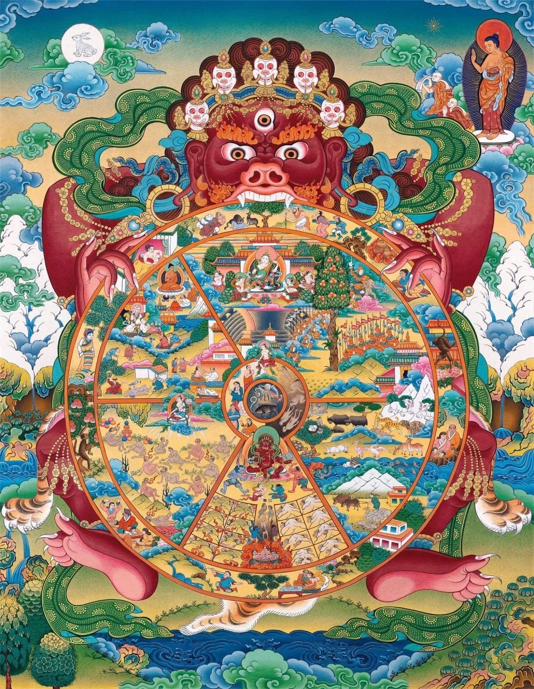
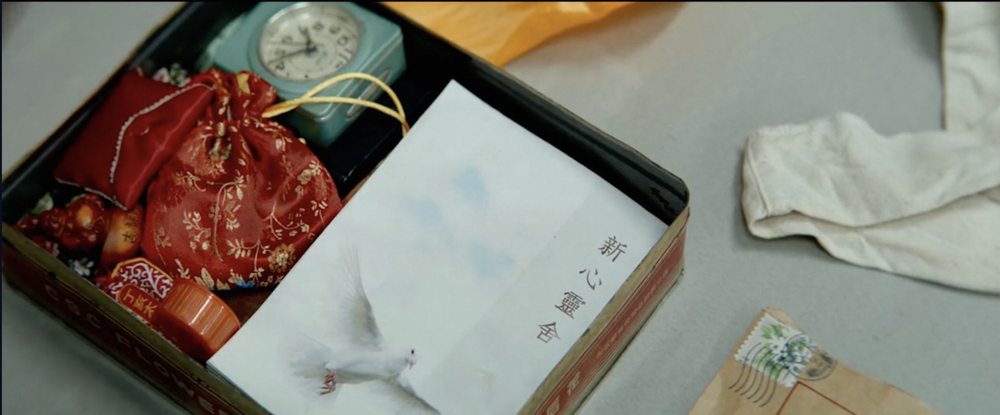
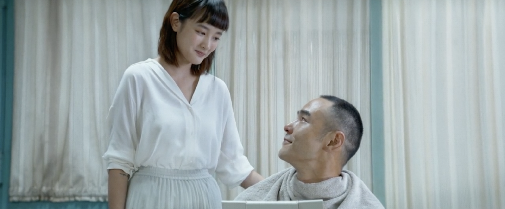

电影《周处除三害》最近很火热，听说在网飞（Netflix）上也可以播放了，立即去找来看。查找的时候，一开始用“周处除三害”去搜索，结果一无所获，还以为是Netflix的上映是分地域的？然后再查了下IMDB上的评分，发现英文名居然是The Pig, The Snake and The Pigeon，顿时更觉得有兴趣了（后面说），这才找到了电影，看了起来。Netflix上是无删减的版本。（备注，本文有轻度剧透。）

## 先说说电影的中文名“周处除三害”

这个网上已经有很多解读了，我这里略微提下：

根据《晋书·周处传》和《世说新语》中有记载。周处年轻时，身形魁梧，武力高强，但横行乡里，为邻人所厌。有一天，周处听说附近山上有一只吊睛白额虎，为祸乡里，让人们提心吊胆。附近的水里还有一只蛟龙，比老虎更厉害。周处不以为意，直接跑与老虎搏斗，又与蛟龙激战三天三夜，最终将它们打死。周处回到村里，乡亲们张灯结彩，敲锣打鼓。周处以为乡亲们是在欢迎周处英雄的凯旋。然而，并非如此，乡亲们以为周处和蛟龙同归于尽了，所以庆祝。原来，当地民间流传着“三害”的说法，第一是猛虎，第二是蛟龙，第三就是周处。根据老百姓的私下排名，周处是这三者中最狠的。虽然他杀了猛虎和蛟龙，但他自己成了最后一害。后来，周处意识到自己的错误，决定洗心革面，重新做人。最终成为晋朝的将军。

电影的情节也大概如此，桂林仔被骗患有肺癌晚期后，决定去自首。却在警局发现，自己在通缉犯上排行第三，前面还有两位通缉犯，排在桂林仔的前面。桂林仔决定为民除害，干掉了前面两位通缉犯，最终自首伏法。

## 解读下英文名

为何我在知道它的英文名是The Pig, The Snake and The Pigeon后，立即增加了兴趣呢？原因很简单。先看下面的图片：

中心太小看不清？再放大一点。

在佛教文化中，猪、蛇、鸽子分别代表了众生的贪、嗔、痴。他们首尾衔接，代表了贪、嗔、痴相互促进和增长的关系。如，愚痴会生贪心，贪不到又会生嗔心，嗔心发作必然冲动，做事不计后果，这就是愚痴了。这样，也就完成了一个完整的闭环。众生生生不息，一直生活在贪、嗔、痴之中。

电影里面的贪是黑帮头目，黑帮头目必定是贪得无厌，唯利是图。而愚痴呢，则是其中的邪教。尤其是在这段结尾时，桂林仔把邪教头目爆头了以后，马上就有人接班了，并且在死到临头，也不知悔改。实在是愚痴至极了。嗔心就是桂林仔了，他在电影里面，就是个杀手的身份。这只是一种对照方式了，换一种也可以，例如说，邪教头目代表贪，黑帮头目代表嗔，桂林仔代表愚痴。

当然，这是很简单的划分。如果再进一步，贪里面必定包含痴和嗔，例如黑社会的唯利是图（贪心）里面，必定会有嗔心（黑帮火拼），和愚痴（要知道后果也不会加入黑帮了）。同样地，愚痴里面很容易生长贪和嗔。在电影的邪教里面，表面上让信徒放弃世俗，并当面烧掉代表世俗的金钱，钱包等。但实际上，却偷偷储存起来，变成了邪教头目的个人奢侈享受。这便是愚痴中生贪心了。后来被桂林仔揭露了以后，把大家以为都烧掉的东西，扔在大家眼前的时候，邪教头目唆使，并最终“杀掉”桂林仔，即是嗔心。桂林仔虽然是嗔心的作祟，同样受到了贪心的唆使，贪图名利，想要成为通缉犯第一名，并让世人知道是他干掉了通缉犯之前的第一名和第二名。他的愚痴也有多处表现，即使上当受骗，以为自己得了肺癌晚期。也有因为愚痴才会加入邪教。最后，更是因为愚痴，才犯下这滔天大罪，最终被执行死刑。

这样黑帮头目、邪教头目和桂林仔每个人都具备了三种，都是是贪、嗔、痴的代表了。

## 解读下里面的邪教 - 新心灵舍

图中所示，一般邪教的主要特征为：“教主”崇拜、精神控制、编造邪说、聚敛钱财、秘密结社、危害社会。邪教常用的骗人手法有：用歪理邪说欺骗人、用宗教幌子蒙蔽人、用治病、免灾诱惑人、用各种把戏吓唬人、用小恩小惠笼络人、用暴力手段胁迫人等。

对照下电影即可一目了然，表面是让信徒抛弃世俗生活，烧掉钱包，银行卡。实际上却暗渡陈仓，偷偷把信众的钱财据为己有，变成了“教主”的个人奢华物质享受。这便是其中的“聚敛钱财”。

在信众的饭菜里面下药，让信众误以为生病，再弄了一个“医生”装模作样诊断了一番。然后“教主”说，是因为身体里面有脏东西。这便是“精神控制、编造邪说”，手段是“用治病”当幌子了。

电影中的“新心灵舍”在一座孤岛上，和外界几乎完全隔离，这便是“秘密结社”。

当桂林仔发现真相，企图去拯救带小孩的妈妈时，教主毫不犹豫地怂恿小孩妈妈杀掉桂林仔。最终，小孩妈妈要么是无法对他人下手，要么是会错意了，结果自杀了。就在小孩妈妈自杀后，“长发”信徒毫不犹豫地拿起刀捅了桂林仔，并且把两者立即埋了。这便是极端的“暴力犯罪”了。

最后，桂林仔从棺材里爬出来后，一枪爆头了邪教头目，桂林仔转身离开。结果还未走远，就听到里面的人继续唱颂着他们的“赞歌”，恍如没事发生一般，桂林仔又回去，先是警告了一番，最后用枪暴力“清场”了。（据说这段画面在国内有被删减）。

虽然这里有电影夸张的表现手法，也不难印证，邪教的“洗脑”是非常可怕的。电影里面的人，到死也不醒悟，实在是太可悲可叹了。

题外话，在一些所谓的宗教自由的地方，这类邪教案件实属不少。所以，电影里面的场景，对于常人无法接受，无法理解，但可能却是在别处发生过的“历史事实”了。

祝愿大家不会遇到任何“邪教”。
平安自在。阿弥陀佛。

