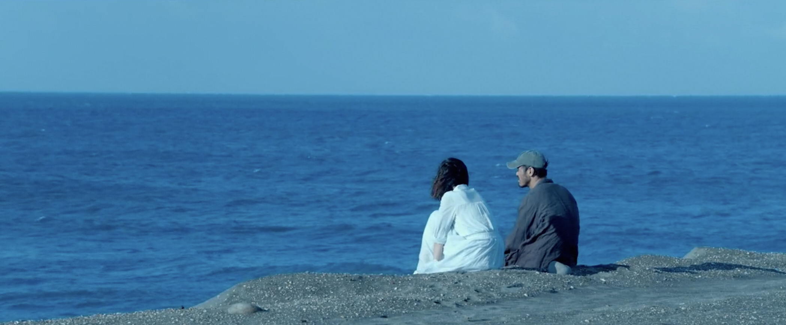
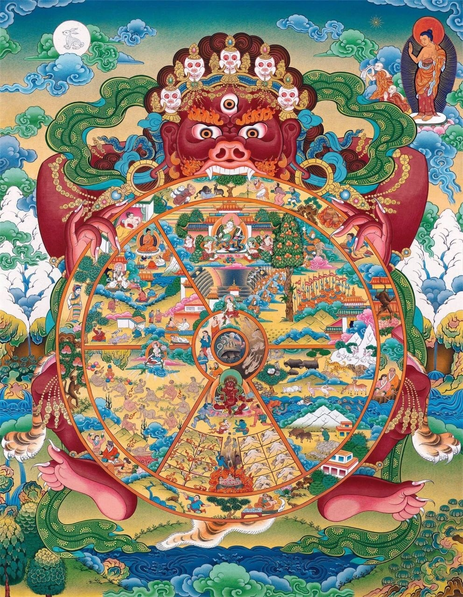
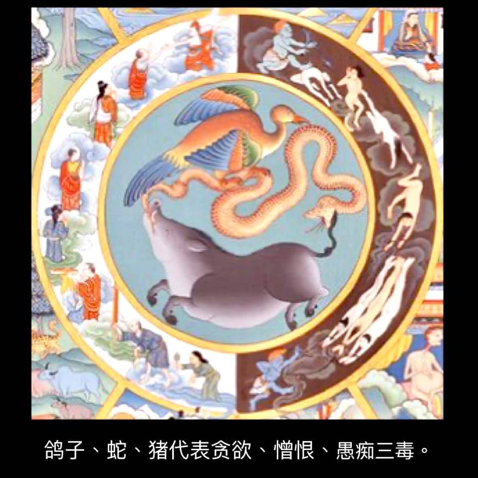
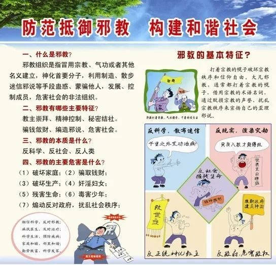
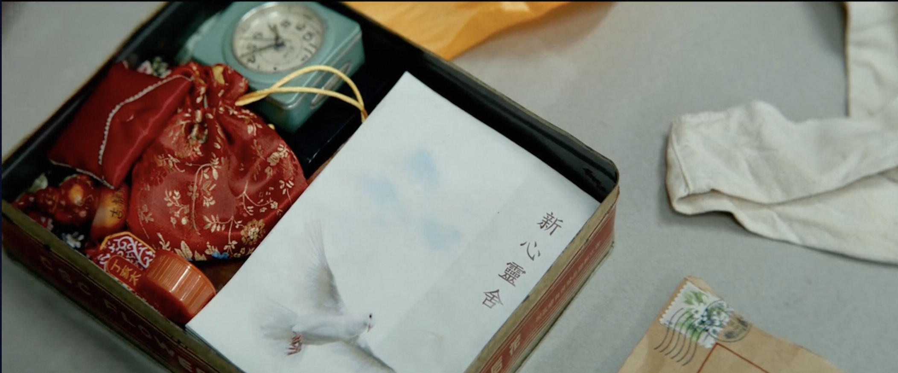
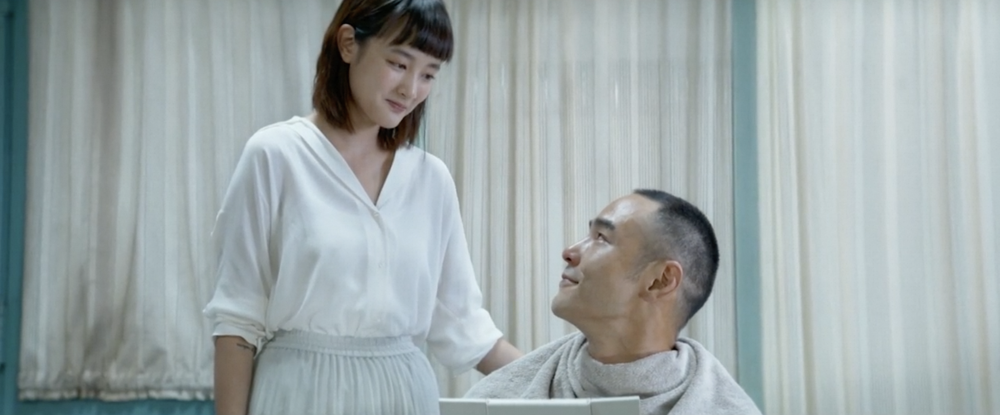

電影《周處除三害》最近很火熱，聽說在網飛（Netflix）上也可以播放了，立即去找來看。查找的時候，一開始用“周處除三害”去搜索，結果一無所獲，還以爲是Netflix的上映是分地域的？然後再查了下IMDB上的評分，發現英文名居然是The Pig, The Snake and The Pigeon，頓時更覺得有興趣了（後面說），這才找到了電影，看了起來。Netflix上是無刪減的版本。（備註，本文有輕度劇透。）

## 先說說電影的中文名“周處除三害”

這個網上已經有很多解讀了，我這裏略微提下：

根據《晉書·周處傳》和《世說新語》中有記載。周處年輕時，身形魁梧，武力高強，但橫行鄉里，爲鄰人所厭。有一天，周處聽說附近山上有一隻吊睛白額虎，爲禍鄉里，讓人們提心吊膽。附近的水裏還有一隻蛟龍，比老虎更厲害。周處不以爲意，直接跑與老虎搏鬥，又與蛟龍激戰三天三夜，最終將它們打死。周處回到村裏，鄉親們張燈結綵，敲鑼打鼓。周處以爲鄉親們是在歡迎周處英雄的凱旋。然而，並非如此，鄉親們以爲周處和蛟龍同歸於盡了，所以慶祝。原來，當地民間流傳着“三害”的說法，第一是猛虎，第二是蛟龍，第三就是周處。根據老百姓的私下排名，周處是這三者中最狠的。雖然他殺了猛虎和蛟龍，但他自己成了最後一害。後來，周處意識到自己的錯誤，決定洗心革面，重新做人。最終成爲晉朝的將軍。

電影的情節也大概如此，桂林仔被騙患有肺癌晚期後，決定去自首。卻在警局發現，自己在通緝犯上排行第三，前面還有兩位通緝犯，排在桂林仔的前面。桂林仔決定爲民除害，幹掉了前面兩位通緝犯，最終自首伏法。

## 解讀下英文名

爲何我在知道它的英文名是The Pig, The Snake and The Pigeon後，立即增加了興趣呢？原因很簡單。先看下面的圖片：

中心太小看不清？再放大一點。

在佛教文化中，豬、蛇、鴿子分別代表了衆生的貪、嗔、癡。他們首尾銜接，代表了貪、嗔、癡相互促進和增長的關係。如，愚癡會生貪心，貪不到又會生嗔心，嗔心發作必然衝動，做事不計後果，這就是愚癡了。這樣，也就完成了一個完整的閉環。衆生生生不息，一直生活在貪、嗔、癡之中。

電影裏面的貪是黑幫頭目，黑幫頭目必定是貪得無厭，唯利是圖。而愚癡呢，則是其中的邪教。尤其是在這段結尾時，桂林仔把邪教頭目爆頭了以後，馬上就有人接班了，並且在死到臨頭，也不知悔改。實在是愚癡至極了。嗔心就是桂林仔了，他在電影裏面，就是個殺手的身份。這只是一種對照方式了，換一種也可以，例如說，邪教頭目代表貪，黑幫頭目代表嗔，桂林仔代表愚癡。

當然，這是很簡單的劃分。如果再進一步，貪裏面必定包含癡和嗔，例如黑社會的唯利是圖（貪心）裏面，必定會有嗔心（黑幫火拼），和愚癡（要知道後果也不會加入黑幫了）。同樣地，愚癡裏面很容易生長貪和嗔。在電影的邪教裏面，表面上讓信徒放棄世俗，並當面燒掉代表世俗的金錢，錢包等。但實際上，卻偷偷儲存起來，變成了邪教頭目的個人奢侈享受。這便是愚癡中生貪心了。後來被桂林仔揭露了以後，把大家以爲都燒掉的東西，扔在大家眼前的時候，邪教頭目唆使，並最終“殺掉”桂林仔，即是嗔心。桂林仔雖然是嗔心的作祟，同樣受到了貪心的唆使，貪圖名利，想要成爲通緝犯第一名，並讓世人知道是他幹掉了通緝犯之前的第一名和第二名。他的愚癡也有多處表現，即使上當受騙，以爲自己得了肺癌晚期。也有因爲愚癡纔會加入邪教。最後，更是因爲愚癡，才犯下這滔天大罪，最終被執行死刑。

這樣黑幫頭目、邪教頭目和桂林仔每個人都具備了三種，都是是貪、嗔、癡的代表了。

## 解讀下里面的邪教 - 新心靈舍

圖中所示，一般邪教的主要特徵爲：“教主”崇拜、精神控制、編造邪說、聚斂錢財、祕密結社、危害社會。邪教常用的騙人手法有：用歪理邪說欺騙人、用宗教幌子矇蔽人、用治病、免災誘惑人、用各種把戲嚇唬人、用小恩小惠籠絡人、用暴力手段脅迫人等。

對照下電影即可一目瞭然，表面是讓信徒拋棄世俗生活，燒掉錢包，銀行卡。實際上卻暗渡陳倉，偷偷把信衆的錢財據爲己有，變成了“教主”的個人奢華物質享受。這便是其中的“聚斂錢財”。

在信衆的飯菜裏面下藥，讓信衆誤以爲生病，再弄了一個“醫生”裝模作樣診斷了一番。然後“教主”說，是因爲身體裏面有髒東西。這便是“精神控制、編造邪說”，手段是“用治病”當幌子了。

電影中的“新心靈舍”在一座孤島上，和外界幾乎完全隔離，這便是“祕密結社”。

當桂林仔發現真相，企圖去拯救帶小孩的媽媽時，教主毫不猶豫地慫恿小孩媽媽殺掉桂林仔。最終，小孩媽媽要麼是無法對他人下手，要麼是會錯意了，結果自殺了。就在小孩媽媽自殺後，“長髮”信徒毫不猶豫地拿起刀捅了桂林仔，並且把兩者立即埋了。這便是極端的“暴力犯罪”了。

最後，桂林仔從棺材裏爬出來後，一槍爆頭了邪教頭目，桂林仔轉身離開。結果還未走遠，就聽到裏面的人繼續唱頌着他們的“讚歌”，恍如沒事發生一般，桂林仔又回去，先是警告了一番，最後用槍暴力“清場”了。（據說這段畫面在國內有被刪減）。

雖然這裏有電影誇張的表現手法，也不難印證，邪教的“洗腦”是非常可怕的。電影裏面的人，到死也不醒悟，實在是太可悲可嘆了。

題外話，在一些所謂的宗教自由的地方，這類邪教案件實屬不少。所以，電影裏面的場景，對於常人無法接受，無法理解，但可能卻是在別處發生過的“歷史事實”了。

祝願大家不會遇到任何“邪教”。
平安自在。阿彌陀佛。

