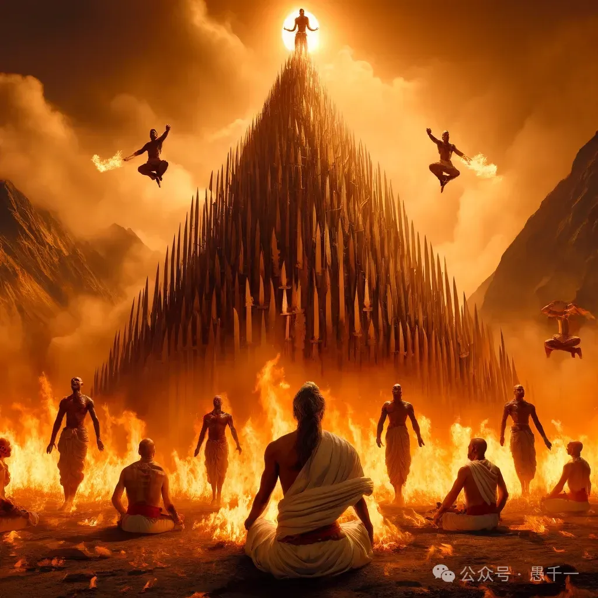
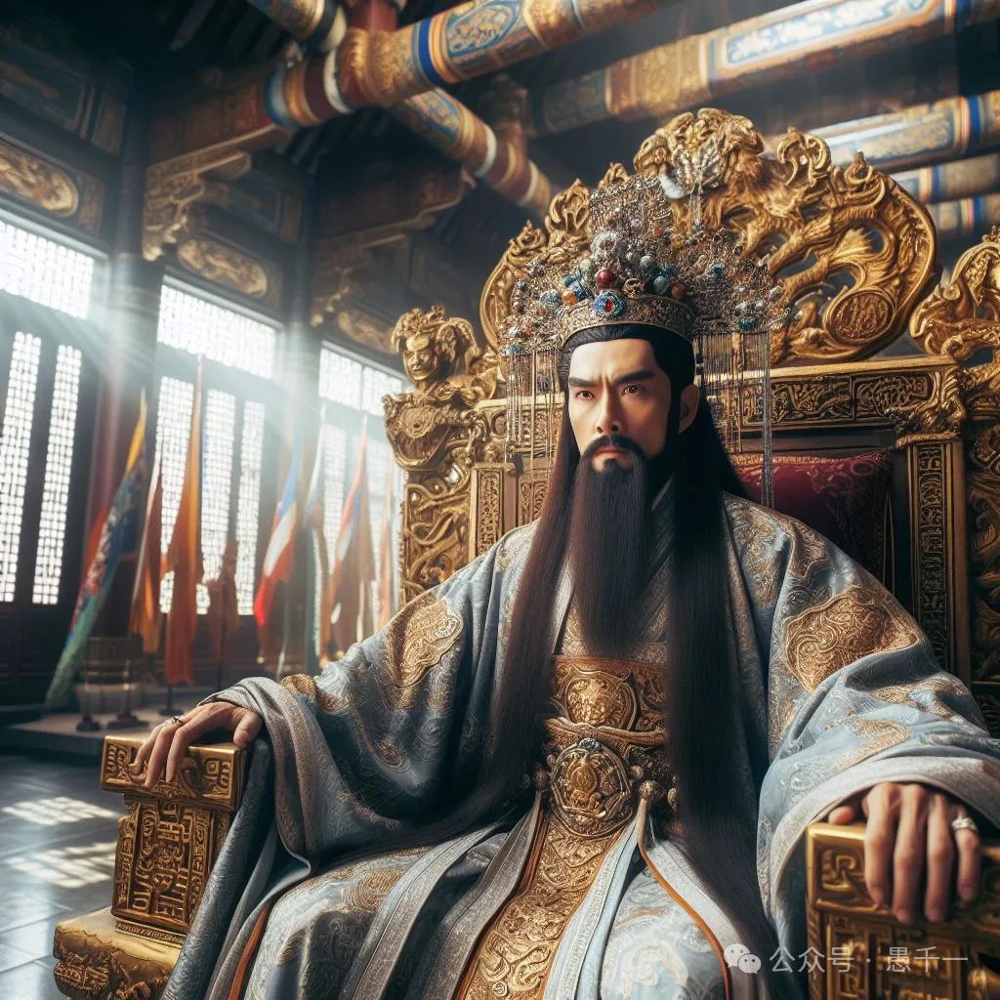
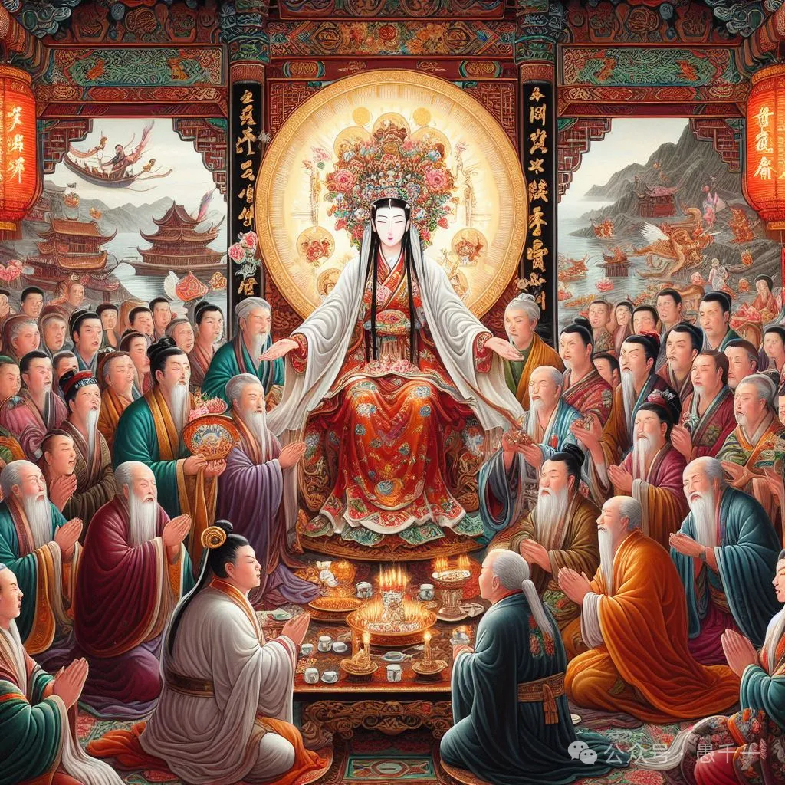
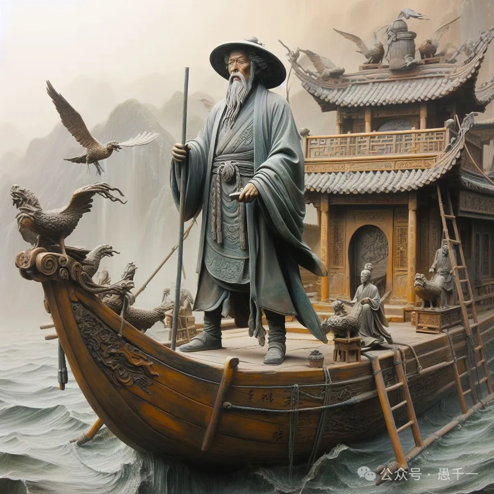
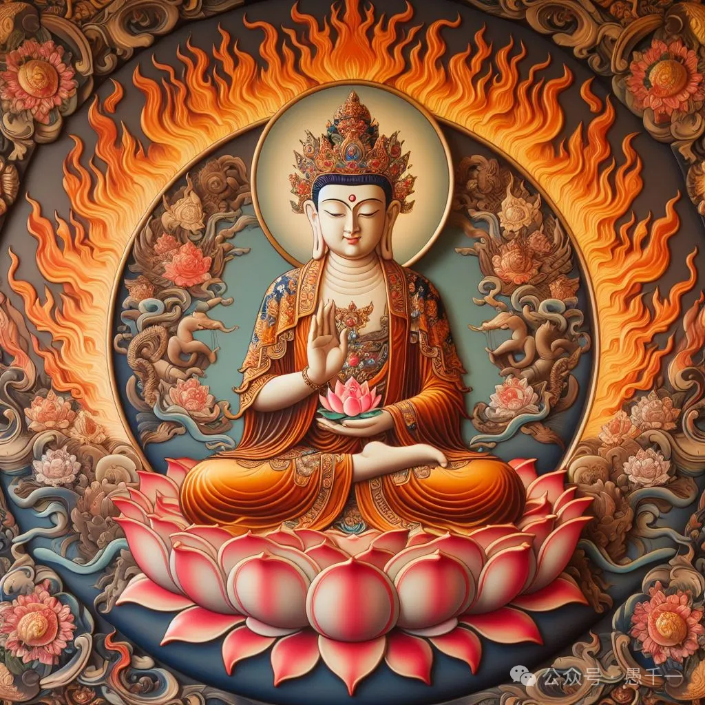
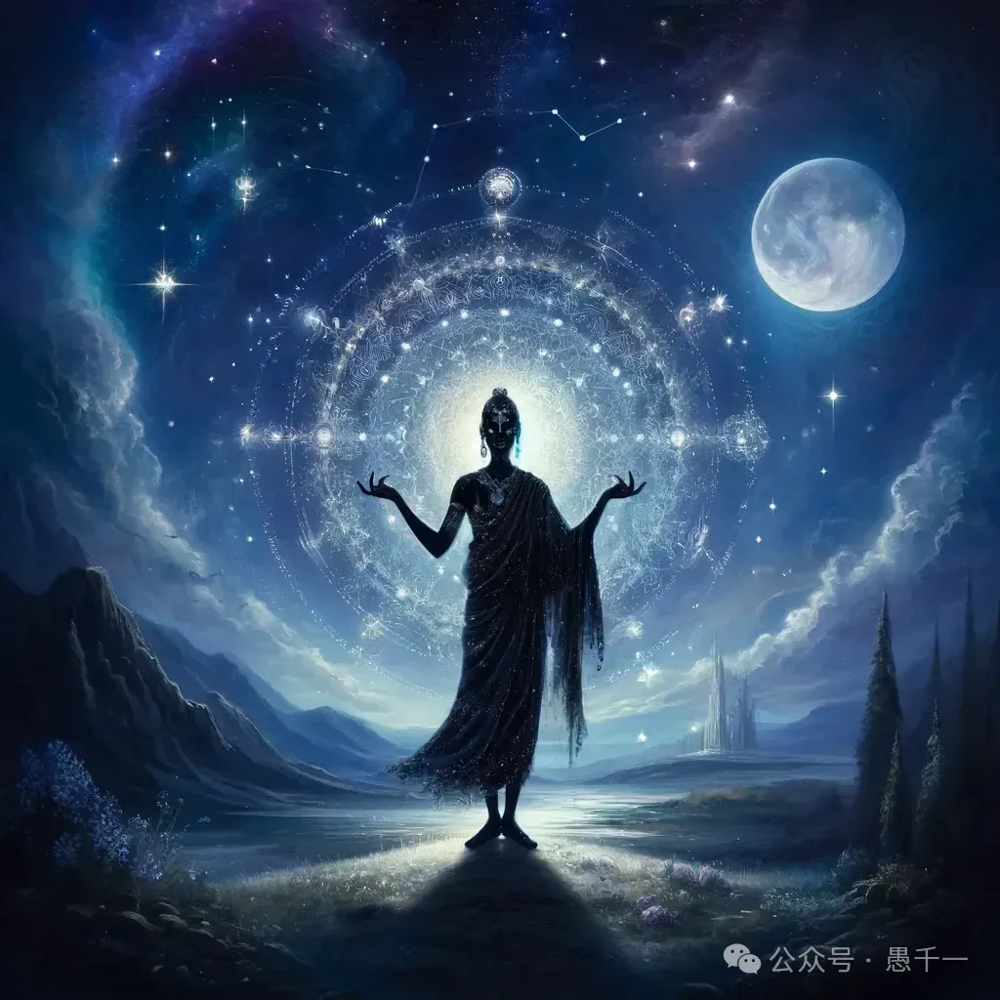
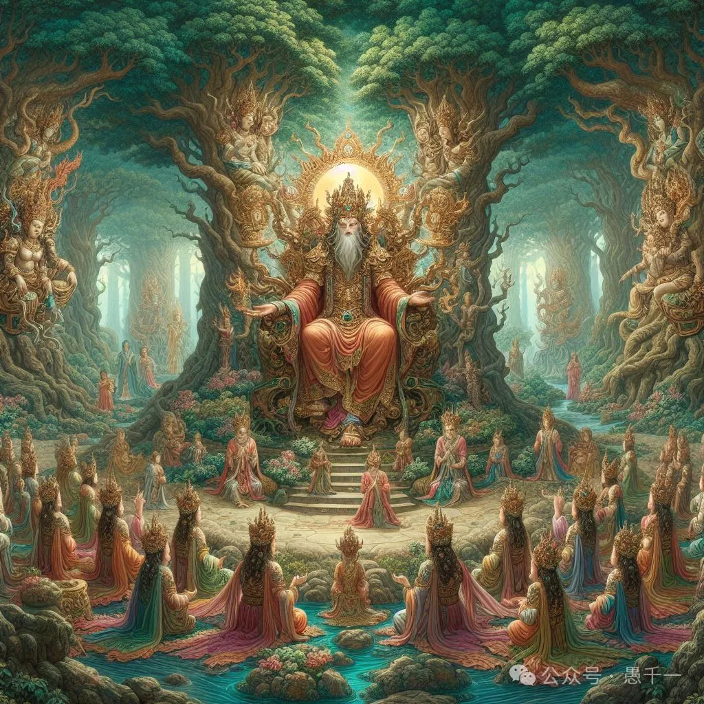
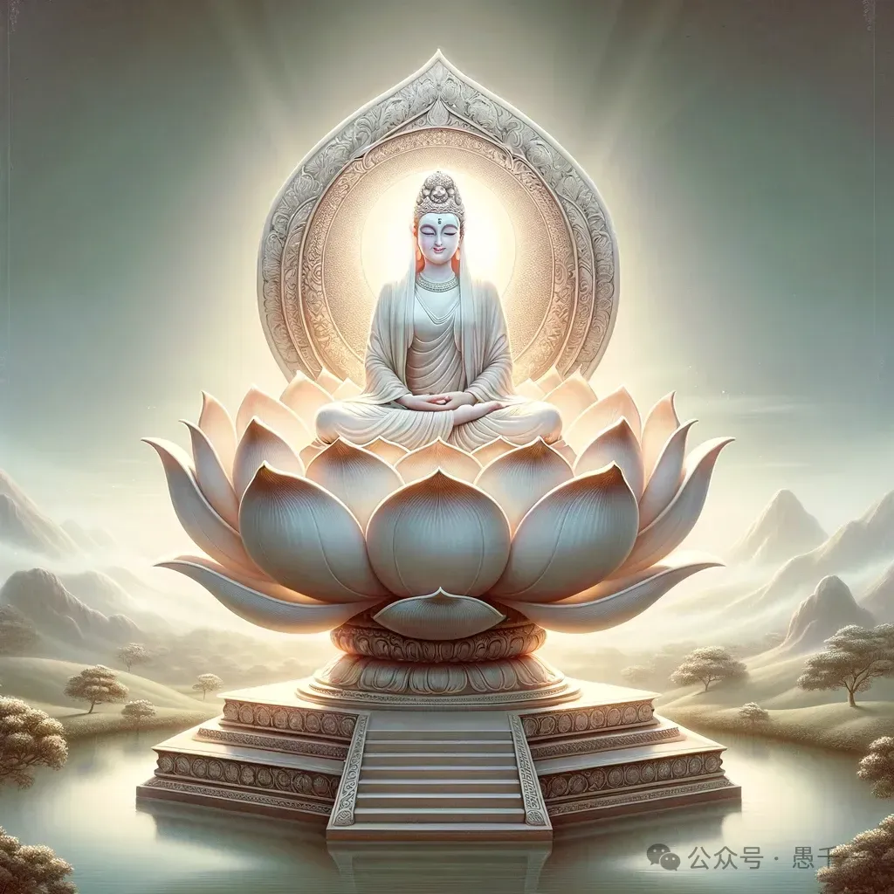
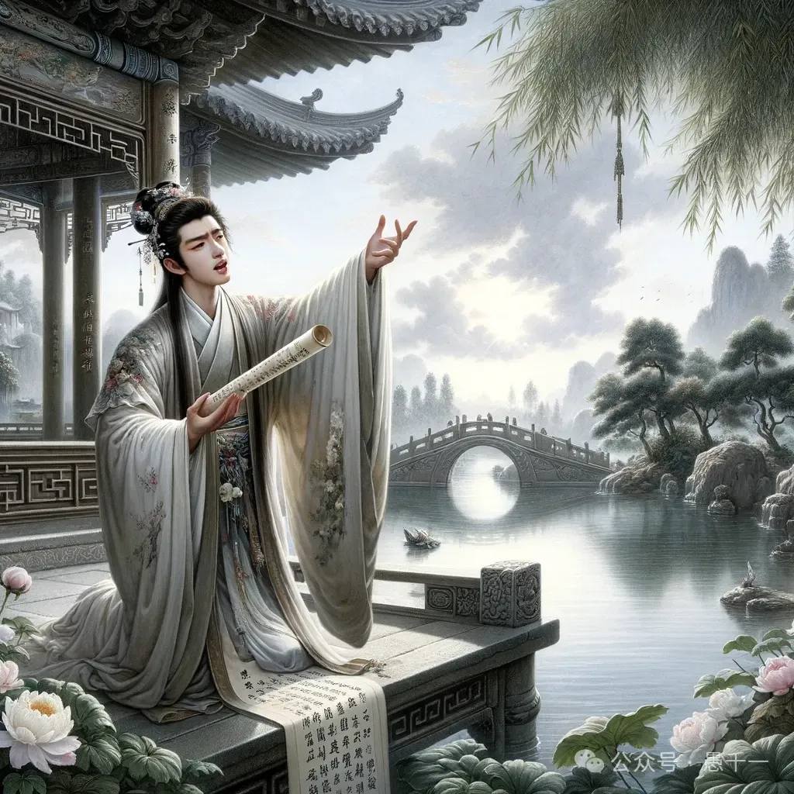
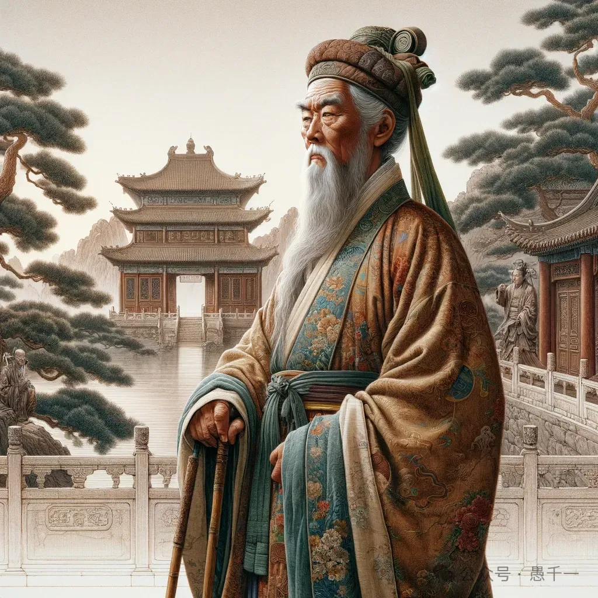

备注：
1. 所有图片都是用AI生成的。生成图片时，有从经文中提取关键字，如背景，身份等。
2. 有些图片的细节处理得不太好，放大后可以看到明显瑕疵。图中的文字都不是真的文字，无法阅读（我所使用的AI的限制）。

### 第1位：吉祥云比丘，教授——忆念一切诸佛平等境界无碍智能普见法门。
南方有一国土，名为胜乐；其国有山名曰妙峰，彼有比丘名吉祥云。

### 第2位：海云比丘，教授——普眼法门
南方有国名曰海门，彼有比丘名为海云。

### 第3位：妙住比丘，教授——普遍速疾，勇猛不空，供养诸佛，成熟众生无碍解脱门

从此南行六十由旬，楞伽道边，有一聚落名为海岸，彼有比丘名曰妙住。

### 第4位：弥伽大士，教授——妙音陀罗尼光明法门

从此南方有一国土，名达逻比咤，其国有城，名金刚层；中有大士，名曰弥伽。...乃见其人于市肆中，处高台上，坐师子座，十千人众所共围遶，广说轮字庄严法门。

### 第5位：解脫長者，教授——如来甚深无碍庄严解脱法门

从此南方有一聚落名为住林，彼有长者名住解脱。

### 第6位：海幢比丘，教授——般若波罗蜜清净光明三昧法门

从此南行阎浮提畔有一住处，名遍无垢；彼有比丘，名曰海幢。...乃见处在经行林侧，结跏趺坐，端身正念，离出入息，无别思觉，住不思议广大三昧，以三昧力现大神通。

### 第7位：伊舍那優婆夷，教授——离忧安隐幢解脱门

从此南行至海潮处，彼有大城名圆满光，其城有王名妙圆光。于彼城东有一园林名普庄严，王有夫人名伊舍那，为优婆夷，止住此林修菩萨行。

### 第8位：大威猛仙人，教授——菩萨无胜幢解脱门

于此南方海潮之处，有一国土名那罗素，中有仙人名大威猛声。

### 第9位：胜热婆罗门，教授——菩萨普圆满无尽轮解脱门

于此南方有一聚落，名伊沙那；彼有住处名阿野怛那，有婆罗门名曰胜热。...渐次游行至伊沙那聚落，见胜热婆罗门，修诸苦行于赫日中，四面火聚犹如大山，中有刀山高峻无极，为欲勤求一切智智，登彼刀山投身入火。

### 第10位：慈行童女，教授——般若波罗蜜普庄严门

南方有城名师子频申，彼城有王名无畏星宿幢王，有童女名为慈行。...慈行童女，身真金色，目发绀青，形貌端严，相好具足，以梵音声而演说法。

### 第11位：妙见比丘，教授——菩萨随顺无尽灯解脱门

于此南方，有一国土，名为三目。彼有比丘，名曰妙见。...渐次前行，至三目国，于彼城邑、市肆、廛里、山川、林薮、仙人住处，周遍寻访妙见比丘。忽然覩见在一林中经行往复，头骨如盖，顶有肉髻，殊胜端严，其眼修广如青莲叶，鼻修高直如挺真金，唇色丹洁如频婆果，齿白齐密具足四十。

### 第12位：自在主童子，教授——一切工巧大神通智光明法门

于此南方，有一国土，名圆满多闻，其中有城，名曰妙门，彼有童子，名根自在主。...见彼童子，十千童子前后围遶，聚沙为戏。

### 第13位：具足優婆夷，教授——菩萨无尽福德庄严藏解脱门

南方有城名海别，住有优婆夷名辨具足。...善财入已，见优婆夷处于宝座，妙年盛色，容貌端严，不御华璎，素服垂发，威光殊特，人所乐见。除佛、菩萨，余无能及；有胜威力，有广大心，令诸众生，见闻亲近，咸生尊重、爱敬之心。

### 第14位：明智居士，教授——随意出生福德藏解脱门

南方有城，名为大有，彼有长者，名具足智。

### 第15位：宝髻长者，教授——菩萨无障碍愿普遍庄严福德藏解脱门

于此南方有一大城，名师子宫，彼有长者，名尊法宝髻。

### 第16位：普眼长者 —— 令一切众生普见诸佛承事供养欢喜法门。

南方有国名曰藤根；其国有城名普遍门；中有长者名为普眼。...尔时，善财于彼城内推求寻觅长者所居，人咸报言：“住市肆中，鬻香药处。”

### 第17位：甘露火王 —— 如幻解脱变化法门

南方有一大城，名多罗幢；彼城有王名甘露火。

### 第18位：大光王，教授——净修菩萨大慈幢行解脱门

南方有城名妙光，王名大光。...渐渐前行，普遍观察，见大光王去于所住楼阁不远四衢道中，坐如意摩尼宝莲华藏广大庄严师子宝座。

### 第19位：不动优婆夷，教授——菩萨所修坚固受持大愿行门、求一切法心无疲厌庄严三昧智光明门、菩萨难摧伏智能藏解脱门、一切法平等地总持门、一切法智光照辩才门

于此南方，有一王都名曰安住；有优婆夷名曰不动。...不动优婆夷身是童女，侍觐父母，在自宅中，与其亲属及无量人，周匝围遶，演说妙法。

### 第20位：遍行外道，教授——至一切处随顺遍行菩萨行

于此南方有一大城，名都萨罗；其中有一出家外道，名曰遍行。

其城东北有一大山，名妙吉祥；善财童子于中夜时，见此山顶有大光明，峰峦峻峙，岩岫攒拱，草树华林靡不辉映，照耀城居，如日初出，见此事已，生大欢喜，作是念言：“我必于此见善知识。”便从城出，正念观察，而登彼山；住立思惟遥望瞻仰，见此外道于其山上平坦之处徐步经行，色相圆满，威光照耀，吉祥福焰过于炽火，十千梵众之所围遶，大梵天王所不能及。

### 第21位：鬻香长者，教授——调和香法

于此南方有一国土，名为广博，彼有聚落从国为名，其中有一鬻香长者，名曰具足优钵罗华。

### 第22位：婆施罗船师，教授——大悲幢行

于此南方有一大城，名曰楼阁；彼有船师，名婆施罗。...到彼城已，见彼船师在城门外海岸上住，百千商人大众围遶，说大海法，方便开示佛功德海。

### 第23位：最胜长者，教授——至一切处净菩萨行庄严法门，无依、无作、无性、无住神通之力

于此南方有一城邑，名乐璎珞；中有长者名为最胜。...见在城东大庄严幢无忧林中，无量商人百千长者众所围遶，理断人间种种事务，因为宣扬出世之法，令离见慢及我、我所，舍所积聚眷属珍财，灭除悭嫉一切疑执，心得清净无诸秽浊。

### 第24位：师子频申比丘尼，教授——灭除一切微细分别，成就一切智菩萨解脱门

于此南方有一国土，名无边际河，其国有城名羯陵迦林，有比丘尼名师子频申...尔时，善财见比丘尼遍坐一切诸宝树下大师子座，身相端严，威仪寂静，住法平等，动止安详。

### 第25位：伐苏蜜多，教授——菩萨离贪欲际解脱法门

于此南方有一聚落，名为险难，其中有城，名宝庄严，彼有女人，名伐苏蜜多。

### 第26位：毘瑟底罗居士，教授——菩萨所得不般涅槃际解脱门

南方有城，名净达彼岸；中有居士，名毘瑟底罗，彼常供养栴檀座佛塔。

### 第27位：观自在菩萨，教授——菩萨大悲速疾行解脱门
于此南方有山，名补怛洛迦，彼有菩萨名观自在。...观自在菩萨于清净金刚宝叶石上结跏趺坐，无量菩萨皆坐宝石恭敬围遶，而为宣说智能光明大慈悲法，令其摄受一切众生。

### 第28位：正性无异行菩萨，教授——普门不动速疾行解脱
尔时，有一菩萨名正性无异行，从于东方虚空中来，至此世界轮围山顶，以足按地。...复以神力随诸众生心之所乐，普于一切诸宫殿中而现其身，令其见者皆悉欢喜，然后来诣观自在菩萨摩诃萨所。

### 第29位：大天，教授——菩萨云网解脱

南方有城名为门主，其中有神名曰大天。...尔时，大天即于是时，长舒四臂，取四海水，自洗其面。

（无论如何都画不出来只有4条胳膊的天神）

### 第30位：自性不动主地神，教授——难摧伏智能藏解脱门

此阎浮提摩竭提国菩提场中，有主地神名自性不动。

### 第31位：春和主夜神，教授——菩萨教化调伏破一切众生痴暗法光明解脱门

阎浮提摩竭提国恒河北岸，有一大城名迦毘罗，有主夜神名曰春和。

### 第32位：普遍吉祥无垢光主夜神，教授——菩萨寂静禅定乐普游步勇猛解脱门

此阎浮提恒河南岸，摩竭提国菩提场中，有主夜神名普遍吉祥无垢光。

### 第33位：喜目观察一切众生主夜神，教授——大速疾力普喜幢无垢解脱门

去此不远菩提树王道场右面，有主夜神名喜目观察一切众生。

（经中非常详细地了这位夜神过去世修行的经历，篇幅非常长）

### 第34位：普救护一切众生威德吉祥主夜神，教授——普现一切世间调伏众生解脱门

于此如来大众会中，有主夜神名普救护一切众生威德吉祥。

（经中非常详细地了以下这些夜神过去世修行的经历，篇幅非常长）

### 第35位：具足功德寂静音海主夜神，教授——念念速疾出生广大欢喜庄严解脱门

去此不远菩提场中，有主夜神，名具足功德寂静音海，坐星宿光幢摩尼王庄严宝莲华藏师子之座，百万阿僧祇夜神以为眷属，前后围遶。

### 第36位：守护一切城增长威德主夜神，教授——甚深自在可爱妙音解脱

此菩提场如来清净圆满会中有主夜神，名守护一切城增长威德。

### 第37位：能开敷一切树华安乐主夜神，教授——菩萨出生广大欢喜调伏众生藏普光明解脱门

此菩提场佛众会中，有主夜神名能开敷一切树华安乐。

(漏了)

### 第38位：一切众生大愿精进力光明夜神，教授——菩萨普化众生令生善根解脱门

此菩提场如来会中，有一夜神，名守护一切众生大愿精进力光明。

### 第39位：妙威德圆满爱敬林神，教授——菩萨于无量劫遍一切处示现受生自在神变解脱法门

此阎浮提从菩提树，恒河西北，迦毘罗城，有一园林，名岚毘尼，彼园有神，名妙威德圆满爱敬。...渐次而行，度恒河北，入憍萨罗国，向迦毘罗城，诣岚毘尼林。到已，右遶周旋，求觅妙德圆满爱敬林神；见在林中大宝树下，庄严圆满宝楼阁中，坐摩尼藏师子之座，二十亿那由他诸林神女前后围遶，广为演说一切菩萨受生海经，令其皆得生如来家，疾入菩萨大功德海。

### 第40位：瞿波，教授——观察菩萨大三昧海微细境界解脱门

从此西南迦毘罗城，有释种女，名曰瞿波。...尔时，善财童子入普现法界影像光明宫殿，周遍观察释女瞿波；见在堂内，一切菩萨大集会中，坐于普现一切宫殿影像摩尼宝王大莲华藏师子之座，八万四千采女眷属之所围遶。

（这位善知识的故事可能是华严经中最丰富、最有故事性的一位）

（AI理解的狮子座就是坐着的狮子）

### 第41位：佛母摩耶，教授——菩萨大愿智幻庄严解脱门，是故常为诸菩萨母。

此世界中有大摩尼毘卢遮那宝莲华藏师子之座，佛母摩耶而坐其上。

### 第42位：主光天女，教授——无碍念清净庄严菩萨解脱

善男子！此三十三天，有王名具足正念；其王有女，名天主光。

### 第43位：遍友童子师，无教授。

善男子！此迦毘罗城，有童子师名为遍友。

### 第44位：善知众艺，教授——具足圆满善知众艺菩萨解脱

此有童子名善知众艺，修学菩萨字智法门。

### 第45位：最胜贤优婆夷，教授——菩萨解脱，名无住处无尽轮

此摩竭提国有一聚落，名为有义。彼中有城，名婆怛那。有优婆夷，名最胜贤。

### 第46位：坚固解脱长者，教授——菩萨解脱，名无着念清净庄严

于此南方有一大城，名为沃田，彼有长者，名坚固解脱，鬻金为业。

### 第47位：妙月长者，教授——菩萨解脱，名无垢智光明

此城中有一长者，名为妙月，其所住宅，常有光明。

### 第48位：无胜军长者，教授——菩萨解脱，名无尽相

于此南方有城，名广大声，彼有长者，名无胜军。

### 第49位：德生童子、有德童女。教授——菩萨解脱，名为幻住。
于此南方有城，名妙意华门，彼有童子，名为德生，复有童女，名为有德。

### 第50位：弥勒菩萨摩诃萨，教授——无量诸总持门

于此南方近海门处，有一国土名为沃田；彼国有园，名大庄严，其中有一广大楼阁，名毘卢遮那庄严藏。...弥勒菩萨摩诃萨安止其中。
（经文内容可能是最长的一位善知识）

### 第52位：文殊师利菩萨，令善财童子具足圆满无数法门；具足无边大智光明；深入种种念佛门、无边际陀罗尼门、无边际辩才门、无边际三昧门、无边际神通门、无边际愿智门；深入普贤诸行愿轮；称叹文殊本住国土一切善巧。

汝当往诣文殊师利菩萨所，莫生疲倦；文殊师利当令汝得一切功德。何以故？汝先所见诸善知识，闻诸菩萨行，深入解脱门，满足大愿海，皆是文殊威神之力；文殊师利于一切处咸得究竟。

### 第53位：普贤菩萨 —— 即得十种智波罗蜜，普贤菩萨即伸右手摩善财顶，善财即得深入一切佛刹极微尘数诸大三昧。...若欲成就此功德门，应修十种广大行愿。何等为十？一者、礼敬诸佛，二者、称赞如来，三者、广修供养，四者、忏悔业障，五者、随喜功德，六者、请转法轮，七者、请佛住世，八者、常随佛学，九者、恒顺众生，十者、普皆回向。

尔时，善财童子见此十种光明相已，即作是念：“我今必见普贤菩萨。”

