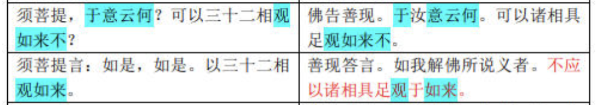
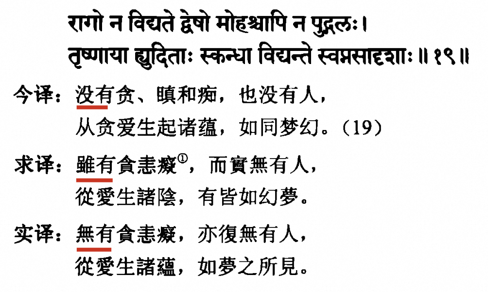
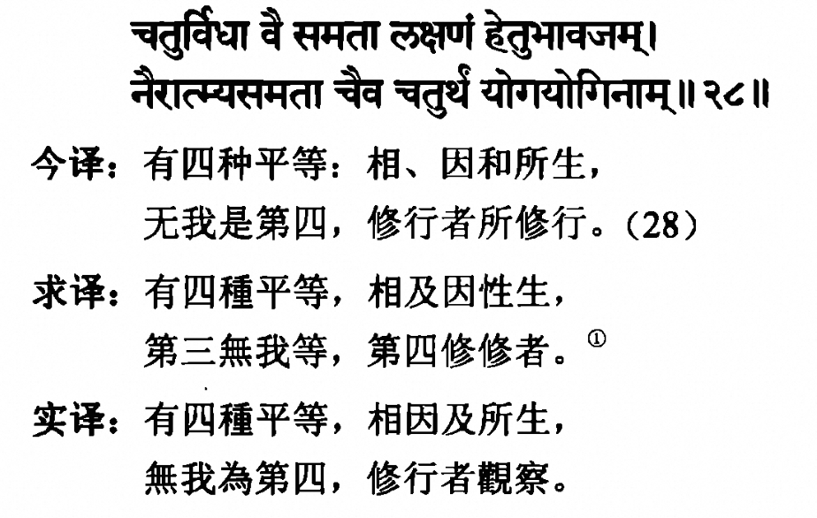

# 佛经中一字一句都是圆满的吗？

对于佛经的看法，从佛教来说，当然是非常神圣的。我刚开始学佛时，就听到过这样一种说法，佛经是非常殊胜的，一字一句都是非常圆满的，里面不会有瑕疵。

刚学佛时，对于佛菩萨、佛经都是非常敬仰的。因此对于这类说法，也是深信不疑的。

但是随着学佛的不断深入，却发现这并非事实，也并非完全正确的。甚至开始感觉到这种说法的一些负面作用了。

不过在进入到负面作用之前，我还是应该先肯定它的积极作用的 —— 毕竟这类说法的由来已久，也必定有可取之处，否则便不会长远流传了。那么这种把佛经中的一字一句都是圆满的、毫无瑕疵的说法的正面作用是什么呢？首先是，令人增长“信” —— 信解行证中的“信”，对于佛菩萨、佛经产生相信，甚至是绝对地相信，如何叫“绝对”呢？因为它不允许你有丝毫的怀疑。一旦有丝毫的怀疑，就不是圆满了。因为相信它的圆满，进而产生恭敬心、仰慕心。再之后，就应该勇猛精进学佛了。

如果可以保持这样的信心，并且不会遇到任何”干扰“，这样继续下去，学习下去，应该也会学有所成的。

在古代的时候，因为信息不发达，一辈子只接触到一种说法，一本佛经是非常普遍的现象。因此，只知道一种说法，并对其深信不疑，继而努力修行，精进修行，最终学有所成，弘化一方，也并非不可能。

然而，现代社会的特点就是信息很多，各种信息都会有，各种说法也都会有，一旦听到不同的说法时，又该如何面对？这才是这篇文章所要写的关键了。这就是上面所说的“干扰”了。 在古代时，信息闭塞，不容易遇到“干扰”。而在现代社会里面，不遇到不同的说法，几乎是不可能的事情。除非自己主动闭塞信息来源，只从一个地方获取信息来源。虽然的确有人如此，自己也觉得学得不错，当时再想要弘扬佛法，明显就会困难重重了。因为别人的信息不是闭塞的，已经听到过不同的信息来源了，不再对单一的信息来源买帐了。

# 一些翻译中的例子

## 《金刚经》的标题

《金刚经》有鸠摩罗什翻译的版本和玄奘大师翻译的版本。鸠摩罗什翻译的版本叫做《金刚般若波罗蜜经》，这是把般若智慧比喻成金刚。然而玄奘大师翻译的版本取名却叫做《能断金刚般若波罗蜜多经》，这是说般若的智慧，可以把最坚硬的金刚都断开。虽然两者都说明了般若智慧的厉害，当时具体的文辞表达上，一个比喻成金刚，另一个说能够断开金刚，两者的不同还是显而易见的。

## 以相观如来 vs 不应以相观如来

鸠摩罗什版本：须菩提，于意云何？可以三十二相观如来不？须菩提言：如是，如是。以三十二相观如来。

玄奘大师版本：佛告善现。于汝意云何。可以诸相具足观如来不。善现答言。如我解佛所说义者。不应以诸相具足观于如来。佛言善现。善哉善哉。如是如是。如汝所说。不应以诸相具足观于如来。

对照看：

*来源： https://www.sohu.com/a/455623291_120984618 《金刚经》两种译本对照 （鸠摩罗什 VS 玄奘法师）*

不仅说玄奘大师翻译成“不应”。另外的版本（如下所列），也都是持否定态度的。只有鸠摩罗什大师的版本是肯定态度的。

菩提流支译：“须菩提！于意云何？可以相成就得见如来不？”须菩提言：“如我解如来所说义，不以相成就得见如来。”

真谛译：“须菩提！汝意云何？可以具足相观如来不？须菩提言：如我解佛所说义，不以具足相应观如来。”

笈多译：“彼何意念？善实！相具足如来见应？”善实言：“不如此，世尊！如我，世尊说义解，我不相具足如来见应。”

义净译：“妙生！于汝意云何？应以具相观如来不？”“不尔，世尊！不应以具相观于如来。”

## 《入楞伽经》中的例子

以下截图来源于《入楞伽经 - 黄宝生 梵汉佛经对勘丛书》

求译是求那跋陀罗的译本《楞伽阿跋多罗宝经》，只有四卷。实译是实叉难陀的译本《大乘入楞伽经》，共有十卷。从上述的图片可以看到，求译的版本是“虽有”，而实译的版本是“无有”。两者一个是有，另一个说无。从文字意义上来说，也是截然相反的。

## 三种还是四种？

求译里面把无我当作第三平等，实译里面的却是把无我当作第四平等。那到底是第三还是第四？

# 总结

从上面给出的例子可以看到，不同版本的佛经，在细节上的差异不仅存在，甚至还很大。不仅细节不完全一致（例如，一个说第三，另一个说第四），甚至有时是完全相反的意思（一个是以相，另一个不以相。一个是有，另一个是无）。

如果之前一味地相信佛经中一字一句都是圆满的，又该如何面对这些佛经中的“问题”呢？是无可言对？还是忽略这些摆在眼前的事实，继续相信一字一句都是“圆满”的呢？这是“智信”还是“迷信”呢？

所以，我的建议是 —— 回归中道的态度。完全可以大大方方地承认佛经在翻译上中的“种种差异”，不必把每个细节都说成是完美的。更不应该忽略这些明显的差异，而强词夺理把它们都解释成一致且完美的。同时，

我们完全可以相信佛经的义理是圆满的，这些不同版本的翻译，所表现出来的主要观点是不会矛盾的，即通过文字说要表达的义理可以说是严格一致的。细节上的偏差，甚至相反的翻译，并不妨碍这点。

这样的态度，可以避免两种极端的态度 —— 一者认为佛经毫无瑕疵，另一者认为佛经版本不同而完全不可信。这样就是佛经翻译中的中道态度吧。

不同的译本对于想要深入佛经的人来说，其实是非常宝贵的学习材料。如果佛经只有一个翻译，那么就只有一种参考了。如果有不同的翻译，就有不同的参考。有时只看一种译本，或许有觉得不好理解的地方。如果可以看到多种译本，交叉对比，反而可以帮助理解佛经了。

所以，不仅要鼓励多多阅读佛经，甚至于有不同版本的佛经，还要多阅读几个不同版本的佛经，这样才能更好地“深入经藏，智慧如海”了。

