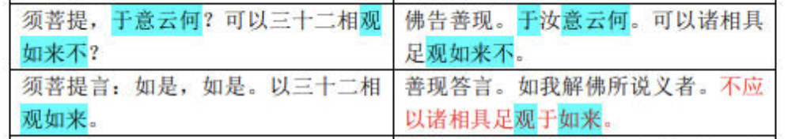
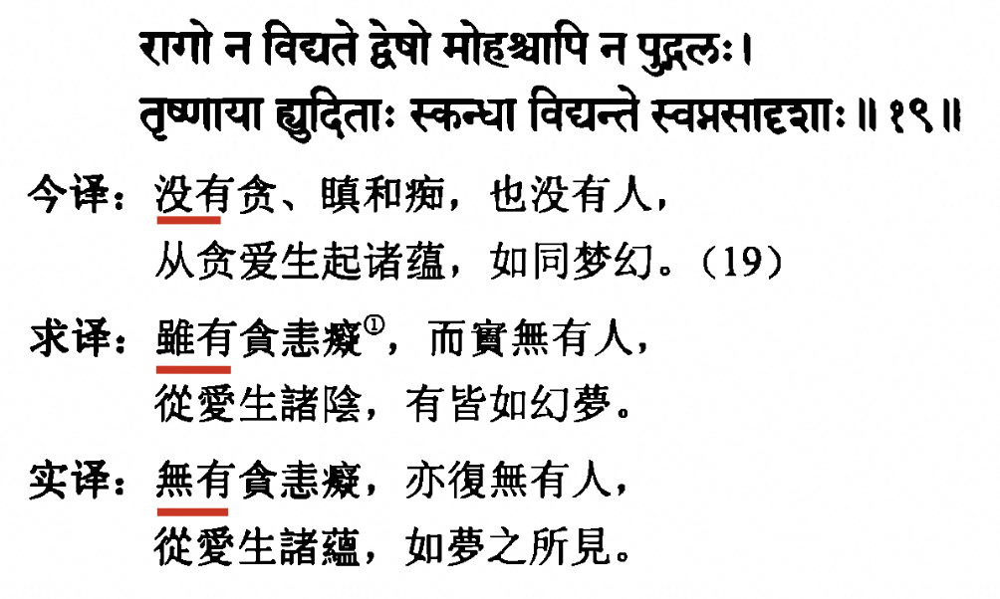

# 佛經中一字一句都是圓滿的嗎？

對於佛經的看法，從佛教來說，當然是非常神聖的。我剛開始學佛時，就聽到過這樣一種說法，佛經是非常殊勝的，一字一句都是非常圓滿的，裡面不會有瑕疵。

剛學佛時，對於佛菩薩、佛經都是非常敬仰的。因此對於這類說法，也是深信不疑的。

但是隨著學佛的不斷深入，卻發現這並非事實，也並非完全正確的。甚至開始感覺到這種說法的一些負面作用了。

不過在進入到負面作用之前，我還是應該先肯定它的積極作用的 —— 畢竟這類說法的由來已久，也必定有可取之處，否則便不會長遠流傳了。那麼這種把佛經中的一字一句都是圓滿的、毫無瑕疵的說法的正面作用是什麼呢？首先是，令人增長“信” —— 信解行證中的“信”，對於佛菩薩、佛經產生相信，甚至是絕對地相信，如何叫“絕對”呢？因為它不允許你有絲毫的懷疑。一旦有絲毫的懷疑，就不是圓滿了。因為相信它的圓滿，進而產生恭敬心、仰慕心。再之後，就應該勇猛精進學佛了。

如果可以保持這樣的信心，並且不會遇到任何”干擾“，這樣繼續下去，學習下去，應該也會學有所成的。

在古代的時候，因為信息不發達，一輩子只接觸到一種說法，一本佛經是非常普遍的現象。因此，只知道一種說法，並對其深信不疑，繼而努力修行，精進修行，最終學有所成，弘化一方，也並非不可能。

然而，現代社會的特點就是信息很多，各種信息都會有，各種說法也都會有，一旦聽到不同的說法時，又該如何面對？這才是這篇文章所要寫的關鍵了。這就是上面所說的“干擾”了。 在古代時，信息閉塞，不容易遇到“干擾”。而在現代社會里面，不遇到不同的說法，幾乎是不可能的事情。除非自己主動閉塞信息來源，只從一個地方獲取信息來源。雖然的確有人如此，自己也覺得學得不錯，當時再想要弘揚佛法，明顯就會困難重重了。因為別人的信息不是閉塞的，已經聽到過不同的信息來源了，不再對單一的信息來源買帳了。

# 一些翻譯中的例子

## 《金剛經》的標題

《金剛經》有鳩摩羅什翻譯的版本和玄奘大師翻譯的版本。鳩摩羅什翻譯的版本叫做《金剛般若波羅蜜經》，這是把般若智慧比喻成金剛。然而玄奘大師翻譯的版本取名卻叫做《能斷金剛般若波羅蜜多經》，這是說般若的智慧，可以把最堅硬的金剛都斷開。雖然兩者都說明了般若智慧的厲害，當時具體的文辭表達上，一個比喻成金剛，另一個說能夠斷開金剛，兩者的不同還是顯而易見的。

## 以相觀如來 vs 不應以相觀如來

鳩摩羅什版本：須菩提，於意云何？可以三十二相觀如來不？須菩提言：如是，如是。以三十二相觀如來。

玄奘大師版本：佛告善現。於汝意云何。可以諸相具足觀如來不。善現答言。如我解佛所說義者。不應以諸相具足觀於如來。佛言善現。善哉善哉。如是如是。如汝所說。不應以諸相具足觀於如來。

對照看：

*來源： https://www.sohu.com/a/455623291_120984618 《金剛經》兩種譯本對照 （鳩摩羅什 VS 玄奘法師）*

不僅說玄奘大師翻譯成“不應”。另外的版本（如下所列），也都是持否定態度的。只有鳩摩羅什大師的版本是肯定態度的。

菩提流支譯：“須菩提！於意云何？可以相成就得見如來不？”須菩提言：“如我解如來所說義，不以相成就得見如來。”

真諦譯：“須菩提！汝意云何？可以具足相觀如來不？須菩提言：如我解佛所說義，不以具足相應觀如來。”

笈多譯：“彼何意念？善實！相具足如來見應？”善實言：“不如此，世尊！如我，世尊說義解，我不相具足如來見應。”

義淨譯：“妙生！於汝意云何？應以具相觀如來不？”“不爾，世尊！不應以具相觀於如來。”

## 《入楞伽經》中的例子

以下截圖來源於《入楞伽經 - 黃寶生 梵漢佛經對勘叢書》

求譯是求那跋陀羅的譯本《楞伽阿跋多羅寶經》，只有四卷。實譯是實叉難陀的譯本《大乘入楞伽經》，共有十卷。從上述的圖片可以看到，求譯的版本是“雖有”，而實譯的版本是“無有”。兩者一個是有，另一個說無。從文字意義上來說，也是截然相反的。

## 三種還是四種？

求譯裡面把無我當作第三平等，實譯裡面的卻是把無我當作第四平等。那到底是第三還是第四？

# 總結

從上面給出的例子可以看到，不同版本的佛經，在細節上的差異不僅存在，甚至還很大。不僅細節不完全一致（例如，一個說第三，另一個說第四），甚至有時是完全相反的意思（一個是以相，另一個不以相。一個是有，另一個是無）。

如果之前一味地相信佛經中一字一句都是圓滿的，又該如何面對這些佛經中的“問題”呢？是無可言對？還是忽略這些擺在眼前的事實，繼續相信一字一句都是“圓滿”的呢？這是“智信”還是“迷信”呢？

所以，我的建議是 —— 迴歸中道的態度。完全可以大大方方地承認佛經在翻譯上中的“種種差異”，不必把每個細節都說成是完美的。更不應該忽略這些明顯的差異，而強詞奪理把它們都解釋成一致且完美的。同時，

我們完全可以相信佛經的義理是圓滿的，這些不同版本的翻譯，所表現出來的主要觀點是不會矛盾的，即通過文字說要表達的義理可以說是嚴格一致的。細節上的偏差，甚至相反的翻譯，並不妨礙這點。

這樣的態度，可以避免兩種極端的態度 —— 一者認為佛經毫無瑕疵，另一者認為佛經版本不同而完全不可信。這樣就是佛經翻譯中的中道態度吧。

不同的譯本對於想要深入佛經的人來說，其實是非常寶貴的學習材料。如果佛經只有一個翻譯，那麼就只有一種參考了。如果有不同的翻譯，就有不同的參考。有時只看一種譯本，或許有覺得不好理解的地方。如果可以看到多種譯本，交叉對比，反而可以幫助理解佛經了。

所以，不僅要鼓勵多多閱讀佛經，甚至於有不同版本的佛經，還要多閱讀幾個不同版本的佛經，這樣才能更好地“深入經藏，智慧如海”了。

