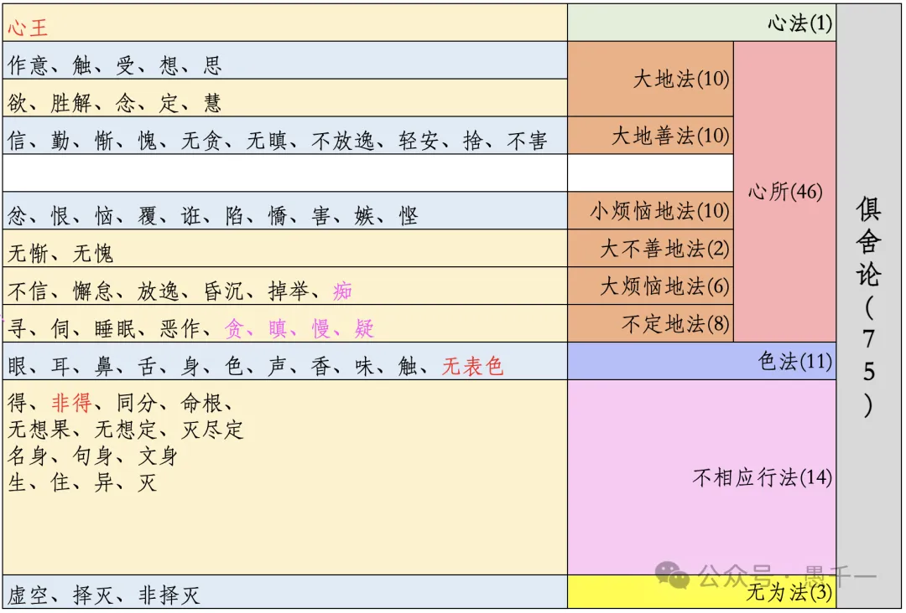

之前分享过可互动的百法大图，https://yuqianyi1001.github.io/100

今天再分享一个不一样的百法表格，做这个表格的时候是为了和俱舍75法进行对比。  

**百法**  

**俱舍75法**  

**大乘百法 vs 俱舍75法**

因为之前学习过百法的缘故，所以从百法再去通75法，是非常有帮助的。原因如下：

1.   名称相同的法，定义几乎完全一样。如果说有差别，也会涉及唯识和俱舍的区别了。而唯识和俱舍最大的区别是什么，那就是俱舍里面不讲第七、第八识。唯识里面比较重视第七、第八识，尤其是第八识。
    
2.  分类上，也有可参考之处。请参考上述对比。
    

**数字上的差别**

百法比俱舍多25个，分别多在这些分类中（从唯识的分类出发）：

-   心法：百法里面有8个，俱舍里面只有心王。百法多7个。
    
-   遍行、别境分别5个，完全对应俱舍中的10个大地法。
    
-   善法：百法比俱舍多1个 —— 无痴。
    
-   根本烦恼：俱舍里面没有“不正见”之外，把其他五个放在了“不定地法”（贪、嗔、慢、疑）和“大烦恼地法”（痴）。这里我暂时有个疑问，还没有去找答案，为何“贪、嗔、慢、疑”放在不定里面？虽然解释上也可以解释得通，但未必100%正确。例如这里的“贪”是不是可以分为“贪善法”和“贪恶法”？（等以后再查了）—— 百法比俱舍多1个“不正见”。
    
-   小随烦恼对应小烦恼地法，完全一致，都是10个。
    
-   中随烦恼对应大不善地法，完全一致，都是2个。
    
-   大随烦恼对应大烦恼地法，俱舍里面有“痴”（对应在百法里面的根本烦恼里面了），所以百法比俱舍多3个。
    
-   色法：都是11个，虽然百法里面的是“法处所摄色”，俱舍里面是“无表色”。
    
-   心不相应法：百法多10个。
    
-   无为法：百法多3个。

百法比俱舍一共多25个。7+1+1+3+10+3 = 25个。

**补充**

*这段在微信公众号上没有，因为微信公众号上文章修改有很多限制。*

后来读《俱舍论颂疏讲记-界品 智敏上师》里面有解释为何俱舍75法中百法中“不定”的区别。

百法中的不定是“不定烦恼”，意思是可能是烦恼，可能不是烦恼。其中有四个：寻、伺、睡眠和恶作（后悔）。

俱舍75法中的不定是因为和其他心所的顺序不定，而不是善、恶、无记三性中的不定。所以，俱舍中的不定叫做“不定地法”，而不属于“烦恼”中。虽然“贪、嗔、慢、疑”必定是烦恼，而其他四个则不一定是烦恼了。

