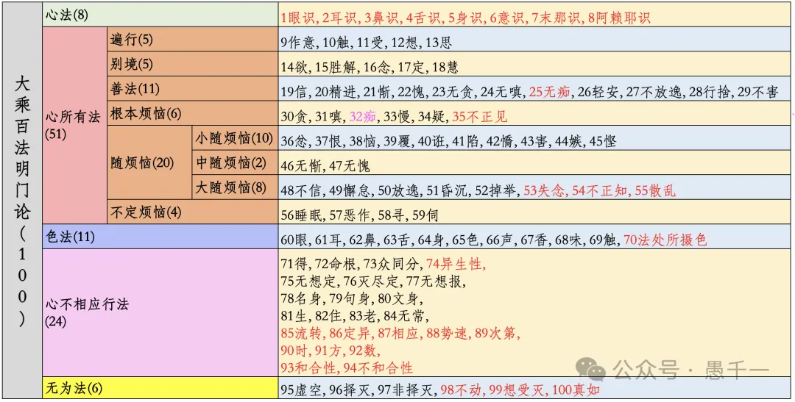
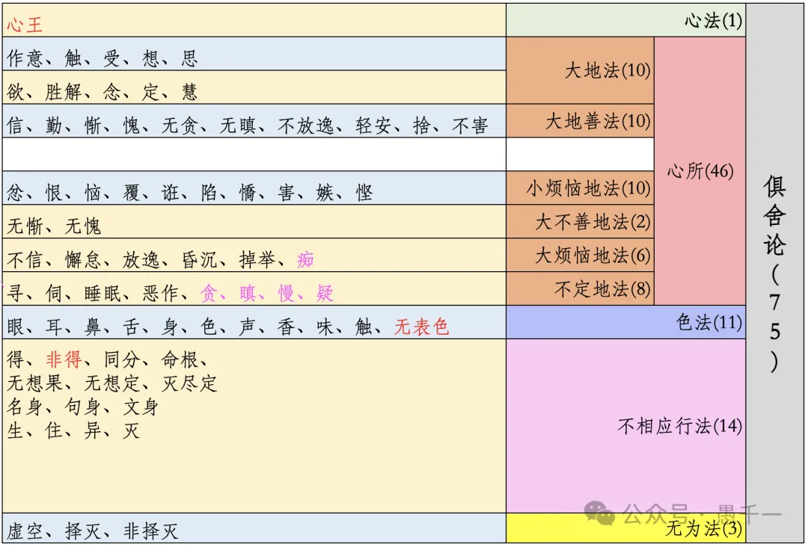
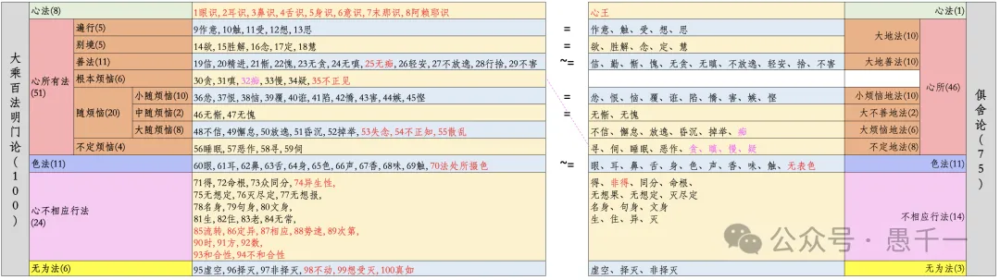

之前分享過可互動的百法大圖，https://yuqianyi1001.github.io/100

今天再分享一個不一樣的百法表格，做這個表格的時候是為了和俱舍75法進行對比。  

**百法**  

**俱舍75法**  

**大乘百法 vs 俱舍75法**

因為之前學習過百法的緣故，所以從百法再去通75法，是非常有幫助的。原因如下：

1.   名稱相同的法，定義幾乎完全一樣。如果說有差別，也會涉及唯識和俱舍的區別了。而唯識和俱舍最大的區別是什麼，那就是俱舍裡面不講第七、第八識。唯識裡面比較重視第七、第八識，尤其是第八識。
    
2.  分類上，也有可參考之處。請參考上述對比。
    

**數字上的差別**

百法比俱舍多25個，分別多在這些分類中（從唯識的分類出發）：

-   心法：百法裡面有8個，俱舍裡面只有心王。百法多7個。
    
-   遍行、別境分別5個，完全對應俱舍中的10個大地法。
    
-   善法：百法比俱舍多1個 —— 無痴。
    
-   根本煩惱：俱舍裡面沒有“不正見”之外，把其他五個放在了“不定地法”（貪、嗔、慢、疑）和“大煩惱地法”（痴）。這裡我暫時有個疑問，還沒有去找答案，為何“貪、嗔、慢、疑”放在不定裡面？雖然解釋上也可以解釋得通，但未必100%正確。例如這裡的“貪”是不是可以分為“貪善法”和“貪惡法”？（等以後再查了）—— 百法比俱舍多1個“不正見”。
    
-   小隨煩惱對應小煩惱地法，完全一致，都是10個。
    
-   中隨煩惱對應大不善地法，完全一致，都是2個。
    
-   大隨煩惱對應大煩惱地法，俱舍裡面有“痴”（對應在百法裡面的根本煩惱裡面了），所以百法比俱舍多3個。
    
-   色法：都是11個，雖然百法裡面的是“法處所攝色”，俱舍裡面是“無表色”。
    
-   心不相應法：百法多10個。
    
-   無為法：百法多3個。

百法比俱舍一共多25個。7+1+1+3+10+3 = 25個。

**補充**

*這段在微信公眾號上沒有，因為微信公眾號上文章修改有很多限制。*

後來讀《俱舍論頌疏講記-界品 智敏上師》裡面有解釋為何俱舍75法中百法中“不定”的區別。

百法中的不定是“不定煩惱”，意思是可能是煩惱，可能不是煩惱。其中有四個：尋、伺、睡眠和惡作（後悔）。

俱舍75法中的不定是因為和其他心所的順序不定，而不是善、惡、無記三性中的不定。所以，俱舍中的不定叫做“不定地法”，而不屬於“煩惱”中。雖然“貪、嗔、慢、疑”必定是煩惱，而其他四個則不一定是煩惱了。

