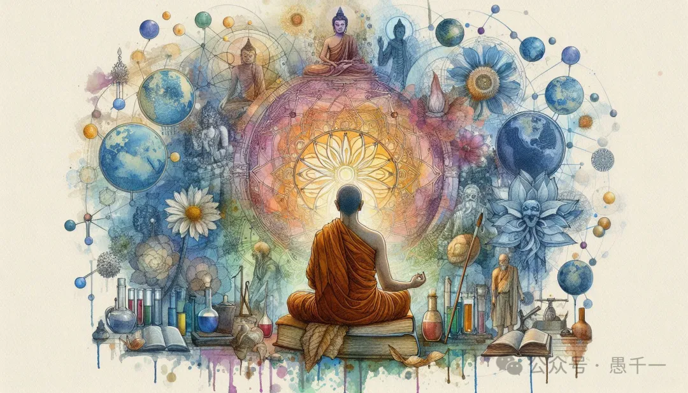
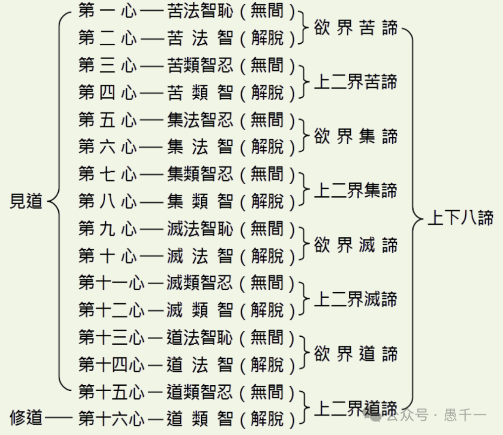
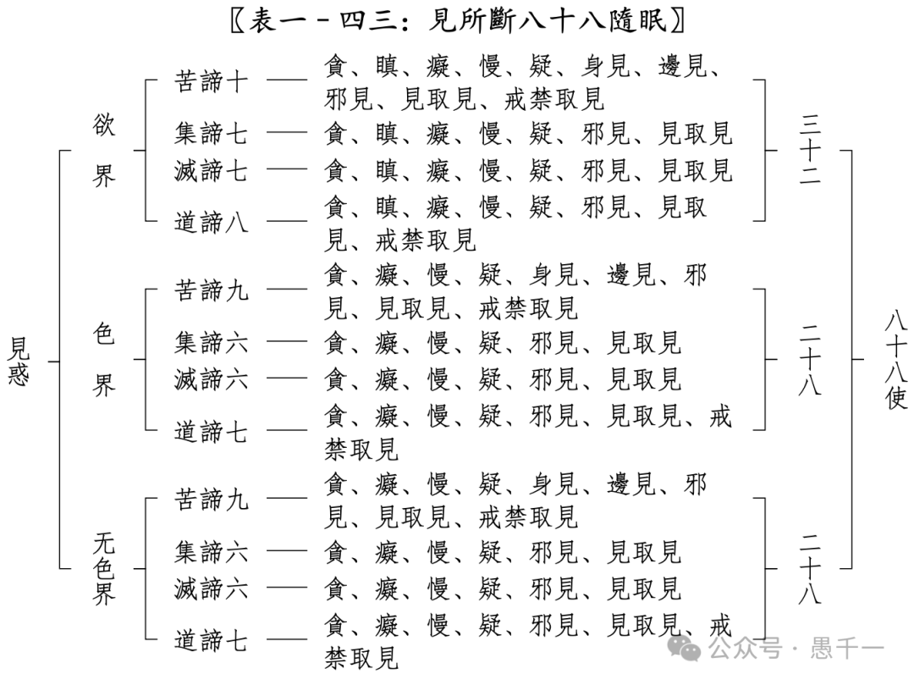

我经常用上学来类比学佛，在我读到高二的时候，学校开始要求我们分科，分成理科和文科。虽然分了两科，但还是有一些课程是共同的，如数学、语文和英语。除此之外，理科还有物理和化学。后来听说还有生物。而文科则是历史和政治。

随着我对佛学的了解，我发现佛学也可以分为理科和文科。我先说说文科。那什么是佛学中的文科呢？！

**佛学中的文科**

我先举一个例子。比如说这句非常著名的话：“须弥藏芥子，芥子纳须弥”。“须弥藏芥子”是非常好理解的，那么“芥子纳须弥”该如何理解呢？因为现实生活中找不到一个完全直接的例子。只能用比喻的方式来形容。但又因为是比喻的方式，所以比喻本身永远都可以找到瑕疵。例如：

有人借用现在科学来比喻，比如用一张光盘（或USB盘）所存储的文件，可以比得上一座山的书籍堆积在一起。当年光盘出来的时候，比尔盖茨还亲自打了一个广告。

图片来源：网络。图片说明：1994年，比尔盖茨坐在33万张纸上，手中拿着一张光盘告诉全世界：一张光盘能记录的内容比这33万张纸都多。

这个比喻的意思是从文字量上来说的。但是一张光盘并不能等价于那33万纸张，或等量的书籍。这就是有瑕疵的地方。光盘如果坏了，那么多文字就全部丢失了，而那么多的纸张要全部丢失却是非常不容易的事情。再者，有人半开玩笑地反驳说，光盘不用了，就只能丢垃圾桶了，而那33万纸张还可以卖破烂，估计还可以得到几百块钱呢。这些“瑕疵”的地方，都说明了比喻本身的局限性。  

也有人借用“心”来说明，“心”虽然很小，要么像拳头那么大（指心脏），要么像碗口那么大（指大脑），却可以包容一切的东西。这个比喻的“瑕疵”就更大了，甚至不能算是一个“合格”的比喻。《大智度论》里面说，合格的比喻应该是用简单的事情来比喻复杂的事情，这样才能帮助大家从简单的事情去类比，然后理解复杂的事情。实际上，佛学上“心”的概念，要比一个“芥子”或“须弥山”要复杂的多。所以，就算有人听到了这样的比喻，也是蒙蒙胧胧，似懂非懂的。好像懂了，又好像没懂。

这就是“文科”的特点，或者说是“文艺科”的特点。一千个人可以有一千个比喻，一千个人可以有一千个理解。就像一篇作文的评分，可以给很高，因为意境很丰富，也可以给很低，因为逻辑不通。

用文科的方式来理解佛法虽然也有用（我从不一棍子打死一个观点），但是这个用途却是非常有限的。比如“芥子纳须弥”这句话，请问你要在生活中如何实践呢？它当然可以让你更加包容，但你只问一下，听完这句话，你就能够包容一切吗？对于一切事物都看得惯吗？对于一切人都看得惯吗？对于我这篇文章可以理解和包容吗？！  

为何会如此？就是因为无法直观体会，光靠理解就会似懂非懂了。再遇到逆境的时候，一下子就现原形了，以前是怎样又回到了怎样的状态了。  

重申下，我并非一棍子打死“文科”或“文艺”的这种理解和表达。我只是指出来一些人可能会存在的问题。这类问题在我的观察中是现实、普遍存在的，所以我才点出来而已。但并不绝对。如果你觉得这类理解对你很有用，那也无妨，你没必要改变什么，继续保持就行。

**佛学中的理科**  

那什么佛学中的理科呢？我们先回到学校，理科主要是指：数、理、化。即数学、物理和化学。这里的理科和文科最大的区别是什么呢？那就是理科是有标准答案的。

比如1+1=2这个等式，无论是小学生、中学生、高中生还是大学生、博士、教授，这个等式都是成立的。不仅1+1=2是成立的，而且知道1+1只能等于2，而不能等于其他数字，等于任何其他数字都是错误的，如0，1，3，-1，-2，-3...。这就是理科的特点 —— 有标准的答案，有统一的认识，可以重复验证。

那佛学中的理科是什么呢？那就是法相学，包括俱舍学和唯识学。请熟悉俱舍学和唯识学的人忍耐一下，虽然俱舍和唯识也有很多分支，但和其他学派对比而言，我文章中的主要观点依旧是成立的。

**为何法相学是佛学中的理科呢？**

**第一，它们都有标准答案。**

比如说色法是什么，答案是有见有对，或无见有对，或无见无对。有见就是眼睛可以看见（尤其是指人眼）。有对就是有质碍。比如说声音，同时10个人跟你说话，说不同的话，你只能听一个人说，当你认真听一个人说的时候，别人说什么，你就“听而不闻”了，不知道他在说什么了。所以，听一个声音对听其他声音产生了障碍。无见无对是一种佛教里面特殊的一种色法 —— 无表色（或法处所摄色），这里就不展开了。有兴趣的可以学习下《俱舍论》。或等我以后再分享《俱舍论》的学习笔记。  

备注下，这里说的标准答案是相对统一的意思，无论是《俱舍论》还是《成唯识论》都包括有多种观点，这些相对其他学派来说，差别还是很小的，这里先忽略了。下面的其他几点也类似，这里一并说明下。

**第二，它们都有清晰的、严格的定义。**

比如说“开悟”这个词，无论是在佛教经典还是在佛学作品里面，“开悟”这个词已经被泛化得无比宽泛了。“泛化”是还算客气的说法，不客气的说，那就是“滥用”了。甚至，很多的非佛教徒也会经常感慨 —— 我今天“顿悟”了什么，又“顿悟”了什么。

这导致一个严重的后果，那就是很多学佛人也不知道“顿悟”具体是什么，“开悟”到底是什么。这也让很多假大师们钻了空子，到处坑蒙拐骗了。

虽然我曾经非常努力地总结开悟是什么意思，有几个层次，但是这毕竟只是个人总结，影响力非常有限 —— [聊聊开悟的常见误解以及开悟的层次](http://mp.weixin.qq.com/s?__biz=MzkzMDMzNzg3Mw==&mid=2247483793&idx=1&sn=f652d126ae2f32ef6047fb4b7878f68b&chksm=c27a84aff50d0db9450cacd0957dc13040955a6cd5814cfa1f116482987f6351bf067a804b3a&scene=21#wechat_redirect)。

比起开悟来说，其实有一个词更加重要，也更应该引起大家的重视，这个词就是 —— 见道。无论是在俱舍还是唯识里面，见道的过程都有极其清晰和严格的描述，精确程度到一个刹那一个刹那（一刹那=1/75秒=0.013秒）地去描述它，而且每个刹那都是不同的，这样的“见道”一共需要经历15个刹那（心）。如下图所示：

图片来源：星云大师全集，     https://books.masterhsingyun.org/ArticleDetail/artcle6847

这十五个刹那分别要断什么烦恼呢？见下面这张图。

图片来源：智敏上师的《俱舍论颂疏讲记-界品》

这篇文章的目的不是要介绍什么“见道”，只是简略地提及下。重点是说，“见道”这么标准，严格的定义，比起“开悟”、“顿悟”来说，是更值得关注和学习的。

如果你是认真的禅宗学人，我还是补充一句，那就是“开悟”虽然有很多层次，但基本上也可以分成两类，一是解悟，就是理解了。二是证悟。而见道是证悟里面的最低标准，成佛是最高的证悟，中间还有许多层次的差别。  

**学法相的好处**  

**第一，有了法相做基础，可以通一切法门。**  

法相学就像是数学中的加减乘除一样，数学中是以加减乘除为基础，其实学佛，尤其是想要深入经藏的人来说，那更是基础了。有了这个基础，再去学习其他学科都是容易的。  

就像是数学学得好的人，再转去学习物理，化学，生物，医药，天文或学习计算机，AI等都是非常容易的。这就是因为数学是理工科的基础，而法相，本该是佛学的基础。有了法相的基础，再去学习其他宗派，如天台、华严、律宗等都是非常容易的。就算是禅宗也是大有好处的，前面用见道对比开悟就是例子之一了。净土宗也是，例如净土里面讲唯心净土，学习了法相以后，你就会非常清晰地明白为何叫唯心净土了。

**第二，有了法相做基础，可以提高鉴别能力，甚至还能打假。**  

因为很多对“标准”缺乏认识，或不知道有“标准”的存在。所以佛教里面也有很多假劣伪冒的假大师。学习法相后，拿法相一对照，可谓是一眼假 —— 一眼就可以看出真假来。所以，如果你想要打假，是具备了这个能力的。（不过在实际操作层面，打假是一件非常高风险的事情，请三思而后行。）  

其次，佛教里面也有很多“差不多先生”，什么意思呢？那就是讲的法不够严格，不够严谨，差不多，笼笼统统。听上去好像正确，但又觉得哪里不对，但是却说不上来。或者听上去觉得哪里不对，但是却说不清楚哪里不对。根本原因就在于，“讲法”的人也没有法相的基础，也只能讲成这个样子了。

不过还是要尊重和理解对方（只要不涉及违法行为，不违反道德伦理），毕竟有时信众们的水平层次，也会决定遇到什么样的老师（或法师）了。如果有人参加过佛教法会、活动就不难发现，老年人居多。其中，又不乏有很多求神拜佛的人，正儿八经学习佛法者，少之又少。深入佛法者，却是少见的。

这也和上学一样，为何清华北大是最好的大学，不仅因为他们有优秀的老师，还因为他们有最优秀的学生，优秀的学生才需要优秀的老师来教。为何三流大学的老师和学生都差一些，其实，这都是有关系的。  

**第三，可以避免很多无意义的争吵**  

比如说，某人是否是开悟了？这样的话题非常常见，也引起了非常多的争论。这正是因为没有一个统一的标准。所以，只要谁名气大，谁弟子多，谁粉丝多，谁就是。然而，事实上真的如此吗？显然不是。

先别说“见道”这样重要的关键点了，先举一个更简单的例子 —— 初禅。有很多人练习打坐，出现了一点境界，就以为自己得定了。初禅，二禅，三禅，四禅，张口就来。要么说见到了什么，要么是体会到了什么，就自以为是禅定了。然而事实上，果真如此了吗？显然不是。

初禅，二禅，三禅，四禅并不是以体会到了什么作为全部标准的，只是之一。更重要的标准其实是止住（或断除）了什么，体会只是其一，而且不如“止”（或断除）重要。比如说，初禅，二禅，三禅各有喜乐。对于没有过禅定体验的人来说，这个喜乐和世间的喜乐有何区别呢（如吃冰激凌，喝可乐，男女之欢，甚至是嗑药）？有人说比这些都要快乐。对于没有体会过禅定的人，完全无法判断，所以很容易被骗，被误导了。

但如果从“止”（或断除）的角度来判定就容易多了。从初禅开始，就断除了嗔心，淫欲心。以嗔心来说，这个就容易判断了。有谁说自己得到了初禅，而且还能保持（重点是保持）。你上去就给他两巴掌，看看他有什么反应就知道了。（自己判断是否要真的动手了，哈哈。）如果只是说得过初禅，但是无法保持。他人就无法简单判断了。因为出定后，又不能保持的话，那和普通人也没什么区别了。最多脾气好点，但不会断除嗔心，不会完全没脾气了。所以他人就无法判断了。

学了法相，对于各种关键的修行阶段都会有清晰的了解，之后，就不会轻易被骗，被误导了。在当今这个鱼龙混杂的佛教“江湖”来说，具备判断能力，是非常重要的了。

**法相并不难学**  

对于法相有一个很大的误解，那就是觉得法相很难学。其实这是以讹传讹的误解。以前95%以上的人都是文盲，当然，别说法相是难学的，任何佛学都是难的（不需要任何佛学基础就可以的念佛、打坐除外）。

但是现在，很多地区和国家都几乎消灭了文盲，都普及了高等教育（指高中及以上）。尤其是年轻人来说，基本上都参加过高等教育的。以这样的背景来学习法相，并不会比现代任何学科困难许多。

比起现代的学科，如IT，医学，法律，生物等行业来说，或许还是简单的呢。所以，真的不用太担心，尽管开始学就好了。

**我正在第二次学习《俱舍论》**

之前只是通读过一次，这次遇到机缘（可以参考这篇文章，[一起来学《阿毗达磨俱舍论》](http://mp.weixin.qq.com/s?__biz=MzkzMDMzNzg3Mw==&mid=2247484384&idx=1&sn=f18442c865277318beabcb6fcd5d2320&chksm=c27a86def50d0fc844db1c4cd99878ddf7e92c7a09a221cbe8311769f6c7f9fc5ede5380a3cc&scene=21#wechat_redirect)），发现有很多的同行善知识，一起学习交流和讨论《俱舍论》，所以我也愿意在通读之后，再次学习一次，这次会精读。后续也会把学习笔记和学习心得发出来（还未开始），抛砖引玉。

希望可以启发和引导更多的人来学习法相 —— 

自皈依法，当愿众生，深入经藏，智慧如海。

阿弥陀佛。  
愚千一。

