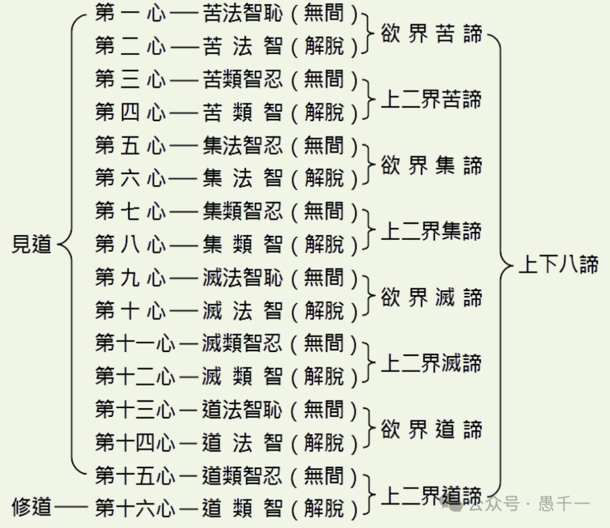

我經常用上學來類比學佛，在我讀到高二的時候，學校開始要求我們分科，分成理科和文科。雖然分了兩科，但還是有一些課程是共同的，如數學、語文和英語。除此之外，理科還有物理和化學。後來聽說還有生物。而文科則是歷史和政治。

隨著我對佛學的瞭解，我發現佛學也可以分為理科和文科。我先說說文科。那什麼是佛學中的文科呢？！

**佛學中的文科**

我先舉一個例子。比如說這句非常著名的話：“須彌藏芥子，芥子納須彌”。“須彌藏芥子”是非常好理解的，那麼“芥子納須彌”該如何理解呢？因為現實生活中找不到一個完全直接的例子。只能用比喻的方式來形容。但又因為是比喻的方式，所以比喻本身永遠都可以找到瑕疵。例如：

有人借用現在科學來比喻，比如用一張光盤（或USB盤）所存儲的文件，可以比得上一座山的書籍堆積在一起。當年光盤出來的時候，比爾蓋茨還親自打了一個廣告。

圖片來源：網絡。圖片說明：1994年，比爾蓋茨坐在33萬張紙上，手中拿著一張光盤告訴全世界：一張光盤能記錄的內容比這33萬張紙都多。

這個比喻的意思是從文字量上來說的。但是一張光盤並不能等價於那33萬紙張，或等量的書籍。這就是有瑕疵的地方。光盤如果壞了，那麼多文字就全部丟失了，而那麼多的紙張要全部丟失卻是非常不容易的事情。再者，有人半開玩笑地反駁說，光盤不用了，就只能丟垃圾桶了，而那33萬紙張還可以賣破爛，估計還可以得到幾百塊錢呢。這些“瑕疵”的地方，都說明了比喻本身的侷限性。  

也有人借用“心”來說明，“心”雖然很小，要麼像拳頭那麼大（指心臟），要麼像碗口那麼大（指大腦），卻可以包容一切的東西。這個比喻的“瑕疵”就更大了，甚至不能算是一個“合格”的比喻。《大智度論》裡面說，合格的比喻應該是用簡單的事情來比喻複雜的事情，這樣才能幫助大家從簡單的事情去類比，然後理解複雜的事情。實際上，佛學上“心”的概念，要比一個“芥子”或“須彌山”要複雜的多。所以，就算有人聽到了這樣的比喻，也是濛濛朧朧，似懂非懂的。好像懂了，又好像沒懂。

這就是“文科”的特點，或者說是“文藝科”的特點。一千個人可以有一千個比喻，一千個人可以有一千個理解。就像一篇作文的評分，可以給很高，因為意境很豐富，也可以給很低，因為邏輯不通。

用文科的方式來理解佛法雖然也有用（我從不一棍子打死一個觀點），但是這個用途卻是非常有限的。比如“芥子納須彌”這句話，請問你要在生活中如何實踐呢？它當然可以讓你更加包容，但你只問一下，聽完這句話，你就能夠包容一切嗎？對於一切事物都看得慣嗎？對於一切人都看得慣嗎？對於我這篇文章可以理解和包容嗎？！  

為何會如此？就是因為無法直觀體會，光靠理解就會似懂非懂了。再遇到逆境的時候，一下子就現原形了，以前是怎樣又回到了怎樣的狀態了。  

重申下，我並非一棍子打死“文科”或“文藝”的這種理解和表達。我只是指出來一些人可能會存在的問題。這類問題在我的觀察中是現實、普遍存在的，所以我才點出來而已。但並不絕對。如果你覺得這類理解對你很有用，那也無妨，你沒必要改變什麼，繼續保持就行。

**佛學中的理科**  

那什麼佛學中的理科呢？我們先回到學校，理科主要是指：數、理、化。即數學、物理和化學。這裡的理科和文科最大的區別是什麼呢？那就是理科是有標準答案的。

比如1+1=2這個等式，無論是小學生、中學生、高中生還是大學生、博士、教授，這個等式都是成立的。不僅1+1=2是成立的，而且知道1+1只能等於2，而不能等於其他數字，等於任何其他數字都是錯誤的，如0，1，3，-1，-2，-3...。這就是理科的特點 —— 有標準的答案，有統一的認識，可以重複驗證。

那佛學中的理科是什麼呢？那就是法相學，包括俱舍學和唯識學。請熟悉俱舍學和唯識學的人忍耐一下，雖然俱舍和唯識也有很多分支，但和其他學派對比而言，我文章中的主要觀點依舊是成立的。

**為何法相學是佛學中的理科呢？**

**第一，它們都有標準答案。**

比如說色法是什麼，答案是有見有對，或無見有對，或無見無對。有見就是眼睛可以看見（尤其是指人眼）。有對就是有質礙。比如說聲音，同時10個人跟你說話，說不同的話，你只能聽一個人說，當你認真聽一個人說的時候，別人說什麼，你就“聽而不聞”了，不知道他在說什麼了。所以，聽一個聲音對聽其他聲音產生了障礙。無見無對是一種佛教裡面特殊的一種色法 —— 無表色（或法處所攝色），這裡就不展開了。有興趣的可以學習下《俱舍論》。或等我以後再分享《俱舍論》的學習筆記。  

備註下，這裡說的標準答案是相對統一的意思，無論是《俱舍論》還是《成唯識論》都包括有多種觀點，這些相對其他學派來說，差別還是很小的，這裡先忽略了。下面的其他幾點也類似，這裡一併說明下。

**第二，它們都有清晰的、嚴格的定義。**

比如說“開悟”這個詞，無論是在佛教經典還是在佛學作品裡面，“開悟”這個詞已經被泛化得無比寬泛了。“泛化”是還算客氣的說法，不客氣的說，那就是“濫用”了。甚至，很多的非佛教徒也會經常感慨 —— 我今天“頓悟”了什麼，又“頓悟”了什麼。

這導致一個嚴重的後果，那就是很多學佛人也不知道“頓悟”具體是什麼，“開悟”到底是什麼。這也讓很多假大師們鑽了空子，到處坑蒙拐騙了。

雖然我曾經非常努力地總結開悟是什麼意思，有幾個層次，但是這畢竟只是個人總結，影響力非常有限 —— [聊聊開悟的常見誤解以及開悟的層次](http://mp.weixin.qq.com/s?__biz=MzkzMDMzNzg3Mw==&mid=2247483793&idx=1&sn=f652d126ae2f32ef6047fb4b7878f68b&chksm=c27a84aff50d0db9450cacd0957dc13040955a6cd5814cfa1f116482987f6351bf067a804b3a&scene=21#wechat_redirect)。

比起開悟來說，其實有一個詞更加重要，也更應該引起大家的重視，這個詞就是 —— 見道。無論是在俱舍還是唯識裡面，見道的過程都有極其清晰和嚴格的描述，精確程度到一個剎那一個剎那（一剎那=1/75秒=0.013秒）地去描述它，而且每個剎那都是不同的，這樣的“見道”一共需要經歷15個剎那（心）。如下圖所示：

圖片來源：星雲大師全集，     https://books.masterhsingyun.org/ArticleDetail/artcle6847

這十五個剎那分別要斷什麼煩惱呢？見下面這張圖。

圖片來源：智敏上師的《俱舍論頌疏講記-界品》

這篇文章的目的不是要介紹什麼“見道”，只是簡略地提及下。重點是說，“見道”這麼標準，嚴格的定義，比起“開悟”、“頓悟”來說，是更值得關注和學習的。

如果你是認真的禪宗學人，我還是補充一句，那就是“開悟”雖然有很多層次，但基本上也可以分成兩類，一是解悟，就是理解了。二是證悟。而見道是證悟裡面的最低標準，成佛是最高的證悟，中間還有許多層次的差別。  

**學法相的好處**  

**第一，有了法相做基礎，可以通一切法門。**  

法相學就像是數學中的加減乘除一樣，數學中是以加減乘除為基礎，其實學佛，尤其是想要深入經藏的人來說，那更是基礎了。有了這個基礎，再去學習其他學科都是容易的。  

就像是數學學得好的人，再轉去學習物理，化學，生物，醫藥，天文或學習計算機，AI等都是非常容易的。這就是因為數學是理工科的基礎，而法相，本該是佛學的基礎。有了法相的基礎，再去學習其他宗派，如天台、華嚴、律宗等都是非常容易的。就算是禪宗也是大有好處的，前面用見道對比開悟就是例子之一了。淨土宗也是，例如淨土裡面講唯心淨土，學習了法相以後，你就會非常清晰地明白為何叫唯心淨土了。

**第二，有了法相做基礎，可以提高鑑別能力，甚至還能打假。**  

因為很多對“標準”缺乏認識，或不知道有“標準”的存在。所以佛教裡面也有很多假劣偽冒的假大師。學習法相後，拿法相一對照，可謂是一眼假 —— 一眼就可以看出真假來。所以，如果你想要打假，是具備了這個能力的。（不過在實際操作層面，打假是一件非常高風險的事情，請三思而後行。）  

其次，佛教裡面也有很多“差不多先生”，什麼意思呢？那就是講的法不夠嚴格，不夠嚴謹，差不多，籠籠統統。聽上去好像正確，但又覺得哪裡不對，但是卻說不上來。或者聽上去覺得哪裡不對，但是卻說不清楚哪裡不對。根本原因就在於，“講法”的人也沒有法相的基礎，也只能講成這個樣子了。

不過還是要尊重和理解對方（只要不涉及違法行為，不違反道德倫理），畢竟有時信眾們的水平層次，也會決定遇到什麼樣的老師（或法師）了。如果有人參加過佛教法會、活動就不難發現，老年人居多。其中，又不乏有很多求神拜佛的人，正兒八經學習佛法者，少之又少。深入佛法者，卻是少見的。

這也和上學一樣，為何清華北大是最好的大學，不僅因為他們有優秀的老師，還因為他們有最優秀的學生，優秀的學生才需要優秀的老師來教。為何三流大學的老師和學生都差一些，其實，這都是有關係的。  

**第三，可以避免很多無意義的爭吵**  

比如說，某人是否是開悟了？這樣的話題非常常見，也引起了非常多的爭論。這正是因為沒有一個統一的標準。所以，只要誰名氣大，誰弟子多，誰粉絲多，誰就是。然而，事實上真的如此嗎？顯然不是。

先別說“見道”這樣重要的關鍵點了，先舉一個更簡單的例子 —— 初禪。有很多人練習打坐，出現了一點境界，就以為自己得定了。初禪，二禪，三禪，四禪，張口就來。要麼說見到了什麼，要麼是體會到了什麼，就自以為是禪定了。然而事實上，果真如此了嗎？顯然不是。

初禪，二禪，三禪，四禪並不是以體會到了什麼作為全部標準的，只是之一。更重要的標準其實是止住（或斷除）了什麼，體會只是其一，而且不如“止”（或斷除）重要。比如說，初禪，二禪，三禪各有喜樂。對於沒有過禪定體驗的人來說，這個喜樂和世間的喜樂有何區別呢（如吃冰激凌，喝可樂，男女之歡，甚至是嗑藥）？有人說比這些都要快樂。對於沒有體會過禪定的人，完全無法判斷，所以很容易被騙，被誤導了。

但如果從“止”（或斷除）的角度來判定就容易多了。從初禪開始，就斷除了嗔心，淫慾心。以嗔心來說，這個就容易判斷了。有誰說自己得到了初禪，而且還能保持（重點是保持）。你上去就給他兩巴掌，看看他有什麼反應就知道了。（自己判斷是否要真的動手了，哈哈。）如果只是說得過初禪，但是無法保持。他人就無法簡單判斷了。因為出定後，又不能保持的話，那和普通人也沒什麼區別了。最多脾氣好點，但不會斷除嗔心，不會完全沒脾氣了。所以他人就無法判斷了。

學了法相，對於各種關鍵的修行階段都會有清晰的瞭解，之後，就不會輕易被騙，被誤導了。在當今這個魚龍混雜的佛教“江湖”來說，具備判斷能力，是非常重要的了。

**法相併不難學**  

對於法相有一個很大的誤解，那就是覺得法相很難學。其實這是以訛傳訛的誤解。以前95%以上的人都是文盲，當然，別說法相是難學的，任何佛學都是難的（不需要任何佛學基礎就可以的唸佛、打坐除外）。

但是現在，很多地區和國家都幾乎消滅了文盲，都普及了高等教育（指高中及以上）。尤其是年輕人來說，基本上都參加過高等教育的。以這樣的背景來學習法相，並不會比現代任何學科困難許多。

比起現代的學科，如IT，醫學，法律，生物等行業來說，或許還是簡單的呢。所以，真的不用太擔心，儘管開始學就好了。

**我正在第二次學習《俱舍論》**

之前只是通讀過一次，這次遇到機緣（可以參考這篇文章，[一起來學《阿毗達磨俱舍論》](http://mp.weixin.qq.com/s?__biz=MzkzMDMzNzg3Mw==&mid=2247484384&idx=1&sn=f18442c865277318beabcb6fcd5d2320&chksm=c27a86def50d0fc844db1c4cd99878ddf7e92c7a09a221cbe8311769f6c7f9fc5ede5380a3cc&scene=21#wechat_redirect)），發現有很多的同行善知識，一起學習交流和討論《俱舍論》，所以我也願意在通讀之後，再次學習一次，這次會精讀。後續也會把學習筆記和學習心得發出來（還未開始），拋磚引玉。

希望可以啟發和引導更多的人來學習法相 —— 

自皈依法，當願眾生，深入經藏，智慧如海。

阿彌陀佛。  
愚千一。

