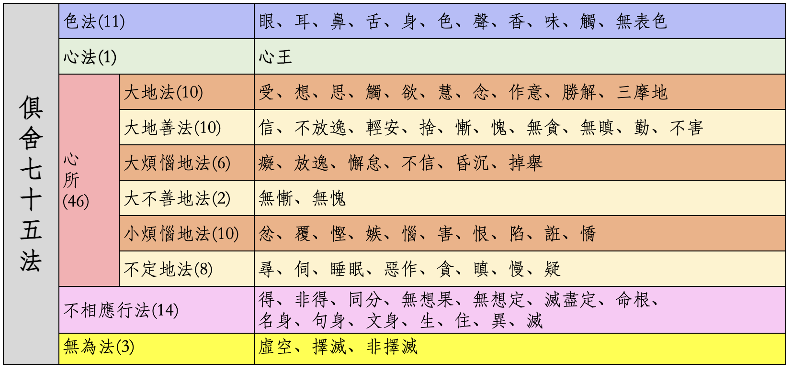
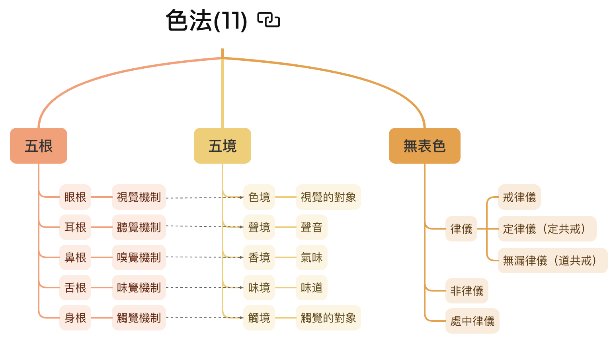
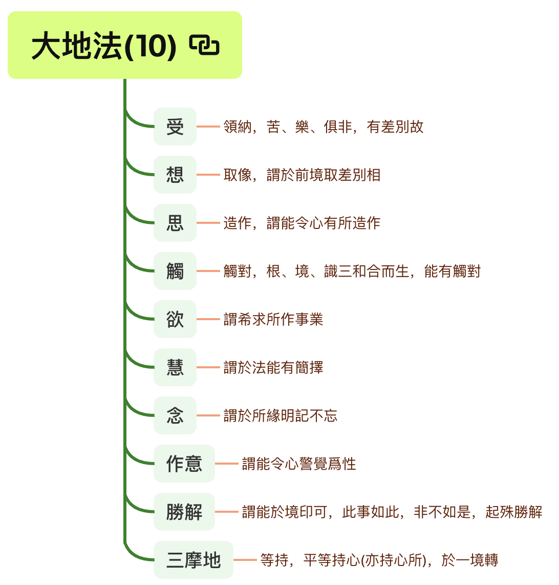

# 参考材料

* 《俱舍论》
* 《成唯识论》
* 智敏上师《俱舍论颂疏讲记》
* 林国良教授《成唯识论直解》
* 佛光大辭典 (慈怡法師主編) [七十五法](https://buddhaspace.org/dict/fk/data/%25E4%25B8%2583%25E5%258D%2581%25E4%25BA%2594%25E6%25B3%2595.html)

**为什么先列参考？**

上一篇文章[佛学中的理科和文科](https://mp.weixin.qq.com/s/YZ-UaEJE9ICBnpapzVq3OQ)中有介绍为何要学习法相（俱舍、唯识），这里列出参考材料，表明文章中的依据以上面的材料为主。尤其是涉及到宗派或论师之间不同观点的取舍时，更是要参考原始经典才行。

# 基本部分

**什么是基础？** 只介绍基本概念、基本解释，了解它的基本框架即可。以俱舍七十五法来说，什么是我认为的基础呢？那就是要知道它的基本分类（五大类），以及每一个大类的名称和基本意思。其次是应该了解每个法的基本概念和基本解释。

对于心所法而言，应该进一步了解其子分类，即大地法，大地善法，大烦恼地法，小烦恼地法，不定地法。以及了解这里每个子分类的基本含义。

以此作为入门的基础，遇到感兴趣的地方，或者想要再深入理解的地方，则应该继续学习下去。兴趣是最好的老师，佛学也不例外。

综合而言，基础部分就是要知道都有什么，是什么意思。整体上先了解它。最好可以背诵它，如果不能背，也要记得它的大多数“法”，否则后面学习会非常不方便。

我本人最不擅长的就是背诵，所以，借助现代科技的一个办法，就是把这个图表打印出来，看书（学习）的时候，虽然查看它。对照这个表的情况下，可以把基本意思记住，也算是一种方便了吧。其次还可以把图表设置成手机或电脑壁纸，方便查看。

# 基本框架

先介绍基本框架。

俱舍七十五法，一共分成五个大类，分别是：
* 色法：一切物质，包括有情的身体和外在的器世界，一共有11个法。
* 心法：即是心。在小乘里面，心、意、识三者经常可以通用，因为它们的体，都是心，所以这里只有1个法。
* 心所法：有人说是心理状态。包含46个法。心所法是关键点，基础部分应该进一步学习和了解。
* 不相应行法：和心、心所都不相应的“法”。这里包含的内容很多，包括一般的“物理规律”，如生住异灭，也包括两种特殊的禅定等等。总之，它们都不会直接和心、心所有相应，不会直接引发我们的心理活动。
* 无为法：前面四大类都是有为法，有为法的定义是，因缘和合而有生住异灭的意思。反之，就是无为法，不会有生住异灭。（无为法有住，但不会生、异、灭。）

# 色法

色法，就是现代物理所说的一切物质，包括一切有情的身体（器官和身体等）和外在的器世界（日月星辰，山河大地等），一共有11个法。分别为：五根，五尘和无表色。

（备注：因为佛法的讲解对象主要是人，为了解释的方便，一些地方会直接用人来代指一切有情了。）

## 五根

* 眼根：视觉机制，包括眼球（器官）和神经系统。（有人说神经系统是净色根。可以先暂且一听，同下。）
* 耳根：听觉机制，包括耳朵（器官）和神经系统。
* 鼻根：嗅觉机制，包括鼻子（器官）和神经系统。
* 舌根：味觉机制，包括舌头（器官）和神经系统。
* 身根：触觉机制，包括身体（器官）和触觉系统。

注意，这里没有意根。俱舍七十五法里面没有意根，法尘和意识。以后介绍十二处、十八界时再做解释。

## 五尘（或五境）
* 色尘：眼睛可以看得见的物质。注意，色法和色尘不一样，色法是大类，色尘是具体的一个法。看经典时，要依据上下文仔细分辨，到底是色法还是色尘。
* 声尘：声音。
* 香尘：嗅觉可以闻到的气味，包括普通情况下无色无味的东西，大概只是人闻不到，嗅觉灵敏如狗，可能就可以闻到了。古印度用“香”表示“气味”，所以臭味也是“香”的一种。
* 味尘：有味道的东西，包括无色无味的东西。
* 触尘：触觉系统所识别的对象，如柔软，硬朗等。

## 无表色

这个概念稍微难一点点，在这里只要记住它的基本意思和具体内容即可。在初学阶段记不住也没关系。后面可以再学、再记。

基本含义：看不见，摸不着，也无法感觉到（所以不是色、声、香、味、触）。但却是依附在身体上的一种存在（所以归在色法里面）。

无表色可以继续分为：律仪（善的），非律仪（恶的），处中律仪（不善不恶）。后面两个很少提到，律仪是比较常见的，律仪里面又有：

* 戒律仪：受戒后的戒体。因为念戒、护戒的缘故，不会去造恶业了。
* 定律仪（定共戒）：有了禅定后的“戒”体。初禅及以上就没有嗔心了。没有嗔心就不会随便害人了。
* 无漏律仪（道共戒）：见道位以上的圣者具有的无漏心。不会再去恶业了。（指引生三恶道的恶业。）

# 心

在小乘（声闻乘）里面，以及俱舍论里面，心、意、识三者经常可以通用，可以互通：它们的“体”都“心”。当然，严格的地方，也还是会区分使用的。当区别使用的时候，就是强调了它们某个特性的意思。

* 用“心”的时候，强调“集起”的功能，或心、意、识三者的综合功能。
* 用“意”的时候，强调“思量”的功能，“思”就是思考的意思，“量”就是计量，测量的意思。
* 用“识”的时候，强调“了别”的功能。

在七十五法里面，只有心和心所。而没有意识，法尘。等到后面介绍十二处、十八界的时候，再做介绍。七十五法是基础，学好了之后，再学五蕴、十二处、十八界都会势如破竹。甚至于比直接学习五蕴、十二处、十八界要更加清晰。

# 心所

以初学者而言，心所法是最关键的地方，也是最重要的地方。学习之后，还可以用在日常中对于自己的观察。如果有禅坐的习惯，更可以让觉察更上一层楼了。

心所包括大地法、大善地法、大烦恼地法、大不善地法、小烦恼地法、不定地法。

* 大地法：任何其他心所（非大地法的36个）生起的时候，一定会有这十个大地法同时生起。
* 大善地法：任何“善心”生起的时候，一定会有这十个大善地法生起。
* 大烦恼地法：任何“烦恼心”生起的时候，一定会有这十个大烦恼地法生起。
* 大不善地法：任何“不善心”生起的时候，一定会有这两个不善心所生起。
* 小烦恼地法：不会同时生起的“烦恼心”，而且它们的特征都比较强烈。相对“大烦恼地法”来说。
* 不定地法：这里的不定不是善、恶性不定（和唯识百法的不定不同，唯识百法是善恶性不定），而是生起的规律不定，有时可以和其他心所同时生起，有时不可以。

备注：不善就是恶，恶比烦恼更为严重，有的烦恼比较隐蔽，特征不明显。比如“不信”，普通人甚至外道，虽然“不信”佛法，但是他们也可能是好人，心境平和之人。

## 大地法

* 大地法：任何其他心所（非大地法的36个）生起的时候，一定会有这十个大地法同时生起。

* 受：感受，有三种受：分为苦、乐、不苦不乐（舍受）。有时，也分为五种：苦（身体上）、忧（心理上）、乐（身体上）、喜（心理上）和舍受。
* 想：套上名称。给看到的东西、听到的声音、闻到的味道、尝到的味道、触感、想法一个名称。如看到一个瓶子的形状，大脑给它立即套个“瓶子”的名称，这样就可以进一步思维了。如这个瓶子好看不好看等。
* 思：更底层的思考。但是这里指更加微细，更底层的思考或大脑神经层次的运动。因为后面还有寻、伺。要注意区分。现代人所说的思考，其实都是寻、伺。后面再说。
* 触：根、境、识三者接触后，心和心所才开始运作。
* 欲：希望。
* 慧：区分和取舍事物的判断力。（这个非常重要！）
* 念：记忆的功能。
* 作意：让心和心所进入准备状态。如果不作意，就会“听而不闻”，“视而不见”。明明在眼前的东西，但是不留意的话，就注意不到。
* 胜解：对自我观点的肯定，觉得一定如此。
* 三摩地（定）：让心专注。（不要和禅定混淆！）

注意：这十个大地法本身是中性的，可以通一切善法，也可以通一切恶法，也可以通一切无记法（不善不恶）。

举例1：当人起善心时，大地法也是善的。比如布施时，需要有智慧判断如何布施，布施给谁，就是“慧心所”的作用。希望去布施时，就是“欲心所”的作用。记得布施法，要去布施时，就是”念心所“的作用，一旦忘记了，布施就无法完成了。

举例2：当人起恶心时，道理也是一样的。例如想要吃鱼，于是把鱼杀了，炖了吃了这件事情。想要吃鱼时，就是“欲心所”的作用。怎么杀鱼，需要有智慧，就是“慧心所”的作用。记得想要吃鱼，如何杀鱼，就是“念心所”的作用。如果不记得想要吃鱼了，就不会再杀鱼了。

## 大善地法

* 大善地法：任何“善心”生起的时候，一定会有这十个大善地法生起。

* 信：相信佛法（关键是因缘法、四圣谛），信本身就有让人有依靠、有安定的作用。现代人常说的安全感。
* 不放逸：不该做的事情不去做（这里的事情指恶法）。
* 轻安：身心舒服，能够去承担做善法。
* 舍：让心处于平静当中，不会浑浑噩噩，不会太散乱无法专注。
* 惭：拿自己和圣贤（或有德之人）相比，觉得自己更差，会虚心向他们学习
* 愧：拿自己和圣贤（或有德之人）相比，觉得他人更强，会虚心向他们学习
* 无贪：没有贪心。
* 无嗔：没有嗔心。
* 不害：不会想要伤害别人（无论是物理伤害还是精神伤害）。
* 勤（精进）：勤快，很努力地做好事。

惭愧有好几种解释，随便先记得哪种都可以。不仅惭愧如此，很多名词都有好多种解释，选择自己最能理解的开始，再逐步扩展到其他解释。

## 大烦恼地法

* 大烦恼地法：任何“烦恼心”生起的时候，一定会有这十个大烦恼地法生起。

