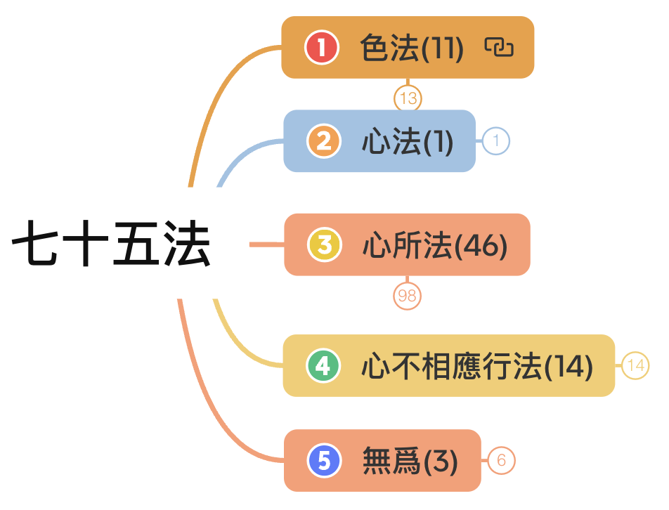
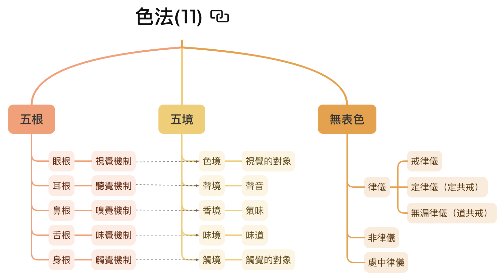
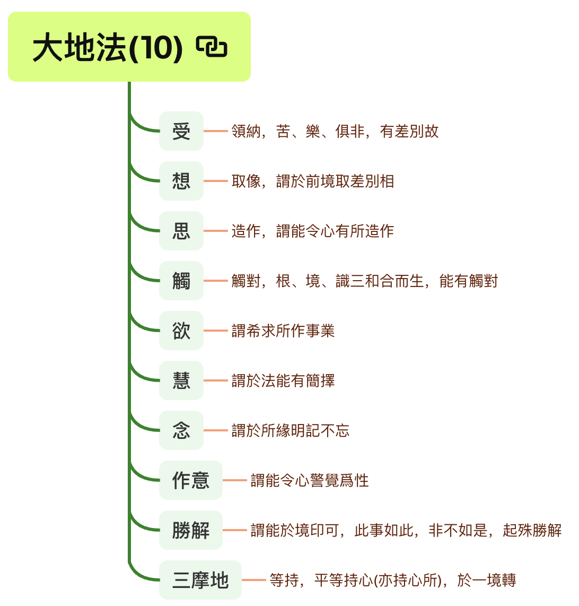
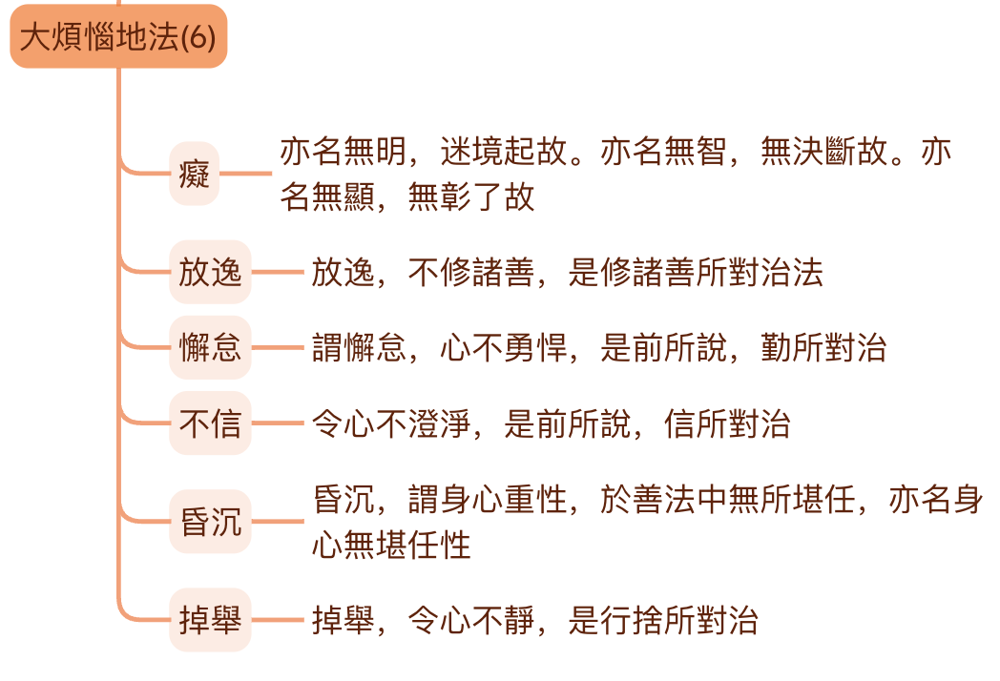
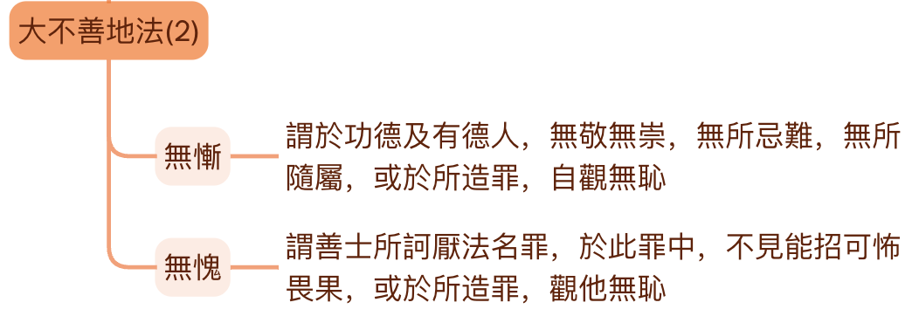
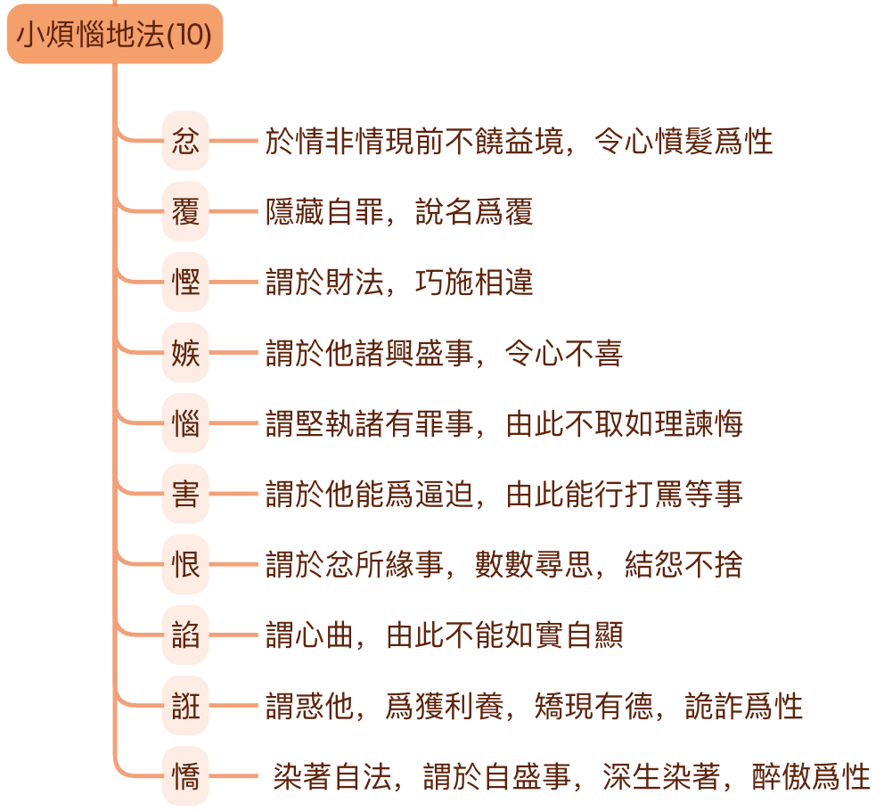
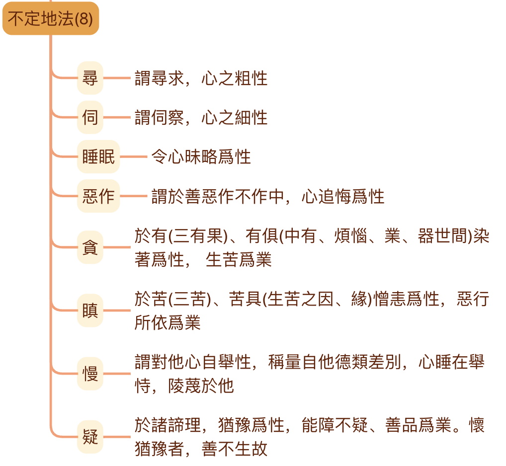
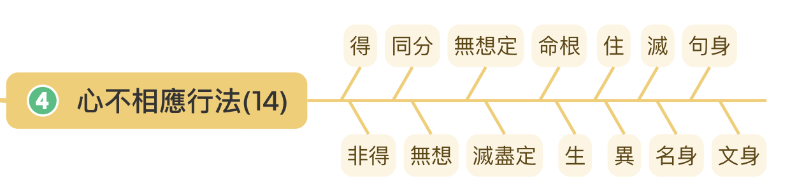
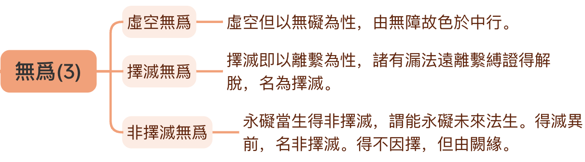

# 参考材料

* 《俱舍论》
* 《成唯识论》
* 智敏上师《俱舍论颂疏讲记》
* 林国良教授《成唯识论直解》
* 佛光大辭典 (慈怡法師主編) [七十五法](https://buddhaspace.org/dict/fk/data/%25E4%25B8%2583%25E5%258D%2581%25E4%25BA%2594%25E6%25B3%2595.html)

**为什么先列参考？**

上一篇文章[佛学中的理科和文科](https://mp.weixin.qq.com/s/YZ-UaEJE9ICBnpapzVq3OQ)中有介绍为何要学习法相（俱舍、唯识），这里列出参考材料，表明文章中的依据以上面的材料为主。尤其是涉及到宗派或论师之间不同观点的取舍时，更是要参考原始经典才行。

# 基础部分

**什么是基础？** 只介绍基本概念、基本解释，了解它的基本框架即可。以俱舍七十五法来说，什么是我认为的基础呢？那就是要知道它的基本分类（五大类），以及每一个大类的名称和基本意思。其次是应该了解每个法的基本概念和基本解释。

对于心所法而言，应该进一步了解其子分类，即大地法，大地善法，大烦恼地法，小烦恼地法，不定地法。以及了解这里每个子分类的基本含义。

有些”法“的意涵非常丰富，也有很多不同的解释，这里只介绍最基础或最容易理解的部分。（尤其是从我个人觉得容易理解的角度。）

以此作为入门的基础，遇到感兴趣的地方，或者想要再深入理解的地方，则应该继续学习下去。兴趣是最好的老师，佛学也不例外。

综合而言，基础部分就是要知道都有什么，是什么意思。整体上先了解它。最好可以背诵它，如果不能背，也要记得它的大多数“法”，否则后面学习会非常不方便。

我本人也不擅长背诵，所以，借助现代科技的一个办法，就是把这个图表打印出来，看书（学习）的时候，时常对照，久而久之，自然就记住了。在对照这个表的情况下，再把基本意思记住，也算是一种方便了吧。其次还可以把图表设置成手机或电脑壁纸，方便随时查看。

# 基本框架

先介绍下基本框架。

俱舍七十五法，一共分成五个大类（五位），分别是：
* 色法：一切物质，包括有情的身体和外在的器世界，一共有11个法。
* 心法：即是心。在小乘里面，心、意、识三者经常可以通用，因为它们的体，都是心，所以这里只有1个法。
* 心所法：心的功能和作用。有人说是现代心理学中的心理状态。包含46个法。心所法是关键点，基础部分应该进一步学习和了解。
* 心不相应行法：和心、心所都不相应的“法”。不是色法，也不是无为法。这里包含的内容很多，包括一般的“物理规律”，“客观规律”，如生住异灭，特殊的禅定等等。
* 无为法：前面四大类都是有为法，有为法的定义是，因缘和合而有生住异灭的意思。反之，就是无为法，不会有生异灭。无为法有住。

完整的表格在文章末尾。

# 色法

* 色法：就是现代物理所说的一切物质（包括可见不可见的），可见的包括一切有情的身体（器官和身体等）和外在的器世界（日月星辰，山河大地等），不可见包括声音等。一共有11个法。分别为：五根，五尘和无表色。

（备注：因为佛法的讲解对象主要是人，为了解释的方便，一些地方会直接用人来代指一切有情了。）

## 五根

* 眼根：视觉机制，包括眼球（器官）和视觉神经系统。（有人说神经系统是净色根。可以先暂且一听，同下。）
* 耳根：听觉机制，包括耳朵（器官）和听觉神经系统。
* 鼻根：嗅觉机制，包括鼻子（器官）和嗅觉神经系统。
* 舌根：味觉机制，包括舌头（器官）和味觉神经系统。
* 身根：触觉机制，包括身体（器官）和触觉神经系统。

注意，这里没有意根。俱舍七十五法里面没有意根，法尘和意识。以后介绍十二处、十八界时再做解释。

## 五尘（或五境）
* 色尘：眼睛可以看得见的物质。注意，色法和色尘不一样，色法是大类，色尘是具体的一个法。看经典时，要依据上下文仔细分辨，到底是色法还是色尘。
* 声尘：声音。
* 香尘：嗅觉可以闻到的气味，包括普通情况下无色无味的东西，大概只是人闻不到，嗅觉灵敏如狗，可能就可以闻到了。古印度用“香”表示“气味”，所以臭味也是“香”的一种。
* 味尘：有味道的东西，包括无色无味的东西。
* 触尘：触觉系统所识别的对象，如柔软，硬朗等。

## 无表色

这个概念稍微难一点点，在这里只要记住它的基本意思和具体内容即可。在基础阶段记不住也没关系。后面可以再学、再记。

基本含义：看不见，摸不着，也无法感觉到（所以不是色、声、香、味、触）。但却是依附在身体上的一种存在（所以归在色法里面）。

无表色可以继续分为：律仪（善的），非律仪（恶的），处中律仪（不善不恶）。后面两个很少提到，律仪是比较常见的，律仪里面又有：

* 戒律仪：受戒后的戒体。因为念戒、护戒的缘故，不会去造恶业了。
* 定律仪（定共戒）：有了禅定后的“戒”体。初禅及以上就没有嗔心了。没有嗔心就不会随便害人了。
* 无漏律仪（道共戒）：见道位以上的圣者具有的无漏心。不会再去造恶业了。（指引生三恶道的恶业。）

# 心法

在小乘（声闻乘）里面，以及俱舍论里面，心、意、识三者经常可以通用、互通，因为它们的“体”都“心”。当然，严格的地方，也还是会区分使用的。当区别使用的时候，就是强调了它们某个特性的意思。

* 用“心”的时候，强调“集起”的功能，或心、意、识三者的综合功能。
* 用“意”的时候，强调“思量”的功能，“思”就是思考的意思，“量”就是计量、测量、打量的意思。
* 用“识”的时候，强调“了别”的功能。

在七十五法里面，只有心和心所。而没有意识和法尘。等到后面介绍十二处、十八界的时候，再做介绍。七十五法是基础，学好了之后，再学五蕴、十二处、十八界都会势如破竹。甚至于比直接学习五蕴、十二处、十八界要更加清晰。

# 心所

在基础阶段，心所法是最关键的地方，也是最重要的地方。学习之后，还可以用在日常中对于自己的观察。如果有禅坐的习惯，更可以让觉察更上一层楼了。

心所包括大地法、大善地法、大烦恼地法、大不善地法、小烦恼地法、不定地法。

* 大地法：任何其他心所（非大地法的36个）生起的时候，一定会有这十个大地法同时生起。
* 大善地法：任何“善心”生起的时候，一定会有这十个大善地法生起。
* 大烦恼地法：任何“烦恼心”生起的时候，一定会有这六个大烦恼地法生起。
* 大不善地法：任何“不善心”生起的时候，一定会有这两个不善心所生起。
* 小烦恼地法：不会同时生起的“烦恼心”，而且它们的特征都比较强烈。相对“大烦恼地法”来说。
* 不定地法：这里的不定不是善、恶性不定（和唯识百法的不定不同，唯识百法是善恶性不定），而是生起的规律不定，有时可以和其他心所同时生起，有时不可以。

备注：这里的不善就是恶，恶比烦恼更为严重，有的烦恼比较隐蔽，特征不明显。比如“不信”，普通人甚至外道，虽然“不信”佛法，但是他们也可能是好人，心平气和之人。

## 大地法

**大地法：** 任何其他心所（非大地法的36个）生起的时候，一定会有这十个大地法同时生起。图片中的文字来源于智敏上师《俱舍论颂疏讲记》，下面的解释，是我个人的注解，或许更容易看懂。下同。

* 受：感受，有三受：分为苦、乐、不苦不乐（舍受）。也分为五种（五受）：苦（身体上）、忧（心理上）、乐（身体上）、喜（心理上）和舍受。
* 想：套上名称。给看到的东西、听到的声音、闻到的味道、尝到的味道、触感、想法一个名称。如看到一个瓶子的形状，大脑给它立即套个“瓶子”的名称，这样就可以进一步思维了（思心所的作用）。如这个瓶子好看不好看等（思心所的作用）。
* 思：更底层的思考。但是这里指更加微细，更底层的思考或大脑神经层次的运动。因为后面还有寻、伺。要注意区分。现代人所说的思考，其实都是寻、伺。后面再说。
* 触：根、境、识三者接触后，心和心所才开始运作。
* 欲：希望。
* 慧：区分和取舍事物的判断力。（这个非常重要！）
* 念：记忆的功能。
* 作意：让心和心所进入准备状态。如果不作意，就会“听而不闻”，“视而不见”。明明在眼前的东西，但是不留意的话，就注意不到，这就是因为没有“作意”。
* 胜解：对自我观点的肯定，觉得一定如此。
* 三摩地（定）：让心专注。（不要和禅定混淆！）

注意：这十个大地法本身是中性的，可以通一切善法，也可以通一切恶法，也可以通一切无记法（不善不恶）。

举例1：当人起善心时，大地法也是善的。比如布施时，需要有智慧判断如何布施，布施给谁，就是“慧心所”的作用。希望去布施时，就是“欲心所”的作用。记得布施法，要去布施时，就是“念心所”的作用，一旦忘记了，布施就无法完成了。

举例2：当人起恶心时，道理也是一样的。例如想要吃鱼，于是把鱼杀了，炖了吃了。想要吃鱼时，就是“欲心所”的作用。怎么杀鱼，需要有“智慧”，就是“慧心所”的作用。记得想要吃鱼，如何杀鱼，就是“念心所”的作用。如果不记得想要吃鱼了，就不会再杀鱼了。

举例3：盗贼电影中经常有一个这样的场景，盗贼通过种种红外线、各种监控、各种暗器，最终盗取珍宝。这其中盗贼的“定心所”非常强大，否则，分分钟就会被监控发现了，或被红外线扫到，最终无法完成盗取。

## 大善地法

**大善地法：** 任何“善心”生起的时候，一定会有这十个大善地法生起。

* 信：相信佛法（关键是因缘法、四圣谛），信本身就有让人有依靠、有安定的作用。现代人常说的安全感。
* 不放逸：不该做的事情不去做（这里的事情指恶法）。
* 轻安：身心舒服，能够去承担做善法。
* 舍：让心处于平静当中，不会浑浑噩噩，不会太散乱无法专注。
* 惭：拿自己和圣贤（或有德之人）相比，觉得自己更差，不如他们，会虚心向他们学习。
* 愧：拿自己和圣贤（或有德之人）相比，觉得他人更强，会虚心向他们学习。第二种解释：对于圣贤所呵斥的事情（恶法），十分认同，这样就会去断恶行善了。
* 无贪：没有贪心。
* 无嗔：没有嗔心。
* 不害：不会想要伤害别人（无论是物理伤害还是精神伤害）。
* 勤（精进）：勤快，很努力地做善事。

惭、愧有好几种解释，随便先记得哪种都可以。不仅惭愧如此，很多名词都有好多种解释，选择自己最能理解的开始，再逐步扩展到其他解释。

## 大烦恼地法

**大烦恼地法：** 任何“烦恼心”生起的时候，一定会有这六个大烦恼地法生起。

* 痴：即无明。愚痴、无知的意思。尤其是指不知佛法，不知佛法中的因缘法，四圣谛等。
* 放逸：不该做的事情，却去做了。事情主要指恶法和过度的娱乐。比如，不该去打麻将却去打了；不该长时间看电视，结果看了5个小时。
* 懈怠：该去做的事情，却偷懒不去做。事情指善法。比如，很多学佛人都制定了定课，或制定了学习计划（如诵经，看经书）等，最终却因为偷懒，找借口等原因不去做。
* 不信：信的反面。不信佛法，不信佛法僧，不信因缘法，不信四圣谛等。
* 昏沉：浑浑噩噩，感觉身体沉重，有心无力，最终做不成事情（善法）。打坐时，指昏昏欲睡，甚至直接睡着了。
* 掉举：以打坐来说，就是快要坐不住了。用不上打坐的方法了，总是想东想西。日常来说，心总是在散乱中，无法专注。但是掉举是在“散乱”之前的一个状态。

放逸、懈怠、昏沉、掉举等都有好几种解释，随便先记得哪种都可以。可以选择自己最能理解的开始，再逐步扩展到其他解释。

## 大不善地法

**大不善地法：** 任何“不善心”生起的时候，一定会有这两个不善心所生起。

备注：这里的不善就是恶，恶比烦恼更为严重，有的烦恼比较隐蔽，特征不明显。比如“不信”，普通人甚至外道，虽然“不信”佛法，但是他们也可能是好人，心境平和之人。

无惭无愧就是惭愧的反面。惭愧是善法，而无惭无愧就是恶法，这里用“不善”表示。

* 无惭：拿自己和圣贤（或有德之人）相比，觉得自己也不差，不需要向他们学习。不会感到羞耻。
* 无愧：拿自己和圣贤（或有德之人）相比，觉得他人也不怎么样，不需要向他们学习。第二种解释：对于圣贤所呵斥的事情（恶法），并不认同，这样就不会去断恶行善了。做了恶事，也不会感觉到羞耻。

## 小烦恼地法 

**小烦恼地法：** 不会同时生起的“烦恼心”。相对“大烦恼地法”来说。它们的特征都比较强烈，生起的时间也会比较短。

* 忿：看到不顺自己心意的事情，怒火就上来了。
* 覆：隐藏自己的错误（罪行：指恶法和烦恼）。
* 悭：对于财物的吝啬之心。进而不会去布施。
* 嫉：嫉妒，看见别人有“好事”，自己心理不高兴。
* 恼：对于错误的事情，不接受别人的指正，并且认为对方是错误的。
* 害：想要伤害人，进而打骂他人。
* 恨：对于前面“忿怒”的事情，怀恨在心。“忿”是要对境，“恨”是不对境的情况下的心理活动，所以比“忿”更进一步了。
* 陷：歪曲事实，为自己辩护，或想要“陷害”他人。
* 诳：假装自己很有德行，很有能力（如有神通，禅定，开悟等）。
* 憍：骄傲。对于自己有的事情，觉得很了不起。是“慢心所”的一部分。

这些是小烦恼地法，通常不会同时生起。虽然现代人经常说“忿恨”（或愤恨），但严格来说，如果对境就是“忿”，不对境就是“恨”。不会同时又“忿”又“恨”。

当然，我们一般情况下还是会用“忿恨”来表示重复发生的“不顺心”的事情，但是这个“忿恨”是指一段时间。而这里“忿心所”和“恨心所”是指一个刹那一个刹那的事情。

佛教的法相学是很严格的，很精确的。这样在禅坐时，就可以细细觉察和对照了，进一步就容易对治了。如果连这些微细的相貌都不知道，对治无从谈起。

就像是修理电器，必须要了解内部构造，工作原理才行的。否则，对于一般人遇到老式电视、老式电脑坏了的时候，就只会在外壳上拍一拍了。运气好，拍好了，运气不好，完全没用，甚至更糟糕了。认真学佛的人，肯定不该如此的。

## 不定地法

**不定地法：** 这里的不定是生起的规律不定，有时可以和其他心所同时生起，有时不可以。而不是善、恶性不定（和唯识百法的不定烦恼不同，唯识百法中是善恶性不定）。

* 寻：心的粗相。寻求，寻找。
* 伺：心的细相。伺察。参照后面的例子说明寻、伺的区别。
* 睡眠：令心昏昧。以一般人的经验，头脑太活跃，太清醒的时候，是无法睡眠的。一般人要睡觉的话，就要让心昏昧才能入睡。
* 恶作：后悔，追悔。恶作通三性（善、恶、无记）。布施后，后悔了，觉得那人不值得布施，这就是“恶”。骂人了，后悔了，觉得不该骂人，应该好好说法，这就是“善”。
* 贪：贪心。一般人都是贪着五欲（色声香味触，财色名食睡）等。修行人则会贪图“功德”，“禅定”，“神通”等。
* 嗔：嗔心。前面介绍过的“忿”，“恨”，“害”等都是“嗔”的一部分。
* 慢：觉得自己比别人厉害。再具体一点有七慢和九慢的说法。
* 疑：对于佛法的道理不能领悟，怀疑他们的正确性，犹豫不决。

寻、伺的解释不太容易理解，可以借助一个例子来说 —— 

**猫抓老鼠** —— 开始的时候，猫不知道老鼠躲在哪里，这里找找，那里找找，这个叫“寻”，四处寻找。突然，老鼠出现，躲进洞里了。洞太小，猫进不去，于是猫趴在洞口“伺机而动”，这个叫“伺”。通过这个例子比较容易看出寻伺的差别，寻就是寻找，寻求。伺就是伺察，仔细审查。

# 心不相应行法

**不相应行法：** 和心、心所都不相应的“法”。不是色法，也不是无为法。特别类似现代学术分类上的“其他分类”。这里包含的内容很多，包括一般的“物理规律”，“客观规律”，如生住异灭，也包括两种特殊的禅定等等。

* 得：表示某种特定状态或获得的能力。
* 非得：表示失去某种特定状态或能力。
* 同分：表示有情共有的特性。
* 无想天：一种无”想心所“的禅定天的状态。外道错误地认为这是就是涅槃的境界。
* 无想定：一种无”想心所“的禅定状态。外道想要进入“无想天”对应的禅定。
* 灭尽定：一种无”想和受心所”的禅定状态。圣者才能入的一种禅定状态。
* 命根：表示生命的持续力量。
* 生：从无到有。
* 住：持续存在的一个过程。
* 异：持续变化、衰败的过程。
* 灭：从有到无。
* 名身：指各种名称。
* 句身：指一个完整独立的句子。
* 文身：指字母，二个字母以上叫“身”。古印度梵语用的是字母，类似英语。汉字不好直接对应。

# 无为法

**无为法：** 前面四大类都是有为法，有为法的定义是，因缘和合而有生住异灭的意思。反之，就是无为法，不会有生异灭。无为法有住，但不会生、异、灭。有为法是无常的。无为法则是常的。

* 虚空无为：因为虚空不会障碍一切法（指色法），所以叫虚空。
* 择灭无为：依靠正见（慧），有选择而灭掉烦恼，得到的无为（涅槃），叫做择灭无为。
* 非择灭无为：不需要选择并灭掉它，它因为缺缘而不再生起的法。

这里的虚空，千万不要和可以填满的“空”混淆了，比如说空瓶，瓶子满了，没有空隙。这里的虚空是指，无论瓶子空不空，瓶子所代表的“空间”都是存在的。空的理解一定要参考上下文。

# 总结

总结下数量：
* 色法：11种。
* 心法：1种。
* 心所法：46种（10+10+2+6+10+8=46）。
  * 大地法：10种。
  * 大地善法：10种。
  * 大烦恼地法：2种。
  * 大不善地法：6种。
  * 小烦恼地法：10种。
  * 不定地法：8种。
* 心不相应行法：14种。
* 无为法：3种。

合计75种。

再次重复下，这是法相学的基础。应该要了解它的基本框架，分类，和子分类。即使无法背诵全部，也可以在对照表格的情况下，可以它们的基本意思说出来。

如果把这些“知识”设计成一张考卷的话，满分100。那基础部分就是指60分了吧。60分万岁，以此为基础，再逐步提高吧。

# 预告下后面的文章

前面提到了几个“伏笔”：
* 五位七十五法中，没有意识和它对应的法尘。这里只有“心王”，虽然可以代表心、意、识三者，但是没有详细说明。
* 十二处、十八界中都有法尘和意根或意识，这里的对应关系如何。
* 五蕴和七十五法的关系如何？

这些以后再写文章介绍吧。

祝愿大家都能深入经藏，智慧如海。

阿弥陀佛

