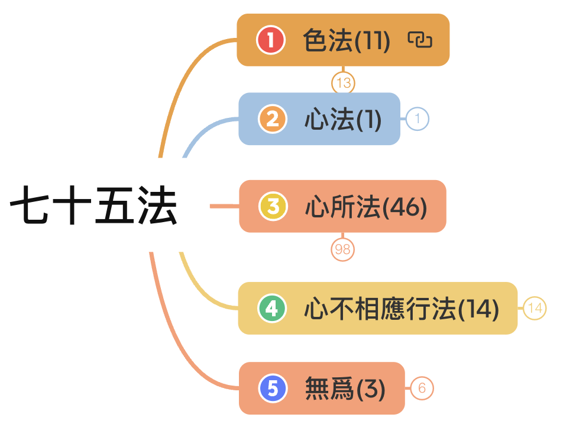
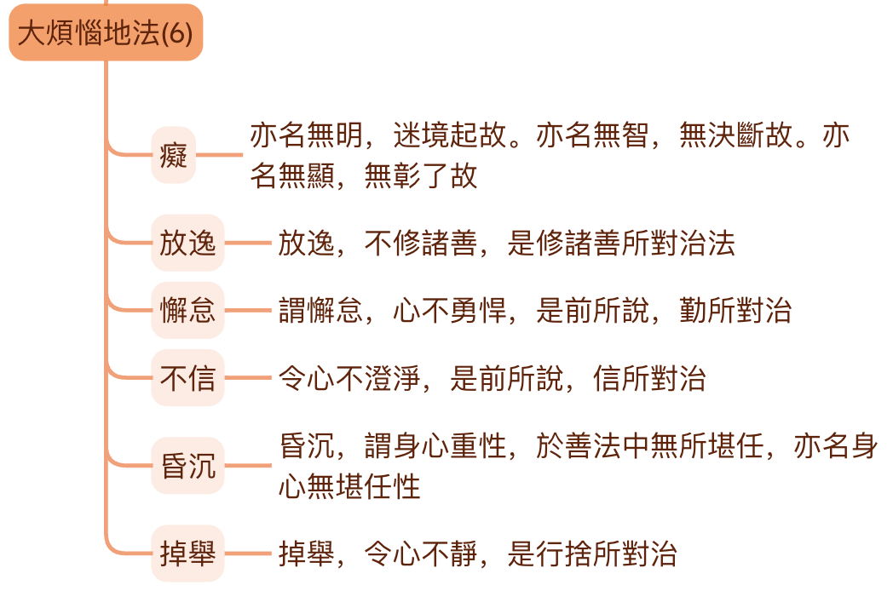
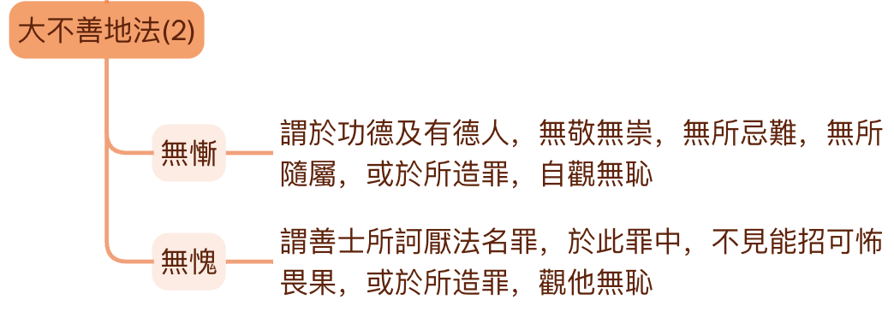
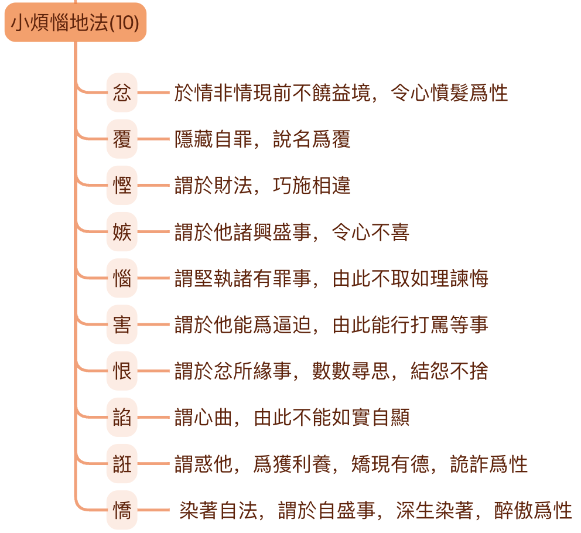
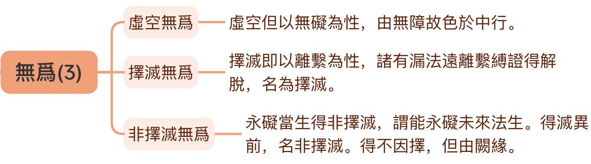
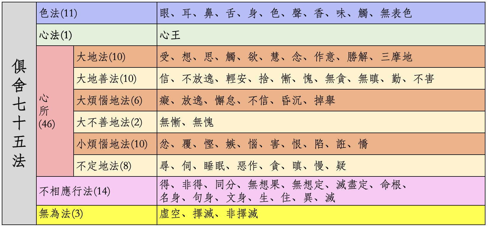

# 參考材料

* 《俱舍論》
* 《成唯識論》
* 智敏上師《俱舍論頌疏講記》
* 林國良教授《成唯識論直解》
* 佛光大辭典 (慈怡法師主編) [七十五法](https://buddhaspace.org/dict/fk/data/%25E4%25B8%2583%25E5%258D%2581%25E4%25BA%2594%25E6%25B3%2595.html)

**為什麼先列參考？**

上一篇文章[佛學中的理科和文科](https://mp.weixin.qq.com/s/YZ-UaEJE9ICBnpapzVq3OQ)中有介紹為何要學習法相（俱舍、唯識），這裡列出參考材料，表明文章中的依據以上面的材料為主。尤其是涉及到宗派或論師之間不同觀點的取捨時，更是要參考原始經典才行。

# 基礎部分

**什麼是基礎？** 只介紹基本概念、基本解釋，瞭解它的基本框架即可。以俱舍七十五法來說，什麼是我認為的基礎呢？那就是要知道它的基本分類（五大類），以及每一個大類的名稱和基本意思。其次是應該瞭解每個法的基本概念和基本解釋。

對於心所法而言，應該進一步瞭解其子分類，即大地法，大地善法，大煩惱地法，小煩惱地法，不定地法。以及瞭解這裡每個子分類的基本含義。

有些”法“的意涵非常豐富，也有很多不同的解釋，這裡只介紹最基礎或最容易理解的部分。（尤其是從我個人覺得容易理解的角度。）

以此作為入門的基礎，遇到感興趣的地方，或者想要再深入理解的地方，則應該繼續學習下去。興趣是最好的老師，佛學也不例外。

綜合而言，基礎部分就是要知道都有什麼，是什麼意思。整體上先了解它。最好可以背誦它，如果不能背，也要記得它的大多數“法”，否則後面學習會非常不方便。

我本人也不擅長背誦，所以，藉助現代科技的一個辦法，就是把這個圖表打印出來，看書（學習）的時候，時常對照，久而久之，自然就記住了。在對照這個表的情況下，再把基本意思記住，也算是一種方便了吧。其次還可以把圖表設置成手機或電腦壁紙，方便隨時查看。

# 基本框架

先介紹下基本框架。

俱舍七十五法，一共分成五個大類（五位），分別是：
* 色法：一切物質，包括有情的身體和外在的器世界，一共有11個法。
* 心法：即是心。在小乘裡面，心、意、識三者經常可以通用，因為它們的體，都是心，所以這裡只有1個法。
* 心所法：心的功能和作用。有人說是現代心理學中的心理狀態。包含46個法。心所法是關鍵點，基礎部分應該進一步學習和了解。
* 心不相應行法：和心、心所都不相應的“法”。不是色法，也不是無為法。這裡包含的內容很多，包括一般的“物理規律”，“客觀規律”，如生住異滅，特殊的禪定等等。
* 無為法：前面四大類都是有為法，有為法的定義是，因緣和合而有生住異滅的意思。反之，就是無為法，不會有生異滅。無為法有住。

完整的表格在文章末尾。

# 色法

* 色法：就是現代物理所說的一切物質（包括可見不可見的），可見的包括一切有情的身體（器官和身體等）和外在的器世界（日月星辰，山河大地等），不可見包括聲音等。一共有11個法。分別為：五根，五塵和無表色。

（備註：因為佛法的講解對象主要是人，為了解釋的方便，一些地方會直接用人來代指一切有情了。）

## 五根

* 眼根：視覺機制，包括眼球（器官）和視覺神經系統。（有人說神經系統是淨色根。可以先暫且一聽，同下。）
* 耳根：聽覺機制，包括耳朵（器官）和聽覺神經系統。
* 鼻根：嗅覺機制，包括鼻子（器官）和嗅覺神經系統。
* 舌根：味覺機制，包括舌頭（器官）和味覺神經系統。
* 身根：觸覺機制，包括身體（器官）和觸覺神經系統。

注意，這裡沒有意根。俱舍七十五法裡面沒有意根，法塵和意識。以後介紹十二處、十八界時再做解釋。

## 五塵（或五境）
* 色塵：眼睛可以看得見的物質。注意，色法和色塵不一樣，色法是大類，色塵是具體的一個法。看經典時，要依據上下文仔細分辨，到底是色法還是色塵。
* 聲塵：聲音。
* 香塵：嗅覺可以聞到的氣味，包括普通情況下無色無味的東西，大概只是人聞不到，嗅覺靈敏如狗，可能就可以聞到了。古印度用“香”表示“氣味”，所以臭味也是“香”的一種。
* 味塵：有味道的東西，包括無色無味的東西。
* 觸塵：觸覺系統所識別的對象，如柔軟，硬朗等。

## 無表色

這個概念稍微難一點點，在這裡只要記住它的基本意思和具體內容即可。在基礎階段記不住也沒關係。後面可以再學、再記。

基本含義：看不見，摸不著，也無法感覺到（所以不是色、聲、香、味、觸）。但卻是依附在身體上的一種存在（所以歸在色法裡面）。

無表色可以繼續分為：律儀（善的），非律儀（惡的），處中律儀（不善不惡）。後面兩個很少提到，律儀是比較常見的，律儀裡面又有：

* 戒律儀：受戒後的戒體。因為念戒、護戒的緣故，不會去造惡業了。
* 定律儀（定共戒）：有了禪定後的“戒”體。初禪及以上就沒有嗔心了。沒有嗔心就不會隨便害人了。
* 無漏律儀（道共戒）：見道位以上的聖者具有的無漏心。不會再去造惡業了。（指引生三惡道的惡業。）

# 心法

在小乘（聲聞乘）裡面，以及俱舍論裡面，心、意、識三者經常可以通用、互通，因為它們的“體”都“心”。當然，嚴格的地方，也還是會區分使用的。當區別使用的時候，就是強調了它們某個特性的意思。

* 用“心”的時候，強調“集起”的功能，或心、意、識三者的綜合功能。
* 用“意”的時候，強調“思量”的功能，“思”就是思考的意思，“量”就是計量、測量、打量的意思。
* 用“識”的時候，強調“了別”的功能。

在七十五法裡面，只有心和心所。而沒有意識和法塵。等到後面介紹十二處、十八界的時候，再做介紹。七十五法是基礎，學好了之後，再學五蘊、十二處、十八界都會勢如破竹。甚至於比直接學習五蘊、十二處、十八界要更加清晰。

# 心所

在基礎階段，心所法是最關鍵的地方，也是最重要的地方。學習之後，還可以用在日常中對於自己的觀察。如果有禪坐的習慣，更可以讓覺察更上一層樓了。

心所包括大地法、大善地法、大煩惱地法、大不善地法、小煩惱地法、不定地法。

* 大地法：任何其他心所（非大地法的36個）生起的時候，一定會有這十個大地法同時生起。
* 大善地法：任何“善心”生起的時候，一定會有這十個大善地法生起。
* 大煩惱地法：任何“煩惱心”生起的時候，一定會有這六個大煩惱地法生起。
* 大不善地法：任何“不善心”生起的時候，一定會有這兩個不善心所生起。
* 小煩惱地法：不會同時生起的“煩惱心”，而且它們的特徵都比較強烈。相對“大煩惱地法”來說。
* 不定地法：這裡的不定不是善、惡性不定（和唯識百法的不定不同，唯識百法是善惡性不定），而是生起的規律不定，有時可以和其他心所同時生起，有時不可以。

備註：這裡的不善就是惡，惡比煩惱更為嚴重，有的煩惱比較隱蔽，特徵不明顯。比如“不信”，普通人甚至外道，雖然“不信”佛法，但是他們也可能是好人，心平氣和之人。

## 大地法

**大地法：** 任何其他心所（非大地法的36個）生起的時候，一定會有這十個大地法同時生起。圖片中的文字來源於智敏上師《俱舍論頌疏講記》，下面的解釋，是我個人的註解，或許更容易看懂。下同。

* 受：感受，有三受：分為苦、樂、不苦不樂（舍受）。也分為五種（五受）：苦（身體上）、憂（心理上）、樂（身體上）、喜（心理上）和舍受。
* 想：套上名稱。給看到的東西、聽到的聲音、聞到的味道、嚐到的味道、觸感、想法一個名稱。如看到一個瓶子的形狀，大腦給它立即套個“瓶子”的名稱，這樣就可以進一步思維了（思心所的作用）。如這個瓶子好看不好看等（思心所的作用）。
* 思：更底層的思考。但是這裡指更加微細，更底層的思考或大腦神經層次的運動。因為後面還有尋、伺。要注意區分。現代人所說的思考，其實都是尋、伺。後面再說。
* 觸：根、境、識三者接觸後，心和心所才開始運作。
* 欲：希望。
* 慧：區分和取捨事物的判斷力。（這個非常重要！）
* 念：記憶的功能。
* 作意：讓心和心所進入準備狀態。如果不作意，就會“聽而不聞”，“視而不見”。明明在眼前的東西，但是不留意的話，就注意不到，這就是因為沒有“作意”。
* 勝解：對自我觀點的肯定，覺得一定如此。
* 三摩地（定）：讓心專注。（不要和禪定混淆！）

注意：這十個大地法本身是中性的，可以通一切善法，也可以通一切惡法，也可以通一切無記法（不善不惡）。

舉例1：當人起善心時，大地法也是善的。比如佈施時，需要有智慧判斷如何佈施，佈施給誰，就是“慧心所”的作用。希望去佈施時，就是“欲心所”的作用。記得佈施法，要去佈施時，就是“念心所”的作用，一旦忘記了，佈施就無法完成了。

舉例2：當人起噁心時，道理也是一樣的。例如想要吃魚，於是把魚殺了，燉了吃了。想要吃魚時，就是“欲心所”的作用。怎麼殺魚，需要有“智慧”，就是“慧心所”的作用。記得想要吃魚，如何殺魚，就是“念心所”的作用。如果不記得想要吃魚了，就不會再殺魚了。

舉例3：盜賊電影中經常有一個這樣的場景，盜賊通過種種紅外線、各種監控、各種暗器，最終盜取珍寶。這其中盜賊的“定心所”非常強大，否則，分分鐘就會被監控發現了，或被紅外線掃到，最終無法完成盜取。

## 大善地法

**大善地法：** 任何“善心”生起的時候，一定會有這十個大善地法生起。

* 信：相信佛法（關鍵是因緣法、四聖諦），信本身就有讓人有依靠、有安定的作用。現代人常說的安全感。
* 不放逸：不該做的事情不去做（這裡的事情指惡法）。
* 輕安：身心舒服，能夠去承擔做善法。
* 舍：讓心處於平靜當中，不會渾渾噩噩，不會太散亂無法專注。
* 慚：拿自己和聖賢（或有德之人）相比，覺得自己更差，不如他們，會虛心向他們學習。
* 愧：拿自己和聖賢（或有德之人）相比，覺得他人更強，會虛心向他們學習。第二種解釋：對於聖賢所呵斥的事情（惡法），十分認同，這樣就會去斷惡行善了。
* 無貪：沒有貪心。
* 無嗔：沒有嗔心。
* 不害：不會想要傷害別人（無論是物理傷害還是精神傷害）。
* 勤（精進）：勤快，很努力地做善事。

慚、愧有好幾種解釋，隨便先記得哪種都可以。不僅慚愧如此，很多名詞都有好多種解釋，選擇自己最能理解的開始，再逐步擴展到其他解釋。

## 大煩惱地法

**大煩惱地法：** 任何“煩惱心”生起的時候，一定會有這六個大煩惱地法生起。

* 痴：即無明。愚痴、無知的意思。尤其是指不知佛法，不知佛法中的因緣法，四聖諦等。
* 放逸：不該做的事情，卻去做了。事情主要指惡法和過度的娛樂。比如，不該去打麻將卻去打了；不該長時間看電視，結果看了5個小時。
* 懈怠：該去做的事情，卻偷懶不去做。事情指善法。比如，很多學佛人都制定了定課，或制定了學習計劃（如誦經，看經書）等，最終卻因為偷懶，找藉口等原因不去做。
* 不信：信的反面。不信佛法，不信佛法僧，不信因緣法，不信四聖諦等。
* 昏沉：渾渾噩噩，感覺身體沉重，有心無力，最終做不成事情（善法）。打坐時，指昏昏欲睡，甚至直接睡著了。
* 掉舉：以打坐來說，就是快要坐不住了。用不上打坐的方法了，總是想東想西。日常來說，心總是在散亂中，無法專注。但是掉舉是在“散亂”之前的一個狀態。

放逸、懈怠、昏沉、掉舉等都有好幾種解釋，隨便先記得哪種都可以。可以選擇自己最能理解的開始，再逐步擴展到其他解釋。

## 大不善地法

**大不善地法：** 任何“不善心”生起的時候，一定會有這兩個不善心所生起。

備註：這裡的不善就是惡，惡比煩惱更為嚴重，有的煩惱比較隱蔽，特徵不明顯。比如“不信”，普通人甚至外道，雖然“不信”佛法，但是他們也可能是好人，心境平和之人。

無慚無愧就是慚愧的反面。慚愧是善法，而無慚無愧就是惡法，這裡用“不善”表示。

* 無慚：拿自己和聖賢（或有德之人）相比，覺得自己也不差，不需要向他們學習。不會感到羞恥。
* 無愧：拿自己和聖賢（或有德之人）相比，覺得他人也不怎麼樣，不需要向他們學習。第二種解釋：對於聖賢所呵斥的事情（惡法），並不認同，這樣就不會去斷惡行善了。做了惡事，也不會感覺到羞恥。

## 小煩惱地法 

**小煩惱地法：** 不會同時生起的“煩惱心”。相對“大煩惱地法”來說。它們的特徵都比較強烈，生起的時間也會比較短。

* 忿：看到不順自己心意的事情，怒火就上來了。
* 覆：隱藏自己的錯誤（罪行：指惡法和煩惱）。
* 慳：對於財物的吝嗇之心。進而不會去佈施。
* 嫉：嫉妒，看見別人有“好事”，自己心理不高興。
* 惱：對於錯誤的事情，不接受別人的指正，並且認為對方是錯誤的。
* 害：想要傷害人，進而打罵他人。
* 恨：對於前面“忿怒”的事情，懷恨在心。“忿”是要對境，“恨”是不對境的情況下的心理活動，所以比“忿”更進一步了。
* 陷：歪曲事實，為自己辯護，或想要“陷害”他人。
* 誑：假裝自己很有德行，很有能力（如有神通，禪定，開悟等）。
* 憍：驕傲。對於自己有的事情，覺得很了不起。是“慢心所”的一部分。

這些是小煩惱地法，通常不會同時生起。雖然現代人經常說“忿恨”（或憤恨），但嚴格來說，如果對境就是“忿”，不對境就是“恨”。不會同時又“忿”又“恨”。

當然，我們一般情況下還是會用“忿恨”來表示重複發生的“不順心”的事情，但是這個“忿恨”是指一段時間。而這裡“忿心所”和“恨心所”是指一個剎那一個剎那的事情。

佛教的法相學是很嚴格的，很精確的。這樣在禪坐時，就可以細細覺察和對照了，進一步就容易對治了。如果連這些微細的相貌都不知道，對治無從談起。

就像是修理電器，必須要了解內部構造，工作原理才行的。否則，對於一般人遇到老式電視、老式電腦壞了的時候，就只會在外殼上拍一拍了。運氣好，拍好了，運氣不好，完全沒用，甚至更糟糕了。認真學佛的人，肯定不該如此的。

## 不定地法

**不定地法：** 這裡的不定是生起的規律不定，有時可以和其他心所同時生起，有時不可以。而不是善、惡性不定（和唯識百法的不定煩惱不同，唯識百法中是善惡性不定）。

* 尋：心的粗相。尋求，尋找。
* 伺：心的細相。伺察。參照後面的例子說明尋、伺的區別。
* 睡眠：令心昏昧。以一般人的經驗，頭腦太活躍，太清醒的時候，是無法睡眠的。一般人要睡覺的話，就要讓心昏昧才能入睡。
* 惡作：後悔，追悔。惡作通三性（善、惡、無記）。佈施後，後悔了，覺得那人不值得佈施，這就是“惡”。罵人了，後悔了，覺得不該罵人，應該好好說法，這就是“善”。
* 貪：貪心。一般人都是貪著五欲（色聲香味觸，財色名食睡）等。修行人則會貪圖“功德”，“禪定”，“神通”等。
* 嗔：嗔心。前面介紹過的“忿”，“恨”，“害”等都是“嗔”的一部分。
* 慢：覺得自己比別人厲害。再具體一點有七慢和九慢的說法。
* 疑：對於佛法的道理不能領悟，懷疑他們的正確性，猶豫不決。

尋、伺的解釋不太容易理解，可以藉助一個例子來說 —— 

**貓抓老鼠** —— 開始的時候，貓不知道老鼠躲在哪裡，這裡找找，那裡找找，這個叫“尋”，四處尋找。突然，老鼠出現，躲進洞裡了。洞太小，貓進不去，於是貓趴在洞口“伺機而動”，這個叫“伺”。通過這個例子比較容易看出尋伺的差別，尋就是尋找，尋求。伺就是伺察，仔細審查。

# 心不相應行法

**不相應行法：** 和心、心所都不相應的“法”。不是色法，也不是無為法。特別類似現代學術分類上的“其他分類”。這裡包含的內容很多，包括一般的“物理規律”，“客觀規律”，如生住異滅，也包括兩種特殊的禪定等等。

* 得：表示某種特定狀態或獲得的能力。
* 非得：表示失去某種特定狀態或能力。
* 同分：表示有情共有的特性。
* 無想天：一種無”想心所“的禪定天的狀態。外道錯誤地認為這是就是涅槃的境界。
* 無想定：一種無”想心所“的禪定狀態。外道想要進入“無想天”對應的禪定。
* 滅盡定：一種無”想和受心所”的禪定狀態。聖者才能入的一種禪定狀態。
* 命根：表示生命的持續力量。
* 生：從無到有。
* 住：持續存在的一個過程。
* 異：持續變化、衰敗的過程。
* 滅：從有到無。
* 名身：指各種名稱。
* 句身：指一個完整獨立的句子。
* 文身：指字母，二個字母以上叫“身”。古印度梵語用的是字母，類似英語。漢字不好直接對應。

# 無為法

**無為法：** 前面四大類都是有為法，有為法的定義是，因緣和合而有生住異滅的意思。反之，就是無為法，不會有生異滅。無為法有住，但不會生、異、滅。有為法是無常的。無為法則是常的。

* 虛空無為：因為虛空不會障礙一切法（指色法），所以叫虛空。
* 擇滅無為：依靠正見（慧），有選擇而滅掉煩惱，得到的無為（涅槃），叫做擇滅無為。
* 非擇滅無為：不需要選擇並滅掉它，它因為缺緣而不再生起的法。

這裡的虛空，千萬不要和可以填滿的“空”混淆了，比如說空瓶，瓶子滿了，沒有空隙。這裡的虛空是指，無論瓶子空不空，瓶子所代表的“空間”都是存在的。空的理解一定要參考上下文。

# 總結

總結下數量：
* 色法：11種。
* 心法：1種。
* 心所法：46種（10+10+2+6+10+8=46）。
  * 大地法：10種。
  * 大地善法：10種。
  * 大煩惱地法：2種。
  * 大不善地法：6種。
  * 小煩惱地法：10種。
  * 不定地法：8種。
* 心不相應行法：14種。
* 無為法：3種。

合計75種。

再次重複下，這是法相學的基礎。應該要了解它的基本框架，分類，和子分類。即使無法背誦全部，也可以在對照表格的情況下，可以它們的基本意思說出來。

如果把這些“知識”設計成一張考卷的話，滿分100。那基礎部分就是指60分了吧。60分萬歲，以此為基礎，再逐步提高吧。

# 預告下後面的文章

前面提到了幾個“伏筆”：
* 五位七十五法中，沒有意識和它對應的法塵。這裡只有“心王”，雖然可以代表心、意、識三者，但是沒有詳細說明。
* 十二處、十八界中都有法塵和意根或意識，這裡的對應關係如何。
* 五蘊和七十五法的關係如何？

這些以後再寫文章介紹吧。

祝願大家都能深入經藏，智慧如海。

阿彌陀佛

