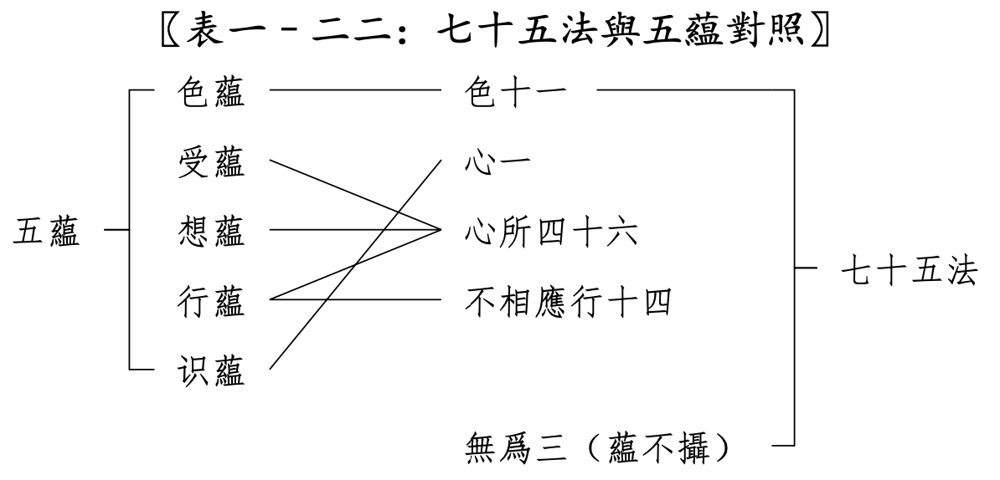
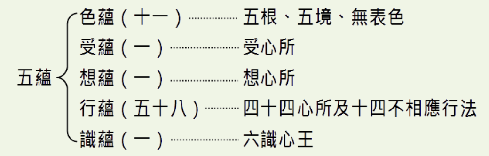

# 參考材料和前提條件

* 《俱舍論》
* 《成唯識論》
* 智敏上師《俱舍論頌疏講記》
* 林國良教授《成唯識論直解》
* 佛光大辭典 (慈怡法師主編) 七十五法 https://buddhaspace.org/dict/fk/data/%25E4%25B8%2583%25E5%258D%2581%25E4%25BA%2594%25E6%25B3%2595.html 
* 《星雲大師全集》 俱舍宗要義 https://books.masterhsingyun.org/ArticleDetail/artcle6847

**為什麼先列參考？**

之前的文章[佛學中的理科和文科](https://mp.weixin.qq.com/s/YZ-UaEJE9ICBnpapzVq3OQ)中有介紹為何要學習法相（俱舍、唯識），這裡列出參考材料，表明文章中的依據以上面的材料為主。尤其是涉及到宗派或論師之間不同觀點的取捨時，更是要參考原始經典才行。

**七十五法是前提條件**

這篇文章假設你已經瞭解了什麼是七十五法，以及七十五法都有哪些分類和心所下的子分類，並且應該瞭解下這七十五法具體的內容。如果你對此不太瞭解，那麼也可以先閱讀下我之前的文章 —— [《五位七十五法（基礎部分）》](https://mp.weixin.qq.com/s/chSlBrFIIE2vLnN1Q-FoGg)

最少的要求，也應該是在看到下面這張圖後，能夠理解其中的大部分內容。

# 五蘊

什麼是五蘊？很多學佛的朋友可能都能脫口而出，那即是色、受、想、行、識這個五個蘊，合起來說應該是色蘊、受蘊、想蘊、行蘊，識蘊。

# 五蘊的具體內容是什麼呢？

一般的解釋可能跟下面這個類似[1]：

* 色蘊：“色”是指物質，色蘊又具體包括地、水、火、風等四大物質因素。
* 受蘊：受蘊指的是感覺的主觀體驗，相當於現代心理學中的感受。
* 想蘊：想蘊描述了感覺器官，與外界物體互動後在意識中，形成的表象和思維過程。
* 行蘊：行蘊指的是意識的加工和反應活動，包括思考、情感和決策等過程。
* 識蘊：識蘊包括各種感覺器官的了別作用，用來辨認外界事物。

這個解釋只是一個大概的、泛泛的樣子，看過之後也不容易留下什麼深刻印象，更談不上在日常中如何實踐了。更何況，這種泛泛而談的解釋還有不準確，甚至不正確的情況（如上面的識蘊）。

所以，如果想要更加深入理解五蘊，想要了解五蘊裡面更加準確的內容。學習七十五法，無疑是最好的方式之一了。下面就用七十五法和五蘊進行對照學習。

# 七十五法和五蘊的對照

七十五法和五蘊的對照如下圖表。

如表所示：
* 五蘊中的**色蘊**，完全對照七十五法中的**色法**，包括裡面的全部內容：五根、五境和無表色。
* 五蘊中的**受蘊**，僅僅對應**受心所**，屬於心所法中的大地法。
* 五蘊中的**想蘊**，僅僅對應**想心所**，屬於心所法中的大地法。
* 五蘊中的**行蘊**，對應了心所中的其他心所，除去受心所和想心所之外的44個心所（大地法剩下的8個，大地善法10個，大煩惱地法6個，大不善地法2個，小煩惱地法10個，不定地法8個）。以及14個不相應行法。
* 五蘊中的**識蘊**，則對應七十五法中的**心王**，心法中的心王。圖中為了對照的方便，把識蘊的順序提前到了第二位。在學習和記憶這些佛法術語的時候，是需要記住它們的順序的。正常的順序裡面，識蘊在最後一個。

七十五法中的3個無為法，沒有對應的蘊，不屬於五蘊的範疇。

# 略解五蘊

通過對比一般性的解釋，以及和七十五法的對照進行分別的說明。

## 色蘊 = 色法（11個）

五蘊中的**色蘊**，完全對照七十五法中的**色法**，包括裡面的全部內容：五根、五境和無表色。

五根（眼根、耳根、鼻根、舌根、身根） —— 即是指有情的身體和器官。佛教經典上經常說的“內”，其實是包括我們的身體和心理兩部分，而不僅僅是心理，這點和現代認知略不一樣。

五境（色境、聲境、香境、味境、觸境） —— 即是五根的所緣境，五根所觀察或接觸的對象。以此來認識外境，包括其他有情和世界。

無表色 —— 無見無對的一種色法，無見是因為無法看見，無對是無法用其他根（耳根、鼻根、舌根、身根）來感知到它的存在與否。具體一點的，可以再參考下律儀無表，非律儀無表，處中無表。

一般的解釋 —— 色蘊：“色”是指物質，色蘊又具體包括地、水、火、風等四大物質因素。

再和這個一般解釋對照下。“色”是指物質 —— 這個是準確的描述。
色蘊又具體包括地、水、火、風等四大物質因素 —— 這個也基本準確。

地、水、火、風是古印度對於一切物質特性的歸納。和道家的五行（金、木、水、火、土）有類似之處。以古代來說，限於技術水平，無法探究物質的本質（如當今物理學上的分類），也無法向普通老百姓宣講過於複雜的物理知識，因此，無論是古印度還是古中國，都是用老百姓日常有所感知的幾個典型作為代表，對於一切事物的性質進行歸納總結。古印度選擇的是地、水、火、風四大。道家選擇的是五行。

## 受蘊 = 受心所

一般的解釋 —— 受蘊：受蘊指的是感覺的主觀體驗，相當於現代心理學中的感受。

七十五法中的受心所：感受，有三受：分為苦、樂、不苦不樂（舍受）。也分為五種（五受）：苦（身體上）、憂（心理上）、樂（身體上）、喜（心理上）和舍受。

這兩者解釋差不多。

## 想蘊 = 想心所

一般的解釋 —— 想蘊：想蘊描述了感覺器官，與外界物體互動後在意識中，形成的表象和思維過程。

七十五法中的想心所：套上名稱。給看到的東西、聽到的聲音、聞到的味道、嚐到的味道、觸感、想法一個名稱。如看到一個瓶子的形狀，大腦給它立即套個“瓶子”的名稱，這樣就可以進一步思維了（思心所的作用）。如這個瓶子好看不好看等（思心所的作用）。

後者把“思維”過程也算在“想”裡面了。這點顯然是不對，看對照圖可知，“思心所”是“行蘊”的一部分了。實際上的“想”要單純的多，只是給所觀察到的外境和意識上出現的念頭（想法、觀念），套上一個名稱而已。

## 行蘊 = 心所（44個）+ 不相應行（14個），一共58個

一般的解釋 —— 行蘊：行蘊指的是意識的加工和反應活動，包括思考、情感和決策等過程。

這個解釋是概括性的。如果要精確地知道其具體內容。那麼七十五法就給出了非常詳細的解釋了。分為兩個部分：44個心所法和14個不相應行法。

七十五法中的心所法一共有46個，去除了已經獨立出來的受、想，剩下44個全部都是行法。

這裡不再重複解釋這些心所法和不相應行法了，請參考之前的文章《五位七十五法（基礎部分）》。

## 識蘊 = 心法 = 心王

一般的解釋 —— 識蘊：識蘊包括各種感覺器官的了別作用，用來辨認外界事物。

這個解釋不準確。識也包括意識，而意識是用來辨識第六意識出現的念頭、觀念、想法的。意識不是外界事物。意識是內在的、心理層面的作用。

七十五法中的心法：在小乘（聲聞乘）裡面，以及俱舍論裡面，心、意、識三者經常可以通用、互通，因為它們的“體”都“心”。當然，嚴格的地方，也還是會區分使用的。當區別使用的時候，就是強調了它們某個特性的意思。
  * 用“心”的時候，強調“集起”的功能，或心、意、識三者的綜合功能。
  * 用“意”的時候，強調“思量”的功能，“思”就是思考的意思，“量”就是計量、測量、打量的意思。
  * 用“識”的時候，強調“了別”的功能。了別的東西包括外在的五境（色聲香味觸），也包括內在的法塵（念頭，想法，觀念等）。

# 從聞到思

佛教中特別重視“聞思修”三慧，聞慧就是聽聞佛法，瞭解和知道。以我的觀察來看，很多學佛者的“聞慧”都是不夠的，或者只是接受過單一來源的輸入，或者只是單一方面的輸入，少有人能夠了解整個佛教的概況，基本框架。

而思慧就是要深入思考，那就是在聽聞之後，要深入思考下一些背後的邏輯、隱藏的邏輯。這裡還必須是有效的思考。而有效思考的前提是提出有效的問題。

以上的佛學知識都只是“聞慧”，那麼像這種深入一點問題就屬於“思慧”了。

## 為什麼無為法不是蘊？

七十五法中的3個無為法，沒有對應的蘊，不屬於五蘊的範疇。因為“蘊”都是有為法。“蘊”本身的意思就是積集，聚集的意思，可以聚少成多。而無為法如虛空，是無相的，不會增加也不會減少（不增不減），當然就無法用“聚積”來形容了。

《大毗婆沙論》中通過詳細地對比蘊和無為法的區別，說明了無為法不是蘊。這些對比其實都是有為法和無為法的對比。有興趣的朋友可以自行查看。

## 為什麼五蘊是“色、受、想、行、識”這個順序呢？

回答：它們是從粗到細逐個說的。《俱舍論頌疏講記》中舉了一個做飯的例子，原文如下：

> 色蘊如器，如世間器，飲食所依;色亦如是，受所依故。受類飲食， 如世間食，有損有益;受亦如是，樂受益人，苦受便損。想同助味，如世 鹽醋，助生食味;想亦如是，起怨想時，生苦受味，起親想時，生樂受味。 行似廚人，由行蘊中，有業煩惱，能感異熟;如世廚人，造得飲食。識喻 食者，受果報故。故隨器等，立蘊次第。

在例子中，是這樣比喻的：
* 色蘊 —— 廚房和廚具，沒有這些，就無法做飯了。
* 受蘊 —— 食材。巧婦難為無米之炊，做飯必須要有食材。
* 想蘊 —— 調料品，如鹽和醋。
* 行蘊 —— 大廚，把食材加工成飯菜。
* 識蘊 —— 食客，吃飯的人。

## 為什麼把受心所、想心所列為受蘊、想蘊？

為什麼在46個心所中單獨把受心所、想心所列為受蘊、想蘊？而其他的44個心所都歸納在行蘊中呢？

《俱舍論頌疏講記》中的原文解釋如下：

> 即由如是諸次第因，離行別立受想二蘊。謂受與想，於諸行 中，相粗，生染，類食同助，二界中強，故別立蘊。

大意是說，在所有的行蘊當中（心所和不相應行），受和想，它們是最粗的（色蘊已經單獨成立為色蘊了），而且，它們能夠引生汙染的心所，樂的就貪，苦的就嗔。在上面做飯的比喻中，一個是食材，一個調料品。如果沒有這兩個，那麼只有廚房和大廚，也無法做出飯菜來給食客吃了。而二界是指色界中受蘊強烈，無色界中想蘊強烈。

因此，受和想，它們兩個非常關鍵，因此把它們單獨成立為受蘊和想蘊。

# 總結

以上，就是略解五蘊，尤其是用七十五法和五蘊進行對照，可以幫助我們更深入、更全面、更精確地瞭解五蘊。

尤其是喜愛《心經》的朋友們，要先知五蘊，再去知空，才知道要空掉什麼。否則，就像是搞衛生，房屋裡面有什麼都不知道，如何可以打掃好衛生呢？如何可以保證無死角呢？

最後附上智敏上師在《講義》中的插圖：

以及《星雲大師全集》俱舍宗要義中的插圖：

祝願大家都能深入經藏，智慧如海。

阿彌陀佛

引用
1. https://www.163.com/dy/article/IF11CFEA0553FV3Z.html

