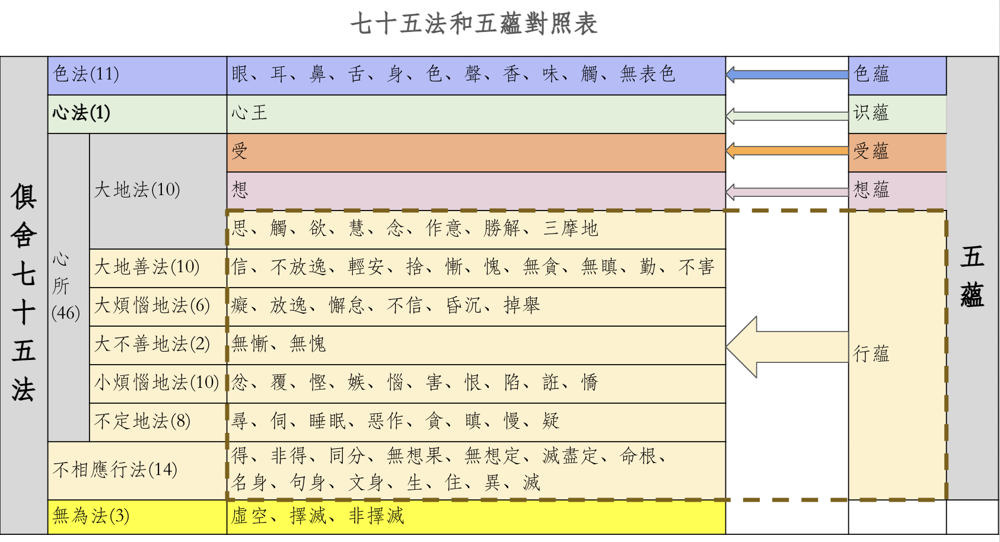

# 参考材料和前提条件

* 《俱舍论》
* 《成唯识论》
* 智敏上师《俱舍论颂疏讲记》
* 林国良教授《成唯识论直解》
* 佛光大辞典 (慈怡法师主编) 七十五法 https://buddhaspace.org/dict/fk/data/%25E4%25B8%2583%25E5%258D%2581%25E4%25BA%2594%25E6%25B3%2595.html 
* 《星云大师全集》 俱舍宗要义 https://books.masterhsingyun.org/ArticleDetail/artcle6847

**为什么先列参考？**

之前的文章[佛学中的理科和文科](https://mp.weixin.qq.com/s/YZ-UaEJE9ICBnpapzVq3OQ)中有介绍为何要学习法相（俱舍、唯识），这里列出参考材料，表明文章中的依据以上面的材料为主。尤其是涉及到宗派或论师之间不同观点的取舍时，更是要参考原始经典才行。

**七十五法是前提条件**

这篇文章假设你已经了解了什么是七十五法，以及七十五法都有哪些分类和心所下的子分类，并且应该了解下这七十五法具体的内容。如果你对此不太了解，那么也可以先阅读下我之前的文章 —— [《五位七十五法（基础部分）》](https://mp.weixin.qq.com/s/chSlBrFIIE2vLnN1Q-FoGg)

最少的要求，也应该是在看到下面这张图后，能够理解其中的大部分内容。

# 五蕴

什么是五蕴？很多学佛的朋友可能都能脱口而出，那即是色、受、想、行、识这个五个蕴，合起来说应该是色蕴、受蕴、想蕴、行蕴，识蕴。

# 五蕴的具体内容是什么呢？

一般的解释可能跟下面这个类似[1]：

* 色蕴：“色”是指物质，色蕴又具体包括地、水、火、风等四大物质因素。
* 受蕴：受蕴指的是感觉的主观体验，相当于现代心理学中的感受。
* 想蕴：想蕴描述了感觉器官，与外界物体互动后在意识中，形成的表象和思维过程。
* 行蕴：行蕴指的是意识的加工和反应活动，包括思考、情感和决策等过程。
* 识蕴：识蕴包括各种感觉器官的了别作用，用来辨认外界事物。

这个解释只是一个大概的、泛泛的样子，看过之后也不容易留下什么深刻印象，更谈不上在日常中如何实践了。更何况，这种泛泛而谈的解释还有不准确，甚至不正确的情况（如上面的识蕴）。

所以，如果想要更加深入理解五蕴，想要了解五蕴里面更加准确的内容。学习七十五法，无疑是最好的方式之一了。下面就用七十五法和五蕴进行对照学习。

# 七十五法和五蕴的对照

七十五法和五蕴的对照如下图表。

如表所示：
* 五蕴中的**色蕴**，完全对照七十五法中的**色法**，包括里面的全部内容：五根、五境和无表色。
* 五蕴中的**受蕴**，仅仅对应**受心所**，属于心所法中的大地法。
* 五蕴中的**想蕴**，仅仅对应**想心所**，属于心所法中的大地法。
* 五蕴中的**行蕴**，对应了心所中的其他心所，除去受心所和想心所之外的44个心所（大地法剩下的8个，大地善法10个，大烦恼地法6个，大不善地法2个，小烦恼地法10个，不定地法8个）。以及14个不相应行法。
* 五蕴中的**识蕴**，则对应七十五法中的**心王**，心法中的心王。图中为了对照的方便，把识蕴的顺序提前到了第二位。在学习和记忆这些佛法术语的时候，是需要记住它们的顺序的。正常的顺序里面，识蕴在最后一个。

七十五法中的3个无为法，没有对应的蕴，不属于五蕴的范畴。

# 略解五蕴

通过对比一般性的解释，以及和七十五法的对照进行分别的说明。

## 色蕴 = 色法（11个）

五蕴中的**色蕴**，完全对照七十五法中的**色法**，包括里面的全部内容：五根、五境和无表色。

五根（眼根、耳根、鼻根、舌根、身根） —— 即是指有情的身体和器官。佛教经典上经常说的“内”，其实是包括我们的身体和心理两部分，而不仅仅是心理，这点和现代认知略不一样。

五境（色境、声境、香境、味境、触境） —— 即是五根的所缘境，五根所观察或接触的对象。以此来认识外境，包括其他有情和世界。

无表色 —— 无见无对的一种色法，无见是因为无法看见，无对是无法用其他根（耳根、鼻根、舌根、身根）来感知到它的存在与否。具体一点的，可以再参考下律仪无表，非律仪无表，处中无表。

一般的解释 —— 色蕴：“色”是指物质，色蕴又具体包括地、水、火、风等四大物质因素。

再和这个一般解释对照下。“色”是指物质 —— 这个是准确的描述。
色蕴又具体包括地、水、火、风等四大物质因素 —— 这个也基本准确。

地、水、火、风是古印度对于一切物质特性的归纳。和道家的五行（金、木、水、火、土）有类似之处。以古代来说，限于技术水平，无法探究物质的本质（如当今物理学上的分类），也无法向普通老百姓宣讲过于复杂的物理知识，因此，无论是古印度还是古中国，都是用老百姓日常有所感知的几个典型作为代表，对于一切事物的性质进行归纳总结。古印度选择的是地、水、火、风四大。道家选择的是五行。

## 受蕴 = 受心所

一般的解释 —— 受蕴：受蕴指的是感觉的主观体验，相当于现代心理学中的感受。

七十五法中的受心所：感受，有三受：分为苦、乐、不苦不乐（舍受）。也分为五种（五受）：苦（身体上）、忧（心理上）、乐（身体上）、喜（心理上）和舍受。

这两者解释差不多。

## 想蕴 = 想心所

一般的解释 —— 想蕴：想蕴描述了感觉器官，与外界物体互动后在意识中，形成的表象和思维过程。

七十五法中的想心所：套上名称。给看到的东西、听到的声音、闻到的味道、尝到的味道、触感、想法一个名称。如看到一个瓶子的形状，大脑给它立即套个“瓶子”的名称，这样就可以进一步思维了（思心所的作用）。如这个瓶子好看不好看等（思心所的作用）。

后者把“思维”过程也算在“想”里面了。这点显然是不对，看对照图可知，“思心所”是“行蕴”的一部分了。实际上的“想”要单纯的多，只是给所观察到的外境和意识上出现的念头（想法、观念），套上一个名称而已。

## 行蕴 = 心所（44个）+ 不相应行（14个），一共58个

一般的解释 —— 行蕴：行蕴指的是意识的加工和反应活动，包括思考、情感和决策等过程。

这个解释是概括性的。如果要精确地知道其具体内容。那么七十五法就给出了非常详细的解释了。分为两个部分：44个心所法和14个不相应行法。

七十五法中的心所法一共有46个，去除了已经独立出来的受、想，剩下44个全部都是行法。

这里不再重复解释这些心所法和不相应行法了，请参考之前的文章《五位七十五法（基础部分）》。

## 识蕴 = 心法 = 心王

一般的解释 —— 识蕴：识蕴包括各种感觉器官的了别作用，用来辨认外界事物。

这个解释不准确。识也包括意识，而意识是用来辨识第六意识出现的念头、观念、想法的。意识不是外界事物。意识是内在的、心理层面的作用。

七十五法中的心法：在小乘（声闻乘）里面，以及俱舍论里面，心、意、识三者经常可以通用、互通，因为它们的“体”都“心”。当然，严格的地方，也还是会区分使用的。当区别使用的时候，就是强调了它们某个特性的意思。
  * 用“心”的时候，强调“集起”的功能，或心、意、识三者的综合功能。
  * 用“意”的时候，强调“思量”的功能，“思”就是思考的意思，“量”就是计量、测量、打量的意思。
  * 用“识”的时候，强调“了别”的功能。了别的东西包括外在的五境（色声香味触），也包括内在的法尘（念头，想法，观念等）。

# 从闻到思

佛教中特别重视“闻思修”三慧，闻慧就是听闻佛法，了解和知道。以我的观察来看，很多学佛者的“闻慧”都是不够的，或者只是接受过单一来源的输入，或者只是单一方面的输入，少有人能够了解整个佛教的概况，基本框架。

而思慧就是要深入思考，那就是在听闻之后，要深入思考下一些背后的逻辑、隐藏的逻辑。这里还必须是有效的思考。而有效思考的前提是提出有效的问题。

以上的佛学知识都只是“闻慧”，那么像这种深入一点问题就属于“思慧”了。

## 为什么无为法不是蕴？

七十五法中的3个无为法，没有对应的蕴，不属于五蕴的范畴。因为“蕴”都是有为法。“蕴”本身的意思就是积集，聚集的意思，可以聚少成多。而无为法如虚空，是无相的，不会增加也不会减少（不增不减），当然就无法用“聚积”来形容了。

《大毗婆沙论》中通过详细地对比蕴和无为法的区别，说明了无为法不是蕴。这些对比其实都是有为法和无为法的对比。有兴趣的朋友可以自行查看。

## 为什么五蕴是“色、受、想、行、识”这个顺序呢？

回答：它们是从粗到细逐个说的。《俱舍論頌疏講記》中举了一个做饭的例子，原文如下：

> 色藴如器，如世間器，飲食所依;色亦如是，受所依故。受類飲食， 如世間食，有損有益;受亦如是，樂受益人，苦受便損。想同助味，如世 鹽醋，助生食味;想亦如是，起怨想時，生苦受味，起親想時，生樂受味。 行似厨人，由行藴中，有業煩惱，能感異熟;如世厨人，造得飲食。識喻 食者，受果報故。故隨器等，立藴次第。

在例子中，是这样比喻的：
* 色蕴 —— 厨房和厨具，没有这些，就无法做饭了。
* 受蕴 —— 食材。巧妇难为无米之炊，做饭必须要有食材。
* 想蕴 —— 调料品，如盐和醋。
* 行蕴 —— 大厨，把食材加工成饭菜。
* 识蕴 —— 食客，吃饭的人。

## 为什么把受心所、想心所列为受蕴、想蕴？

为什么在46个心所中单独把受心所、想心所列为受蕴、想蕴？而其他的44个心所都归纳在行蕴中呢？

《俱舍論頌疏講記》中的原文解释如下：

> 即由如是諸次第因，離行别立受想二藴。謂受與想，於諸行 中，相粗，生染，類食同助，二界中强，故别立藴。

大意是说，在所有的行蕴当中（心所和不相应行），受和想，它们是最粗的（色蕴已经单独成立为色蕴了），而且，它们能够引生污染的心所，乐的就贪，苦的就嗔。在上面做饭的比喻中，一个是食材，一个调料品。如果没有这两个，那么只有厨房和大厨，也无法做出饭菜来给食客吃了。而二界是指色界中受蕴强烈，无色界中想蕴强烈。

因此，受和想，它们两个非常关键，因此把它们单独成立为受蕴和想蕴。

# 总结

以上，就是略解五蕴，尤其是用七十五法和五蕴进行对照，可以帮助我们更深入、更全面、更精确地了解五蕴。

尤其是喜爱《心经》的朋友们，要先知五蕴，再去知空，才知道要空掉什么。否则，就像是搞卫生，房屋里面有什么都不知道，如何可以打扫好卫生呢？如何可以保证无死角呢？

最后附上智敏上师在《讲义》中的插图：

以及《星云大师全集》俱舍宗要义中的插图：

祝愿大家都能深入经藏，智慧如海。

阿弥陀佛

引用
1. https://www.163.com/dy/article/IF11CFEA0553FV3Z.html

