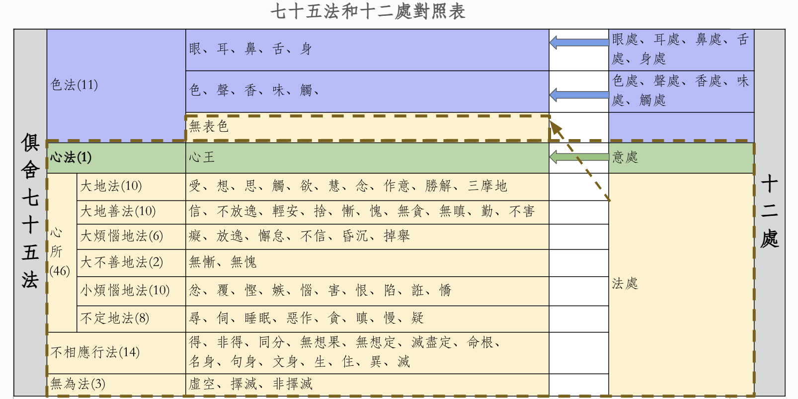

# 七十五法是前提條件

這篇文章假設你已經瞭解了什麼是七十五法，以及七十五法都有哪些分類和心所下的子分類，並且應該瞭解下這七十五法具體的內容。如果你對此不太瞭解，那麼也可以先閱讀下我之前的文章 —— [《五位七十五法（基礎部分）》](https://mp.weixin.qq.com/s/chSlBrFIIE2vLnN1Q-FoGg)

最少的要求，也應該是在看到下面這張圖後，能夠理解其中的大部分內容。

# 十二處

什麼是十二處？那就是眼處、耳處、鼻處、舌處、身處、意處、色處、聲處、香處、味處、觸處、法處。

前面五個比較簡單，它們是：眼處、耳處、鼻處、舌處、身處。分別對應我們非常熟悉的五根。
* 眼處，即眼根：視覺機制，包括眼球（器官）和視覺神經系統。 
* 耳處，即耳根：聽覺機制，包括耳朵（器官）和聽覺神經系統。
* 鼻處，即鼻根：嗅覺機制，包括鼻子（器官）和嗅覺神經系統。
* 舌處，即舌根：味覺機制，包括舌頭（器官）和味覺神經系統。
* 身處，即身根：觸覺機制，包括身體（器官）和觸覺神經系統。

和它們分別對應的也有五處，是五塵（或叫五境）：
* 色處，即色塵：眼睛可以看得見的物質。注意，色法和色塵不一樣，色法是大類，色塵是具體的一個法。看經典時，要依據上下文仔細分辨，到底是色法還是色塵。
* 聲處，即聲塵：聲音。
* 香處，即香塵：嗅覺可以聞到的氣味，包括普通情況下無色無味的東西，大概只是人聞不到，嗅覺靈敏如狗，可能就可以聞到了。古印度用“香”表示“氣味”，所以臭味也是“香”的一種。
* 味處，即味塵：有味道的東西，包括無色無味的東西。
* 觸處，即觸塵：觸覺系統所識別的對象，如柔軟，硬朗等。

稍難的地方是意處和法處。爲了更好地瞭解這個意處和法處，就可以用到七十五法了。

## 七十五法和十二處的對比

下圖就是七十五法和十二處的對比。

從圖中可以清晰地看到兩者的對比關係，以下略作說明。

* 前五處（眼處、耳處、鼻處、舌處、身處）：對應七十五法中，色法中的五根。圖中淡藍色的第一行。
* 色處、聲處、香處、味處、觸處：對應七十五法中，色法中的五塵（五境）。圖中淡藍色的第二行。
* 意處：或叫意根。對應七十五法中的心法，或說心王。圖中的淡綠色部分。
* 法處：包括的內容比較多，分別包括七十五法中的4個種類，共64個法。圖中的淡橙色部分。
  * 色法中的無表色。
  * 全部的心所法，包括所有的46心所。
  * 全部的不相應行法，包括所有的14個法。
  * 全部的無爲法，包括3個無爲法。

因爲法處包括的內容較多，不再重複了，請有興趣的朋友在這裏查看它們的解釋 —— [《五位七十五法（基礎部分）》](https://mp.weixin.qq.com/s/chSlBrFIIE2vLnN1Q-FoGg)

# 參考材料

* 《俱舍論》
* 智敏上師《俱舍論頌疏講記》
* 爲何要學習法相（俱舍、唯識）？ —— [《佛學中的理科和文科》](https://mp.weixin.qq.com/s/YZ-UaEJE9ICBnpapzVq3OQ)

