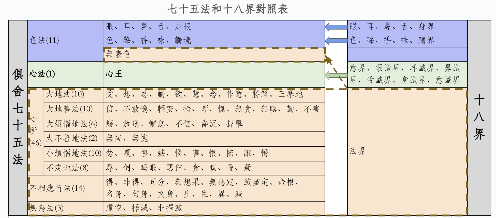

# 七十五法是前提條件

這篇文章假設你已經瞭解了什麼是七十五法，以及七十五法都有哪些分類和心所下的子分類，並且應該瞭解下這七十五法具體的內容。如果你對此不太瞭解，那麼也可以先閱讀下我之前的文章 —— [《五位七十五法（基礎部分）》](https://mp.weixin.qq.com/s/chSlBrFIIE2vLnN1Q-FoGg)

最少的要求，也應該是在看到下面這張圖後，能夠理解其中的大部分內容。

# 十八界

什麼是十八界？分別是：
* 眼界、耳界、鼻界、舌界、身界、意界
* 色界、聲界、香界、味界、觸界、法界
* 眼識界、耳識界、鼻識界、舌識界、身識界、意識界

前面五個比較簡單，它們是：眼界、耳界、鼻界、舌界、身界。分別對應我們非常熟悉的五根。
* 眼界，即眼根：視覺機制，包括眼球（器官）和視覺神經系統。 
* 耳界，即耳根：聽覺機制，包括耳朵（器官）和聽覺神經系統。
* 鼻界，即鼻根：嗅覺機制，包括鼻子（器官）和嗅覺神經系統。
* 舌界，即舌根：味覺機制，包括舌頭（器官）和味覺神經系統。
* 身界，即身根：觸覺機制，包括身體（器官）和觸覺神經系統。

和五根分別對應的也有五界，是五塵（或叫五境）：
* 色界，即色塵：眼睛可以看得見的物質。注意，色法和色塵不一樣，色法是大類，色塵是具體的一個法。看經典時，要依據上下文仔細分辨，到底是色法還是色塵。
* 聲界，即聲塵：聲音。
* 香界，即香塵：嗅覺可以聞到的氣味，包括普通情況下無色無味的東西，大概只是人聞不到，嗅覺靈敏如狗，可能就可以聞到了。古印度用“香”表示“氣味”，所以臭味也是“香”的一種。
* 味界，即味塵：有味道的東西，包括無色無味的東西。
* 觸界，即觸塵：觸覺系統所識別的對象，如柔軟，硬朗等。

五根對五塵（或五境）產生識：
* 眼識界：視覺上的認識作用（了別，下同）。
* 耳識界：聽覺上的認識作用。
* 鼻識界：嗅覺上的認識作用。
* 舌識界：味覺上的認識作用。
* 身識界：觸覺上的認識作用。

稍難的地方是意界、法界、意識界。爲了更好地瞭解這個意界、法界、意識界，可以用到七十五法。

## 七十五法和十八界的對比

下圖就是七十五法和十八界的對比。

從圖中可以清晰地看到兩者的對比關係，以下略作說明。

* 前五界（眼界、耳界、鼻界、舌界、身界）：對應七十五法中，色法中的五根。圖中淡藍色的第一行。
* 色界、聲界、香界、味界、觸界：對應七十五法中，色法中的五塵（五境）。圖中淡藍色的第二行。
* 意界：或叫意根。對應七十五法中的心法，或說心王。圖中的淡綠色部分。
* 六識界（眼識界、耳識界、鼻識界、舌識界、身識界、意識界）：也對應七十五法中的心法，或說心王。圖中的淡綠色部分。
* 法界：包括的內容比較多，分別包括七十五法中的4個種類，共64個法。圖中的淡橙色部分。
  * 色法中的無表色。
  * 全部的心所法，包括所有的46心所。
  * 全部的不相應行法，包括所有的14個法。
  * 全部的無爲法，包括3個無爲法。

因爲法界包括的內容較多，不再重複了，請有興趣的朋友在這裏查看它們的解釋 —— [《五位七十五法（基礎部分）》](https://mp.weixin.qq.com/s/chSlBrFIIE2vLnN1Q-FoGg)

## 心、意、識

前面提到，意根和六識，都是對應七十五法中的心王。心王在七十五法中反而只有一個法。而心王在十八界中，反而有7個法（意界和六識界）。

這裏的意界，也叫意根。先梳理下心、意、識的關係。從前面介紹七十五法的文章中摘錄如下：

> 在小乘（聲聞乘）裏面，以及俱舍論裏面，心、意、識三者經常可以通用、互通，因爲它們的“體”都“心”。當然，嚴格的地方，也還是會區分使用的。當區別使用的時候，就是強調了它們某個特性的意思。
> * 用“心”的時候，強調“集起”的功能，或心、意、識三者的綜合功能。
> * 用“意”的時候，強調“思量”的功能，“思”就是思考的意思，“量”就是計量、測量、打量的意思。
> * 用“識”的時候，強調“了別”的功能。

再補充下 —— 六識：即是從六根的角度把“識”再細分了一下，便形成了六識，用來區分“識”在六塵下的作用。從這裏來說，十八界在“心”上的分類，比七十五法還更細緻了。

不過，如果對應《百法》，就沒有這個問題了，因爲百法裏面，心王下面是包括八個識的。這樣十八界的六識，就可以和八識中的前六識一一對應了。

## 意界和意識界

意界，也叫意根。意根和意識界的關係是什麼呢？根據智敏上師在《俱舍論頌疏講記》的解釋說，意識是了別法塵的。包括一般所說的概念，觀念、想法，念頭等等。

意識了別之後的下一個剎那，就變成了意根。這樣意識就可以繼續了別下一個剎那的法塵了。

這和《百法》是不同的，在百法中，第七識是第六識的根。而在俱舍七十五法的介紹中，前一剎那的意識是當前意識的意根。

**如何看待兩者的不同？** —— 把這當個知識點就行，別說對於一般人了，就是阿羅漢，如果不是聽佛說法，也不會知道第七識和第八識的存在。換句話說，就是阿羅漢，如果不是聽佛說法，也無法區分第六意識的根是哪個，是第七識還是前一剎那的意識。既然如此，對於我們普通人來說，把這當個知識點記住就行。

# 參考材料

* 《俱舍論》
* 智敏上師《俱舍論頌疏講記》
* 爲何要學習法相（俱舍、唯識）？ —— [《佛學中的理科和文科》](https://mp.weixin.qq.com/s/YZ-UaEJE9ICBnpapzVq3OQ)

