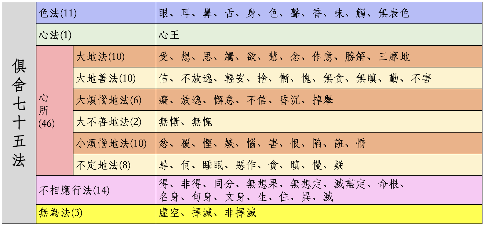
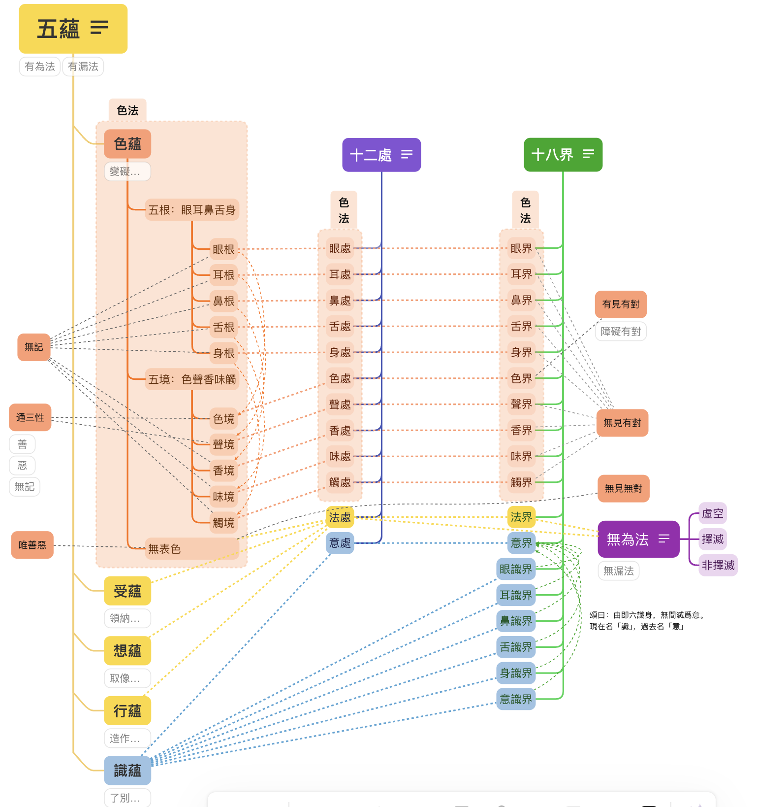

# 七十五法和基础

这篇文章假设你已经了解了什么是七十五法，以及七十五法都有哪些分类和心所下的子分类，并且应该了解下这七十五法具体的内容。如果你对此不太了解，那么也可以先阅读下我之前的文章 —— [《五位七十五法（基础部分）》](https://mp.weixin.qq.com/s/chSlBrFIIE2vLnN1Q-FoGg)

最少的要求，也应该是在看到下面这张图后，能够理解其中的大部分内容。

# 五蕴和七十五法的对照

什么是五蕴？即是色蕴、受蕴、想蕴、行蕴，识蕴。

七十五法和五蕴的对照如下图表。

如表所示：
* 五蕴中的**色蕴**，完全对照七十五法中的**色法**，包括里面的全部内容：五根、五境和无表色。
* 五蕴中的**受蕴**，仅仅对应**受心所**，属于心所法中的大地法。
* 五蕴中的**想蕴**，仅仅对应**想心所**，属于心所法中的大地法。
* 五蕴中的**行蕴**，对应了心所中的其他心所，除去受心所和想心所之外的44个心所（大地法剩下的8个，大地善法10个，大烦恼地法6个，大不善地法2个，小烦恼地法10个，不定地法8个）。以及14个不相应行法。
* 五蕴中的**识蕴**，则对应七十五法中的**心王**，心法中的心王。图中为了对照的方便，把识蕴的顺序提前到了第二位。在学习和记忆这些佛法术语的时候，是需要记住它们的顺序的。正常的顺序里面，识蕴在最后一个。

## 为什么无为法不是蕴？

七十五法中的3个无为法，没有对应的蕴，不属于五蕴的范畴。因为“蕴”都是有为法。“蕴”本身的意思就是积集，聚集的意思，可以聚少成多。而无为法如虚空，是无相的，不会增加也不会减少（不增不减），当然就无法用“聚积”来形容了。

《大毗婆沙论》中通过详细地对比蕴和无为法的区别，说明了无为法不是蕴。这些对比其实都是有为法和无为法的对比。有兴趣的朋友可以自行查看。

## 为什么五蕴是“色、受、想、行、识”这个顺序呢？

回答：它们是从粗到细逐个说的。《俱舍论颂疏讲记》中举了一个做饭的例子，原文如下：

> 色蕴如器，如世间器，饮食所依;色亦如是，受所依故。受类饮食， 如世间食，有损有益;受亦如是，乐受益人，苦受便损。想同助味，如世 盐醋，助生食味;想亦如是，起怨想时，生苦受味，起亲想时，生乐受味。 行似厨人，由行蕴中，有业烦恼，能感异熟;如世厨人，造得饮食。识喻 食者，受果报故。故随器等，立蕴次第。

在例子中，是这样比喻的：
* 色蕴 —— 厨房和厨具，没有这些，就无法做饭了。
* 受蕴 —— 食材。巧妇难为无米之炊，做饭必须要有食材。
* 想蕴 —— 调料品，如盐和醋。
* 行蕴 —— 大厨，把食材加工成饭菜。
* 识蕴 —— 食客，吃饭的人。

## 为什么把受心所、想心所列为受蕴、想蕴？

为什么在46个心所中单独把受心所、想心所列为受蕴、想蕴？而其他的44个心所都归纳在行蕴中呢？

《俱舍论颂疏讲记》中的原文解释如下：

> 即由如是诸次第因，离行别立受想二蕴。谓受与想，于诸行 中，相粗，生染，类食同助，二界中强，故别立蕴。

大意是说，在所有的行蕴当中（心所和不相应行），受和想，它们是最粗的（色蕴已经单独成立为色蕴了），而且，它们能够引生污染的心所，乐的就贪，苦的就嗔。在上面做饭的比喻中，一个是食材，一个调料品。如果没有这两个，那么只有厨房和大厨，也无法做出饭菜来给食客吃了。而二界是指色界中受蕴强烈，无色界中想蕴强烈。

因此，受和想，它们两个非常关键，因此把它们单独成立为受蕴和想蕴。

# 十二处和七十五法的对照

什么是十二处？那就是：
* 六根：眼处、耳处、鼻处、舌处、身处、意处
* 六尘：色处、声处、香处、味处、触处、法处。

下图就是七十五法和十二处的对比。

从图中可以清晰地看到两者的对比关系，以下略作说明。

* 前五处（眼处、耳处、鼻处、舌处、身处）：对应七十五法中，色法中的五根。图中淡蓝色的第一行。
* 色处、声处、香处、味处、触处：对应七十五法中，色法中的五尘（五境）。图中淡蓝色的第二行。
* 意处：或叫意根。对应七十五法中的心法，或说心王。图中的淡绿色部分。
* 法处：包括的内容比较多，分别包括七十五法中的4个种类，共64个法。图中的淡橙色部分。
  * 色法中的无表色。
  * 全部的心所法，包括所有的46心所。
  * 全部的不相应行法，包括所有的14个法。
  * 全部的无为法，包括3个无为法。

因为法处包括的内容较多，不再重复了，请有兴趣的朋友在这里查看它们的解释 —— [《五位七十五法（基础部分）》](https://mp.weixin.qq.com/s/chSlBrFIIE2vLnN1Q-FoGg)

# 十八界和七十五法的对照

什么是十八界？分别是：
* 六根：眼界、耳界、鼻界、舌界、身界、意界
* 六尘：色界、声界、香界、味界、触界、法界
* 六识：眼识界、耳识界、鼻识界、舌识界、身识界、意识界

下图就是七十五法和十八界的对比。

从图中可以清晰地看到两者的对比关系，以下略作说明。

* 前五界（眼界、耳界、鼻界、舌界、身界）：对应七十五法中，色法中的五根。图中淡蓝色的第一行。
* 色界、声界、香界、味界、触界：对应七十五法中，色法中的五尘（五境）。图中淡蓝色的第二行。
* 意界：或叫意根。对应七十五法中的心法，或说心王。图中的淡绿色部分。
* 六识界（眼识界、耳识界、鼻识界、舌识界、身识界、意识界）：也对应七十五法中的心法，或说心王。图中的淡绿色部分。
* 法界：包括的内容比较多，分别包括七十五法中的4个种类，共64个法。图中的淡橙色部分。
  * 色法中的无表色。
  * 全部的心所法，包括所有的46心所。
  * 全部的不相应行法，包括所有的14个法。
  * 全部的无为法，包括3个无为法。

因为法界包括的内容较多，不再重复了，请有兴趣的朋友在这里查看它们的解释 —— [《五位七十五法（基础部分）》](https://mp.weixin.qq.com/s/chSlBrFIIE2vLnN1Q-FoGg)

## 意界（意根）和意识界

意界，也叫意根。意根和意识界的关系是什么呢？根据智敏上师在《俱舍论颂疏讲记》的解释说，意识是了别法尘的。包括一般所说的概念，观念、想法，念头等等。

意识了别之后的下一个刹那，就变成了意根。这样意识就可以继续了别下一个刹那的法尘了。

这和《百法》是不同的，在百法中，第七识是第六识的根。而在俱舍七十五法的介绍中，前一刹那的意识是当前意识的意根。

**如何看待两者的不同？** —— 把这当个知识点就行，别说对于一般人了，就是阿罗汉，如果不是听佛说法，也不会知道第七识和第八识的存在。换句话说，就是阿罗汉，如果不是听佛说法，也无法区分第六意识的根是哪个，是第七识还是前一刹那的意识。既然如此，对于我们普通人来说，把这当个知识点记住就行。

# 心、意、识

前面提到，意根和六识，都是对应七十五法中的心王。心王在七十五法中反而只有一个法。而心王在十八界中，反而有7个法（意界和六识界）。

这里的意界，也叫意根。先梳理下心、意、识的关系。从前面介绍七十五法的文章中摘录如下：

> 在小乘（声闻乘）里面，以及俱舍论里面，心、意、识三者经常可以通用、互通，因为它们的“体”都“心”。当然，严格的地方，也还是会区分使用的。当区别使用的时候，就是强调了它们某个特性的意思。
> * 用“心”的时候，强调“集起”的功能，或心、意、识三者的综合功能。
> * 用“意”的时候，强调“思量”的功能，“思”就是思考的意思，“量”就是计量、测量、打量的意思。
> * 用“识”的时候，强调“了别”的功能。

再补充下 —— 六识：即是从六根的角度把“识”再细分了一下，便形成了六识，用来区分“识”在六尘下的作用。从这里来说，十八界在“心”上的分类，比七十五法还更细致了。

不过，如果对应《百法》，就没有这个问题了，因为百法里面，心王下面是包括八个识的。这样十八界的六识，就可以和八识中的前六识一一对应了。

# 五蕴、十二处、十八界的对照

在俱舍中，五蕴、十二处、十八界合起来也叫三科。这三者也是佛学中基础的基础，应该对它们有充分的认识才能更好地深入佛法。以下是三者的对照关系：

## 从五蕴对照十二处和十八界
* 色蕴：在五蕴中只是一个蕴，但是内涵丰富。分别对照：
  * 十二处中的十处，即是前五根和前五尘。
  * 十八界中的十界，也是前五根和前五尘。
  * 有个例外：无表色，它对照十二处中的法处，十八界中的法界。这样分类的原因是，它无见无对，无见是不可见，无对是无法感知。按照现代科学的话说，无对就是无法用仪器进行测量。
* 受蕴、想蕴、行蕴：
  * 分别对照十二处中的法处的一部分。
  * 分别对照十八界中的法界的一部分。
* 识蕴：
  * 对照十二处中的意处（也叫意根）。
  * 对照十八界中的意界（即意根）和六识。在十八界中，识的分类最细致，甚至比七十五法还细致。因为在七十五法中，也只有心王一法。

## 从十二处对照五蕴和十八界
* 前五根处 —— 眼处、耳处、鼻处、舌处、身处
  * 对应五蕴中色蕴中的一部分
  * 分别十八界中的眼界、耳界、鼻界、舌界、身界
* 前五尘处 —— 色处、声处、香处、味处、触处
  * 对应五蕴中色蕴中的一部分
  * 分别十八界中的色界、声界、香界、味界、触界
* 法处：
  * 对应五蕴中的受蕴、想蕴、行蕴和五蕴中的无表色
  * 对应十八界中的法界
* 意处（即意根）：
  * 对应五蕴中的识蕴
  * 对应十八界中的意处

## 从十八界对照五蕴和十二处
* 前五根界 —— 眼界、耳界、鼻界、舌界、身界
  * 对应五蕴中色蕴中的一部分
  * 分别十二处中的眼处、耳处、鼻处、舌处、身处
* 前五尘界 —— 色界、声界、香界、味界、触界
  * 对应五蕴中色蕴中的一部分
  * 分别十二处中的色处、声处、香处、味处、触处
* 法界：
  * 对应五蕴中的受蕴、想蕴、行蕴和五蕴中的无表色
  * 对应十二处中的法处
* 六识：
  * 对应五蕴中的识蕴
  * 对应十二界中的意处（即意根）

## 无为法

在七十五法中，无为法有三个：虚空无为，择灭无为，非择灭无为。无为法的情况在三科中有点特殊，略作补充。

* 五蕴中不包含（不摄）无为法。因为有为法才能聚集，才是蕴。无为法无形无色、无生无灭也就无法聚集了。所以，五蕴中不包含无为法。
* 十二处中的法处，十八界的中法界，除了对应五蕴中的色蕴中的无表色和受、想、行蕴之外，还包括无为法。

**参考材料**

* 《俱舍论》
* 《成唯识论》
* 智敏上师《俱舍论颂疏讲记》
* 林国良教授《成唯识论直解》
* 佛光大辞典 (慈怡法师主编) [七十五法](https://buddhaspace.org/dict/fk/data/%25E4%25B8%2583%25E5%258D%2581%25E4%25BA%2594%25E6%25B3%2595.html)
* 为什么要学习法相？—— [佛学中的理科和文科](https://mp.weixin.qq.com/s/YZ-UaEJE9ICBnpapzVq3OQ)

综上，通过使用七十五法对照五蕴、十二处、十八界，以及五蕴、十二处、十八界的相互对照，希望以此可以帮助我们更好地理解这些佛学中的基础概念。

阿弥陀佛。 
愚夫合十。

