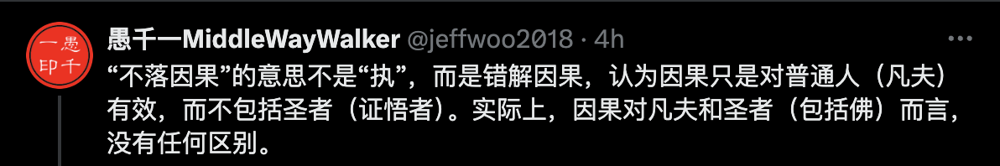
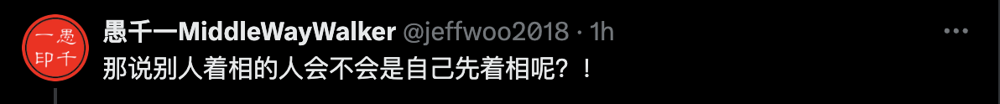

## 前言

佛教里面有个“怪事”，那就是经常会有人批评他人说 —— 你着相了。当他们这样说的时候，似乎他们比被批评者更胜一筹，更懂佛法，修行更高一样。

我初学佛时，经常听到、看到这类的言论。那时，我甚至会反问我自己，我真的是着相了吗？佛教不应该明辨是非、明辨善恶吗？明辨是非就是着相了吗？不着相的人就不辨是非、对错了吗？—— 那时的我虽然觉得隐隐不对，却也无法反驳，更说不出来个所以然来。

再到后来，随着系统性地学习佛法以后，尤其是在看到佛法的层次后，才恍然大悟。原来那些批评过我 —— 着相 —— 的人，他们自己也未必是真的懂，不过是人云亦云，自以为“不着相”比“明辨是非、对错”更高级而已。

## 我又被批评是着相了

举例来说，有推友在推特上发表自己对“不昧因果”和“不落因果”的解读，她认为“不落因果”是“执着因果”。我觉得她的解读不正确。于是，我就回复了她并附上了我自己的解读，我的解读如下：

> “不落因果”的意思不是“执”，而是错解因果，认为因果只是对普通人（凡夫）有效，而不包括圣者（证悟者）。实际上，因果对凡夫和圣者（包括佛）而言，没有任何区别。

结果却有人回应我说：“这位愚千老师着相了…也是执啊”。

这就是一个典型的不懂“着相”，却自以为是懂得“着相”，并且认为“着相”比“明辨法义”更加高级的，于是就因此回应我了。换做以前，我肯定又该反省自己去了。不过，好在我有继续学习，没有停留在过去。于是，我毫不客气地回复说：“那说别人着相的人会不会是自己先着相呢？！”。

很显然，他无法回复我了。如果他承认自己着相（批判我着相也是二元对立，也是一种相），那他批判我着相的同时自己也着相了，半斤八两。如果他不承认自己着相了，可是他明明刚才就批判我着相了。这就是他自己的“逻辑漏洞”。无论怎么回复，都会落入下风。于是他不敢直面回答，只好顾左右而言他了。最后他说：“嗯嗯，有道理，阁下什么都是对的”。

即便如此，我也没有“放过他”，而是乘胜追击，又补了一刀。说到：“啥？还有对错？”。

这件事的起因，就在于他随意批判我“着相”在先。批判我有对有错，而有对有错就是“着相”。结果到头来，他自己还在“对错”里面打滚，还在“对错的相”中。这就是错上加错了。

如果以佛教辩论的方式来说，这就是他“输”了，还“输”了两次。前面不敢正面回应算“输”一次。后面自己又掉入“对错的相”中，这是“输”了第二次。如果是有自知之明的人，应该主动承认错误。并认真交流“着相”的真正含义。这样反而不会“输”，反而可能正确地理解“着相”。

不过呢，我也没“赢”，毕竟现在网上的交流都不是什么真正的辩论。如果下次他不再轻易说人“着相”了，或者深入佛学，了解下“着相”的真正含义，那也算是有意义的对话了。

那么，“着相”是什么意思呢？

## 什么是着相？

着相的意思就是“执着”。而“执着”又可以分层这样几种情况：
1. 世俗上的执着。
2. 佛法上的执着。
  * 我执。
  * 法执。

详细的解释请参考我之前的文章 —— [【原创】什么是执着？\| 一文说清楚佛教的执着是什么 \| 我执和法执](https://mp.weixin.qq.com/s/i7iPKIWTZ_BN_QkJlQjJTA)

## 明辨是非、对错不是着相 —— 那什么是着相？

如果明辨是非、对错就是着相，那谁是最着相的人呢？ —— 那一定是释迦牟尼佛了，因为他宣说了十善业和十恶业，还制定了戒律，告诉他人什么该做，什么不该做。那么释迦牟尼佛是最着相的人吗？—— 很显然不是。那么，明辨是非、对错和着相是什么关系呢？分两个层次：

1. 世俗谛：世俗谛中就是有二元对立的，有对有错，有是非，有高矮，有美丑。这些我们不仅要学习明辨他们，还要认真地学习他们。为什么呢？因为这是基础，不仅世间人如此，不仅修行人如此，举例来说，什么是善恶，什么是对错。普通人以“不犯法”为底线，以遵守“道德”为正人君子。而修行人以遵守更加严格的“戒律”为修行。这些，都是要以知晓和理解法律、道德和戒律为前提，才能做好一个普通人、君子、修行人。

2. 胜义谛：当把世俗谛这一层学习后，才来学习胜义谛。什么是胜义谛呢？（胜义谛的解读很多，这里只说相关的解读。）在胜义谛中，总结来说，就是“无我”和“无相”：
  * 无我：不认为有一个固定、永恒不变的“我”在持戒，在行善。没有一个绝对错误、一直错误、永远错误的“别人”，更没有一个绝对正确、一直正确、永恒正确的“我”。无论是“别人”还是“我”，也都不是固定的、永恒不变的。那“我”是什么呢？不过是“五蕴”而已。五蕴的因缘和合，才有了当下的你、我、他。
  * 无相：任何外相、相貌、相状也都是因缘和合的。而且“相状”比“我”还简单，只是五蕴之一的“色蕴”（现代所说的物质）而已。所以，万事万物并没有一个固定的、恒定不变的“相”。比如说，以“偷盗”的相状举例，它可能只是电影、电视中的表演，并非是真的偷盗行为。

所以，明辨是非、对错并不是着相。但如果认为有一个固定的、不变的“我”在明辨是非，那就是着相了。或者，认为有一个永恒的、固定的“相状”就是某行为，那也是“着相”了，反之，不认为有一个固定的、不变的“我”，不认为有一个固定的、不变的“相状”，那就不是着相了。

不仅不是着相，还是个明白人，明眼人呢。那我们应该多多交流才对了。最后，我要感谢这位网友，才让我有了这篇文章。

亲爱的读者朋友们，如果你们再遇到过这样的批评时，就不必再纠结、挂碍和内耗自己了。只要你能够正确地理解什么是着相什么不是，那么他人随意的批评就对你毫无意义了。反过来说，随意批评你的人，他才可能是真的着相呢。你可以试着自己回应他，或直接把这篇文章转发给他吧。

阿弥陀佛。 
愚千一。

