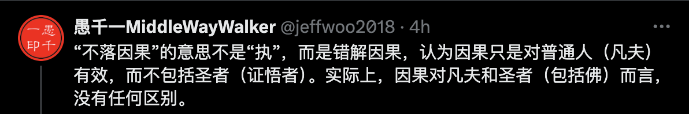
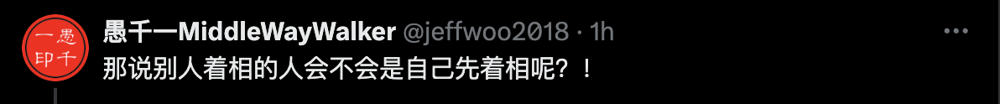
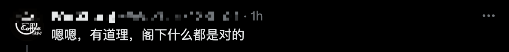

## 前言

佛教裏面有個“怪事”，那就是經常會有人批評他人說 —— 你着相了。當他們這樣說的時候，似乎他們比被批評者更勝一籌，更懂佛法，修行更高一樣。

我初學佛時，經常聽到、看到這類的言論。那時，我甚至會反問我自己，我真的是着相了嗎？佛教不應該明辨是非、明辨善惡嗎？明辨是非就是着相了嗎？不着相的人就不辨是非、對錯了嗎？—— 那時的我雖然覺得隱隱不對，卻也無法反駁，更說不出來個所以然來。

再到後來，隨着系統性地學習佛法以後，尤其是在看到佛法的層次後，才恍然大悟。原來那些批評過我 —— 着相 —— 的人，他們自己也未必是真的懂，不過是人云亦云，自以爲“不着相”比“明辨是非、對錯”更高級而已。

## 我又被批評是着相了

舉例來說，有推友在推特上發表自己對“不昧因果”和“不落因果”的解讀，她認爲“不落因果”是“執着因果”。我覺得她的解讀不正確。於是，我就回復了她並附上了我自己的解讀，我的解讀如下：

> “不落因果”的意思不是“執”，而是錯解因果，認爲因果只是對普通人（凡夫）有效，而不包括聖者（證悟者）。實際上，因果對凡夫和聖者（包括佛）而言，沒有任何區別。

結果卻有人回應我說：“這位愚千老師着相了…也是執啊”。

這就是一個典型的不懂“着相”，卻自以爲是懂得“着相”，並且認爲“着相”比“明辨法義”更加高級的，於是就因此回應我了。換做以前，我肯定又該反省自己去了。不過，好在我有繼續學習，沒有停留在過去。於是，我毫不客氣地回覆說：“那說別人着相的人會不會是自己先着相呢？！”。

很顯然，他無法回覆我了。如果他承認自己着相（批判我着相也是二元對立，也是一種相），那他批判我着相的同時自己也着相了，半斤八兩。如果他不承認自己着相了，可是他明明剛纔就批判我着相了。這就是他自己的“邏輯漏洞”。無論怎麼回覆，都會落入下風。於是他不敢直面回答，只好顧左右而言他了。最後他說：“嗯嗯，有道理，閣下什麼都是對的”。

即便如此，我也沒有“放過他”，而是乘勝追擊，又補了一刀。說到：“啥？還有對錯？”。

這件事的起因，就在於他隨意批判我“着相”在先。批判我有對有錯，而有對有錯就是“着相”。結果到頭來，他自己還在“對錯”裏面打滾，還在“對錯的相”中。這就是錯上加錯了。

如果以佛教辯論的方式來說，這就是他“輸”了，還“輸”了兩次。前面不敢正面回應算“輸”一次。後面自己又掉入“對錯的相”中，這是“輸”了第二次。如果是有自知之明的人，應該主動承認錯誤。並認真交流“着相”的真正含義。這樣反而不會“輸”，反而可能正確地理解“着相”。

不過呢，我也沒“贏”，畢竟現在網上的交流都不是什麼真正的辯論。如果下次他不再輕易說人“着相”了，或者深入佛學，瞭解下“着相”的真正含義，那也算是有意義的對話了。

那麼，“着相”是什麼意思呢？

## 什麼是着相？

着相的意思就是“執着”。而“執着”又可以分層這樣幾種情況：
1. 世俗上的執着。
2. 佛法上的執着。
  * 我執。
  * 法執。

詳細的解釋請參考我之前的文章 —— [【原創】什麼是執着？\| 一文說清楚佛教的執着是什麼 \| 我執和法執](https://mp.weixin.qq.com/s/i7iPKIWTZ_BN_QkJlQjJTA)

## 明辨是非、對錯不是着相 —— 那什麼是着相？

如果明辨是非、對錯就是着相，那誰是最着相的人呢？ —— 那一定是釋迦牟尼佛了，因爲他宣說了十善業和十惡業，還制定了戒律，告訴他人什麼該做，什麼不該做。那麼釋迦牟尼佛是最着相的人嗎？—— 很顯然不是。那麼，明辨是非、對錯和着相是什麼關係呢？分兩個層次：

1. 世俗諦：世俗諦中就是有二元對立的，有對有錯，有是非，有高矮，有美醜。這些我們不僅要學習明辨他們，還要認真地學習他們。爲什麼呢？因爲這是基礎，不僅世間人如此，不僅修行人如此，舉例來說，什麼是善惡，什麼是對錯。普通人以“不犯法”爲底線，以遵守“道德”爲正人君子。而修行人以遵守更加嚴格的“戒律”爲修行。這些，都是要以知曉和理解法律、道德和戒律爲前提，才能做好一個普通人、君子、修行人。

2. 勝義諦：當把世俗諦這一層學習後，纔來學習勝義諦。什麼是勝義諦呢？（勝義諦的解讀很多，這裏只說相關的解讀。）在勝義諦中，總結來說，就是“無我”和“無相”：
  * 無我：不認爲有一個固定、永恆不變的“我”在持戒，在行善。沒有一個絕對錯誤、一直錯誤、永遠錯誤的“別人”，更沒有一個絕對正確、一直正確、永恆正確的“我”。無論是“別人”還是“我”，也都不是固定的、永恆不變的。那“我”是什麼呢？不過是“五蘊”而已。五蘊的因緣和合，纔有了當下的你、我、他。
  * 無相：任何外相、相貌、相狀也都是因緣和合的。而且“相狀”比“我”還簡單，只是五蘊之一的“色蘊”（現代所說的物質）而已。所以，萬事萬物並沒有一個固定的、恆定不變的“相”。比如說，以“偷盜”的相狀舉例，它可能只是電影、電視中的表演，並非是真的偷盜行爲。

所以，明辨是非、對錯並不是着相。但如果認爲有一個固定的、不變的“我”在明辨是非，那就是着相了。或者，認爲有一個永恆的、固定的“相狀”就是某行爲，那也是“着相”了，反之，不認爲有一個固定的、不變的“我”，不認爲有一個固定的、不變的“相狀”，那就不是着相了。

不僅不是着相，還是個明白人，明眼人呢。那我們應該多多交流纔對了。最後，我要感謝這位網友，才讓我有了這篇文章。

親愛的讀者朋友們，如果你們再遇到過這樣的批評時，就不必再糾結、掛礙和內耗自己了。只要你能夠正確地理解什麼是着相什麼不是，那麼他人隨意的批評就對你毫無意義了。反過來說，隨意批評你的人，他纔可能是真的着相呢。你可以試着自己回應他，或直接把這篇文章轉發給他吧。

阿彌陀佛。 
愚千一。

