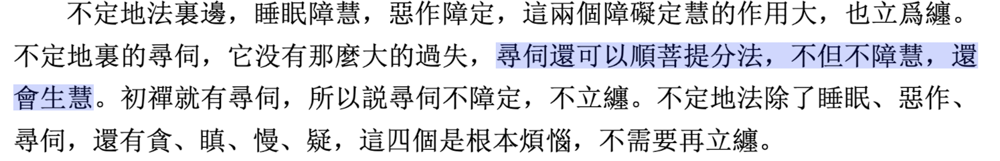

我在读智敏上师的《俱舍论颂疏讲解》时，读到了这句话 —— 

> 尋伺還可以順菩提分法，不但不障慧，還會生慧。

突然非常难过。我参加过多次禅修，也听到多次关于禅修的说法，其中对于“寻”，“伺”的呵责，无异于“剧毒猛兽”。为什么我会难过呢？先简单说下什么是寻伺。

* 寻：粗想 —— 寻求，寻找，寻察。
* 伺：细想 —— 伺察，伺机而动的伺。

通常用一个比喻来形容和区分两者：比如猫爪老鼠，一开始，猫不知道老鼠在哪里，这里找找，那里找找 —— 这是寻。最后发现老鼠躲在一个小洞里面，洞太小，猫进不去，于是猫守在洞口 —— 这是伺。等老鼠出洞，一旦出洞，必定被猫抓住。

用现在的话说，寻伺就是思考，寻：是不确定目标，或不确定方法，在发散性地思考。伺：当有确定性的目标或方法后，仔细地思考下具体的细节。

最重要的是，思考本身是中性的，不是善，也不是恶。当然，思考的内容可以是善的，是恶的，是不善不恶（无记）的。

然而，在很多人的说法中，都把这种寻伺（或思考能力）描述成完全负面的东西，犹如剧毒猛兽，一点也不能留下。这实际上就是对概念的胡乱解释了。

上面的《俱舍论颂疏讲解》却说，“寻伺可以顺菩提分法，不但不障慧，还会生慧”—— 意思是说，寻伺（思考能力），可以帮助我们解脱，和解脱法相应，不但不会障碍智慧，还能够产生智慧 —— 这是多么地“打脸”前者啊。

于是我在想，佛教中的各种误解，到底从何而来？

第一，佛教外部，即普通人的误解，比如把《西游记》当佛法的，或者把民间传说当佛法的，比如《济公传》，或者把神话当佛法的。

第二，佛教内部，即使是佛教内部，很多人的说法都非常不严格，不严谨，不依据经典，尤其是那些思辨性、逻辑性强的经典。只顾着如何“用欲勾牵”，却忘记了如何入“佛道”了，甚至于，把根本的、核心的、佛教独具的理论都忽略了，这才是我突然难过的原因了。

想要改变这样的情况，只有一条出路，那就是回归经典，教义，尤其是这种注重思辨，层次性的宗派，如俱舍，唯识等。夯实基础，才有可能触碰到佛法中的内涵。即是“自皈依法，当愿众生，深入经藏，智慧如海”。

圣严法师是我学佛的榜样之一，他说：佛法那么好，知道的人那么少，误解却那么多。我写文章的目的之一，也是想要排解各种误解。可是他老人家更慈悲，没有明说误解从何而来。就当我年轻气盛，初生牛犊不怕虎吧，直面问题，才可能改善问题。（写这篇文章的时候，的确是有点嗔心了）

阿弥陀佛。 
愚千一。

写于G1403高铁上。

