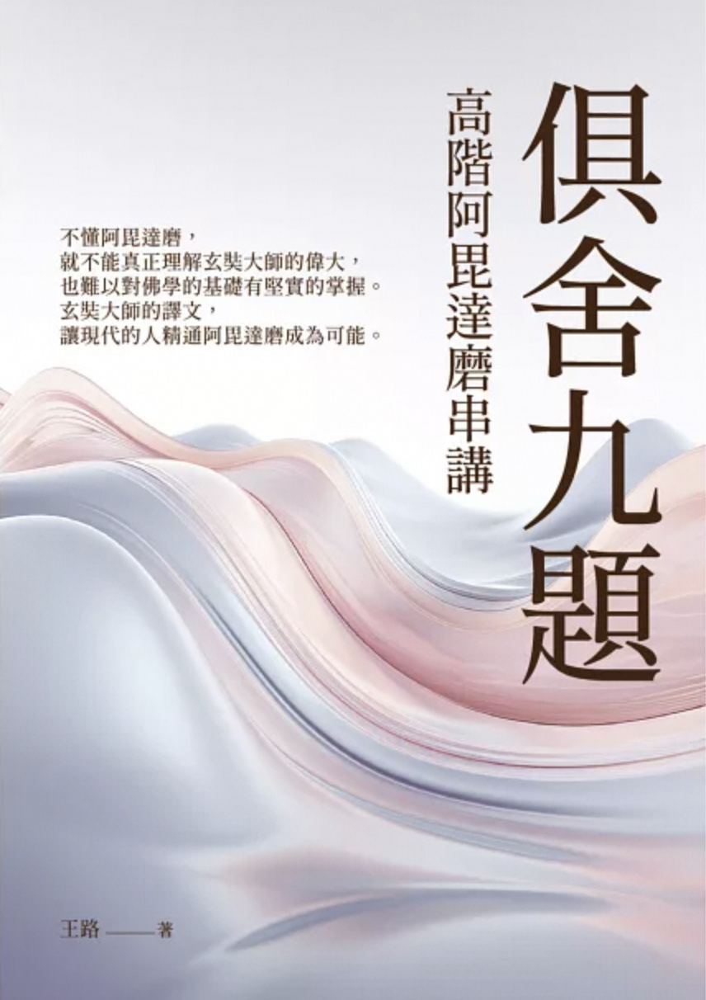

## 和王路老师的见面

趁着在北京出差的机会，有幸和王路老师见了一面。这算是我出差私事中，重要的三件事情之一。其他两件事是回老家看望父母，以及看张学友的60+巡回演唱会，这也是我人生中第一次看演唱会。

张学友真的是一位德艺双馨的老艺人，唱歌方面不用说，被称之为歌神。做人方面也是我的榜样，在演唱会上，他特意向观众一一介绍所有的参演者，包括乐队和配舞。其中有一位最小的乐手是2002年的，才22岁，张学友依然称呼他老师。在演唱会结束的时候，有观众拍到他和配舞的演员一一碰拳，以示圆满和感谢，并且最后向他们深鞠一躬。张学友的歌唱得好是众所周知的，亲见他的为人的机会却不多。非常有幸得以目睹一次老艺人的风采。

王路老师给我的印象也是如此。对于我来说，能够把俱舍研究得透彻的人，无疑是非常值得我敬重的。怀着这份敬重之心，我还是非常期待可以见上王路老师的。因为出差的各种安排非常多，又经常出现变故。再加上和王路老师的交流也不多，仅限于几个问题而已。对于能否约见到王路老师，我并无把握。但在那个周日早上，对于突然出现的空挡，我还是冒昧地跟王路老师发出了邀约，出乎意外的是，王路老师几乎是秒回并同意。

见面的过程非常顺利，王路老师在他的文章中也有简略地提及。见面给我有一种即熟悉又陌生的感觉。熟悉的是，我对于王路老师也是有一点了解的，看过他的一些文章和视频，很多事情他都有提过了。陌生的地方是，我们在生活中毫无交集，也没见过，第一次见面时还是略显局促。为了避免这种尴尬，对于王路老师的问题，我也是有问必答，甚至为了避免冷场，也有尽量地多说一些。告别后，我才想起来忘记拍个合照，又打车折回了。王路老师也没有嫌弃我多事，很大方地接受了我的请求，在没人帮忙的情况下，我们两拍了一个大头合照。

总结来说，王路老师是非常平易近人的，毫无学究气，也没有任何架子。正如他文章中提及的那样，这种基于共同兴趣的见面，甚至比一些常见的地缘、亲缘关系还要友好和有益，更何况是基于圣教中的最最重要的阿毗达摩了。

(王路老师的赠书和亲笔签名)

## 请教王路老师的几个问题

因为有佛教群的群友好奇我们聊了什么，以及我请教了王路老师哪些问题，我觉得有记录下来的必要，顺便分享下，或许也可以帮助更多的朋友。以下是部分问答。（如果有记忆错误的部分，还请王路老师帮忙纠正下，括号中的部分是我的备注）。

**问题一：为何《俱舍论颂疏讲记》中用的圆晖法师的疏，而不是《俱舍论》的长行？**

因为《疏》比《论》更简单，《论》中包括的知识点和信息量更多，更深。《疏》更适合入门的同学。

**问题二：有部的理论有瑕疵，所以部分解释搞得更复杂了？**

（问题解释：因为说一切有部的宗旨是一切事物都是有体的，而且是“三世实有”，基于这个宗旨，后面的一些解释反而搞得更复杂了。如果不认为“三世一切有”，而是像经部或唯识那样，只承认现在是“有体”，而过去、未来“没有体”，那么一些解释反而可以更加简洁。）

是这样的的。

**问题三：您如何看待佛经的结集问题？**

主要是赞同学界的意见，结集是一个长期的过程，而不是一次成形的。在结集的过程中会有增、删、改。现今看到的佛经，就是一个多次结集（增、删、改）后的结果。不管怎么结集，最终都是为了体现佛陀的精神（注：解脱和菩提）。

**问题四：菩萨法不是阿毗达摩吗？**

菩萨道是阿毗达磨，我的意思是，在阿毗达磨中，菩萨道和独觉道不是所归依的对象。阿毗达磨不讲菩萨的52位，因为阿毗达磨里的菩萨就是指成道之前的佛陀。（备注：这个菩萨道是有部的菩萨道，不包括大乘菩萨道）大乘的菩萨在有部中有渊源。

**问题五：您如何看待如来藏？**

（在大乘三种思想体系中）倾向于唯识和中观。（它们在逻辑思辨性更强。）

## 王路老师的《俱舍九题：高阶阿毘达磨》在台湾出版了，可以下单哦

虽然他的《俱舍九题》有事先发在他的公众号上，我也有读一部分（大概1/3-1/2），但是因为我没有仔细学过俱舍，这导致有些基础的分类和逻辑不太了解，于是我打算读完《俱舍论颂疏讲记》后，再来重读这本《俱舍九题》。

如果各位的俱舍基础不错，也可以直接读读看。如果读了觉得艰难，也不要放弃，不妨回到基础部分，学完以后再来读。

下单地址：https://www.books.com.tw/products/0010993632

（备注，无库存也可以下单订购，只是等待时间略长。）

（《俱舍九题：高阶阿毘达磨》封面）

阿弥陀佛。 
愚千一。 

