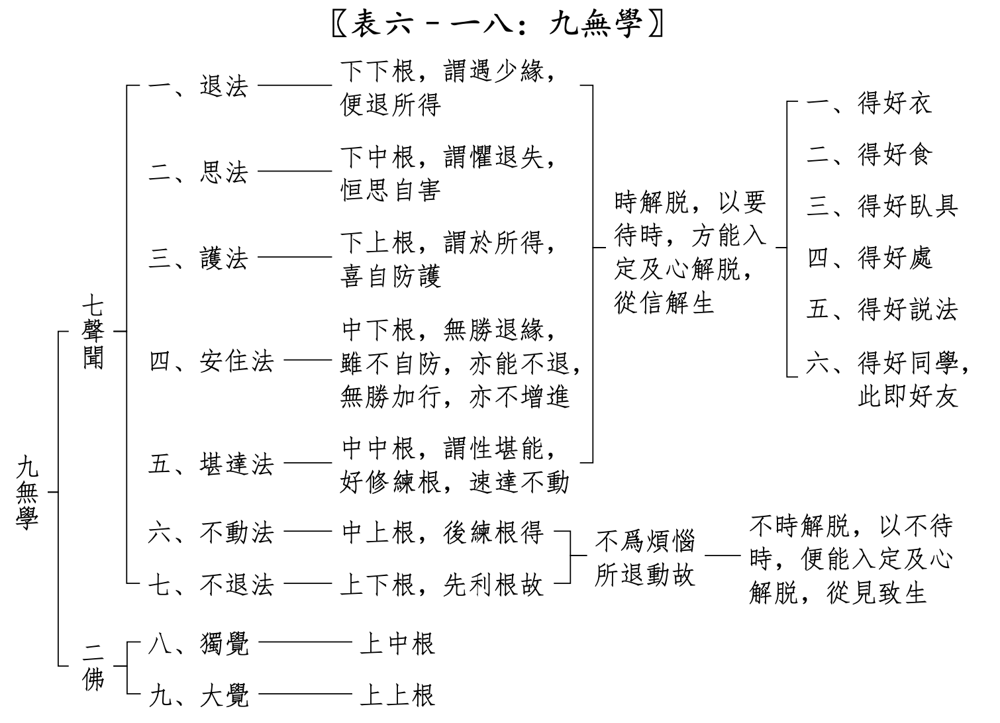

## 利根和钝根的故事

说到利根，总会提起禅宗六祖慧能大师。因为慧能大师在出家前，大字不识一个，却可以在听到他人诵《金刚经》的“应无所住而生其心”时，突然有所“悟”。然后决定出家求道，遇到五祖询问来意时，直接了当地要“作佛”，后来便成为了禅宗六祖。

那钝根是什么样子的呢？可能也有一个例子，那就是周利槃陀伽的故事了。在故事中，周利槃陀伽极其愚笨，连一首完整的偈语都记不住，记住了前面忘记了后面，记住了后面忘记了前面。后来佛陀只教他念六个字：“我拂尘、我除垢”，结果连这也记不住。后来佛陀再教他去清理其他僧众的鞋子，这才让他得以清除业障，然后他才能记住上面这六个字，深思它的含义后，证悟成阿罗汉了。（完整故事请参考《根本说一切有部毘奈耶》卷31。）

两个故事的开头可谓是天壤之别，一个是最利根的例子，一句话就有所悟，并成为禅宗六祖。另一个是“最钝根”的例子（其实是业障的关系），一句偈语都记不住，最终却因为佛陀的善巧方便，以及他的依教奉行，最终成为了阿罗汉。所以，无论是利根还是钝根，只要遇到善知识，并通过自身的努力，最终都会证悟成就的。

但是，利根和钝根的核心区别到底是什么呢？

## 随法行和随信行

> 释曰：名随信法行，由根钝利别者，见道位中，圣者有二：一随信行，二随法行。由根钝利，立此二名。若钝根者，名随信行，彼于先时，随信他言，而行义故。若利根者，名随法行，彼于先时，由自披阅契经等法，随行义故。（《俱舍论颂疏》）

这里是说，在见道位中，有两种圣者，一是随信行，二是随法行。这两种圣者就是从根上立名的。钝根的人，叫做随信行。利根的人，叫做随法行。后面有简单的解释。在《大毗婆沙论》中的解释更为详细，补充如下。

## 什么是随信行？

> 问：何故名随信行？答：由彼依信随信行故，名随信行。谓依有漏信随无漏信行，依有缚信随解脱信行，依有系信随离系信行，由信为先得入圣道。如是种类补特伽罗从本以来性多信故，若闻他劝汝应务农以自存活，彼不思察，我为应作为不应作，我为能作为不能作，为有宜便为无宜便，闻已便作。或闻他劝汝应商贾，或应事王，或应习学书算印等种种伎艺以自存活，亦不思察，广说乃至闻已便作。或闻他劝汝应出家，亦不思察，为应出家不应出家，为能出家不能出家，为能持戒不能持戒，为有宜便为无宜便，闻他劝已即便出家。既出家已，若闻他劝汝应诵习，彼不思察，为应诵习不应诵习，为能诵习不能诵习，为有宜便为无宜便，为素怛缆，为毗柰耶，为阿毗达磨，闻他劝已即便诵习。或闻他劝营理僧事，亦不思察，我为应作为不应作，我为能作为不能作，为有宜便为无宜便，闻已便作。或闻他劝住阿练若，亦不思察，我为应住为不应住，我为能住为不能住，为有宜便为无宜便，闻已便住。彼渐次修圣道加行，展转引起世第一法，无间引生苦法智忍，从此见道十五刹那名随信行。(《大毗婆沙论》卷五四)

什么是随信行呢？简单来说，就是非常听信别人的话，听别人的劝，别人说好，他就信了，然后就去做了，自己不会思考（思察），不会去判断该做不该做，是否适合自己。（部分白话解释。）

## 什么是随法行？

> 问：何故名随法行？答：由彼依法随法行故，名随法行。谓依有漏法随无漏法行，依有缚法随解脱法行，依有系法随离系法行，由慧为先得入圣道。如是种类补特伽罗从本以来性多慧故，若闻他劝汝应务农以自存活，彼便思察，我为应作为不应作，我为能作为不能作，为有宜便为无宜便，审思察已然后作之，余广如前随信行说。彼渐次修圣道加行，展转引起世第一法，无间引生苦法智忍，从此见道十五刹那名随法行。 (《大毗婆沙论》卷五四)

什么是随法行呢？简单来说，就是人比较聪明，有思考能力，能够自己判断，什么是该做什么不该做，什么适合什么不合适。（部分白话解释。）

## 利根和钝根在时间上的区别

最大的区别是什么，我觉得可能是时间 —— “声闻极速三生，极迟六十劫”。意思是说，以证阿罗汉来说，最快的话是三生，最慢的话，是六十劫。这里是虽然没说是小劫还是大劫，就算是以小劫来说，1680万年，60小劫也是10亿年了。想想这是多少生了，就是以劫数的平均寿命42000岁来说(依据佛教理论，人寿最高 84000岁，最低10岁)，那也是6000生了。这还是以小劫来说的，如果是以大劫来说，那么还要乘以80，那就是48000生了。

所以，利根和钝根在阿罗汉的时间区别，至少是2000倍，当然，也可能是16000倍。

## 只“随信行”的风险

为何会有这么大的区别？虽然经典里面没有明说，但是不难推测出来。最重要的是，没有独立思考能力，别人说什么就信什么。这种有点“盲从”的“信”就很有风险了。比如说：

别人说一神教很好，应该信仰那些一神教。 
于是就信了，也学习他们了。这样的结果对于佛教来说，就很糟糕了，甚至可能是南辕北辙的。

别人说修苦行很好，比如把一只手举起来，一辈子不放下。 
于是就跟着做了，把手举了一辈子。

别人说某“大师”很厉害，有神通，是“佛菩萨”再来人。 
于是就跟着这位“大师”了，成为了这位“大师”的弟子。当别人揭露他是假大师的时候，非但不醒悟，还去维护这位假大师。这样的事例在当今社会也太常见了。

所有的这些都是“盲信”的结果，因为缺乏独立的思考能力，判断能力，别人说什么就信什么，别人劝做什么就做什么。这样的“道路”，必定是非常曲折的，必定会走很多弯路，最终能否到达目的都很难说，就算可以到达目的，那时间上来说，也要多出几千倍的。

除了时间上的巨大差异外，还要多吃更多的“苦”。就像上面那些无意义的“苦行”一样，所吃的苦没有意义。不仅不能帮助解脱。反而会因此更加沉迷于这些“苦行”。

## 狭义和广义，以及实际情况

依据《俱舍论颂疏讲记》来说，随信行和随法行是在见道位上的圣者的两种类别，意思是说，没到见道位的时候，是不能称呼一个凡夫是随信行或者是随法行的，这是依据严格的定义来说的。也可以算是狭义上的随信行和随法行吧。

广义上来说，就是把适用范围扩大。不仅这里介绍的两个概念如此，其实佛教里面很多概念也是如此的。从原本的狭义定义、严格定义演变成了广义的、宽松上的定义的。比如学佛中的“学”字，严格的“有学”定义也是指见道位后的圣人，“无学”是指证阿罗汉或成佛的圣人。凡夫只能称呼为“非有学非无学”。但是后来的“学”字也变成了广义的了，跟上学一样，只要是在学习佛法，都称呼为“学佛”的人了。

随信行和随法行在广义上也是如此。虽然我们都是凡夫，但是我们依然可以自我审视一下，看看自己的学佛是随信行多，还是随法行多。客观来说，很难说一个人是完全的随信行，因为他多多少少也会有自己的思考，只是思考程度的深浅问题。同样地，随法行里面，也有随信行的成分，因为在证悟之前，只能依靠佛和佛经来学习（先排除缘觉和成佛的情况而言）。

因此，随法行和随信行并不是二选一，并不是排斥性的。看到了随法行的好处后（时间短，吃苦少等），我们应该多多提高“随法行”的成分，多多思考，谨慎选择，这样必定可以缩短最终所需要的时间，并可以更早地见道而证悟了。相信学佛的人，都想要早点证悟吧。

## 《俱舍论颂疏讲记》中的利根和钝根对比汇总（简略版本）

| | 利根 | 钝根 | 说明 |
| -- | ---- | ---- |-------- |
| 1 | 随法行  | 随信行 | 见道位上的名字差别 |
| 2 | 见至  | 信解 | 修道位上的名字差别 | 
| 3 | 不时解脱 | 时解脱 | 时解脱表示需要满足6个条件时才能解脱 |
| 4 | 不动 | 退法、思法、护法、安住、堪达 | 阿罗汉位上的名字差别 | 
| 5 | 不退 | 退法：证阿罗汉后有退 | 虽然会退，但会在此生一定会再次证阿罗汉 |
| 6 | 尽智、无生智 | 只有尽智，没有无生智 | 证阿罗汉后 |
| 7 | 俱解脱 | 慧解脱 | 区别：是否有灭尽定，有就是俱，没有就是慧。|
| 8 | 灭尽定 | 无灭尽定，有定障 | “要修灭尽定的，起码是三果” | 
| 9 | 三明六通 | 只有漏尽通，其他不一定有 |
| 10 | 无 | 可以修成利根（练根、转根） | |
| 11 | 修超等至 | 无 | “要修超等至的， 起码是四果、利根” |
| 12 | 最快三生 | 最慢60劫 | 证阿罗汉的时间长度 |

时解脱的六个条件： 
一、得好衣，二、得好食，三、 得好卧具，四、得好处，五、得好说法，六、得好同学也。

阿弥陀佛。 
愚千一。 

