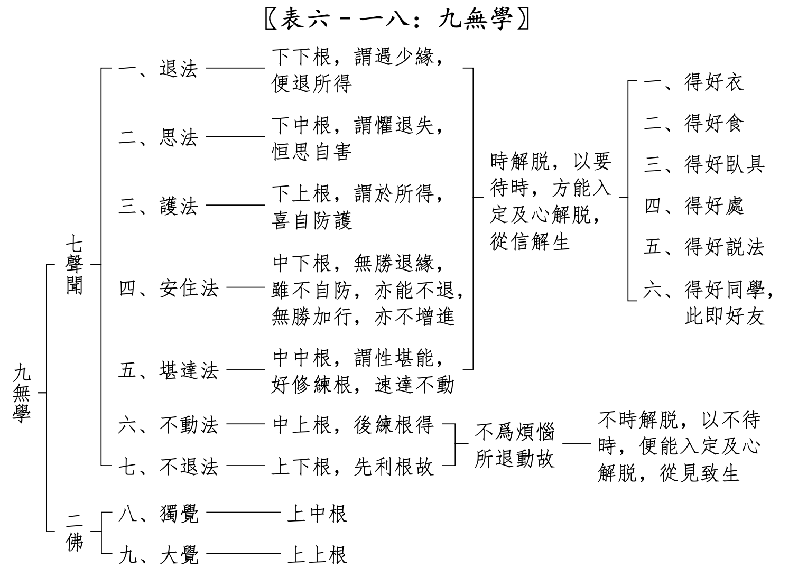

## 利根和鈍根的故事

說到利根，總會提起禪宗六祖慧能大師。因爲慧能大師在出家前，大字不識一個，卻可以在聽到他人誦《金剛經》的“應無所住而生其心”時，突然有所“悟”。然後決定出家求道，遇到五祖詢問來意時，直接了當地要“作佛”，後來便成爲了禪宗六祖。

那鈍根是什麼樣子的呢？可能也有一個例子，那就是周利槃陀伽的故事了。在故事中，周利槃陀伽極其愚笨，連一首完整的偈語都記不住，記住了前面忘記了後面，記住了後面忘記了前面。後來佛陀只教他念六個字：“我拂塵、我除垢”，結果連這也記不住。後來佛陀再教他去清理其他僧衆的鞋子，這才讓他得以清除業障，然後他才能記住上面這六個字，深思它的含義後，證悟成阿羅漢了。（完整故事請參考《根本說一切有部毘奈耶》卷31。）

兩個故事的開頭可謂是天壤之別，一個是最利根的例子，一句話就有所悟，併成爲禪宗六祖。另一個是“最鈍根”的例子（其實是業障的關係），一句偈語都記不住，最終卻因爲佛陀的善巧方便，以及他的依教奉行，最終成爲了阿羅漢。所以，無論是利根還是鈍根，只要遇到善知識，並通過自身的努力，最終都會證悟成就的。

但是，利根和鈍根的核心區別到底是什麼呢？

## 隨法行和隨信行

> 釋曰：名隨信法行，由根鈍利別者，見道位中，聖者有二：一隨信行，二隨法行。由根鈍利，立此二名。若鈍根者，名隨信行，彼於先時，隨信他言，而行義故。若利根者，名隨法行，彼於先時，由自披閱契經等法，隨行義故。（《俱舍論頌疏》）

這裏是說，在見道位中，有兩種聖者，一是隨信行，二是隨法行。這兩種聖者就是從根上立名的。鈍根的人，叫做隨信行。利根的人，叫做隨法行。後面有簡單的解釋。在《大毗婆沙論》中的解釋更爲詳細，補充如下。

## 什麼是隨信行？

> 問：何故名隨信行？答：由彼依信隨信行故，名隨信行。謂依有漏信隨無漏信行，依有縛信隨解脫信行，依有系信隨離系信行，由信爲先得入聖道。如是種類補特伽羅從本以來性多信故，若聞他勸汝應務農以自存活，彼不思察，我爲應作爲不應作，我爲能作爲不能作，爲有宜便爲無宜便，聞已便作。或聞他勸汝應商賈，或應事王，或應習學書算印等種種伎藝以自存活，亦不思察，廣說乃至聞已便作。或聞他勸汝應出家，亦不思察，爲應出家不應出家，爲能出家不能出家，爲能持戒不能持戒，爲有宜便爲無宜便，聞他勸已即便出家。既出家已，若聞他勸汝應誦習，彼不思察，爲應誦習不應誦習，爲能誦習不能誦習，爲有宜便爲無宜便，爲素怛纜，爲毗柰耶，爲阿毗達磨，聞他勸已即便誦習。或聞他勸營理僧事，亦不思察，我爲應作爲不應作，我爲能作爲不能作，爲有宜便爲無宜便，聞已便作。或聞他勸住阿練若，亦不思察，我爲應住爲不應住，我爲能住爲不能住，爲有宜便爲無宜便，聞已便住。彼漸次修聖道加行，展轉引起世第一法，無間引生苦法智忍，從此見道十五剎那名隨信行。(《大毗婆沙論》卷五四)

什麼是隨信行呢？簡單來說，就是非常聽信別人的話，聽別人的勸，別人說好，他就信了，然後就去做了，自己不會思考（思察），不會去判斷該做不該做，是否適合自己。（部分白話解釋。）

## 什麼是隨法行？

> 問：何故名隨法行？答：由彼依法隨法行故，名隨法行。謂依有漏法隨無漏法行，依有縛法隨解脫法行，依有系法隨離系法行，由慧爲先得入聖道。如是種類補特伽羅從本以來性多慧故，若聞他勸汝應務農以自存活，彼便思察，我爲應作爲不應作，我爲能作爲不能作，爲有宜便爲無宜便，審思察已然後作之，餘廣如前隨信行說。彼漸次修聖道加行，展轉引起世第一法，無間引生苦法智忍，從此見道十五剎那名隨法行。 (《大毗婆沙論》卷五四)

什麼是隨法行呢？簡單來說，就是人比較聰明，有思考能力，能夠自己判斷，什麼是該做什麼不該做，什麼適合什麼不合適。（部分白話解釋。）

## 利根和鈍根在時間上的區別

最大的區別是什麼，我覺得可能是時間 —— “聲聞極速三生，極遲六十劫”。意思是說，以證阿羅漢來說，最快的話是三生，最慢的話，是六十劫。這裏是雖然沒說是小劫還是大劫，就算是以小劫來說，1680萬年，60小劫也是10億年了。想想這是多少生了，就是以劫數的平均壽命42000歲來說(依據佛教理論，人壽最高 84000歲，最低10歲)，那也是6000生了。這還是以小劫來說的，如果是以大劫來說，那麼還要乘以80，那就是48000生了。

所以，利根和鈍根在阿羅漢的時間區別，至少是2000倍，當然，也可能是16000倍。

## 只“隨信行”的風險

爲何會有這麼大的區別？雖然經典裏面沒有明說，但是不難推測出來。最重要的是，沒有獨立思考能力，別人說什麼就信什麼。這種有點“盲從”的“信”就很有風險了。比如說：

別人說一神教很好，應該信仰那些一神教。 
於是就信了，也學習他們了。這樣的結果對於佛教來說，就很糟糕了，甚至可能是南轅北轍的。

別人說修苦行很好，比如把一隻手舉起來，一輩子不放下。 
於是就跟着做了，把手舉了一輩子。

別人說某“大師”很厲害，有神通，是“佛菩薩”再來人。 
於是就跟着這位“大師”了，成爲了這位“大師”的弟子。當別人揭露他是假大師的時候，非但不醒悟，還去維護這位假大師。這樣的事例在當今社會也太常見了。

所有的這些都是“盲信”的結果，因爲缺乏獨立的思考能力，判斷能力，別人說什麼就信什麼，別人勸做什麼就做什麼。這樣的“道路”，必定是非常曲折的，必定會走很多彎路，最終能否到達目的都很難說，就算可以到達目的，那時間上來說，也要多出幾千倍的。

除了時間上的巨大差異外，還要多喫更多的“苦”。就像上面那些無意義的“苦行”一樣，所喫的苦沒有意義。不僅不能幫助解脫。反而會因此更加沉迷於這些“苦行”。

## 狹義和廣義，以及實際情況

依據《俱舍論頌疏講記》來說，隨信行和隨法行是在見道位上的聖者的兩種類別，意思是說，沒到見道位的時候，是不能稱呼一個凡夫是隨信行或者是隨法行的，這是依據嚴格的定義來說的。也可以算是狹義上的隨信行和隨法行吧。

廣義上來說，就是把適用範圍擴大。不僅這裏介紹的兩個概念如此，其實佛教裏面很多概念也是如此的。從原本的狹義定義、嚴格定義演變成了廣義的、寬鬆上的定義的。比如學佛中的“學”字，嚴格的“有學”定義也是指見道位後的聖人，“無學”是指證阿羅漢或成佛的聖人。凡夫只能稱呼爲“非有學非無學”。但是後來的“學”字也變成了廣義的了，跟上學一樣，只要是在學習佛法，都稱呼爲“學佛”的人了。

隨信行和隨法行在廣義上也是如此。雖然我們都是凡夫，但是我們依然可以自我審視一下，看看自己的學佛是隨信行多，還是隨法行多。客觀來說，很難說一個人是完全的隨信行，因爲他多多少少也會有自己的思考，只是思考程度的深淺問題。同樣地，隨法行裏面，也有隨信行的成分，因爲在證悟之前，只能依靠佛和佛經來學習（先排除緣覺和成佛的情況而言）。

因此，隨法行和隨信行並不是二選一，並不是排斥性的。看到了隨法行的好處後（時間短，喫苦少等），我們應該多多提高“隨法行”的成分，多多思考，謹慎選擇，這樣必定可以縮短最終所需要的時間，並可以更早地見道而證悟了。相信學佛的人，都想要早點證悟吧。

## 《俱舍論頌疏講記》中的利根和鈍根對比彙總（簡略版本）

| | 利根 | 鈍根 | 說明 |
| -- | ---- | ---- |-------- |
| 1 | 隨法行  | 隨信行 | 見道位上的名字差別 |
| 2 | 見至  | 信解 | 修道位上的名字差別 | 
| 3 | 不時解脫 | 時解脫 | 時解脫表示需要滿足6個條件時才能解脫 |
| 4 | 不動 | 退法、思法、護法、安住、堪達 | 阿羅漢位上的名字差別 | 
| 5 | 不退 | 退法：證阿羅漢後有退 | 雖然會退，但會在此生一定會再次證阿羅漢 |
| 6 | 盡智、無生智 | 只有盡智，沒有無生智 | 證阿羅漢後 |
| 7 | 俱解脫 | 慧解脫 | 區別：是否有滅盡定，有就是俱，沒有就是慧。|
| 8 | 滅盡定 | 無滅盡定，有定障 | “要修滅盡定的，起碼是三果” | 
| 9 | 三明六通 | 只有漏盡通，其他不一定有 |
| 10 | 無 | 可以修成利根（練根、轉根） | |
| 11 | 修超等至 | 無 | “要修超等至的， 起碼是四果、利根” |
| 12 | 最快三生 | 最慢60劫 | 證阿羅漢的時間長度 |

時解脫的六個條件： 
一、得好衣，二、得好食，三、 得好臥具，四、得好處，五、得好說法，六、得好同學也。

阿彌陀佛。 
愚千一。 

