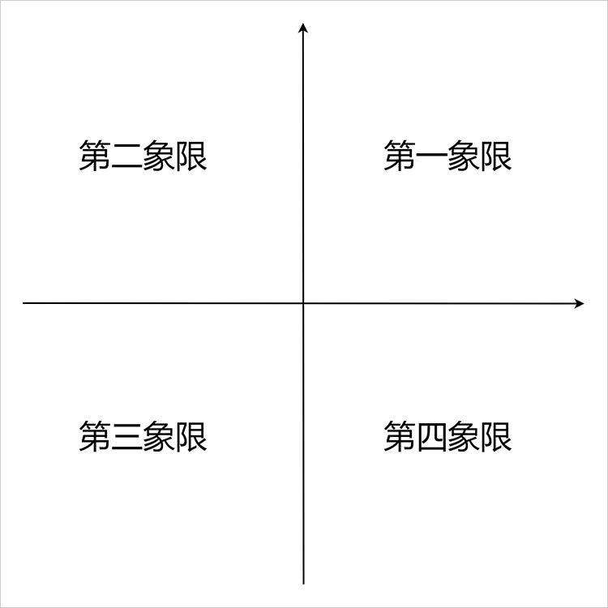
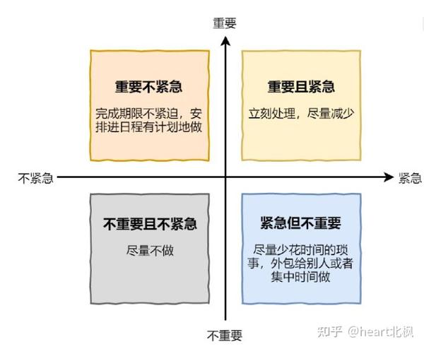
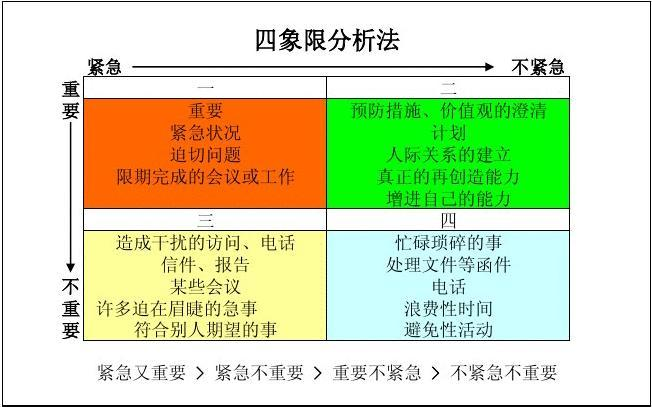
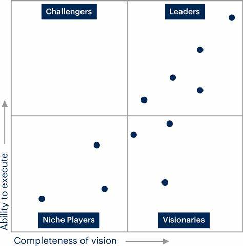
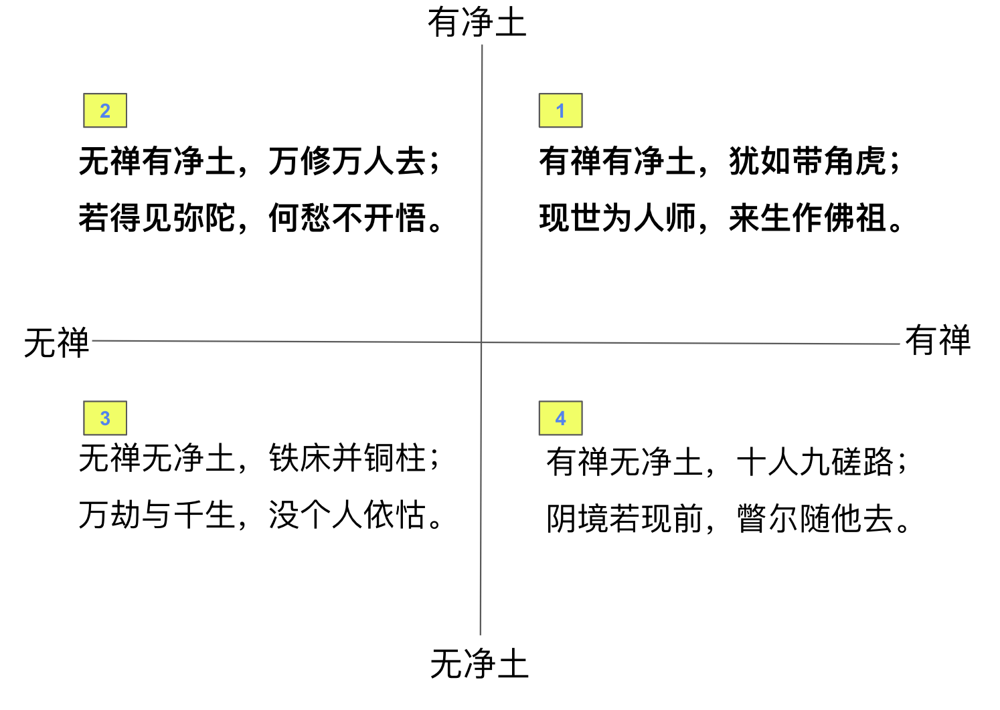
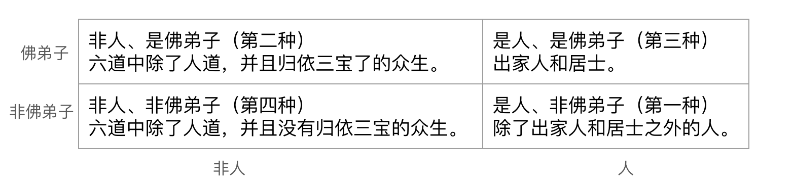

## 什么是四象限图？

四象限图（Quadrant Diagram）是一种图表工具，用于将数据或信息分为四个不同的区域或象限，以便于分析和理解。它的基本结构是将两个轴线（通常是X轴和Y轴）相交，形成四个区域或象限。每个象限代表不同的特征、属性或状态。

两个轴线类型：

举例：这是常用的提高工作效率的办法，把工作任务区分重要性和紧急性，先做“重要且紧急”（第一象限），其次做“重要不紧急”，然后是“紧急但不重要”，最后是“不重要且不紧急”的事情。

矩阵类型：

上面的图也可以画成矩阵类型。

以我所在的科技行业而言，大家都喜欢参考和引用Gartner的魔力四象限图，并希望自己的公司或产品出现在“Leaders（领导者）”的象限中，

## 什么是四料简（佛教中的）？

在佛教中，当要比较或说明两个相关概念时，经常会使用四料简。而佛教中最流行的四料简就是 —— 宋朝永明延寿 (904~975)的禅净四料简(出自《莲修必读》)，用来说明参禅和净土的关系。

## 禅净四料简

有禅有净土，犹如带角虎； 
现世为人师，来生作佛祖。 
无禅有净土，万修万人去； 
若得见弥陀，何愁不开悟。 
有禅无净土，十人九磋路； 
阴境若现前，瞥尔随他去。 
无禅无净土，铁床并铜柱； 
万劫与千生，没个人依怙。 

把上面这段话，画成四象限图，那就是下面这个样子了。

## 四料简在佛教经典中的应用

经典中常以“应作四句”来开始四料简的说明。经查询，在《俱舍论》中，有20个搜索结果。在《大毘婆沙论》中，有197个搜索结果。

其他情况如“四句分别”也是如此。同样是永明延寿大师作的《宗镜录》里面有17个搜索结果。

## 举例：人和佛弟子的关系

这个例子来自于智敏上师《俱舍论颂疏讲记》：

> 第一种，是人不是佛弟子。世间上没有归依三宝的人，他是人，不是佛弟子。

> 第二种，是佛弟子，不是人。比如归依三宝的天人，他是佛弟子，但不是人间的人。

> 第三种，是人又是佛弟子。像我们这些出家人，还有归依三宝的居士。

> 第四种，既不是佛弟子，又不是人。比如那些没有归依三宝的畜生、饿鬼，或者天人。

把上面这段话，画成四象限图，那就是下面这个样子了。

## 总结

其实佛教理论是非常严格和精准，从定义到内容再到使用范围，在必要的时候，都需要使用四料简（四象限图）这样科学的方式才能进行详细地说明，才能把事情说清楚。因此，佛教理论虽然是古代的智慧结晶，但依旧值得现代人学习和参考。

──

阿弥陀佛。 
愚千一。 

