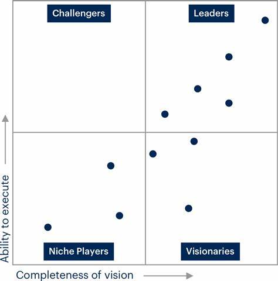

## 什麼是四象限圖？

四象限圖（Quadrant Diagram）是一種圖表工具，用於將數據或信息分為四個不同的區域或象限，以便於分析和理解。它的基本結構是將兩個軸線（通常是X軸和Y軸）相交，形成四個區域或象限。每個象限代表不同的特徵、屬性或狀態。

兩個軸線類型：

舉例：這是常用的提高工作效率的辦法，把工作任務區分重要性和緊急性，先做“重要且緊急”（第一象限），其次做“重要不緊急”，然後是“緊急但不重要”，最後是“不重要且不緊急”的事情。

矩陣類型：

上面的圖也可以畫成矩陣類型。

以我所在的科技行業而言，大家都喜歡參考和引用Gartner的魔力四象限圖，並希望自己的公司或產品出現在“Leaders（領導者）”的象限中，

## 什麼是四料簡（佛教中的）？

在佛教中，當要比較或說明兩個相關概念時，經常會使用四料簡。而佛教中最流行的四料簡就是 —— 宋朝永明延壽 (904~975)的禪淨四料簡(出自《蓮修必讀》)，用來說明參禪和淨土的關係。

## 禪淨四料簡

有禪有淨土，猶如帶角虎； 
現世為人師，來生作佛祖。 
無禪有淨土，萬修萬人去； 
若得見彌陀，何愁不開悟。 
有禪無淨土，十人九磋路； 
陰境若現前，瞥爾隨他去。 
無禪無淨土，鐵床並銅柱； 
萬劫與千生，沒個人依怙。 

把上面這段話，畫成四象限圖，那就是下面這個樣子了。

## 四料簡在佛教經典中的應用

經典中常以“應作四句”來開始四料簡的說明。經查詢，在《俱舍論》中，有20個搜索結果。在《大毘婆沙論》中，有197個搜索結果。

其他情況如“四句分別”也是如此。同樣是永明延壽大師作的《宗鏡錄》裡面有17個搜索結果。

## 舉例：人和佛弟子的關係

這個例子來自於智敏上師《俱舍論頌疏講記》：

> 第一種，是人不是佛弟子。世間上沒有歸依三寶的人，他是人，不是佛弟子。

> 第二種，是佛弟子，不是人。比如歸依三寶的天人，他是佛弟子，但不是人間的人。

> 第三種，是人又是佛弟子。像我們這些出家人，還有歸依三寶的居士。

> 第四種，既不是佛弟子，又不是人。比如那些沒有歸依三寶的畜生、餓鬼，或者天人。

把上面這段話，畫成四象限圖，那就是下面這個樣子了。

## 總結

其實佛教理論是非常嚴格和精準，從定義到內容再到使用範圍，在必要的時候，都需要使用四料簡（四象限圖）這樣科學的方式才能進行詳細地說明，才能把事情說清楚。因此，佛教理論雖然是古代的智慧結晶，但依舊值得現代人學習和參考。

──

阿彌陀佛。 
愚千一。 

