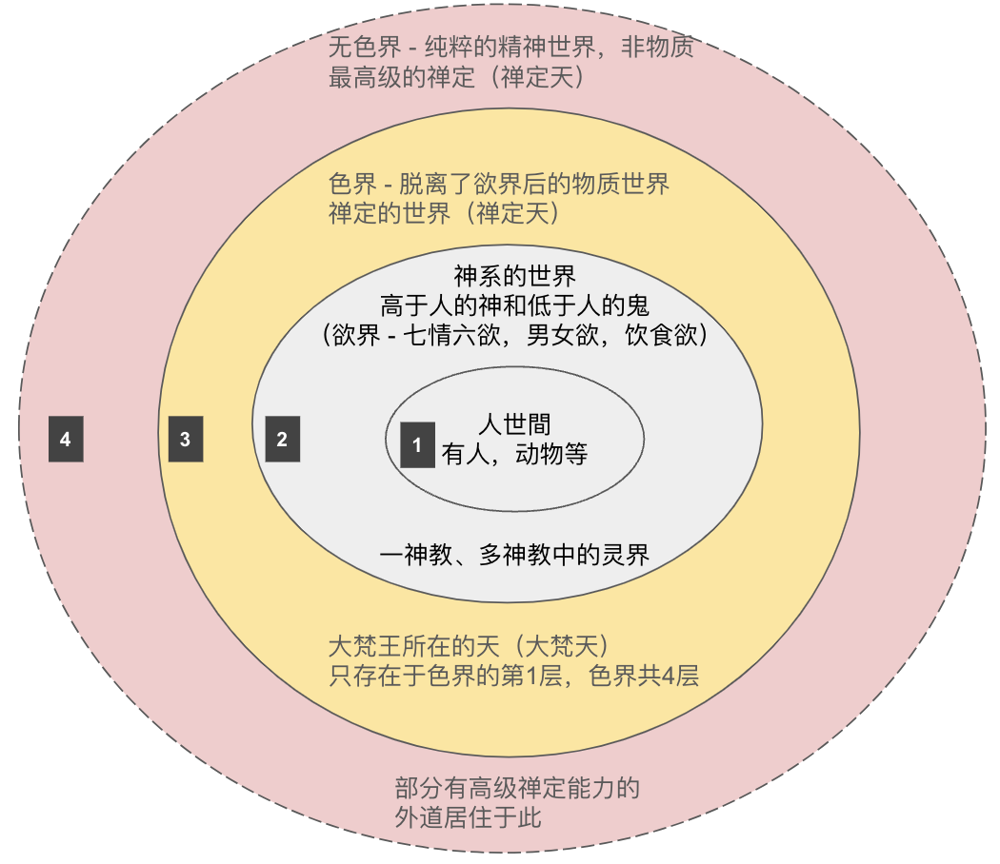

## 夏虫和井蛙

“夏虫不可语冰”出自《庄子·秋水》。

> 井蛙不可以语于海者，拘于虚也；夏虫不可以语于冰者，笃于时也；曲士不可以语于道者，束于教也。

这句话的意思是，不能和生长在夏天的虫子谈论冰，因为它没有在冬天生活过，对冰不会有任何的认知和概念。所以，对于它来说，冰和冬天都是不存在的；没有意义的。除非有一天，它可以坚持到冬天，然后看见了冰 —— 这时，它才能对冰有所认识，对冬天有所了解了。同样地，不能和井底之蛙谈论大海，因为它受到空间的限制，见不到大海。这两个典故都是在告诉我们，不能和见识浅陋的人谈论大道理，因为他们的认知有所限制。

有些限制是外部的，例如上面的夏虫和井蛙，它们都没有能力打破环境的约束，因此环境决定了它们的见识。还有一些限制是自身的，因为自己的见识和偏见，不愿意去相信更广大，更深邃的事物。

## 世界的层次

虽然是说世界的层次，其实也对应了一些宗教的层次。

### 第一层，人世间（人界）

这个世界是最简单、最直接的，那就是人类用肉眼所能观察到的世界。以普通人的视角来说，现代人看到的世界和古人看到的世界也并未不同。甚至，人类看到的世界和动物看到的世界，也并未有很大区别。（指部分动物）

虽然科学的发展帮助我们扩展了许多，延伸了许多，可以看到更微细的东西，如病毒，分子，也可以看到更远的东西，如其他星球。但是，就世界本质而言，并无本质的变化。尤其是从普通人角度而言。

### 第二层，神系的世界（天界）

以宗教的眼光来看，在人世间外还有一个神系的世界。在不同的宗教里面，这部分的描述区别非常大。

如果是以民间信仰来说，其实这是一个鬼神的世界。有很多民间的鬼故事由此有关，最著名的或许就是《聊斋》等小说了吧。但是因为这类民间信仰缺乏严密的体系，众说纷纭，没有统一的标准，基本上都是自说自话，所以也就没什么参考意义了，学术上的研究也比较少。无法单独成为研究课题，一般混杂在民俗、文化的研究之中了。

以有神教类的宗教来说，有可以分为一神教和多神教。一神教的世界比较简单，如有造物主的神，神的眷属如天使，对头如魔鬼等。以多神教来说，如希腊诸神，那就各种各样各具其职的神了，如智慧之神雅典娜，海神之波塞冬等，也有众神之王的如宙斯和他的妻子赫拉，他的女儿雅典娜。

这类的有神教都有一个共同的特征，那就是这些神依旧是有七情六欲的，或有喜怒哀乐的。基本上，他们本身可以看成是人的升级，他们所处的世界也是人世间的升级。或者说是人的神格化，以及人间的神格化。如《西游记》中的玉皇大帝、神仙们、天兵天将们，就和唐朝时的朝廷设置是相似的，不过一个是在人间，另一个在天界。

### 第三层，更高的神系（天界）

神都是有住处的，要么是天堂，要么是天界。天堂的分类不太常见。但是要说到天，以佛教而言，那还能再分成28层。而这28层有归属于三界，分别是：

* 欲界：有六层天。因为有七情六欲，或者是恶的行为和心念。所以归属于欲界。
* 色界：欲界之外的一种更加“高级”的天，没有恶（嗔恨）的行为和信念。没有男女之欲，饮食之欲。

以及脱离于物质，只有精神的纯粹存在的无色界 —— 是第四层。

### 第四层，无色界。

* 无色界：最高级的“天”，是一种脱离于物质之外，纯粹精神的世界（识界）。

在图中，最外层的无色界的边界是虚线，其实是想说明两个含义，第一，从禅定的角度来说，它比色界更高，那当然要高于欲界更多了。第二，欲界和色界都是物质的世界（色就是物质的意思）。超脱于物质，并没有另外一个空间的存在，所以图中用虚线表示了。

## 能力越强，越有见识

虽然以佛教的角度来说，可以有这四层世界。但是这四层世界并非是佛、菩萨或阿罗汉创造的 —— 而只是他们发现的。甚至也不是佛教自己独自的发现，而是古印度宗教的共识。所以，色界和无色界也叫做“四禅八定”，是共外道的（就是说，古印度非佛教的宗教也是承认的）。

这几层世界虽然在表现层次上有许多的差别，但是最核心差别可能还是能力。还是以井蛙来举例，假设它很努力，在尝试不停地跳跃，而且每次尝试都跳得更高，更远。

* 人世间 —— 就是最小的井，这个井里生命只有人类和动物。虽然科技有进步，也只是发现了更小的“动物” —— 微生物或病毒而已，并未超越人世间的范畴。
* 欲界的神系世界 —— 青蛙的跳跃能力有了飞跃，可以跳出第一个井 —— 人世间，那它就可以看到更大的另一个世界了，除了人合动物外，还可以看到神和鬼。高于人的是神，低于人，不如人的是鬼。
* 色界 —— 青蛙的能力再次提升，可以跳到色界。这时它可以看到一种更加巨大，宏伟，庄严的生命 —— 大梵天。
* 无色界 —— 青蛙的能力达到了顶峰，跳出了物质的世界，进入到了纯粹的精神世界，这是另外一种超越物质的存在了。

青蛙从一个“井”到另一个“井”，需要的是跳跃的能力。同样，人从一层世界到另外一层世界，需要的能力是禅定。禅定可以帮助人，从欲界到色界，乃至无色界。（以俱舍和唯识的观点来说，禅定也是见道的必要条件了。）

## 总结

有人把我加入一个“世界宗教”的群组，里面天天吵闹不休，谁也无法说服谁，基本上都是各说各话。尤其是以各自的立场，固执于自己的立场，去批判他人。本质上来说，这些都是“井蛙”。对于人世间之外的世界，大多也只是停留在“信仰”的层面，而没有自己的“体验”，没有亲眼见到，亲耳听到。就算有人宣称自己看到了，听到了 —— 大家也无法验证，无法证伪他是在说谎，还是真的体验到了。

所以，当我们自己还是一只“井蛙”的时候，不要浪费时间去说服他人，而应该努力提高自己的“跳跃”能力，当我们能够“跳出”这个“井”的时候，自然就知道了 —— 另一个更大的世界是什么样子的了。

阿弥陀佛 
愚千一

