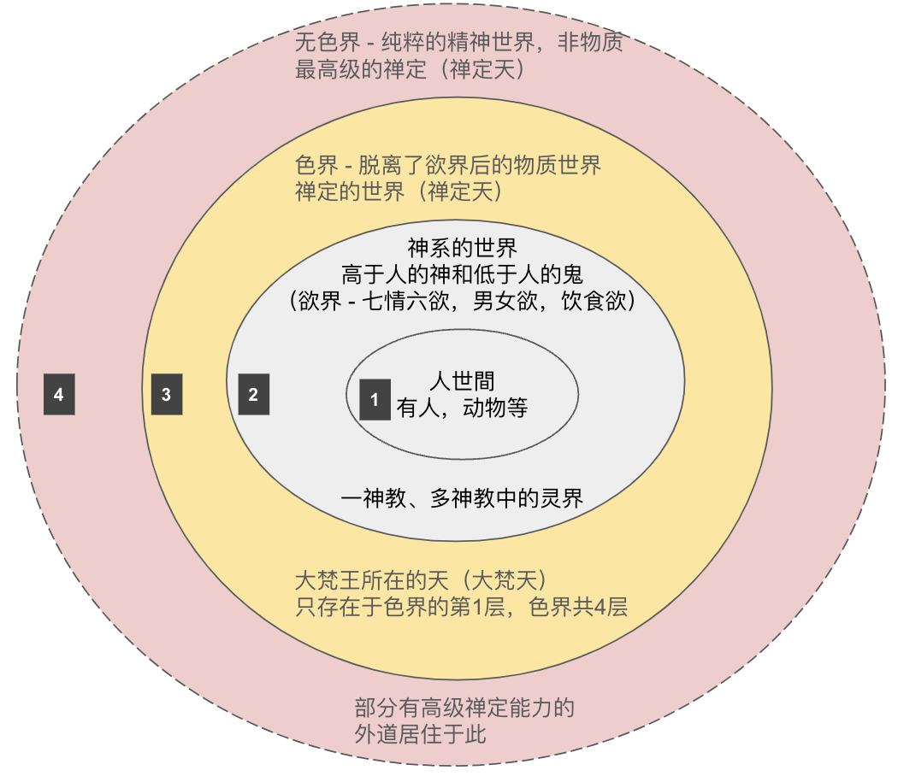

## 夏蟲和井蛙

“夏蟲不可語冰”出自《莊子·秋水》。

> 井蛙不可以語於海者，拘於虛也；夏蟲不可以語於冰者，篤於時也；曲士不可以語於道者，束於教也。

這句話的意思是，不能和生長在夏天的蟲子談論冰，因爲它沒有在冬天生活過，對冰不會有任何的認知和概念。所以，對於它來說，冰和冬天都是不存在的；沒有意義的。除非有一天，它可以堅持到冬天，然後看見了冰 —— 這時，它才能對冰有所認識，對冬天有所瞭解了。同樣地，不能和井底之蛙談論大海，因爲它受到空間的限制，見不到大海。這兩個典故都是在告訴我們，不能和見識淺陋的人談論大道理，因爲他們的認知有所限制。

有些限制是外部的，例如上面的夏蟲和井蛙，它們都沒有能力打破環境的約束，因此環境決定了它們的見識。還有一些限制是自身的，因爲自己的見識和偏見，不願意去相信更廣大，更深邃的事物。

## 世界的層次

雖然是說世界的層次，其實也對應了一些宗教的層次。

### 第一層，人世間（人界）

這個世界是最簡單、最直接的，那就是人類用肉眼所能觀察到的世界。以普通人的視角來說，現代人看到的世界和古人看到的世界也並未不同。甚至，人類看到的世界和動物看到的世界，也並未有很大區別。（指部分動物）

雖然科學的發展幫助我們擴展了許多，延伸了許多，可以看到更微細的東西，如病毒，分子，也可以看到更遠的東西，如其他星球。但是，就世界本質而言，並無本質的變化。尤其是從普通人角度而言。

### 第二層，神系的世界（天界）

以宗教的眼光來看，在人世間外還有一個神系的世界。在不同的宗教裏面，這部分的描述區別非常大。

如果是以民間信仰來說，其實這是一個鬼神的世界。有很多民間的鬼故事由此有關，最著名的或許就是《聊齋》等小說了吧。但是因爲這類民間信仰缺乏嚴密的體系，衆說紛紜，沒有統一的標準，基本上都是自說自話，所以也就沒什麼參考意義了，學術上的研究也比較少。無法單獨成爲研究課題，一般混雜在民俗、文化的研究之中了。

以有神教類的宗教來說，有可以分爲一神教和多神教。一神教的世界比較簡單，如有造物主的神，神的眷屬如天使，對頭如魔鬼等。以多神教來說，如希臘諸神，那就各種各樣各具其職的神了，如智慧之神雅典娜，海神之波塞冬等，也有衆神之王的如宙斯和他的妻子赫拉，他的女兒雅典娜。

這類的有神教都有一個共同的特徵，那就是這些神依舊是有七情六慾的，或有喜怒哀樂的。基本上，他們本身可以看成是人的升級，他們所處的世界也是人世間的升級。或者說是人的神格化，以及人間的神格化。如《西遊記》中的玉皇大帝、神仙們、天兵天將們，就和唐朝時的朝廷設置是相似的，不過一個是在人間，另一個在天界。

### 第三層，更高的神系（天界）

神都是有住處的，要麼是天堂，要麼是天界。天堂的分類不太常見。但是要說到天，以佛教而言，那還能再分成28層。而這28層有歸屬於三界，分別是：

* 欲界：有六層天。因爲有七情六慾，或者是惡的行爲和心念。所以歸屬於欲界。
* 色界：欲界之外的一種更加“高級”的天，沒有惡（嗔恨）的行爲和信念。沒有男女之慾，飲食之慾。

以及脫離於物質，只有精神的純粹存在的無色界 —— 是第四層。

### 第四層，無色界。

* 無色界：最高級的“天”，是一種脫離於物質之外，純粹精神的世界（識界）。

在圖中，最外層的無色界的邊界是虛線，其實是想說明兩個含義，第一，從禪定的角度來說，它比色界更高，那當然要高於欲界更多了。第二，欲界和色界都是物質的世界（色就是物質的意思）。超脫於物質，並沒有另外一個空間的存在，所以圖中用虛線表示了。

## 能力越強，越有見識

雖然以佛教的角度來說，可以有這四層世界。但是這四層世界並非是佛、菩薩或阿羅漢創造的 —— 而只是他們發現的。甚至也不是佛教自己獨自的發現，而是古印度宗教的共識。所以，色界和無色界也叫做“四禪八定”，是共外道的（就是說，古印度非佛教的宗教也是承認的）。

這幾層世界雖然在表現層次上有許多的差別，但是最核心差別可能還是能力。還是以井蛙來舉例，假設它很努力，在嘗試不停地跳躍，而且每次嘗試都跳得更高，更遠。

* 人世間 —— 就是最小的井，這個井裏生命只有人類和動物。雖然科技有進步，也只是發現了更小的“動物” —— 微生物或病毒而已，並未超越人世間的範疇。
* 欲界的神繫世界 —— 青蛙的跳躍能力有了飛躍，可以跳出第一個井 —— 人世間，那它就可以看到更大的另一個世界了，除了人合動物外，還可以看到神和鬼。高於人的是神，低於人，不如人的是鬼。
* 色界 —— 青蛙的能力再次提升，可以跳到色界。這時它可以看到一種更加巨大，宏偉，莊嚴的生命 —— 大梵天。
* 無色界 —— 青蛙的能力達到了頂峯，跳出了物質的世界，進入到了純粹的精神世界，這是另外一種超越物質的存在了。

青蛙從一個“井”到另一個“井”，需要的是跳躍的能力。同樣，人從一層世界到另外一層世界，需要的能力是禪定。禪定可以幫助人，從欲界到色界，乃至無色界。（以俱舍和唯識的觀點來說，禪定也是見道的必要條件了。）

## 總結

有人把我加入一個“世界宗教”的羣組，裏面天天吵鬧不休，誰也無法說服誰，基本上都是各說各話。尤其是以各自的立場，固執於自己的立場，去批判他人。本質上來說，這些都是“井蛙”。對於人世間之外的世界，大多也只是停留在“信仰”的層面，而沒有自己的“體驗”，沒有親眼見到，親耳聽到。就算有人宣稱自己看到了，聽到了 —— 大家也無法驗證，無法證僞他是在說謊，還是真的體驗到了。

所以，當我們自己還是一隻“井蛙”的時候，不要浪費時間去說服他人，而應該努力提高自己的“跳躍”能力，當我們能夠“跳出”這個“井”的時候，自然就知道了 —— 另一個更大的世界是什麼樣子的了。

阿彌陀佛 
愚千一

