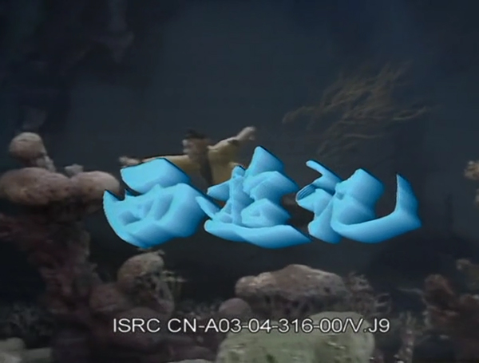
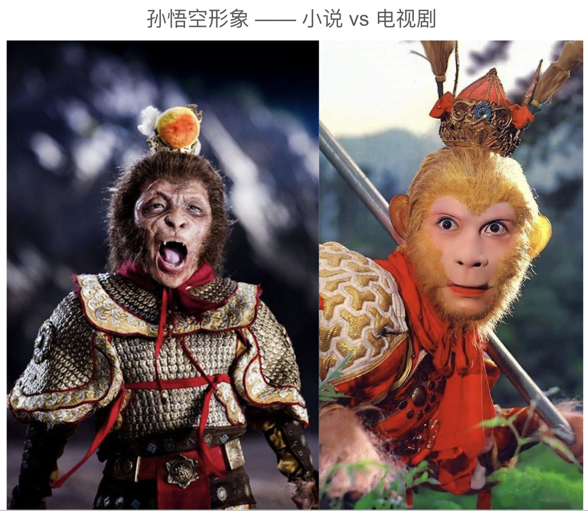
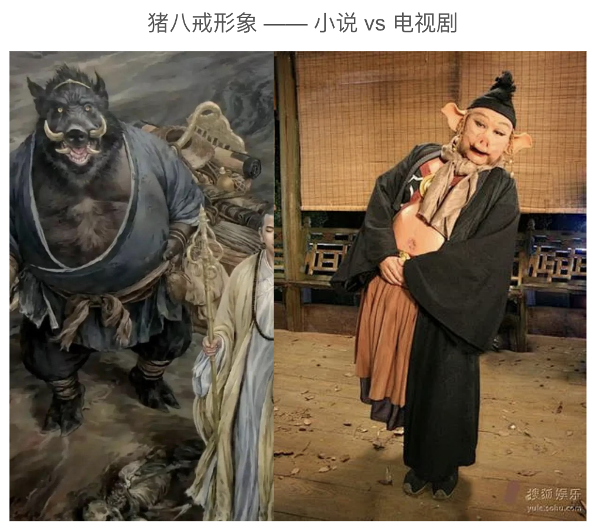
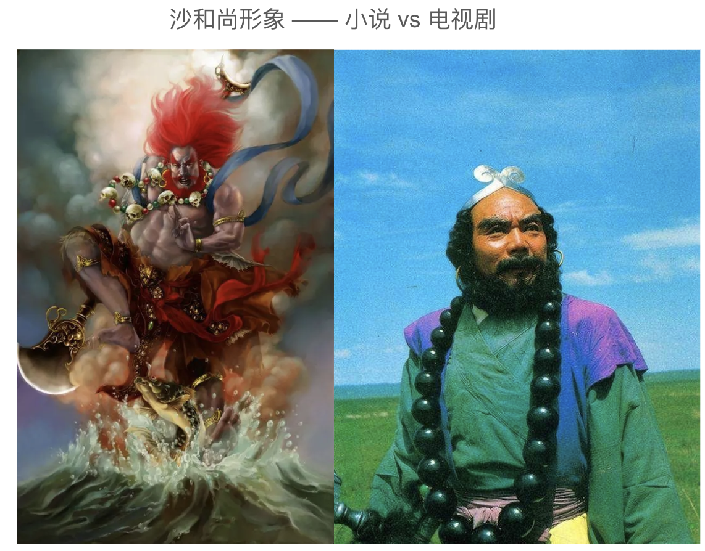

随着《黑神话悟空》游戏的火热，《西游记》又成了一个火热话题。然而，《西游记》从小说到86版电视剧，实际上是一次反转。

## 86版《西游记》电视剧是一代经典

《西游记》本来只是一本小说，后来因为改编成电视剧后，才成为几代人的经典。对于80、90后来说，西游记都不止看过一遍，上学期间的每个暑假，一定会有某个电视台重播《西游记》。而86版《西游记》最是经典，在2013年时就位居千年重播剧第一，已播2000次。（参考：https://ent.ifeng.com/tv/news/toutiao/detail_2013_02/21/22332437_0.shtml）

这是信息爆炸前的状态了，那时候的媒体资源（电视、电影）很少，一部好看的电视剧，就可以不断地重复播放。而对于后来的00后，居然也有没看过电视剧《西游记》的。上次就遇到这样一个00后，不得不感慨下，这就是时代的变迁和代沟了。下面回归正题。

## 《西游记》小说对于佛教的讽刺和丑化

如上，看过电视版《西游记》的人非常多，除了86版外，还有很多版本的电视、电视《西游记》。但是，看过小说原著的人，就未必那么多了。就算看过，也不见得有宗教敏感度。实际上，《西游记》这部小说，里面有很多对于佛教的批判内容和讽刺。不少人认为《西游记》小说本是佛教之争下，道教对佛教的讽刺和丑化。简单列举如下。记住：以下是指《西游记》小说，而非电视剧。

对佛教徒的讽刺 —— 唐僧师徒四人只有唐僧是人，其他三个徒弟都是妖魔鬼怪 —— 这就是讽刺佛教徒里面的“人”很少，“妖魔鬼怪”很多。

对唐僧的丑化 —— 小说里面很多描写他的负面特征，如软弱、无能、爱哭等。这与历史上玄奘法师的崇高形象形成了鲜明对比，佛教界认为这是一种庸俗化的叙事手法，贬低了玄奘大师的佛法造诣和伟大精神（可以通过俱舍和唯识来了解玄奘大师的学识和伟大）。有兴趣的朋友也可以读下《大慈恩寺三藏法师传》来看下李世忠真实的玄奘大师。

对阿罗汉的丑化 —— 阿难尊者、迦叶尊者在唐僧到达西天后，竟公然向他索要贿赂，这一段描写也是讽刺某些佛教徒的贪婪和腐败。

佛教的压制性 —— 孙悟空在反抗命运时被西天如来佛祖压入五指山下，这一情节被解读为对佛教的批判，认为佛教是一股压制在人民头上难以撼动的强大势力 —— 尤其是当某些皇帝只顾个人修行而不理朝政的时候，或者是故意“出家”，然后让朝廷花钱将其赎回的时候。当西藏佛教在政教合一的时候，政治上对于百姓的剥削和对佛教的照顾衍生了不少社会问题和腐败问题。

## 从小说到电视剧其实是一次“反转”

在1986年版《西游记》电视剧开拍之前，导演杨洁曾访问过赵朴初先生，希望他能为电视剧题写片头字幕。然而，赵朴初婉言谢绝了。他严肃地指出，《西游记》歪曲了唐僧的形象，佛教界不认可。他曾是佛教协会会长，最有资格代表佛教界了。赵朴初先生诚恳地提出建议，希望电视剧能纠正唐僧的形象，至少不要丑化唐僧。

导演杨洁接受了他的建议，拍出来的《西游记》和小说有很多不同，甚至反转了很多小说对于佛教的讽刺和丑化。

 
（因为赵朴初的婉言谢绝，最终的片头题字是陈叔亮先生的。）

## 孙悟空形象的反转 —— 猢狲 vs 美猴王

原著中的孙悟空是这样的：“行者身躯鄙猥，面容羸瘦，不满四尺，原来是这般一个骷髅的病鬼”，《西游·降魔篇》对于孙悟空的形象最贴近原著的（左图）。而86版《西游记》中的孙悟空是名副其实的美猴王。俊美到什么程度呢？在明信片流行的年代，当时的小男孩们最喜欢的，可能就是这组美猴王了。（右图）

## 猪八戒形象的反转 

原著中的猪八戒是这样的：“卷脏莲蓬吊搭嘴，耳如蒲扇显金睛。獠牙锋利如钢锉，长嘴张开似火盆”，这原著里的猪八戒长嘴獠牙，相貌丑陋，是一个活脱脱的野猪精形象。（左图）

而86版电视剧中的猪八戒，肥头大耳，有着白花花的大肚皮，总是腆在外面；耳朵像蒲扇，鼻子口吻较长，獠牙虽有但不太明显。性格上，他表现出憨厚可爱的一面，同时也有懒惰、贪吃、好色、爱占小便宜等令人讨厌的特点。然而，这些缺点并没有让观众对他产生厌恶，反而使这个角色更加生动有趣，令人印象深刻。（右图）

## 沙和尚形象的反转

在《西游记》小说中，沙和尚初登场时，原文形容他 “青不青，黑不黑，晦气色脸；长不长，短不短，赤脚筋躯。眼光闪烁，好似灶底双灯；口角丫叉，就如屠家火钵。獠牙撑剑刃，红发乱蓬松。一声叱咤如雷吼，两脚奔波似滚风”。（左图）

而86版电视剧《西游记》中，闫怀礼饰演的沙僧面相方正，让人心生信赖之感，几乎 “忠厚” 刻在了脸上，与沙僧这一角色相得益彰。（右图）

## 总结

在原著中，孙悟空虽神通广大但也有急躁好斗的一面；猪八戒外貌丑陋且性格中充满贪婪、懒惰与好色；唐僧也有懦弱迂腐、不明是非的时候。

而在86版电视剧中，人物形象经过了一定的美化和简化。孙悟空成为了勇敢无畏、正义忠诚的象征，深受观众喜爱，甚至成为了很多人心中的“榜样”，小孩子们都爱扮演孙悟空；猪八戒虽然贪吃懒惰但也增添了许多可爱之处；沙僧则变得更加忠厚老实。唐僧的形象也更加慈悲善良、坚定执着。

此外，小说中的一些恐怖、血腥的情节在电视剧中被淡化处理，使其更适合大众观看。电视剧以生动的画面、精彩的表演和通俗易懂的剧情，让更多人了解和喜爱《西游记》，扩大了这部经典作品的影响力。但同时，也在一定程度上“反转”了人们对小说原著的认知。以为原著就是如此。这实在是令人啼笑皆非。

阿弥陀佛 
愚千一

