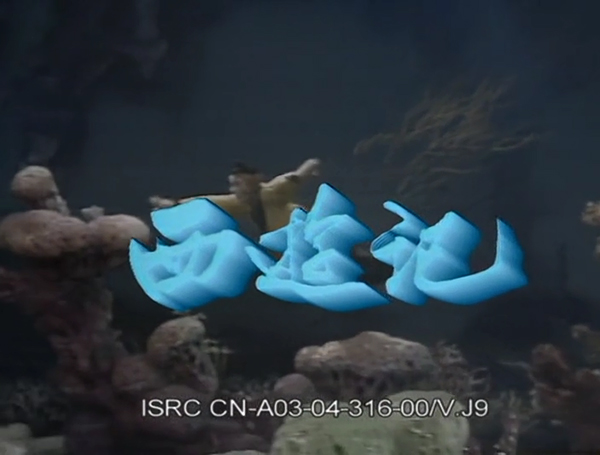

隨著《黑神話悟空》遊戲的火熱，《西遊記》又成了一個火熱話題。然而，《西遊記》從小說到86版電視劇，實際上是一次反轉。

## 86版《西遊記》電視劇是一代經典

《西遊記》本來只是一本小說，後來因為改編成電視劇後，才成為幾代人的經典。對於80、90後來說，西遊記都不止看過一遍，上學期間的每個暑假，一定會有某個電視臺重播《西遊記》。而86版《西遊記》最是經典，在2013年時就位居千年重播劇第一，已播2000次。（參考：https://ent.ifeng.com/tv/news/toutiao/detail_2013_02/21/22332437_0.shtml）

這是信息爆炸前的狀態了，那時候的媒體資源（電視、電影）很少，一部好看的電視劇，就可以不斷地重複播放。而對於後來的00後，居然也有沒看過電視劇《西遊記》的。上次就遇到這樣一個00後，不得不感慨下，這就是時代的變遷和代溝了。下面迴歸正題。

## 《西遊記》小說對於佛教的諷刺和醜化

如上，看過電視版《西遊記》的人非常多，除了86版外，還有很多版本的電視、電視《西遊記》。但是，看過小說原著的人，就未必那麼多了。就算看過，也不見得有宗教敏感度。實際上，《西遊記》這部小說，裡面有很多對於佛教的批判內容和諷刺。不少人認為《西遊記》小說本是佛教之爭下，道教對佛教的諷刺和醜化。簡單列舉如下。記住：以下是指《西遊記》小說，而非電視劇。

對佛教徒的諷刺 —— 唐僧師徒四人只有唐僧是人，其他三個徒弟都是妖魔鬼怪 —— 這就是諷刺佛教徒裡面的“人”很少，“妖魔鬼怪”很多。

對唐僧的醜化 —— 小說裡面很多描寫他的負面特徵，如軟弱、無能、愛哭等。這與歷史上玄奘法師的崇高形象形成了鮮明對比，佛教界認為這是一種庸俗化的敘事手法，貶低了玄奘大師的佛法造詣和偉大精神（可以通過俱舍和唯識來了解玄奘大師的學識和偉大）。有興趣的朋友也可以讀下《大慈恩寺三藏法師傳》來看下李世忠真實的玄奘大師。

對阿羅漢的醜化 —— 阿難尊者、迦葉尊者在唐僧到達西天后，竟公然向他索要賄賂，這一段描寫也是諷刺某些佛教徒的貪婪和腐敗。

佛教的壓制性 —— 孫悟空在反抗命運時被西天如來佛祖壓入五指山下，這一情節被解讀為對佛教的批判，認為佛教是一股壓制在人民頭上難以撼動的強大勢力 —— 尤其是當某些皇帝只顧個人修行而不理朝政的時候，或者是故意“出家”，然後讓朝廷花錢將其贖回的時候。當西藏佛教在政教合一的時候，政治上對於百姓的剝削和對佛教的照顧衍生了不少社會問題和腐敗問題。

## 從小說到電視劇其實是一次“反轉”

在1986年版《西遊記》電視劇開拍之前，導演楊潔曾訪問過趙樸初先生，希望他能為電視劇題寫片頭字幕。然而，趙樸初婉言謝絕了。他嚴肅地指出，《西遊記》歪曲了唐僧的形象，佛教界不認可。他曾是佛教協會會長，最有資格代表佛教界了。趙樸初先生誠懇地提出建議，希望電視劇能糾正唐僧的形象，至少不要醜化唐僧。

導演楊潔接受了他的建議，拍出來的《西遊記》和小說有很多不同，甚至反轉了很多小說對於佛教的諷刺和醜化。

 
（因為趙樸初的婉言謝絕，最終的片頭題字是陳叔亮先生的。）

## 孫悟空形象的反轉 —— 猢猻 vs 美猴王

原著中的孫悟空是這樣的：“行者身軀鄙猥，面容羸瘦，不滿四尺，原來是這般一個骷髏的病鬼”，《西遊·降魔篇》對於孫悟空的形象最貼近原著的（左圖）。而86版《西遊記》中的孫悟空是名副其實的美猴王。俊美到什麼程度呢？在明信片流行的年代，當時的小男孩們最喜歡的，可能就是這組美猴王了。（右圖）

## 豬八戒形象的反轉 

原著中的豬八戒是這樣的：“卷髒蓮蓬吊搭嘴，耳如蒲扇顯金睛。獠牙鋒利如鋼銼，長嘴張開似火盆”，這原著裡的豬八戒長嘴獠牙，相貌醜陋，是一個活脫脫的野豬精形象。（左圖）

而86版電視劇中的豬八戒，肥頭大耳，有著白花花的大肚皮，總是腆在外面；耳朵像蒲扇，鼻子口吻較長，獠牙雖有但不太明顯。性格上，他表現出憨厚可愛的一面，同時也有懶惰、貪吃、好色、愛佔小便宜等令人討厭的特點。然而，這些缺點並沒有讓觀眾對他產生厭惡，反而使這個角色更加生動有趣，令人印象深刻。（右圖）

## 沙和尚形象的反轉

在《西遊記》小說中，沙和尚初登場時，原文形容他 “青不青，黑不黑，晦氣色臉；長不長，短不短，赤腳筋軀。眼光閃爍，好似灶底雙燈；口角丫叉，就如屠家火缽。獠牙撐劍刃，紅髮亂蓬鬆。一聲叱吒如雷吼，兩腳奔波似滾風”。（左圖）

而86版電視劇《西遊記》中，閆懷禮飾演的沙僧面相方正，讓人心生信賴之感，幾乎 “忠厚” 刻在了臉上，與沙僧這一角色相得益彰。（右圖）

## 總結

在原著中，孫悟空雖神通廣大但也有急躁好鬥的一面；豬八戒外貌醜陋且性格中充滿貪婪、懶惰與好色；唐僧也有懦弱迂腐、不明是非的時候。

而在86版電視劇中，人物形象經過了一定的美化和簡化。孫悟空成為了勇敢無畏、正義忠誠的象徵，深受觀眾喜愛，甚至成為了很多人心中的“榜樣”，小孩子們都愛扮演孫悟空；豬八戒雖然貪吃懶惰但也增添了許多可愛之處；沙僧則變得更加忠厚老實。唐僧的形象也更加慈悲善良、堅定執著。

此外，小說中的一些恐怖、血腥的情節在電視劇中被淡化處理，使其更適合大眾觀看。電視劇以生動的畫面、精彩的表演和通俗易懂的劇情，讓更多人瞭解和喜愛《西遊記》，擴大了這部經典作品的影響力。但同時，也在一定程度上“反轉”了人們對小說原著的認知。以為原著就是如此。這實在是令人啼笑皆非。

阿彌陀佛 
愚千一

