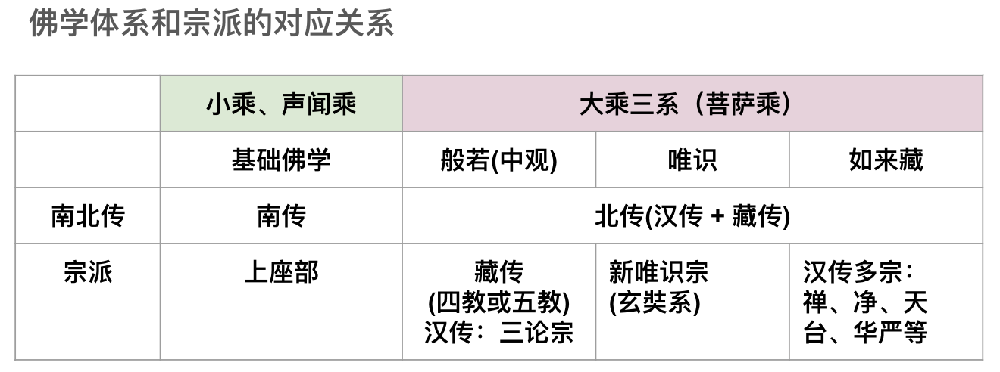

## 学佛卡壳了？—— 这是“正常”的。

佛教里面的概念、名词、理论实在太多了。

一会儿有，一会儿无， 
一会儿是，一会儿非， 
一会儿真，一会儿假， 
一会儿实，一会儿虚幻， 
一会儿要断烦恼，一会儿烦恼即菩提 

这么多的概念不仅对于初学来说是非常困难的，就是学佛十年，二十年的人，对于这些概念也常常是懵懵懂懂，似是而非的。再具体来说，是这样的：

刚听了一个概念，如断烦恼，是这样说，烦恼有贪、嗔、痴等等，好像听懂了。 

过会儿，又听了另一个相反的概念，如烦恼即菩提，又一番说法，烦恼即空，空即菩提，好像也挺懂了。 

再过会儿，当烦恼出现的时候，又无法空去烦恼的时候，就会陷入迷惑，困惑，怀疑了。如此反复，就会感觉佛法无用了，越来越懈怠。所谓学佛十年，佛在天边了。 

如果这个例子不够，再来一个。

刚听了一个概念，叫做“缘起性空”，意思是“因缘有自性空”。 
过会儿又听到一个坛经里面的“何其自性，能生万法”。 
有人就会迷惑了，这个“自性”到底是空还是不是空啊？ 
如果“自性”是空的，为何又说可以“生万法”呢？ 

以上所有的“矛盾”其实都是一个问题，那就是混淆了佛教的不同体系，在不同体系里面，概念名称相同，但是定义（或内涵）却不尽相同。这就是造成上述困惑，迷茫的根本原因了。那要如何解决这个问题呢？其实也很简单，那就是先了解各个体系的大概和区分，然后再选择一个体系深入下去，只要先把一个体系弄得比较懂了，再去触类旁通其他体系，这个时候就容易了 —— 这也是我个人学习佛法的心得了。

## 佛教分类（佛学分类）

传统上是这样分类的：

要么是按照地域分类，比如分成南传，北传。北传里面再分汉传、藏传。 
汉传里面又分八宗或十宗。（略） 
藏传里面又分四教或五教。（略） 

这种分类方法有它的依据，但是这个分类并不完全是“佛法”上的区分（除了南、北传）。如果要按照佛法体系（或佛学体系）分类，只需要分成四类：小乘，大乘。大乘里面再分中观（或般若）、唯识、如来藏。这就是大乘三系，再加上小乘（声闻）。那就是总共四大分类了。

## 体系和宗派的简单对照

简单解读：
1. 南传，只有上座部，只是声闻乘，现代也叫根本理论，或基础理论。
2. 北传包括汉传和藏传。
3. 藏传都是中观系（般若系）。
3. 汉传中，只有三论宗是纯正的般若系，新唯识宗是纯正唯识系，其他的宗派如：禅、净、天台、华严，甚至包括旧唯识都是如来藏系。旧唯识（即承认如来藏的）也可以算是如来藏系了。

## 四大体系的核心理论

小乘、或声闻乘（也有叫原始佛教，根本佛教，基础佛教等名字），它的核心理论就是，缘起，也叫因缘法，缘起法。重要理论有：缘起法，四圣谛和十二因缘。对应经典：阿含经等。

般若，或叫中观，它的核心理论是缘起性空。对应经典：般若经等，《心经》《金刚经》《大品般若》《中观》等。

唯识，它的核心理论是万法唯识。对应经典：《唯识三十颂》《解深密经》《成唯识论》等。

如来藏，它的核心理论是空如来藏，不空如来藏，空不空如来藏。对应经典：《如来藏经》《楞严经》《起信论》等（非常非常多）。

早在2022年08月06日的时候，我就写过一篇对比三系的文章，依旧可以参考：

>【原创】尝试对比中观、唯识和如来藏
https://mp.weixin.qq.com/s/n1RfPHv65iJtp1WmARvSNQ
 中观和唯识是印度佛教的两大支柱，而当今学界所认为的三大体系之如来藏，并没有在印度开宗立派，却在传入中国后成为主流。本文尝试比较下三者，希望从中找到缘由。

>【原创】尝试对比中观、唯识和如来藏
https://yuqianyi1001.github.io/comparison-between-madhyamaka-Yogacara-Tathagatagarbha_zh-tw/
中观和唯识是印度佛教的两大支柱，而当今学界所认为的三大体系之如来藏，并冇有在印度开宗立派，却在传入中国后成为主流。本文尝试比较下三者，希望从中找到缘由。

## 因缘法是一切体系的共同基础和核心

**什么是因缘法？**

>《杂阿含经》卷第十三，335经：谓“此有故彼有，此起故彼起，……此无故彼无，此灭故彼灭……”。

白话：因为这个存在所以那个存在，这个生起所以那个生起；因为这个不存在所以那个不存在，这个消失所以那个消失。

基本含义：一切事物的产生（起）和存在（有），都依赖于其他事物的产生和存在。同样地，当一切事物所依赖的环境发生变化时，它们也会发生变化，最终因为依赖的消亡而消亡，最后依赖不存在（无）了，事物本身也不存在了。换句话说，一切事物都不能独立地产生和存在。

这就是佛教最最核心、最最重要、最最基本的因缘法。也叫缘起法。

## 四大体系的核心区别

### 声闻和般若

**般若的核心概念：空性和无生**

缘起法（或因缘法）是一切体系的基础和共识。它的核心只有上面那四句。

声闻和般若的思想是最为一致的，声闻强调缘起，般若强调性空，虽然两者强调的不同，但是从根本上来说，缘起就是性空，性空的原因就是缘起。所以，般若上也经常说 —— 缘起性空 —— 因缘有自性空。

因缘有，也就是假有，幻有 —— 而不是实有。

般若对“实有”的定义是常、一。常是指永恒存在，固定不变的存在，独立自主地存在，不可分割、不可拆分，始终保持绝对“一”体的存在（都是绝对意义上）。但是，一切事物都是因缘和合才有的，所以，这类的因缘有，就是假有，而不是“实有”。

般若在这基础上更进一步说 —— “无生”，一切法不生，这个生是指，一切“实有的”法不生，能生的法都是因缘和合才有，所以都是“假生”，而不是“实生”。

补充下：性空，空性是一个意思。无生、无相、无性也是一个意思。只是侧重点不同，但是内涵一致。

### 般若和唯识

般若和唯识本身是没有任何矛盾的，只是强调的东西不同而已。般若的核心概念前面已经说了。下面简单说唯识。

唯识的核心其实也分简单，唯识的核心是对八识的认知和了解。

但是从概念上，必须要了解一点，唯识上的“实法”和“假法”在定义和般若上的“实法”和“假法”不同。

般若上的实法，实有的法，定义是常、一，即有独立的、自主的永恒不变的绝对存在。

唯识上的实法是指有种子，而种子是以比喻命名的，种子也不是般若意义上的“实有”，而是因缘有，是生灭的。唯识上的“假法”是说，没有自己的种子，是根据“实法的种子”衍生的说法，比如说，唯识中的百法中的心所有51个，但是其中有很多的“心所”是假法，假立的，比如说“不害”心所，就是从“无嗔”心所衍生出来的假法，意思是，只有“无嗔”是有种子的，但是“不害”没有种子，它只是“无嗔”的一个侧面表现形式。

唯识上的真如，可以对应般若上的空性或无生。

### 如来藏

相对般若和唯识来说，都有清晰的简单的定义，都可以用我们日常生活中的经验来比拟大多数的概念和理论，就算是不容易体会和理解，也可以用逻辑推理的方式进行学习和讨论。而用逻辑思维和推理对于佛学来说，其实是非常重要的，“闻思修”中的“思”就是逻辑思维和推理了。

而如来藏的概念最为复杂，比如如来藏的核心概念，即如来藏，就没有一个简单的定义。要正确地理解如来藏，必须要分三个角度分别进行，空如来藏（类似般若，但不是般若），不空如来藏（类似唯识，但不是唯识），空不空如来藏（类似中观的八不）。

这就是如来藏概念的复杂性了。无论是般若的空还是唯识的有，都较容易理解和推理，因为他们的定义是简单的，单一的。也很容易在日常生活中找到比喻的例子。而如来藏这样同时具有三个角度，缺一不可的复杂概念来说，生活中找不到一个例子可以同时比喻三个角度，而只能找到不同的比喻分别比喻一个角度。这也造成了对如来藏难以了解。无法透彻了解，所以很多佛友总是在似懂非懂、模棱两可的迷糊状态（也就是卡壳了）。

我也尝试过用简单的语言来尝试表达自己对如来藏的理解，多次尝试后都不理想，思来想去，才总结出来说，因为如来藏的概念本身就是比般若和唯识复杂的。因此，没有办法简化和通俗化。只能同时从这三个角度同时描述才不至于有缺陷，才是完整的思想。

**如来藏的自性是什么？**

如来藏的自性必须同时包括这三个方面，缺一不可。

1. 空如来藏 —— 全部都非，意思是，没有任何一个东西可以代指如来藏，也没有部分东西可以代指如来藏。所以说，全部都非。
2. 不空如来藏 —— 全部都是，意思是，任何一个东西都是如来藏的体现（或表现），所以禅宗说：青青翠竹尽是法身，郁郁黄花无非般若。（法身，般若都是如来藏的异名）。
3. 空不空如来藏，整合空和不空，两者非二，空和不空是不二的。这点倒是和般若的八不类似了。

补充说，其实了解了以上的三点，很多禅宗的公案也就容易解读了。

**综上 —— 佛学四大体系的核心和差异**

## 如何读懂佛经？

一、先判断该经属于哪个体系，是声闻乘的基础佛教（四圣谛，十二因缘），还是般若，唯识，或如来藏。

二、如果是声闻乘的基础佛教，就按照基础佛教理论去理解，主要就是缘起法，四圣谛和十二因缘。如果是般若，就以般若的定义和体系去理解 —— 关键是缘起性空，或因缘有，自性空。如果是唯识，就以万法唯识的定义和体系去理解 —— 这里的自性是指种子，真如是空性。如果是如来藏，就以如来藏的定义和体系去理解 —— 全体都非（空如来藏），全体都是（不空如来藏），空不空是不二的（空不空如来藏）。

三、有些经典，会包括多个思想，那么就可以分段落（分品，或分卷）去套上面的一和二了。

总之，只要不要把各个体系和定义混杂在一起，读经就不会卡壳了。

其实，这样的分类方式和学习方式和现代教育是一致的。现代教育都是分科教育的，语文，数学，物理，化学，生物，历史，地理等。而古代教育，可能就是混杂在一起的，或者是比较粗条的分类，而没有这么细致的分类。细致的分类有助于学习和教育，这是现代教育最为成功的原因之一，我们当然也可以应用在佛学上。

祝愿大家都能深入经藏，不卡壳。

阿弥陀佛。

愚千一

PS：这里只是简单地介绍下体系，所谓体系只是很粗的分类，严格来说，就需要有更细致的分类，比如般若和中观不同，唯识分新旧，以及净土法门比较特殊，另外历史上还有过俱舍宗等。总之，这篇文章的目的是希望作为一个读懂经文的敲门砖。

