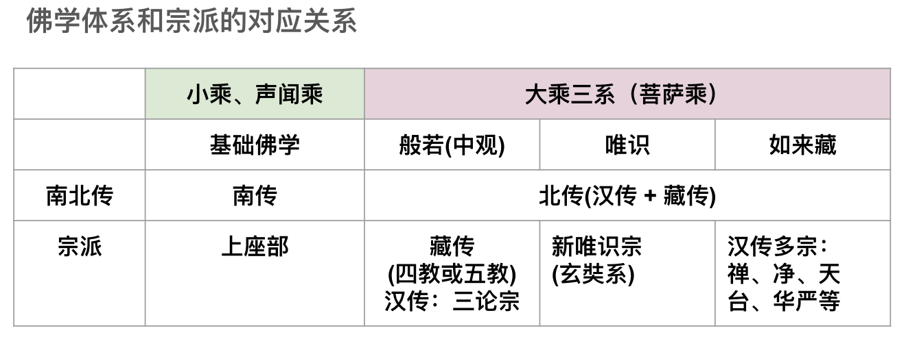

## 學佛卡殼了？—— 這是“正常”的。

佛教裡面的概念、名詞、理論實在太多了。

一會兒有，一會兒無， 
一會兒是，一會兒非， 
一會兒真，一會兒假， 
一會兒實，一會兒虛幻， 
一會兒要斷煩惱，一會兒煩惱即菩提 

這麼多的概念不僅對於初學來說是非常困難的，就是學佛十年，二十年的人，對於這些概念也常常是懵懵懂懂，似是而非的。再具體來說，是這樣的：

剛聽了一個概念，如斷煩惱，是這樣說，煩惱有貪、嗔、痴等等，好像聽懂了。 

過會兒，又聽了另一個相反的概念，如煩惱即菩提，又一番說法，煩惱即空，空即菩提，好像也挺懂了。 

再過會兒，當煩惱出現的時候，又無法空去煩惱的時候，就會陷入迷惑，困惑，懷疑了。如此反覆，就會感覺佛法無用了，越來越懈怠。所謂學佛十年，佛在天邊了。 

如果這個例子不夠，再來一個。

剛聽了一個概念，叫做“緣起性空”，意思是“因緣有自性空”。 
過會兒又聽到一個壇經裡面的“何其自性，能生萬法”。 
有人就會迷惑了，這個“自性”到底是空還是不是空啊？ 
如果“自性”是空的，為何又說可以“生萬法”呢？ 

以上所有的“矛盾”其實都是一個問題，那就是混淆了佛教的不同體系，在不同體系裡面，概念名稱相同，但是定義（或內涵）卻不盡相同。這就是造成上述困惑，迷茫的根本原因了。那要如何解決這個問題呢？其實也很簡單，那就是先了解各個體系的大概和區分，然後再選擇一個體系深入下去，只要先把一個體系弄得比較懂了，再去觸類旁通其他體系，這個時候就容易了 —— 這也是我個人學習佛法的心得了。

## 佛教分類（佛學分類）

傳統上是這樣分類的：

要麼是按照地域分類，比如分成南傳，北傳。北傳裡面再分漢傳、藏傳。 
漢傳裡面又分八宗或十宗。（略） 
藏傳裡面又分四教或五教。（略） 

這種分類方法有它的依據，但是這個分類並不完全是“佛法”上的區分（除了南、北傳）。如果要按照佛法體系（或佛學體系）分類，只需要分成四類：小乘，大乘。大乘裡面再分中觀（或般若）、唯識、如來藏。這就是大乘三系，再加上小乘（聲聞）。那就是總共四大分類了。

## 體系和宗派的簡單對照

簡單解讀：
1. 南傳，只有上座部，只是聲聞乘，現代也叫根本理論，或基礎理論。
2. 北傳包括漢傳和藏傳。
3. 藏傳都是中觀系（般若系）。
3. 漢傳中，只有三論宗是純正的般若系，新唯識宗是純正唯識系，其他的宗派如：禪、淨、天台、華嚴，甚至包括舊唯識都是如來藏系。舊唯識（即承認如來藏的）也可以算是如來藏繫了。

## 四大體系的核心理論

小乘、或聲聞乘（也有叫原始佛教，根本佛教，基礎佛教等名字），它的核心理論就是，緣起，也叫因緣法，緣起法。重要理論有：緣起法，四聖諦和十二因緣。對應經典：阿含經等。

般若，或叫中觀，它的核心理論是緣起性空。對應經典：般若經等，《心經》《金剛經》《大品般若》《中觀》等。

唯識，它的核心理論是萬法唯識。對應經典：《唯識三十頌》《解深密經》《成唯識論》等。

如來藏，它的核心理論是空如來藏，不空如來藏，空不空如來藏。對應經典：《如來藏經》《楞嚴經》《起信論》等（非常非常多）。

早在2022年08月06日的時候，我就寫過一篇對比三系的文章，依舊可以參考：

>【原創】嘗試對比中觀、唯識和如來藏
https://mp.weixin.qq.com/s/n1RfPHv65iJtp1WmARvSNQ
 中觀和唯識是印度佛教的兩大支柱，而當今學界所認為的三大體系之如來藏，並沒有在印度開宗立派，卻在傳入中國後成為主流。本文嘗試比較下三者，希望從中找到緣由。

>【原創】嘗試對比中觀、唯識和如來藏
https://yuqianyi1001.github.io/comparison-between-madhyamaka-Yogacara-Tathagatagarbha_zh-tw/
中觀和唯識是印度佛教的兩大支柱，而當今學界所認為的三大體系之如來藏，並沒有在印度開宗立派，卻在傳入中國後成為主流。本文嘗試比較下三者，希望從中找到緣由。

## 因緣法是一切體系的共同基礎和核心

**什麼是因緣法？**

>《雜阿含經》卷第十三，335經：謂“此有故彼有，此起故彼起，……此無故彼無，此滅故彼滅……”。

白話：因為這個存在所以那個存在，這個生起所以那個生起；因為這個不存在所以那個不存在，這個消失所以那個消失。

基本含義：一切事物的產生（起）和存在（有），都依賴於其他事物的產生和存在。同樣地，當一切事物所依賴的環境發生變化時，它們也會發生變化，最終因為依賴的消亡而消亡，最後依賴不存在（無）了，事物本身也不存在了。換句話說，一切事物都不能獨立地產生和存在。

這就是佛教最最核心、最最重要、最最基本的因緣法。也叫緣起法。

## 四大體系的核心區別

### 聲聞和般若

**般若的核心概念：空性和無生**

緣起法（或因緣法）是一切體系的基礎和共識。它的核心只有上面那四句。

聲聞和般若的思想是最為一致的，聲聞強調緣起，般若強調性空，雖然兩者強調的不同，但是從根本上來說，緣起就是性空，性空的原因就是緣起。所以，般若上也經常說 —— 緣起性空 —— 因緣有自性空。

因緣有，也就是假有，幻有 —— 而不是實有。

般若對“實有”的定義是常、一。常是指永恆存在，固定不變的存在，獨立自主地存在，不可分割、不可拆分，始終保持絕對“一”體的存在（都是絕對意義上）。但是，一切事物都是因緣和合才有的，所以，這類的因緣有，就是假有，而不是“實有”。

般若在這基礎上更進一步說 —— “無生”，一切法不生，這個生是指，一切“實有的”法不生，能生的法都是因緣和合才有，所以都是“假生”，而不是“實生”。

補充下：性空，空性是一個意思。無生、無相、無性也是一個意思。只是側重點不同，但是內涵一致。

### 般若和唯識

般若和唯識本身是沒有任何矛盾的，只是強調的東西不同而已。般若的核心概念前面已經說了。下面簡單說唯識。

唯識的核心其實也分簡單，唯識的核心是對八識的認知和了解。

但是從概念上，必須要了解一點，唯識上的“實法”和“假法”在定義和般若上的“實法”和“假法”不同。

般若上的實法，實有的法，定義是常、一，即有獨立的、自主的永恆不變的絕對存在。

唯識上的實法是指有種子，而種子是以比喻命名的，種子也不是般若意義上的“實有”，而是因緣有，是生滅的。唯識上的“假法”是說，沒有自己的種子，是根據“實法的種子”衍生的說法，比如說，唯識中的百法中的心所有51個，但是其中有很多的“心所”是假法，假立的，比如說“不害”心所，就是從“無嗔”心所衍生出來的假法，意思是，只有“無嗔”是有種子的，但是“不害”沒有種子，它只是“無嗔”的一個側面表現形式。

唯識上的真如，可以對應般若上的空性或無生。

### 如來藏

相對般若和唯識來說，都有清晰的簡單的定義，都可以用我們日常生活中的經驗來比擬大多數的概念和理論，就算是不容易體會和理解，也可以用邏輯推理的方式進行學習和討論。而用邏輯思維和推理對於佛學來說，其實是非常重要的，“聞思修”中的“思”就是邏輯思維和推理了。

而如來藏的概念最為複雜，比如如來藏的核心概念，即如來藏，就沒有一個簡單的定義。要正確地理解如來藏，必須要分三個角度分別進行，空如來藏（類似般若，但不是般若），不空如來藏（類似唯識，但不是唯識），空不空如來藏（類似中觀的八不）。

這就是如來藏概念的複雜性了。無論是般若的空還是唯識的有，都較容易理解和推理，因為他們的定義是簡單的，單一的。也很容易在日常生活中找到比喻的例子。而如來藏這樣同時具有三個角度，缺一不可的複雜概念來說，生活中找不到一個例子可以同時比喻三個角度，而只能找到不同的比喻分別比喻一個角度。這也造成了對如來藏難以瞭解。無法透徹瞭解，所以很多佛友總是在似懂非懂、模稜兩可的迷糊狀態（也就是卡殼了）。

我也嘗試過用簡單的語言來嘗試表達自己對如來藏的理解，多次嘗試後都不理想，思來想去，才總結出來說，因為如來藏的概念本身就是比般若和唯識複雜的。因此，沒有辦法簡化和通俗化。只能同時從這三個角度同時描述才不至於有缺陷，才是完整的思想。

**如來藏的自性是什麼？**

如來藏的自性必須同時包括這三個方面，缺一不可。

1. 空如來藏 —— 全部都非，意思是，沒有任何一個東西可以代指如來藏，也沒有部分東西可以代指如來藏。所以說，全部都非。
2. 不空如來藏 —— 全部都是，意思是，任何一個東西都是如來藏的體現（或表現），所以禪宗說：青青翠竹盡是法身，鬱郁黃花無非般若。（法身，般若都是如來藏的異名）。
3. 空不空如來藏，整合空和不空，兩者非二，空和不空是不二的。這點倒是和般若的八不類似了。

補充說，其實瞭解了以上的三點，很多禪宗的公案也就容易解讀了。

**綜上 —— 佛學四大體系的核心和差異**

## 如何讀懂佛經？

一、先判斷該經屬於哪個體系，是聲聞乘的基礎佛教（四聖諦，十二因緣），還是般若，唯識，或如來藏。

二、如果是聲聞乘的基礎佛教，就按照基礎佛教理論去理解，主要就是緣起法，四聖諦和十二因緣。如果是般若，就以般若的定義和體系去理解 —— 關鍵是緣起性空，或因緣有，自性空。如果是唯識，就以萬法唯識的定義和體系去理解 —— 這裡的自性是指種子，真如是空性。如果是如來藏，就以如來藏的定義和體系去理解 —— 全體都非（空如來藏），全體都是（不空如來藏），空不空是不二的（空不空如來藏）。

三、有些經典，會包括多個思想，那麼就可以分段落（分品，或分卷）去套上面的一和二了。

總之，只要不要把各個體系和定義混雜在一起，讀經就不會卡殼了。

其實，這樣的分類方式和學習方式和現代教育是一致的。現代教育都是分科教育的，語文，數學，物理，化學，生物，歷史，地理等。而古代教育，可能就是混雜在一起的，或者是比較粗條的分類，而沒有這麼細緻的分類。細緻的分類有助於學習和教育，這是現代教育最為成功的原因之一，我們當然也可以應用在佛學上。

祝願大家都能深入經藏，不卡殼。

阿彌陀佛。

愚千一

PS：這裡只是簡單地介紹下體系，所謂體系只是很粗的分類，嚴格來說，就需要有更細緻的分類，比如般若和中觀不同，唯識分新舊，以及淨土法門比較特殊，另外歷史上還有過俱舍宗等。總之，這篇文章的目的是希望作為一個讀懂經文的敲門磚。

