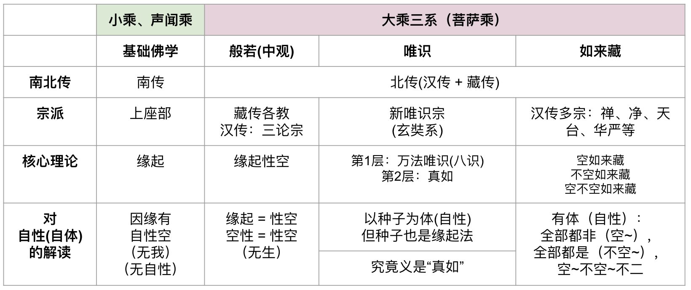

## 佛学四个体系

在上一篇文章《学佛卡壳了怎么办？试试这个方法 ｜ 按照体系学习佛法，就不会再卡壳了（超级推荐）｜ 略说佛学四大体系的异同》https://mp.weixin.qq.com/s/3phGhhEbBsb743CdgnUktA ，里面提到了四大体系和它们的差异。可用下面这张图帮助记忆。

总结起来说，即前面三个体系（基础佛学，般若/中观，唯识）都有相对简单的定义，清晰的逻辑；而最后的如来藏体系，相对来说，如来藏的概念非常复杂，同时具备三个角度，且缺一不可，又无法在日常生活中找到比喻，经常给学佛人造成了很大的困惑。

**所以，有句话在上篇文章中没有明确明说，这里再补充下，如果你觉得学佛很久了，但是依旧有困惑，无法彻底理解佛法，那你大概率是受如来藏思想影响比较大，可以试试先学习纯正的基础佛法，或纯正的般若，或纯正的新唯识。这样之后，或许会有突破。**

## 佛学四大体系和它们的“陷阱”

先给出这里对“陷阱”的定义，并不是说某个体系不好，而是说，如果对这个体系的思想有误解的话，就容易掉入“陷阱”当中了。所以这里的“陷阱”其实是误解的意思，但是，我觉得用“误解”这个词不足以形容其严重程度，因此，我用了“陷阱”这个词。

重申，佛法本身都是好的，只是因为我们学佛的人水平有限，有时讲法的人的水平也是有限的，最终就容易造成一系列的严重的误解，所以，我在这里把它们叫做“陷阱”了。

### 基础佛法没有“陷阱”

基础佛法理论的核心是：缘起法、四圣谛、十二因缘。而这里没有“陷阱”，虽然也会被误解，但是不严重，所以我不把它当作陷阱。

那常见的误解是什么呢？那就是认为佛教是悲观主义，消极主义，认为一切皆苦，是对生命的负面看法，有逃避的感觉。

这个误解是大众对佛教最常见的误解之一，虽然也不容易消除，但是只要认真学习下佛法，就不难纠正了 —— 佛法上说的“苦”，虽然也包括“痛苦”，“受苦”的意思，但更多的是“不稳定”，“不安定”的意思。前一个“苦”是身体或心理上的苦，后一个“苦”则更像是哲学上的表述了。

所以，基础佛法的目标就是“断苦”，苦因为无明引起，无明引发了贪、嗔、痴，及各种烦恼。如果能够消除“无明”，变成“明”，明白，明了，那么这种“苦”就会逐渐减轻，乃至消除 —— 最终进入一种无任何“苦”的状态 —— 涅槃寂静（人当然还活着，但是心理上再没有苦的感受了）。

缘起法又是最重要的核心，用缘起法来解释生命的流转时，就是十二因缘。用缘起法来解释外在的世界，就是因缘和合了（否则没有像前者一样有专有名词）。把对生命的解释和对世界的解释，汇合起来就是缘起法了（也叫因缘法）。

### 般若系有一个“大陷阱” —— 恶取空（或叫顽空）

般若系理论的核心理论就一个 —— 缘起性空，或再进一步，叫做“无生”，后面当然还可以再引申，这里就不再赘述了，有兴趣的去了解下四重二谛说。这里重点说下这个“大陷阱” —— 恶取空。

般若系的正解，就是缘起性空，因缘有自性空。因缘有，就是因缘和合而有，有的意思是产生和存在。自性空的意思是，没有一个东西，会有绝对独立的、恒常不变、固定不变的自性（自体）。

缘起和性空，实际上是同一个真理的两个角度表达，一个是从因缘的角度说，是因缘所生，另一个角度是从自性的角度说的，无自性。

再进一步说，一切因缘所生的法，都是假法，都是虚法，幻有 —— 不是真实存在。一定一定要记住，**实有的定义是：常、一**。所以说，没有一个“实法”是存在的，这就是“无生” —— 无任何实有的法被生出来，或存在。

对于性空（和空性是一个内涵）的一个常见误解就是 —— 恶取空（或叫顽空） —— 即不承认实有，也不承认假有，认为任何一切都是没有的 —— 没有善恶，没有因果，没有佛菩萨，没有众生，一切都没有，是一种绝对的虚无主义，消极主义。

一旦这样误解“空性”后，就是佛学上的“恶取空” —— 以恶意取住“空”相，并执“空”了。另一方面，也是因为这种执空的思想非常严重，会导致恶劣的后果 —— 例如，有人认为没有善恶，于是就放纵自己，放任自己。对于普通人，就是放弃自己了，变成了一个对自己不负责任的人，对于有权有势者，那危害就更大了 —— 甚至可以危害社会，乃至全人类。

所以佛教有说，“宁执有如须弥山，不执空如芥子许”。意思是，如果不能正确理解空性，不如就认为有，哪怕是，一切都是实有 —— 虽然，这不符合般若思想的意思，但是也比执空要好无数倍。

佛教又说，执有 —— 还有希望可以转念，而执空 —— 就没有办法再转念了，不可救了，因为任何说法，他都会认为是没有意义的，不再听任何劝说了 —— 这也是顽空名词的由来了。

补充：以上说的“不可救”是方便说，意思是，极难转变，但是并没有说，绝无转变的可能。

### 唯识体系也没有陷阱

唯识体系，也叫唯识学，有一个最常见的误解是 —— 唯识难学，实际上，唯识难学是因为古代文盲率超过99%了，不认识字的人，都是绝大多数的，这样的背景说下，说难学当然是非常正确的了。

而现代社会，很多国家的文盲率都非常低，甚至有非常高的比例是受过高等教育的（即高中及以上文化）。再以这样的背景来说唯识难学，就是人云亦云了，实际上，唯识不比高中的数理化难。

所以，唯识体系是没什么陷阱的。重复下，误解肯定也是有的，但是相对来说，都不到“陷阱”的地步了。

### 如来藏体系中有非常多的“陷阱”

前面三个，只有般若学有一个大陷阱 —— 恶取空，这个陷阱真的很大，一旦掉进去，极难改变，后果严重，所以是大陷阱。而基础佛学，唯识都是没有什么陷阱的，误解是有，但都不太严重。

相比而言，如来藏学的陷阱非常多。不过，虽然多，但每一个都不如“恶取空”那么大。也许，是祖师大德们的慈悲，为了大家不陷入“恶取空”这样的“大陷进”，所以才大谈特谈“如来藏”，虽然有陷进，但都是还可救的。

**陷进1：本来是佛**

对这句话的误解是：原来是佛，但是后来又堕落了，于是变成了凡夫。然后再进一步说，那修行是不是没用？最后成佛了又会堕落，还要再修。或者说，大家原来已经成佛了，后来又堕落了，于是又重新开始修行了。

这些是非常严重的误解，乃至连佛教常识都没有 —— 如果成佛后，还会堕落，还会再变成凡夫 —— 那修行就是这个世界上最大的骗局，没有之一。

实际上，这句话的正确理解是 —— 一切众生都有佛性，通过努力，都可以成佛。而成佛后，是不会再堕落的。

另外也可以参考《圆觉经》中的解释，我之前专门写过这个误解 ——
【被误解的佛教之 —— 本来是佛 | 正确解读的通用原则和通用方法 | 浅析《圆觉经》中的“本来成佛】 https://mp.weixin.qq.com/s/DEntY9gHvjSg6pfsMRfSsA

总结上文来说，就是《圆觉经》有“本来是佛”这句，但是它的意思是，这是胜义谛的表达，而非世俗谛的表达。而很多人都是把“胜义谛”和“世俗谛”搞混了，才产生了无数的误解。如果可以正确理解“胜义谛”和“世俗谛”，那么，99%以上的佛理都可以理解了。

**陷阱2：本自清净（自性清净）**

这句话的正确理解，也是要从胜义谛上去理解的，胜义谛上，一切都是不生不灭，不增不减，不垢不净，是一种超越二元对立的意思。而为了讨喜“喜欢清净”的人，把胜义谛描述成“本自清净”，是从“清净”的角度去描述它。

当然，根据俱舍对“净法”的定义也是包括道谛和无为法的。这是多一个用“净”来描述的理由。

这句话容易产生的误解是什么呢？ —— 那就是误以为会 —— 从净生染。误解为，在世俗谛上，我们也是清净的，一切都是清净的，但是因为无明，因为妄想，然后才产生了染污，产生了烦恼，以及贪瞋痴。

而如果在世俗谛里面也是“清净无染”的东西，却可以产生“染污” —— 那修行又有何用呢？和前面一个陷进一样，会对修行产生怀疑，从而无法坚定修行的信心和决心。

**陷阱3：常乐我净**

常、乐、我、净 —— 对它正确的、简单的理解，还是从胜义谛的角度去理解，事实上，这个常乐我净也多是用于形容涅槃（胜义谛）所具备的四个特点，而非是说世俗谛的事情，世俗谛上的众生了。

认为世俗谛上的众生或一切外在的事物也是常、乐、我、净，就是误解了。如果有了这样的误解，就不会积极地修行了。如果本来就是佛，而且本自清净，常乐我净的，那干嘛还要修行呢？ 修行就是多余的了。

## 总结

以上分别说明了：
* 基础佛法，没有陷阱。
* 般若系统，有一个大陷阱 —— 恶取空。
* （新）唯识系统，没有陷阱。
* 如来藏系统，有很多陷阱。

可能有人会来提醒说（或反驳），胜义谛和世俗谛，也是不二的，因此用形容胜义谛的词语来说世俗谛，从法理上来说，其实也是正确的。当然也是可以这样说的。

但是从学习的角度来说，绝大多数的人，都是要从小学开始起学的，然后才是初中，高中，大学这样。虽然有极少数的天才可以在少年时期就上大学（如大学的少年班），但是这些人依旧是具备了小学，初中，高中的完备知识，通过了考试，才能进入大学学习的。

相同的道理，学习佛法也应该有个顺序：
1. 先学习什么是世俗谛。
2. 再学习什么是胜义谛。
3. 最后再学习世俗谛和胜义谛是不二的。

这样的学习顺序就可以保证不产生误解了，不容易掉入陷阱了。就好比说，初中不毕业，学习成绩不达标，是上不了高中的。如果这个时候，可以不让他接触高中的知识，那怎么会产生误解呢？

但是学佛不是这样，大家每天可以接触到的佛学是不成体系的，也少有谈体系的，都是一个角度，一个观点。这样就容易产生误解了，乃至掉进陷阱里面了。

所以，如果我们有不理解的地方，就应该回到基础，回到顺序，按照顺序学习。

最后，祝愿大家都能远离陷进 —— 深入经藏，智慧如海。

阿弥陀佛。

愚千一

