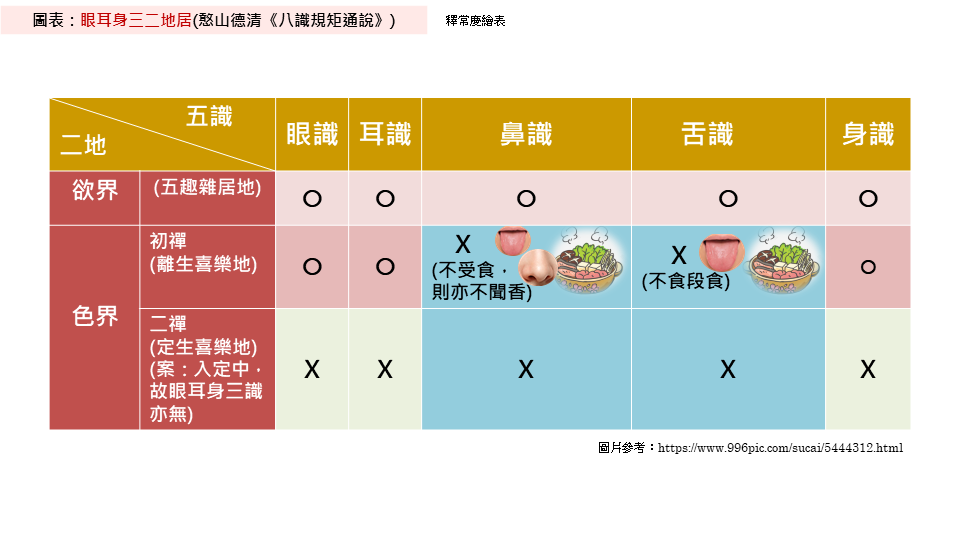

# 《八识规矩颂》原文

唐三藏法师玄奘奉诏撰

## 前五识（三颂十二句）

性境现量通三性　眼耳身三二地居  
遍行别境善十一　中二大八贪瞋痴  
五识同依净色根　九缘七八好相邻  
合三离二观尘世　愚者难分识与根  
变相观空唯后得　果中犹自不诠真  
圆明初发成无漏　三类分身息苦轮  

## 第六识（三颂十二句）

三性三量通三境　三界轮时易可知 
相应心所五十一　善恶临时别配之 
性界受三恒转易　根随信等总相连 
动身发语独为最　引满能招业力牵 
发起初心欢喜地　俱生犹自现缠眠 
远行地后纯无漏　观察圆明照大千 

## 第七识（三颂十二句）

带质有覆通情本　随缘执我量为非 
八大遍行别境慧　贪痴我见慢相随 
恒审思量我相随　有情日夜镇昏迷 
四惑八大相应起　六转呼为染净依 
极喜初心平等性　无功用行我恒摧 
如来现起他受用　十地菩萨所被机 

## 第八识（三颂十二句）

性唯无覆五遍行　界地随他业力生 
二乘不了因迷执　由此能兴论主诤 
浩浩三藏不可穷　渊深七浪境为风 
受熏持种根身器　去后来先作主公 
不动地前才舍藏　金刚道后异熟空 
大圆无垢同时发　普照十方尘刹中 

# 《八识规矩颂》白话文

网络上找到了几个白话文版本，但是经常无法访问，因此在我可以访问的时候，我把内容在这里做了一个备份，可供参考。其实还有一个版本，但是在我写文章的时候，它还无法访问，所以无法备份了。后续如果后续看到更多的版本，也会放在这个页面中。也可以自行搜索“《八识规矩颂》白话文”。

简体： https://yuqianyi1001.github.io/ba-shi-gui-ju-song-bai-hua-wen/
繁体： https://yuqianyi1001.github.io/ba-shi-gui-ju-song-bai-hua-wen_zh-tw/

# 八识的要点和修行中的关键转折点

## 前五识颂 

前五识至少要记得这样几个要点：

1. 前五识本身是中性的、客观的，但是也可以参与行善和行恶。这是非常容易理解，如眼睛可以看到天空，这本身是不善不恶的。拜佛的时候，眼睛看着佛像，这是行善。小偷小摸正在偷钱包的时候，眼睛要盯住钱包不放，这是行恶。对应的颂文是“性境现量通三性”。
2. 了解前五识起作用的范围，可以辅助判断禅定是真是假 —— 颂文是“眼耳身三二地居”，参考下图：
  * 前五识（眼耳鼻舌身）全都有的，只有欲界（对应六道轮回中的大部分，除了四禅八定）。
  * 初禅中起作用的只有眼识、耳识、身识。而没有鼻识、舌识。
  * 二禅及以上，前五识全部不起作用了。

注意：
* 前五识的根都在，但是不起作用而已，不要误会了，以为入了二禅就没有眼睛、鼻子等。
* 这里的禅定不包括未到地定和中间禅。未到地定接近初禅，中间禅接近二禅。所以，也可以类比和推测。

（图片来源：释常庆法师的《八识规矩颂参考图表》 https://cqings.blogspot.com/2021/05/blog-post_20.html ）

了解了这些以后，当有人说，我入了禅定（初禅以上才叫禅定），闻到了扑鼻而来的檀香。 —— 就可以轻易判断，这不是禅定了，初禅就没有鼻识了，鼻识只在欲界（欲界的鬼神会吃香味），禅定以上就没有鼻识，自然吃不到香味了。又有人说，我入了二禅、三禅，乃至四禅，看见了很多的佛菩萨，还和佛菩萨说话了 —— 这还是错误的，肯定不是二禅及以上的禅定，因为二禅及以上就没有眼识，自然无法看到了，能看到的，必定不是二禅了。

注意：这里也不包括神通的情况，有禅定就可以发起神通，而有无神通是比较容易验证的。

修行中的关键转折点只有一个：

3. **成佛的时候，前五识才会从有漏变成无漏，从染污的变成清净的**。颂文是：“圆明初发成无漏”。
4. **成佛后，前五识才会转为成所作智**，才能化出三类身体度化无量无边的众生。颂文是：“三类分身息苦轮”。

三类身体是：自受用身，他受用身（即佛报身）和，应化身（如娑婆世界的释迦牟尼佛）。

|  | **前五识**  |
|--|------|
| **颂文**   | 圆明初发成无漏 |
| **有漏**   | 成佛前 |
| **无漏**   | 成佛后 |
| **转识成智**   | 成佛后 |

## 第六识（意识）

因为第六识（意识）在唯识之外，已经讲得比较多了，所以，大家对第六识其实都不陌生，只是一般的讲法里面，虽然是讲意识，但有时会隐含了第七、第八识在里面，而没有特别去讲第六、七、八识的区别而已。

而在唯识中，哪些是第六识的作用，哪些是第七，第八识的作用是区分的比较清晰的。

所以第六识（意识）的要点是：
1. 在八识中，能够发动身体，能够发出语言，第六识的作用最为明显、最为突出、最为强大 —— 颂文：“动身发语独为最”
  * 前五识也会有作用，但是作用较为微弱（类似现代医学所说的肌肉惯性或神经反射）
  * 第七识和第八识都没有**直接**发动身体和触发语言的功能，这里说的是直接，虽然一切的行为都是由第八识中的种子所变现的，但却不是第八识本身的作用。第七识虽然有我执，有染污的作用，但也不直接发动身体和触发语言。
2. 第六识造业的能力也是最强的 —— 颂文：“引满能招业力牵”，这句话依然是相对前五识和第七、第八识而言的。
  * 前五识也能造业，参与造业，但是作用微弱，大多数的情况都是因为第六识的驱使。前五识本身的造业，如走路踩死蚂蚁，这是身体在没有第六识参与的情况下也可能造下的恶业（严重程度较轻）。
  * 第六识造业能力最强。
  * 第七识有染污但不造业 —— 第七识只会染污第六识，告诉他有我，是我的。但第七识不直接参与造业。
  * 第八识完全不造业 —— 第八识完全是中性的、客观的存在。

修行中的关键转折点有两个：
3. 见道位的时候，第六识才开始转变为无漏。意思是，见道位前，第六识是纯有漏，见道位后开始，有时无漏，有时有漏。颂文：“发起初心欢喜地”。
  * 什么时候是无漏呢？升起空观的时候，才是无漏，才有妙观察智。
  * 什么时候是有漏呢？没有升起空观的时候，就是有漏，有漏的时候就没有妙观察智了。
  * 有漏的时候，俱生我执和俱生法执依然会现行，会有烦恼障和所知障。颂文：“俱生犹自现缠眠”。

注意：升起空观就是入禅定了，这里的禅定按照狭义的理解，就是要打坐入定。如果按照禅宗的理解，不打坐的时候也可以，但，即便是不打坐，定力和入禅定的定力是一样的。（这相当于狭义禅定和广义禅定的区别了。）

4. 八地及以上第六识才变成是无漏的了，成佛后才是完全无漏。
  * 严格来说，其实是从第七地的出位就开始算的，但是因为第七位的出，和第八地的入都是在很短的时间内（比如是一瞬间？或一刹那？）就完成的，所以，简单记述来说，就算第八地好了。一般的说法中，也都是以八地作为菩萨的关键转折点的。
  * 颂文：“远行地后纯无漏”中说纯无漏，但是染污的种子还是有的，只是因为八地菩萨的空观任运而生（自动升起，不需要加行），俱生我执的种子无法变现了。所以，从现行的角度来说，第六识是纯无漏的，但是无漏（俱生我执）的种子还有，这部分要到成佛前才彻底断除。

|  | **前五识**  | **第六识(意识)**  |
|--|------|------|
| **颂文**   | 圆明初发成无漏 |发起初心欢喜地 俱生犹自现缠眠 远行地后纯无漏 | 
| **纯有漏**   | 成佛前 | 见道位前 |
| 有漏无漏间杂 | 不存在这种情况 | 初地到七地 |
| 是无漏，但 还有染污种子 | 不存在这种情况 | 八地及以上 |
| **纯无漏**   | 成佛后 | 成佛后 |
| **转识成智**   | 成佛后 | 无漏时 成佛后 |

## 第七识（末那识）

要点：
1. 在凡夫位上的时候，第七识（末那识）永远在那里打量着第八识（的见分），然后就把这个第八识（的见分）当成了我。这就是俱生我执的根本来源。它时时刻刻地染污着第六识，让我们生死轮回。即便是动物（或其他有情），也是有这样一个俱生我执的。颂文：“恒审思量我相随”。

修行上的关键转折点：

2. 初地菩萨开始证得平等性智（无漏）。

什么时候有平等性智（无漏）？什么时候是有漏的？和第六识一样，升起空观的时候，第六识是无漏，第七识也是无漏，没有空观的时候，第六识转回到有漏，第七识也回到有漏的。这个阶段，要有功用行。意思是，主观上，要故意去升起空观，才能升起空观。而其他情况，空观不会任运而起（无法自动起来，必须加行）。

3. 同第六识类似，八地及以上变成无漏，但依然俱生法执的种子。成佛后，才会变成完全无漏的。

类似第六识变无漏，是因为八地时，空观任运而起，不需要加行也一直在空观中，所以，即使有俱生我执、俱生法执的种子，但是无法变现。所以说八地及以上，第七识也是无漏的。而到了成佛前的金刚喻定，才会彻底断除一切种子，变成完全无漏的第七识了。

|  | **前五识**  | **第六识(意识)**  | **第七识(末那)**  |
|--|------|------|------|
| **颂文**   | 圆明初发成无漏 |发起初心欢喜地 俱生犹自现缠眠 远行地后纯无漏 | 极喜初心平等性 无功用行我恒摧 |  
| **纯有漏**   | 成佛前 | 见道位前 | 见道位前 |
| 有漏无漏间杂 | 不存在这种情况 | 初地到七地 | 初地到七地 |
| 是无漏，但 还有染污种子 | 不存在这种情况 | 八地及以上 | 八地及以上 |
| **纯无漏**   | 成佛后 | 成佛后 | 成佛后 |
| **转识成智**   | 成佛后 | 无漏时 成佛后 | 无漏时 成佛后 |

## 第八识（阿赖耶识）

要点：

1. 大海和波浪的比喻 —— 大海比作第八识，里面有无数的种子。人生比作波浪，七次连续推动的波浪，比作前七识。颂文：“浩浩三藏不可穷，渊深七浪境为风”。

这个比喻很好地回答了这样一个问题，过去世那么多，过去世造的善业、恶业、无记业也那么多，现世的这一辈子是所有的种子都变现了吗？还是一部分？就像大海和波浪的关系，无论多大的波浪，无论是滔天大浪，还是微风微波，它只是一部分海水，而不是全部的海水。所以，现世的一辈子，也只是一部分种子会变现而已，而不是全部的。

2. 在生命轮转的时候，是第八识最先来，也是第八识最后去。颂文：“去后来先作主公”。

这里有一个限定条件，是以人道而言，而且是以胎生的人类而言的。如天人，是化生的，一瞬间就有了一个成熟的身体，而不像胎生的，是从一个受精卵变成的，受精卵的时候，暂不论第七识，和第六识，前五识都是不明显的，说是没有前五识也可以的。

在临终关怀和助念中，断气后，身体依然有余温（高于室温的意思），这就是说第八识（俗称神识）还在身体里面，其实是还有佛法里面的“生命”的意思。断气只是医学上的“生命死亡”，但不是佛法上的。只有身体的余温也没了，变成室温，或略低于室温，这个时候才说，第八识（神识）离开了身体，开始了中阴身或下一段生命。

所以，颂文中的“来去”是拟人说，并不是真的有一个东西来来去去，用唯识的术语是“唯识所变”，变现的变。

修行上的关键转折点，其实都体现在第八识的名称中。

### 第八识有多个名称

第八识有多个名称，每个名称的意义不同，适用的范围是不同的。

* 藏识（梵语：阿赖耶识），适用范围是从凡夫到七地。
* 异熟识（梵语：毘播迦），适用范围是从凡夫到成佛前，包括十地菩萨。
* 无垢识（清净识）：适用范围是成佛后。
* 执持识（梵语：阿陀那识，也叫清净识）：适用范围是从凡夫到佛都可以，指成佛后也适用。

做成表格后，显示如下：

|    | 凡夫和初地到七地    | 八地到十地 | 成佛后 |
| ---- | ----- | ----- | --- |
| 阿赖耶识  | ✅       | ❌      | ❌      |
| 异熟识    | ✅       | ✅      | ❌      |
| 无垢识    | ❌       | ❌      | ✅      |
| 执持识    | ✅       | ✅      | ✅      |

通常说的“第八识”，适用范围也是从凡夫到佛都可以的。如果对于以上名字记不住，那么只用第八识来描述凡夫、菩萨和佛是最准确的。

最常用的“阿赖耶识”反而只是适用于八地前的菩萨和凡夫了，而不适用于佛了。所以，切换下视角，若以修行的果位来说。应该是这样的：

* 凡夫的第八识：可以叫做阿赖耶识，异熟识，执持识。但是不能叫做无垢识。
* 八地到十地的菩萨的第八识可以叫做异熟识，执持识。但是不能叫做阿赖耶识和无垢识。
* 成佛后的第八识：可以叫做执持识和无垢识，但是不能叫做：阿赖耶识，异熟识。

阿弥陀佛。

愚千一

