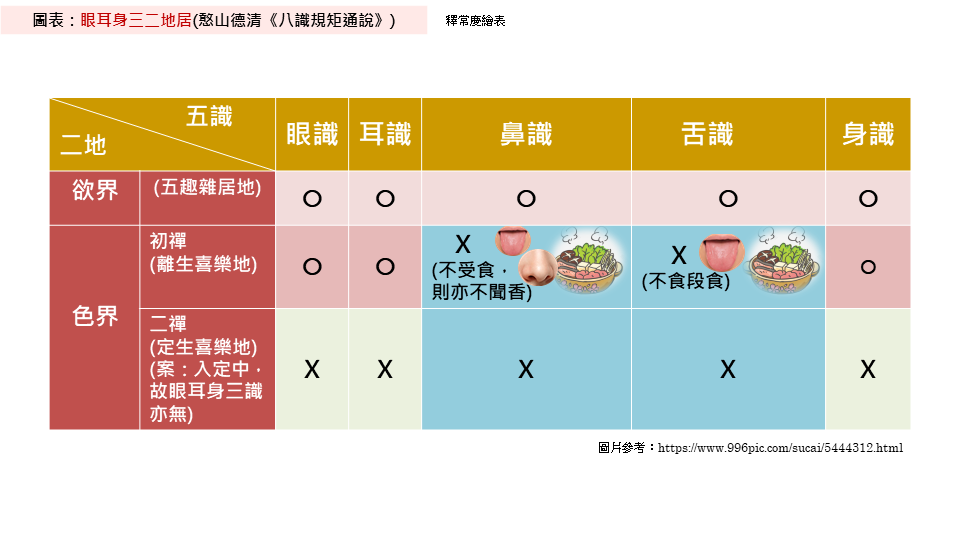

# 《八識規矩頌》原文

唐三藏法師玄奘奉詔撰

**前五識（三頌十二句）**

性境現量通三性　眼耳身三二地居  
遍行別境善十一　中二大八貪瞋癡  
五識同依淨色根　九緣七八好相鄰  
合三離二觀塵世　愚者難分識與根  
變相觀空唯後得　果中猶自不詮真  
圓明初發成無漏　三類分身息苦輪  

**第六識（三頌十二句）**

三性三量通三境　三界輪時易可知 
相應心所五十一　善惡臨時別配之 
性界受三恆轉易　根隨信等總相連 
動身發語獨爲最　引滿能招業力牽 
發起初心歡喜地　俱生猶自現纏眠 
遠行地後純無漏　觀察圓明照大千 

**第七識（三頌十二句）**

帶質有覆通情本　隨緣執我量爲非 
八大遍行別境慧　貪癡我見慢相隨 
恆審思量我相隨　有情日夜鎮昏迷 
四惑八大相應起　六轉呼爲染淨依 
極喜初心平等性　無功用行我恆摧 
如來現起他受用　十地菩薩所被機 

**第八識（三頌十二句）**

性唯無覆五遍行　界地隨他業力生 
二乘不了因迷執　由此能興論主諍 
浩浩三藏不可窮　淵深七浪境爲風 
受燻持種根身器　去後來先作主公 
不動地前才舍藏　金剛道後異熟空 
大圓無垢同時發　普照十方塵剎中 

# 《八識規矩頌》白話文

網絡上找到了幾個白話文版本，但是經常無法訪問，因此在我可以訪問的時候，我把內容在這裏做了一個備份，可供參考。其實還有一個版本，但是在我寫文章的時候，它還無法訪問，所以無法備份了。後續如果後續看到更多的版本，也會放在這個頁面中。也可以自行搜索“《八識規矩頌》白話文”。

簡體： https://yuqianyi1001.github.io/ba-shi-gui-ju-song-bai-hua-wen/
繁體： https://yuqianyi1001.github.io/ba-shi-gui-ju-song-bai-hua-wen_zh-tw/

# 八識的要點和修行中的關鍵轉折點

## 前五識

**前五識的要點：**

1. 前五識本身是中性的、客觀的，但是也可以參與行善和行惡。頌文：“性境現量通三性”。

這是非常容易理解，如眼睛可以看到天空，這本身是不善不惡的（即是無記）。 
拜佛的時候，眼睛看着佛像，這是行善。 
小偷小摸正在偷錢包的時候，眼睛要盯住錢包不放，這是行惡。

2. 瞭解前五識起作用的範圍，可以輔助判斷禪定是真是假 —— 頌文是“眼耳身三二地居”，參考下圖：
  * 前五識（眼耳鼻舌身）全都有的情況只有欲界（對應六道輪迴中的大部分，除了四禪八定）。
  * 初禪中起作用的只有眼識、耳識、身識。而沒有鼻識、舌識。
  * 二禪及以上，前五識全部不起作用了。

注意：
* 前五識的根都在，但是不起作用而已，不要誤會了，以爲入了初禪就沒了鼻子和舌頭，入了二禪就沒了眼睛、耳朵和身體。
* 這裏的禪定不包括未到地定和中間禪。未到地定接近初禪，中間禪接近二禪。所以，也可以類比和推測。

（圖片來源：釋常慶法師的《八識規矩頌參考圖表》 https://cqings.blogspot.com/2021/05/blog-post_20.html ）

瞭解了這些以後，當有人說，我入了禪定（初禪以上才叫禪定），聞到了撲鼻而來的檀香。 —— 就可以輕易判斷，這不是禪定了，初禪就沒有鼻識了，鼻識只在欲界（欲界的鬼神會喫香味），禪定以上就沒有鼻識，自然聞不到香味了。又有人說，我入了二禪、三禪，乃至四禪，看見了很多的佛菩薩，還和佛菩薩說話了 —— 這還是錯誤的，肯定不是二禪及以上的禪定，因爲二禪及以上就沒有眼識，自然無法看到了，能看到的，必定不是二禪了。

注意：這裏也不包括神通的情況，有禪定就可以發起神通，而有無神通是比較容易驗證的。而當一個人說自己沒有神通，但又入了禪定的時候，你可以追問下禪定的境界，即可對照判斷真假了。（可以判斷，但是不建議隨意戳穿別人，至於說還是不說，請視情況而定😄）。

**修行中的關鍵轉折點：**

3. 成佛的時候，前五識才會從有漏變成無漏，從染污的變成清淨的。頌文是：“圓明初發成無漏”。這裏的無漏是完全的無漏。
4. 成佛後，前五識才會轉爲成所作智，才能化出三類身體度化無量無邊的衆生。頌文是：“三類分身息苦輪”。

三類身體是：自受用身，他受用身（即佛報身）和應化身（如娑婆世界的釋迦牟尼佛）。

|  | **前五識**  |
|--|------|
| **頌文**   | 圓明初發成無漏 |
| **有漏**   | 成佛前 |
| **完全無漏**   | 成佛後 |
| **轉識成智**   | 成佛後 |

## 第六識（意識）

因爲第六識（意識）在唯識之外，已經講得比較多了，所以，大家對第六識其實都不陌生，只是一般的講法裏面，雖然是講第六識意識，但有時會隱含了第七、第八識在裏面，而沒有特別去講第六、七、八識的區別而已。

而在唯識中，哪些是第六識的作用，哪些是第七，第八識的作用是區分的比較清晰的。

以下是**第六識（意識）的要點**是：

1. 在八識中，能夠發動身體，能夠觸發語言，第六識的作用最爲明顯、最爲突出、最爲強大 —— 頌文：“動身發語獨爲最”
  * 前五識也會有作用，但是作用較爲微弱（類似現代醫學所說的肌肉慣性或神經反射）
  * 第七識和第八識都沒有**直接**發動身體和觸發語言的功能，這裏說的是直接，雖然一切的行爲都是由第八識中的種子所變現的，但卻不是第八識本身的作用。第七識雖然有我執，有染污的作用，但也不直接發動身體和觸發語言。
2. 第六識造業的能力也是最強的 —— 頌文：“引滿能招業力牽”，這句話依然是相對前五識和第七、第八識而言的。
  * 前五識也能造業，參與造業，但是作用微弱，大多數的情況都是因爲第六識的驅使。前五識本身的造業，如走路踩死螞蟻，這是身體在沒有第六識參與的情況下也可能造下的惡業（無意識下的業報都是不太嚴重的，是較輕的）。
  * 第六識造業能力最強（無需多解釋了）。
  * 第七識有染污但不造業 —— 第七識只會染污第六識，告訴第六識有我，有我所。但第七識**不直接**參與造業。
  * 第八識完全不造業 —— 第八識完全是中性的、客觀的存在。

**修行中的關鍵轉折點**有兩個：

3. 見道位的時候，第六識才開始轉變爲無漏。意思是，見道位前，第六識是純有漏，見道位後開始，有時無漏，有時有漏。頌文：“發起初心歡喜地”。
  * 什麼時候是無漏呢？升起空觀（我空，法空）的時候，纔是無漏，纔有妙觀察智。
  * 什麼時候是有漏呢？沒有升起空觀的時候，就是有漏，有漏的時候就沒有妙觀察智了。
    * 八地前的菩薩必須加行才能升起空觀。
    * 見道位前的凡夫無法升起空觀（只能升起類似的空觀，但不是見道位後的空觀）。
  * 有漏的時候，未升起空觀的時候，俱生我執和俱生法執依然會現行，會有煩惱障和所知障。頌文：“俱生猶自現纏眠”。

注意：升起空觀是否需要入禪定？不一定。這裏的禪定按照狹義的理解，就是要打坐入定（初級）。八地菩薩的空觀任運而生，就不需要打坐入禪定了。如果按照禪宗的理解，不打坐的時候也可以，但，即便是不打坐，定力和入禪定的定力要能一樣。這相當於狹義禪定和廣義禪定的區別了。

4. 八地及以上第六識才變成是無漏的了，成佛後纔是完全無漏。
  * 嚴格來說，其實是從第七地的出位就開始算的，但是因爲第七位的出，和第八地的入都是在很短的時間內（比如是一瞬間？或一剎那？）就完成的，所以，簡單記述來說，就算第八地好了。一般的說法中，也都是以八地作爲菩薩的關鍵轉折點的。
  * 頌文：“遠行地後純無漏”中說純無漏，但是染污的種子還是有的，只是因爲八地菩薩的空觀任運而生（自動升起，不需要加行），俱生我執的種子無法變現了。所以，從現行的角度來說，第六識是純無漏的，但是無漏（俱生我執）的種子還有，這部分要到成佛前才徹底斷除。

|  | **前五識**  | **第六識(意識)**  |
|--|------|------|
| **頌文**   | 圓明初發成無漏 |發起初心歡喜地 俱生猶自現纏眠 遠行地後純無漏 | 
| **純有漏**   | 成佛前 | 見道位前 |
| 有漏無漏間雜 | 不存在這種情況 | 初地到七地 |
| 是無漏，但 還有染污種子 | 不存在這種情況 | 八地及以上 |
| **純無漏**   | 成佛後 | 成佛後 |
| **轉識成智**   | 成佛後 | 無漏時 成佛後 |

## 第七識（末那識）

**要點：**

1. 在凡夫位上的時候，第七識（末那識）永遠在那裏打量着第八識（的見分），然後就把這個第八識（的見分）當成了我。

這就是俱生我執的根本來源。它時時刻刻地染污着第六識，讓我們執着有我，我所，導致生死輪迴。即便是動物（或其他有情），也是有這樣一個俱生我執的。頌文：“恆審思量我相隨，有情日夜鎮昏迷”。

**修行上的關鍵轉折點：**

2. 初地菩薩開始證得平等性智（無漏）。

什麼時候有平等性智（無漏）？什麼時候是有漏的？和第六識一樣，升起空觀的時候，第六識是無漏，第七識也是無漏，沒有升起空觀的時候，第六識轉回到有漏，第七識也回到有漏的。這個階段，要有功用行。意思是，主觀上，要故意（加行）去升起空觀，才能升起空觀。不加行升起空觀的時候，或空觀的力量退失的時候，第六、第七識就回到了有漏了。

3. 同第六識類似，八地及以上變成無漏，但依然俱生法執的種子。成佛後，纔會變成完全無漏的。

類似第六識變無漏，是因爲八地時，空觀任運而起，不需要加行也一直在空觀中，所以，即使有俱生我執、俱生法執的種子，但是無法變現。所以說八地及以上，第七識也是無漏的。而到了成佛前的金剛喻定，纔會徹底斷除一切種子，變成完全無漏的第七識了。

|  | **前五識**  | **第六識(意識)**  | **第七識(末那)**  |
|--|------|------|------|
| **頌文**   | 圓明初發成無漏 |發起初心歡喜地 俱生猶自現纏眠 遠行地後純無漏 | 極喜初心平等性 無功用行我恆摧 |  
| **純有漏**   | 成佛前 | 見道位前 | 見道位前 |
| 有漏無漏間雜 | 不存在這種情況 | 初地到七地 | 初地到七地 |
| 是無漏，但 還有染污種子 | 不存在這種情況 | 八地及以上 | 八地及以上 |
| **純無漏**   | 成佛後 | 成佛後 | 成佛後 |
| **轉識成智**   | 成佛後 | 無漏時 成佛後 | 無漏時 成佛後 |

備註：有種說法說，第七識沒有八地這個關鍵轉折點，只有成佛後才變成無漏的。以我等初學來說，知道有不同說法即可，不影響整體瞭解就可以。

## 第八識（阿賴耶識）

**要點：**

1. 大海和波浪的比喻 —— 大海比作第八識，裏面有無數的種子。人生比作波浪，七次連續推動的波浪，比作前七識。頌文：“浩浩三藏不可窮，淵深七浪境爲風”。

這個比喻很好地回答了這樣一個問題，過去世那麼多，過去世造的善業、惡業、無記業也那麼多，現世的這一輩子是所有的種子都變現了嗎？還是一部分？就像大海和波浪的關係，無論多大的波浪，無論是滔天大浪，還是微風微波，它只是一部分海水，而不是全部的海水。所以，現世的一輩子，也只是一部分種子會變現而已，而不是全部的。

2. 在生命輪轉的時候，是第八識最先來，也是第八識最後去。頌文：“去後來先作主公”。

這裏主要是指人道而言，而且是以胎生的人類而言的。如天人，是化生的，一瞬間就有了一個成熟的身體，而不像胎生的，有一個過程，是從一個受精卵慢慢變成嬰兒的，受精卵的時候，暫不論第七識，和第六識，前五識都是不明顯的，說是沒有前五識也可以的。

在臨終關懷和助念中，斷氣後，身體依然有餘溫（高於室溫的意思），這就是說第八識（俗稱神識）還在身體裏面，其實是還有佛法裏面的“生命”的意思。斷氣只是醫學上的“生命死亡”，但不是佛法上的。只有身體的餘溫也沒了，變成室溫，或略低於室溫，這個時候才說，第八識（神識）離開了身體，開始了中陰身或下一段生命。

所以，頌文中的“來去”是擬人說，並不是真的有一個東西來來去去，用唯識的術語是“唯識所變”，變現的變。

**修行上的關鍵轉折點，其實都體現在第八識的名稱中。**

### 第八識有多個名稱

第八識有多個名稱，每個名稱的意義不同，適用的範圍是不同的。

* 藏識（梵語：阿賴耶識），能藏和所藏，所藏的種子主要是指會變現的染污的種子，適用範圍是從凡夫到七地。
* 異熟識（梵語：毘播迦），適用範圍是從凡夫到成佛前，包括十地菩薩。
* 無垢識（清淨識）：適用範圍是成佛後。此識是絕對的清淨的無污染的識。
* 執持識（梵語：阿陀那識，也叫清淨識）：適用範圍是從凡夫到佛都可以，指成佛後也適用。這個識是指執持身根不散壞，尤其是第六識有中斷的時候（如無想定，滅盡定），若無此識，入定時人即散壞，無法出定了。

做成表格後，顯示如下：

|    | 凡夫和初地到七地    | 八地到十地 | 成佛後 |
| ---- | ----- | ----- | --- |
| 阿賴耶識  | ✅       | ❌      | ❌      |
| 異熟識    | ✅       | ✅      | ❌      |
| 無垢識    | ❌       | ❌      | ✅      |
| 執持識    | ✅       | ✅      | ✅      |

通常說的“第八識”，適用範圍也是從凡夫到佛都可以的。如果對於以上名字記不住，那麼只用第八識來描述凡夫、菩薩和佛是最準確的。

最常用的“阿賴耶識”反而只是適用於八地前的菩薩和凡夫了，而不適用於佛和八地之後的菩薩了。所以，切換下視角，若以修行的果位來說。應該是這樣的：

* 凡夫，及初地到七地菩薩的第八識：可以叫做阿賴耶識，異熟識，執持識。但是不能叫做無垢識。
* 八地到十地的菩薩的第八識可以叫做異熟識，執持識。但是不能叫做阿賴耶識和無垢識。
* 成佛後的第八識：可以叫做執持識和無垢識，但是不能叫做：阿賴耶識，異熟識。

## 總結

宗寶本的《壇經》有說：六七因中轉，五八果上轉。

這句話就是對於八識在修行中關鍵轉折點的總結。意思是說，第六識和第七識在因地中，就會開始轉了（轉識成智），這裏的因地是菩薩地中的因地，見道位後的意思，不要誤會說是凡夫位上開始轉。而前五識和第八識都是要在佛果上才轉（轉識成智）。

以上就是上篇了，下篇待續，下篇的內容會包括，八識和心所的對照關係，我執和法執的作用範圍等。

阿彌陀佛。

愚千一

