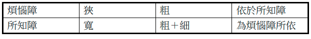

前文《八识的要点和修行中的关键转折点 ——《八识规矩颂》的学习笔记(上)》https://mp.weixin.qq.com/s/r5IuxxL98S7wcK9dMjrCvw 中，分别根据前五识、第六识（意识），第七识（末那识），第八识的要点和修行中的关键转折点。本文将继续讨论八识，首先是和心所的对照关系，其次是我执和法执的作用范围等。

# 八识分别对应的心所

（图片来源：释常庆法师的《八识规矩颂参考图表》 https://cqings.blogspot.com/2021/05/blog-post_20.html）

图中的含义已经非常明显了，这里就不再赘述了。但是值得补充的地方是，这里所描述的八识（图中的心王）是指针对凡夫的情况，如果见道后的修道位，以及究竟位的佛果，八识对应的心所就会发生变化了。下面就以究竟位的佛果来举例，毕竟成佛都是学佛人的终极目标，（以《法华经》为依据而言），那么再了解下成佛后的状态，总是令人感到期待又备受鼓舞的。那么成佛后的八识对应多少个心所呢？

| 心王 | 心所数量  | 心所 |
|--|------|------|
| 成佛后的八识 | 21个  | 遍行（5）+ 别境（5）+ 善（11） |

以上所示，非常简单，八识全部都只有21个心所了。没有任何心所再会和烦恼心所相应，所以排除掉6个根本烦恼和20个随烦恼了，以大乘佛教对佛陀的描述来说（主要指报身），并不认为佛会有无记的情况（如睡觉等），所以4个不定心所也没有了。（其他部派佛教以释迦牟尼佛为主，即人间的佛陀，认为佛会有无记的情况，这就另说了，知道即可。）

# 我执和法执

我执就是烦恼障，法执就是所知障。烦恼障比较容易理解，就是起了烦恼现行，或还没有起烦恼的种子（和习气）。所知障的定义稍微复杂一点，在详细解释之前，可以先记住一个口诀 —— 烦恼障涅槃，所知障菩提。

意思是，二乘圣者声闻和缘觉可以入涅槃，这里的涅槃就是指断掉一切烦恼了。所知障对此没有影响，所知障碍的菩提，就是障碍成佛的意思。想要成佛，必须连所知障也断除。

## 所知障的误解

那就是认为所知道的东西（内容或见解）障碍了自己，变得不能接受其他的知识或观点了。这样的误解是依文解意。

## 所知障的定义

简单来说，就是认为实有诸法，不能正确认识诸法，因此障碍了对真如的正确认知。详细解释可以参考下面：

>《成唯识论》︰「所知障者，谓执徧计所执实法萨迦耶见而为上首。见、疑、无明、爱、恚、慢等，覆所知境无颠倒性，能障菩提名所知障。（中略）」

> 演培法师《成唯识论讲记》卷九（摘录）︰什么叫做所知障﹖所谓「所知障者」，就是「执」着「徧计所执」着的「实」有诸「法」，以法我、我所的「萨迦耶见而为上首」。如指出这所知障的体性，主要的有「见、疑、无明、爱、恚、慢等」诸惑。实际说来，这些都与烦恼障相同的，因为烦恼相应，必然是有所知障的。不过烦恼障的相貌粗，所以有多种不同的品类，至于所知障的相貌细，所以不分别它的品类。有了这些烦恼的存在，就能盖「覆」我们「所」要了「知」的一切有为无为的理「境」，使我们不能正确理解一一境为何物，同时又覆盖「无颠倒」的真如法「性」之理，使我们不能亲见诸法的真实性。由于覆此理境，障碍智慧不生，并「能障」碍「菩提」不得现前，所以「名所知障」。

## 烦恼障和所知障的关系

图片来源：释文修-《成唯识论》中烦恼障与所知障之研究pdf，
https://www.huayencollege.org/files/paper/thesis/pdf/2011/11-%E9%87%8B%E6%96%87%E4%BF%AE-%E3%80%8A%E6%88%90%E5%94%AF%E8%AD%98%E8%AB%96%E3%80%8B%E4%B8%AD%E7%85%A9%E6%83%B1%E9%9A%9C%E8%88%87%E6%89%80%E7%9F%A5%E9%9A%9C%E4%B9%8B%E7%A0%94%E7%A9%B6.pdf 

释文修法师的解说如下：

> 若以示意图呈现则如下图，图 A 为所知障，图 B 为烦恼障，图 C 则是代表具有二障时。大圈中有小黑点，表细烦恼，图 B 大方格代表较粗的烦恼，当两个圈重叠时，同时具有粗细的烦恼，当断了烦恼障时就如图 A 只剩所知障的细烦恼。

## 什么阶位断什么执？

请参考下面3张图片：

(图片来源：同上）

(图片来源：同上）

最后文修法师总结了这张表格，实在太详细了，感觉我无需再多解释了：

代表符號：尚有△；伏盡但由故意力可暫現起▲；漸伏☆；永伏不現★；漸斷▽；斷╳

(图片来源：同上）

## 如何修行？

以下是我自己对修行的理解，并不是严格遵守唯识宗对修行的描述，尽量少地使用术语，而尽量使用通俗易懂的语言，所以说，是我个人的理解，仅供参考：

### 凡夫位

见道位之前都可以叫做凡夫，虽然包括了资粮位和加行位。如果说非要准确地说，那绝大多数的普通人，最多算是资粮位。因为加行位有非常明确的特征：暖顶忍世，而且多指禅定（狭义的禅定）。

藏传佛教里面有一个很流行的说法是“修加行”，但是这个加行和唯识中的加行只是名称相同，内涵完全不同。藏传佛教中的“加行”是指磕大头多少个，念某某咒多少遍等。这和暖顶忍世的内涵完全不同。这里只是略微提一下，有兴趣的朋友可以分别查下暖、顶、忍、世第一的定义和描述。

为了避免自我带高帽的情况，直接说是凡夫就好，不容易有歧义。

### 凡夫位如何修和所对治？

以唯识来说，见道位之前，总是有漏的，不存在无漏的情况 - 见道位以后才有无漏的情况。所以，这里的修行，应该是以修禅定和修空观为主。禅定就是四禅八定。修空观就是我空、法空。

以唯识来说，凡夫位上的修空观，只是相似的空观，还是有漏的空观，而非是无漏的空观。虽然是有漏的，但依然可以减少烦恼乃至调伏烦恼。

而在凡夫位上减少的烦恼，乃至调伏的烦恼 —— 所对治的 —— 其实就是分别我执和分别法执的现行了。只有这部分烦恼，是在凡夫阶段（包括资粮位和加行位）断除的。如下图中的红线所示（这里不再区分第六、第七识了，区分的情况可以查看上面的表格）。

### 见道位 

到了见道位的时候，分别我执和分别法执就会顿断了。包括它们的现行，习气和种子。如下图所示。见道位是一个很短的瞬间，很快就进入到修道位了，即初地菩萨。

### 修道位（初地及以上）

修行所对治的就是俱生二障的现行，种子和习气了。

阿弥陀佛。

愚千一

