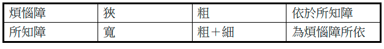
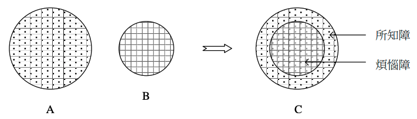
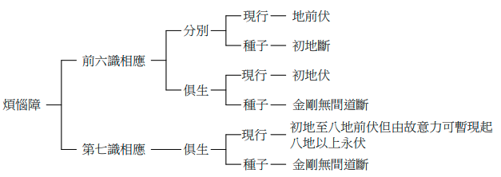
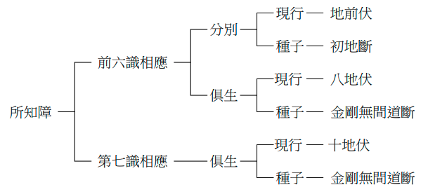
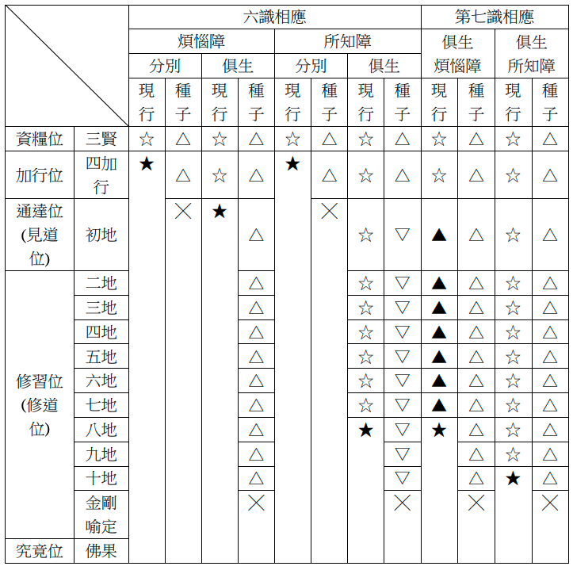
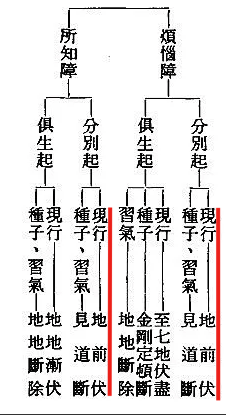
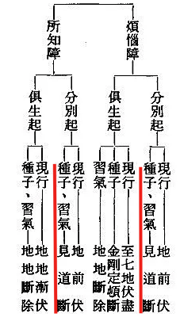
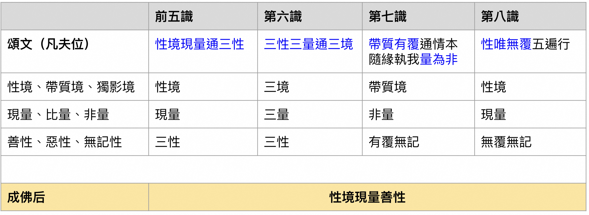
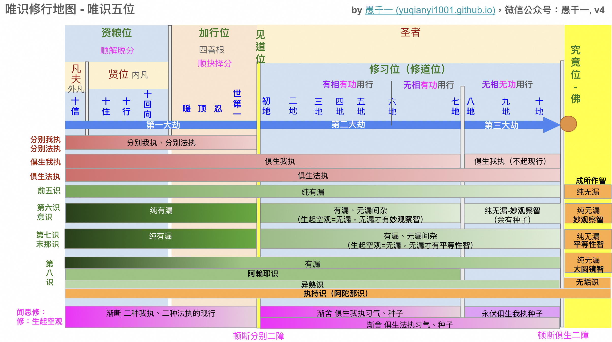

前文《八識的要點和修行中的關鍵轉折點 ——〈八識規矩頌〉的學習筆記(上)》https://mp.weixin.qq.com/s/r5IuxxL98S7wcK9dMjrCvw 中，分別總結了前五識、第六識（意識），第七識（末那識），第八識的要點和修行中的關鍵轉折點。本文將繼續討論八識，首先是和心所的對照關係，其次是我執和法執的作用範圍，三境、三量和三性等。

# 八識分別對應的心所

（圖片來源：釋常慶法師的《八識規矩頌參考圖表》 https://cqings.blogspot.com/2021/05/blog-post_20.html）

圖中的含義已經非常明顯了，這裡就不再贅述了。但是值得補充的地方是，這裡所描述的八識（圖中的心王）是指針對凡夫的情況。見道後的修道位，以及究竟位的佛果，八識對應的心所就會發生變化了。下面就以究竟位的佛果來舉例。畢竟成佛都是學佛人的終極目標，（以《法華經》為依據而言），那麼再瞭解下成佛後的狀態，總是令人感到期待又備受鼓舞的。那麼成佛後的八識對應多少個心所呢？

| 心王 | 心所數量  | 心所 |
|--|------|------|
| 成佛後的八識 | 21個  | 遍行（5）+ 別境（5）+ 善（11） |

如表所示，非常簡單，八識全部都只有21個心所相應了。沒有任何心王會再和煩惱心所相應，所以排除掉6個根本煩惱和20個隨煩惱了，以大乘佛教對佛陀的描述來說（主要指報身），並不認為佛會有無記的情況（如睡覺等），所以4個不定心所也沒有了。（其他部派佛教以釋迦牟尼佛為主，即人間的佛陀，認為佛會有無記的情況，這就另說了，不展開了。）

# 我執和法執

我執就是煩惱障，法執就是所知障。煩惱障比較容易理解，就是起了煩惱現行，或還沒有起煩惱的種子（和習氣）。所知障的定義稍微複雜一點，在詳細解釋之前，可以先記住一個口訣 —— 煩惱障涅槃，所知障菩提。

意思是，二乘聖者聲聞和緣覺可以證入涅槃，就是指可以斷掉一切煩惱了。《大智度論》中提到的阿羅漢依然有習氣，但是這個習氣對於本人來說並不是煩惱，只是可能會引發他人的煩惱，有興趣的佛友可以找下《大智度論》相關內容來了解下，還有一個相關的故事，蠻有趣的。

所知障對此（證入涅槃）沒有影響，所知障礙的是菩提，這裡的菩提是成佛的意思。想要成佛，必須連所知障也要全部斷除。

## 所知障的常見誤解

那就是認為所知道的東西（內容或見解）障礙了自己，變得不能接受其他的知識或觀點了。這樣的誤解是依文解意，並不是佛學上的意思。

## 所知障的定義

簡單來說，就是認為實有諸法，不能正確認識諸法，因此障礙了對真如的正確認知。詳細解釋可以參考下面：

>《成唯識論》︰「所知障者，謂執徧計所執實法薩迦耶見而為上首。見、疑、無明、愛、恚、慢等，覆所知境無顛倒性，能障菩提名所知障。（中略）」

> 演培法師《成唯識論講記》卷九（摘錄）︰什麼叫做所知障﹖所謂「所知障者」，就是「執」著「徧計所執」著的「實」有諸「法」，以法我、我所的「薩迦耶見而為上首」。如指出這所知障的體性，主要的有「見、疑、無明、愛、恚、慢等」諸惑。實際說來，這些都與煩惱障相同的，因為煩惱相應，必然是有所知障的。不過煩惱障的相貌粗，所以有多種不同的品類，至於所知障的相貌細，所以不分別它的品類。有了這些煩惱的存在，就能蓋「覆」我們「所」要了「知」的一切有為無為的理「境」，使我們不能正確理解一一境為何物，同時又覆蓋「無顛倒」的真如法「性」之理，使我們不能親見諸法的真實性。由於覆此理境，障礙智慧不生，並「能障」礙「菩提」不得現前，所以「名所知障」。

## 煩惱障和所知障的關係

圖片來源：釋文修-《成唯識論》中煩惱障與所知障之研究pdf，
https://www.huayencollege.org/files/paper/thesis/pdf/2011/11-%E9%87%8B%E6%96%87%E4%BF%AE-%E3%80%8A%E6%88%90%E5%94%AF%E8%AD%98%E8%AB%96%E3%80%8B%E4%B8%AD%E7%85%A9%E6%83%B1%E9%9A%9C%E8%88%87%E6%89%80%E7%9F%A5%E9%9A%9C%E4%B9%8B%E7%A0%94%E7%A9%B6.pdf 

釋文修法師的解說如下：

> 若以示意圖呈現則如下圖，圖 A 為所知障，圖 B 為煩惱障，圖 C 則是代表具有二障時。大圈中有小黑點，表細煩惱，圖 B 大方格代表較粗的煩惱，當兩個圈重疊時，同時具有粗細的煩惱，當斷了煩惱障時就如圖 A 只剩所知障的細煩惱。

如果對所知障還是不太清楚，可以先不管它，專注於煩惱障，專注於斷除煩惱也可以。畢竟，煩惱障是比較粗重的，比所知障的表現要粗重和也相對容易對治。證阿羅漢比成佛容易，也是同樣的道理了。

## 什麼階段斷什麼障？

請參考下面3張圖片：

(圖片來源：同上）

(圖片來源：同上）

最後文修法師總結了這張表格，實在太詳細了，感覺我無需再多解釋了：

代表符號：尚有△；伏盡但由故意力可暫現起▲；漸伏☆；永伏不現★；漸斷▽；斷╳

(圖片來源：同上）

## 從二障（或二執）的角度看，該如何修行？

以下是我從二障（或二執）的角度，來談修行的重點。並不是嚴格遵守唯識宗對修行的描述，如五重唯識觀。

### 凡夫位（資糧位）

見道位之前都可以叫做凡夫，雖然包括了資糧位和加行位。如果非要準確地說，那絕大多數的普通人，最多算是資糧位。因為加行位有非常明確的特徵：暖頂忍世，而且多指禪定（狹義的禪定，四禪八定等）。

藏傳佛教裡面有一個很流行的說法是“修加行”，但是這個加行和唯識中的加行只是名稱相同，內涵完全不同。藏傳佛教中的“加行”是指磕大頭多少個，念某某咒多少遍等。這和暖頂忍世的內涵完全不同。這裡只是略微提一下，有興趣的朋友可以分別查下暖、頂、忍、世第一的定義和描述。

為了避免自我帶高帽的情況，自認為已經是加行位，還是直接說是凡夫就好，不容易有歧義，也不會驕傲自大了。以前在水木論壇上的一位佛友，總愛自稱自己是加行位，然後論斷他人在資糧位，由此引起許多爭論。這實在是沒有必要。

### 凡夫位如何修和所對治？

以唯識來說，見道位之前，總是有漏的，不存在無漏的情況（針對第六識來說） - 見道位以後才有無漏的情況。所以，這裡的修行，應該是以修禪定和修空觀為主。禪定就是四禪八定。修空觀就是我空、法空。以唯識來說，凡夫位上的修空觀，只是相似的空觀，還是有漏的空觀，而非是無漏的空觀。雖然是有漏的，但依然可以減少煩惱乃至調伏煩惱。

而在凡夫位上減少的煩惱，乃至調伏的煩惱 —— 所對治的 —— 其實就是分別我執和分別法執的現行了。只有這部分煩惱，是在凡夫階段（包括資糧位和加行位）斷除的。如下圖中的紅線所示（這裡不再區分第六、第七識了，區分的情況可以查看上面的表格）。

### 見道位 

到了見道位的時候，分別我執和分別法執就會頓斷了。包括它們的現行，習氣和種子。如下圖所示。見道位是一個很短的瞬間，很快就進入到修道位了，即初地菩薩。

### 修道位（初地及以上）

修道位的修行所對治的就是俱生二障的現行、種子和習氣了，同樣是修行空觀為主。

以我們普通人（凡夫）來說，最重要的目標是見道，修道是見道以後的事情，考慮到大乘的見道後就是初地菩薩了，後面的修法在這裡略過了。畢竟，以見道作為此生的目標，都不容易達到，而後面的事情，自然可以先略過了，大概瞭解下即可。

# 三境、三量、三性，以及凡夫和成佛後的對比

下面再總結下八識的三境、三量、三性。

三性最為常見和簡單，它們是善性，惡性，無記性（不善不惡）。無記裡面可以再分為，有覆無記和無覆無記。有覆的意思是，把聖道覆蓋起來了，障礙見道了。所以，有覆無記雖然是不善不惡的無記法，卻也屬於染汙法。而無覆無記是屬於清淨法，清淨與染汙相對。

三境是：
* 性境：簡單理解就是“客觀存在”的事物，這裡的“客觀存在”是指共業而言，比如，眼前有一個蘋果，大家都看到有這樣一個蘋果，這個眼前的蘋果就是一個客觀存在的性境了。
* 帶質境：兼有一份“客觀存在”的境界。比如，剛才桌子上有一個蘋果，然後蘋果被別人吃了，等我們再看桌子上的時候，沒有蘋果了。於是我們問：“剛才那個蘋果被誰吃了？” —— 這就是帶質境，蘋果是過去的“性境”，但是眼前沒有了，是我們從記憶裡面知道的的，剛才有一個蘋果。還有其他的情況，這裡略過，有興趣的可以查詢佛學詞典。
* 獨影境：指脫離於“客觀存在”的境界。比如一部分的夢境，夢見一個在現實生活中從未出現過的境界，比如夢見自己變成了小鳥，在天空中翱翔。這件事情，在生活中不可能出現過，所以，它是完全想象出來的境界，或第六意識創造出來的境界。

三量是：
* 現量：指我們通過感官直接獲得的認知，不經過思考或推理。例如，看到紅色的蘋果，這是一種“客觀”的認識。
* 比量：推理或推斷得來的認知。通過已知的信息，推斷未知的事實。例如，看到野外有煙，推測有火。
* 非量：錯誤的推理。例如，當看到一個人穿著比較隨意，就認為這個人不認真、不負責，這就是一種錯誤的推理，屬於非量。

## 八識和三境、三量、三性的關係

表格上面的三行是凡夫位的情況，最下面一行是成佛後的情況。這裡不詳細介紹每個識的境、量、性了，有興趣的佛友，建議從頭到尾學習下《八識規矩頌》。

# 大總結

我把上篇文章和這篇文章的大多數知識點，歸納整理起來，就有了下面這張圖。基本內容都在前面有過說明，這裡就不再贅述了，這張圖可以用來當做學習《八識規矩頌》的一個輔助參考，或者是輔助記憶。無論如何，我的學習筆記都無法替代《八識規矩頌》內容本身的學習。對於對八識有興趣的佛友，還是應該從頭到尾學習下《八識規矩頌》。

最後再分享下我學習唯識的次第（順序）：
1. 百法 - 《百法明門論》
2. 《八識規矩頌》或唯識概論一類的書籍。以上兩類的講解書非常多，建議多讀基本參考，例如聖嚴法師的《探索識界》和於凌波的八識講記，都非常不錯。僅我看過的版本而言。
3. 《唯識三十頌》或《成唯識論》或《成唯識論直解》。其中，《成唯識論》是《唯識三十頌》的註釋書，而《成唯識論直解》是《成唯識論》的白話版。
4. 《瑜伽師地論》《解深密經》等等，印順法師的《唯識學探源》等等。

以上，希望對大家瞭解八識有所幫助。

阿彌陀佛。

愚千一

