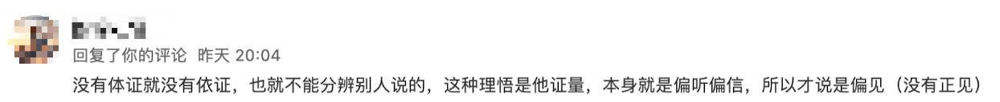
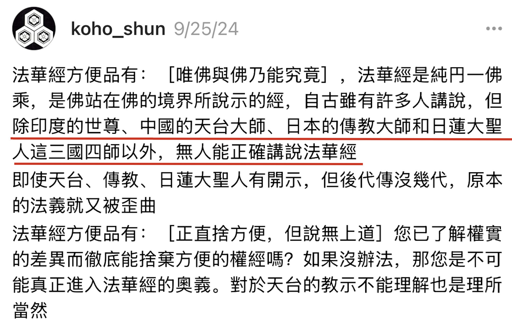

读经，解经本来是一件很正常的事情，只要读了经文，就一定会产生自己的理解，或浅或深，或窄或广。不同的人，读同样的经，产生的理解也不一定相同，只要这种理解是合情合理的，符合佛法的基本原则，我们都应该接受。可是，也总有人，喜欢一些极端的，落于一端的解读方式，甚至进而否定、贬低其他人的理解，这就非常可怕了。殊不知，一旦落入了一边，且只承认一边，便远离了佛陀所倡导的中道。举例如下：

比如说，只有佛这样的觉悟者，才能真正地了解佛经的意思，凡夫俗子则不可能对佛经产生正确的理解。 

比如说，只有证悟者，才能真正懂得佛理的意思，凡夫俗子对佛经的理解都是“偏见”。 

比如说，只有某某某，才能正确解说某经，其他人的理解都不行。 

以上就是一些“极端”的例子。这些极端的例子，也许本意是想推崇某人，或某个思想 —— 这是可以的，但如果同时也开始贬低，排斥他人的理解，那就变成了问题。

实际上，独尊一人，或一经，或一派，难免会产生对其他人，其他经，其他派的排斥了。这是因为，绝大多数的人，都是生活在一个对立的二元世界里面，有好，就会有坏，有高，就会有低，如果都一样，就没有所谓的好坏，也没有所谓的高低了。

所以，凡是强调最高的，最好的，几乎都是方便说，方便法，都是不了义了。了义的，究竟的说法中，都是无分别的，平等的，圆融的，包容的。

因此，我才建议大家多看符合中道的解经（和说法），那什么是中道解经、中道说法呢？我总结了这样三个关键字 —— 讲层次，讲逻辑，讲人话。

# 第一，讲层次

任何经典的理解都可以分成若干个层次，中间的层次比较多，暂不说，先说两头 —— 最低层次的解读和最高层次的解读。

首先是最低的层次，那就是文盲了，字都不认识，完全无法读经了，无法读经，也就谈不上理解了。我们先不考虑别人读他听到的情况。最低的层次，算作第0层。

什么是最高的层次呢？那就是佛了，这是很显然的，因为佛是一切智，一切种智，没有任何的烦恼，也没有任何的障碍，佛的智慧是至高无上的、最圆满的。所以，我们以佛的理解作为第100层（最高层）。

那么在0到100层中间，至少还有99层次。如果有必要，每一个层次中，还可以再细分。比如在第1层内，还可以分成第0.1层，第0.2层……以此类推，这样，中间的层次可以有无数个了。为了解说的方便，我还是整数（1,2,3…………100）来写文章。

注意，这里层次不一定是线性关系。举个例子，从第1层到第2层，可能只需要几个月，几年的时间就可以，但是从第5层到第6层，可能需要几十年才行，而从第9层到第10层，可能要几辈子才行。这还是简化了的说法，如果按照成佛要三大阿僧祇劫来说，那时间的差别就更大了，会有成千上万倍的区别。简化的方式，即容易理解，也容易和现代教育做对比。对比如下：

第0层 - 学前班（或文盲） 
第1层 - 小学，认识所有的字了。 
第2层 - 中学，理解里面的佛教术语。 
第3层 - 高中，可以通读全文，基本佛经大意，但还会有疑点。 
第4层 - 大学，疑点一一排除了，能够贯通全文，可以用自己的语言讲解经文了，也可以用自己的比喻。 
第5层 - 研究生，深入不同的体系，触类旁通，可以用不同的方式讲解同一篇经文了。据说能海上师可以二十多种方式讲解《心经》。
...
第10层 - 体悟、证悟佛经。类比初地菩萨，继续修布施。
第20层 - 类比二地菩萨，继续修持戒。
第30层 - 类比三地菩萨，继续修忍辱。
...
第100层 - 成佛。

暂且不论初地菩萨后的层次，就是初地菩萨之前，还可以有小学、中学、高中、大学所对照的层次。就算是小学，还可以分小学一年级、二年级、三年级、四年级、五年级。

曾经听一位仁波切说过，“弘法”不仅是出家人的责任，也是在家人的责任，在家人也可以“弘法”，但是不要自傲，因为只是像小学四年级的学生带领三年级的学生而已。我十分赞同这个说法，但我从不认为自己是在“弘法”，我最多只是一个小学四年级的学生，把自己的心得分享大家，希望可以帮助到三年级和以下的小学生们、学前班的幼儿们。当然，也欢迎高年级的学长学姐、以及老师们多多温柔地批评指正。按照现代教育，温柔地批判和指正小学生，小学生当然会更加乐意接受了。

# 第二，讲逻辑

我在《佛学中的理科和文科https://mp.weixin.qq.com/s/YZ-UaEJE9ICBnpapzVq3OQ 》一文中，已经介绍过一次了，简述如下，所有的佛法可以分成两大类，类比现代教育，一类是文科，一类是理科。

文科类的佛法，没有或较少有统一答案，比如一首诗，有人认为是绝世诗句，有人认为狗屁不通。一幅画，有人认为是绝世佳作，有人认为只是涂鸦。对比佛法，比如禅宗公案，它们的解读可谓是五花八门，仁者见仁智者见智，大家也经常因此吵吵闹闹。

理科类的佛法，就有统一答案了（相对而言），它就像数理化一样，1就是1，2就是2，1不是2，2也不是1。数学上的 1 + 1 = 2，古今中外，从未发生过变化，而且我们可以确定肯定一定地说，在未来也不会发生变化。不可能在未来的小学数学里会说，1 + 1 从今天起不等于2，而等于3了 —— 众所周知，这是不可能的事情。

那什么是佛教中的理科佛法呢？根据我在《学佛卡壳了怎么办？试试这个方法｜按照体系学习佛法，就不会再卡壳了 ｜ 略说佛学四大体系的异同 https://mp.weixin.qq.com/s/3phGhhEbBsb743CdgnUktA 》一文中的分类，基础佛法（或叫根本佛法）、般若（中观）、唯识都算理科的。

如来藏系的天台、华严这种有完整判教体系的，也可以算是理科了。只有禅宗，最像文科，尤其是不讲逻辑，只讲顿悟的时候 —— 可以参考各类禅宗公案的解读，或大家对于公案的各种争吵。

# 第三，讲人话

讲人话是现代特别热门的一个新兴词汇，它的意思是，要讲人人都能听懂的大白话，清晰易懂的大白话，朴素的日常用语。而不要拐弯抹角，云里雾里的套话、官话。

如果可以做到上面的讲层次、讲逻辑，那么讲出来的话，必定是符合上述定义的人话了。

但是，佛法上的人话，可以多一个要求，那就把人当人看待，不要把我们这些学佛的普通人当成佛菩萨来要求，当成圣人来要求 —— 

不要以为学佛了，就不能争取自己的权益了，必须忍气吞声修忍辱了。 
不要以为学佛了，就不能娱乐了，必须六根清净了。 
不要以为学佛了，就不能有自己的情绪了，必须毫无挂碍、毫无执念了。 
不要以为学佛了，就不能有物质需求了，必须像苦行僧一样了。 
…… 

实际上，这些都是不合理的要求，是把普通人当成了佛菩萨来要求了。以现代教育来说，请问我们可以这样要求吗？

小学生必须精通所有学科知识，不能有任何疑惑。 
小学生就要具备成年人的思维逻辑和决策能力。 
小学生必须每天学习十八个小时以上，不能有任何休息时间。 
小学生要完全控制自己的情绪，不能有任何哭闹或发脾气的时候。 
小学生就得承担起家庭的经济重担和生活压力。 
……

显而易见，没人会同意这是合理的要求。然而，在学佛这件事情上，大家却经常这样犯错，经常提出这种不合理的要求。这确实太不是“人话”了。

以上。最后再次重述下，建议大家多看符合中道的解经 —— 讲层次，讲逻辑，讲人话。希望大家都能从佛法中获得符合自身需求的感悟，体会不同层次的法乐。

阿弥陀佛。

愚千一

