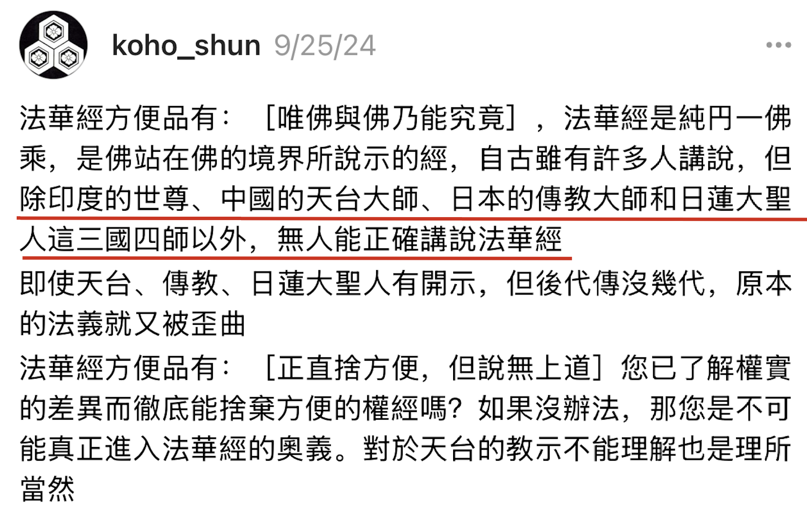

讀經，解經本來是一件很正常的事情，只要讀了經文，就一定會產生自己的理解，或淺或深，或窄或廣。不同的人，讀同樣的經，產生的理解也不一定相同，只要這種理解是合情合理的，符合佛法的基本原則，我們都應該接受。可是，也總有人，喜歡一些極端的，落於一端的解讀方式，甚至進而否定、貶低其他人的理解，這就非常可怕了。殊不知，一旦落入了一邊，且只承認一邊，便遠離了佛陀所倡導的中道。舉例如下：

比如說，只有佛這樣的覺悟者，才能真正地瞭解佛經的意思，凡夫俗子則不可能對佛經產生正確的理解。 

比如說，只有證悟者，才能真正懂得佛理的意思，凡夫俗子對佛經的理解都是“偏見”。 

比如說，只有某某某，才能正確解說某經，其他人的理解都不行。 

以上就是一些“極端”的例子。這些極端的例子，也許本意是想推崇某人，或某個思想 —— 這是可以的，但如果同時也開始貶低，排斥他人的理解，那就變成了問題。

實際上，獨尊一人，或一經，或一派，難免會產生對其他人，其他經，其他派的排斥了。這是因為，絕大多數的人，都是生活在一個對立的二元世界裡面，有好，就會有壞，有高，就會有低，如果都一樣，就沒有所謂的好壞，也沒有所謂的高低了。

所以，凡是強調最高的，最好的，幾乎都是方便說，方便法，都是不了義了。了義的，究竟的說法中，都是無分別的，平等的，圓融的，包容的。

因此，我才建議大家多看符合中道的解經（和說法），那什麼是中道解經、中道說法呢？我總結了這樣三個關鍵字 —— 講層次，講邏輯，講人話。

# 第一，講層次

任何經典的理解都可以分成若干個層次，中間的層次比較多，暫不說，先說兩頭 —— 最低層次的解讀和最高層次的解讀。

首先是最低的層次，那就是文盲了，字都不認識，完全無法讀經了，無法讀經，也就談不上理解了。我們先不考慮別人讀他聽到的情況。最低的層次，算作第0層。

什麼是最高的層次呢？那就是佛了，這是很顯然的，因為佛是一切智，一切種智，沒有任何的煩惱，也沒有任何的障礙，佛的智慧是至高無上的、最圓滿的。所以，我們以佛的理解作為第100層（最高層）。

那麼在0到100層中間，至少還有99層次。如果有必要，每一個層次中，還可以再細分。比如在第1層內，還可以分成第0.1層，第0.2層……以此類推，這樣，中間的層次可以有無數個了。為了解說的方便，我還是整數（1,2,3…………100）來寫文章。

注意，這裡層次不一定是線性關係。舉個例子，從第1層到第2層，可能只需要幾個月，幾年的時間就可以，但是從第5層到第6層，可能需要幾十年才行，而從第9層到第10層，可能要幾輩子才行。這還是簡化了的說法，如果按照成佛要三大阿僧祇劫來說，那時間的差別就更大了，會有成千上萬倍的區別。簡化的方式，即容易理解，也容易和現代教育做對比。對比如下：

第0層 - 學前班（或文盲） 
第1層 - 小學，認識所有的字了。 
第2層 - 中學，理解裡面的佛教術語。 
第3層 - 高中，可以通讀全文，基本佛經大意，但還會有疑點。 
第4層 - 大學，疑點一一排除了，能夠貫通全文，可以用自己的語言講解經文了，也可以用自己的比喻。 
第5層 - 研究生，深入不同的體系，觸類旁通，可以用不同的方式講解同一篇經文了。據說能海上師可以二十多種方式講解《心經》。
...
第10層 - 體悟、證悟佛經。類比初地菩薩，繼續修佈施。
第20層 - 類比二地菩薩，繼續修持戒。
第30層 - 類比三地菩薩，繼續修忍辱。
...
第100層 - 成佛。

暫且不論初地菩薩後的層次，就是初地菩薩之前，還可以有小學、中學、高中、大學所對照的層次。就算是小學，還可以分小學一年級、二年級、三年級、四年級、五年級。

曾經聽一位仁波切說過，“弘法”不僅是出家人的責任，也是在家人的責任，在家人也可以“弘法”，但是不要自傲，因為只是像小學四年級的學生帶領三年級的學生而已。我十分贊同這個說法，但我從不認為自己是在“弘法”，我最多隻是一個小學四年級的學生，把自己的心得分享大家，希望可以幫助到三年級和以下的小學生們、學前班的幼兒們。當然，也歡迎高年級的學長學姐、以及老師們多多溫柔地批評指正。按照現代教育，溫柔地批判和指正小學生，小學生當然會更加樂意接受了。

# 第二，講邏輯

我在《佛學中的理科和文科https://mp.weixin.qq.com/s/YZ-UaEJE9ICBnpapzVq3OQ 》一文中，已經介紹過一次了，簡述如下，所有的佛法可以分成兩大類，類比現代教育，一類是文科，一類是理科。

文科類的佛法，沒有或較少有統一答案，比如一首詩，有人認為是絕世詩句，有人認為狗屁不通。一幅畫，有人認為是絕世佳作，有人認為只是塗鴉。對比佛法，比如禪宗公案，它們的解讀可謂是五花八門，仁者見仁智者見智，大家也經常因此吵吵鬧鬧。

理科類的佛法，就有統一答案了（相對而言），它就像數理化一樣，1就是1，2就是2，1不是2，2也不是1。數學上的 1 + 1 = 2，古今中外，從未發生過變化，而且我們可以確定肯定一定地說，在未來也不會發生變化。不可能在未來的小學數學裡會說，1 + 1 從今天起不等於2，而等於3了 —— 眾所周知，這是不可能的事情。

那什麼是佛教中的理科佛法呢？根據我在《學佛卡殼了怎麼辦？試試這個方法｜按照體系學習佛法，就不會再卡殼了 ｜ 略說佛學四大體系的異同 https://mp.weixin.qq.com/s/3phGhhEbBsb743CdgnUktA 》一文中的分類，基礎佛法（或叫根本佛法）、般若（中觀）、唯識都算理科的。

如來藏系的天台、華嚴這種有完整判教體系的，也可以算是理科了。只有禪宗，最像文科，尤其是不講邏輯，只講頓悟的時候 —— 可以參考各類禪宗公案的解讀，或大家對於公案的各種爭吵。

# 第三，講人話

講人話是現代特別熱門的一個新興詞彙，它的意思是，要講人人都能聽懂的大白話，清晰易懂的大白話，樸素的日常用語。而不要拐彎抹角，雲裡霧裡的套話、官話。

如果可以做到上面的講層次、講邏輯，那麼講出來的話，必定是符合上述定義的人話了。

但是，佛法上的人話，可以多一個要求，那就把人當人看待，不要把我們這些學佛的普通人當成佛菩薩來要求，當成聖人來要求 —— 

不要以為學佛了，就不能爭取自己的權益了，必須忍氣吞聲修忍辱了。 
不要以為學佛了，就不能娛樂了，必須六根清淨了。 
不要以為學佛了，就不能有自己的情緒了，必須毫無掛礙、毫無執念了。 
不要以為學佛了，就不能有物質需求了，必須像苦行僧一樣了。 
…… 

實際上，這些都是不合理的要求，是把普通人當成了佛菩薩來要求了。以現代教育來說，請問我們可以這樣要求嗎？

小學生必須精通所有學科知識，不能有任何疑惑。 
小學生就要具備成年人的思維邏輯和決策能力。 
小學生必須每天學習十八個小時以上，不能有任何休息時間。 
小學生要完全控制自己的情緒，不能有任何哭鬧或發脾氣的時候。 
小學生就得承擔起家庭的經濟重擔和生活壓力。 
……

顯而易見，沒人會同意這是合理的要求。然而，在學佛這件事情上，大家卻經常這樣犯錯，經常提出這種不合理的要求。這確實太不是“人話”了。

以上。最後再次重述下，建議大家多看符合中道的解經 —— 講層次，講邏輯，講人話。希望大家都能從佛法中獲得符合自身需求的感悟，體會不同層次的法樂。

阿彌陀佛。

愚千一

